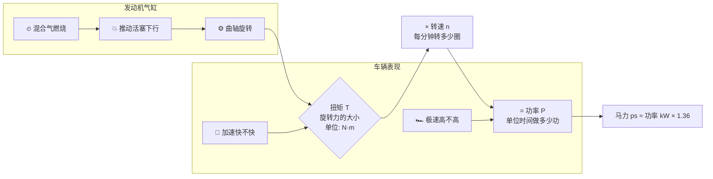
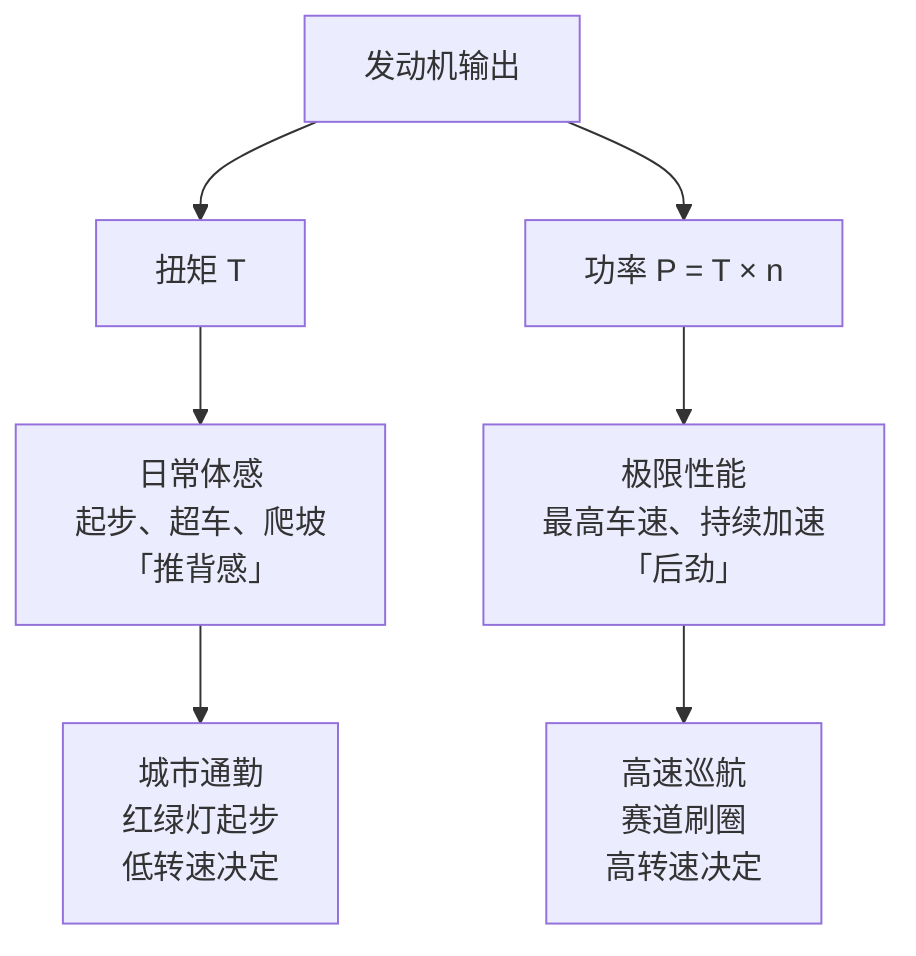

# 📖 扭矩 vs 马力：别再被销售忽悠了

> **阅读时间**：8 分钟 | **难度**：零基础友好 | **关键词**：扭矩(N·m)、马力(ps)、功率(kW)、加速、极速

---

## ❓ 真实问题

> 「销售说这车 200 匹马力，动力很猛——但我看参数表上扭矩才 250 N·m，是不是虚标了？」
> 「为什么柴油卡车扭矩上千，跑高速却还不如一辆 1.5L 的小轿车快？」

这两个问题，99% 的非汽车专业新人第一次看参数表时都会问。**扭矩和马力，到底谁说了算？**

---

## 🗺️ 一图看懂：扭矩与马力的关系

---

## 🔬 原理拆解

### 扭矩 = 旋转的"力气"

想象你在拧一个很紧的瓶盖：
- **扭矩**就是你手拧的**力度**
- 扭矩大 = 手劲大，一瞬间就能把瓶盖拧动

汽油机/柴油机里，混合气燃烧推动活塞 → 通过连杆 → 转动曲轴 → 输出**扭矩**。

| 参数 | 含义 | 直观类比 |
|------|------|----------|
| **扭矩 (Torque)** | 发动机单次做功的"爆发力" | 一拳打出去的力道 |
| **功率 (Power)** | 单位时间内持续输出的总能量 | 一分钟能打多少拳 |
| **马力 (Horsepower)** | 功率的另一种单位，1 ps ≈ 0.735 kW | 同上，只是换了个说法 |

### 关键公式

> **功率 (kW) = 扭矩 (N·m) × 转速 (rpm) ÷ 9549**

这公式道破天机：
- 扭矩大但转速低 → 功率不一定大（柴油机就是例子）
- 扭矩一般但转速极高 → 功率可以很大（F1 赛车 1.6L 发动机能到 1000 马力！）

### 扭矩 vs 马力：分别决定什么？

**一句口诀**：扭矩管加速体感，马力管极速上限。

---

## ⚡ 油电对比

| 维度 | 燃油车 (ICE) | 电动车 (EV) |
|------|-------------|------------|
| **扭矩输出特性** | 随转速爬升，有峰值区间 | **零转速即峰值** |
| **起步推背感** | 需要拉转速才有 | 油门一踩就来 |
| **是否需要变速箱** | 必须（转速区间窄） | 可以单级减速（转速区间宽） |
| **马力表现** | 依赖高转速 | 电机特性更平直 |
| **典型扭矩/马力比** | 1.0~1.5 | 2.0~5.0 |

> **为什么电动车起步那么猛？** 电机在 **0 rpm 就能输出最大扭矩**，不需要像燃油机那样等转速上来。这就是为什么一辆 20 万的 Model 3 起步可以秒杀 50 万的燃油性能车。

---

## 🏭 车企场景

### 真实案例 1：大众 EA888 2.0T（燃油）

| 车型 | 扭矩 | 马力 | 扭矩/马力比 | 体感 |
|------|------|------|------------|------|
| 迈腾 330TSI | 320 N·m | 186 ps | **1.72** | 日常轻快 |
| 高尔夫 GTI | 370 N·m | 245 ps | 1.51 | 运动取向 |

**差异在哪？** GTI 的涡轮更大，高转速时能持续发力。虽然扭矩也只多了 50 N·m，但因为高转速下不掉扭矩，马力多了 59 ps——这就是调校哲学的不同。

### 真实案例 2：比亚迪 DM-i 混动（油+电）

| 工况 | 谁干活 | 效果 |
|------|--------|------|
| 起步 0-30 km/h | 电机为主 | 零延迟推背 |
| 巡航 60-90 km/h | 发动机直驱 | 经济省油 |
| 急加速 | 电机+发动机并联 | 扭矩叠加 |

> **DM-i 的聪明之处**：低速让电机出力（扭矩随时有），高速让发动机工作在最高效区间。各取所长。

---

## 📝 小测（3 题）

**Q1**：某车 200 ps / 300 N·m  vs  150 ps / 350 N·m。哪个起步更快？

点击看答案

**150 ps / 350 N·m 起步更快。** 起步阶段看重扭矩，350 > 300。但 200 ps 那辆在后段加速和极速上会反超。

---

**Q2**：为什么柴油卡车扭矩能到 2000 N·m，马力却只有 300 ps？

点击看答案

柴油机转速上限低（通常 2500-3000 rpm），虽然单次爆发力（扭矩大），但单位时间做功次数少（转速低），所以**功率 = 大扭矩 × 低转速，乘积不大**。马力管极速，所以卡车跑不快——但扭矩大意味着能拉动几十吨货。

---

**Q3**：电动车为什么不需要多挡变速箱？

点击看答案

电机在 0-15000 rpm 都能高效输出扭矩，转速区间是内燃机的 2-3 倍。一个固定减速比就能覆盖 0-150 km/h，不需要换挡。这也是为什么电动车的加速"丝般顺滑"——没有换挡顿挫。

---

> 💡 **记住这个类比**：扭矩是你一拳的力道，马力是你一小时能打多少拳。拳击比赛看重持续输出（马力），掰手腕只看单次爆发（扭矩）。

---

*下一篇预告：[变速箱究竟在干什么](./02-变速箱工作原理.md)*
