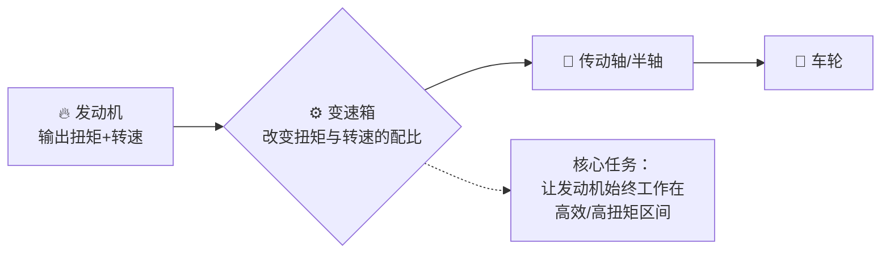
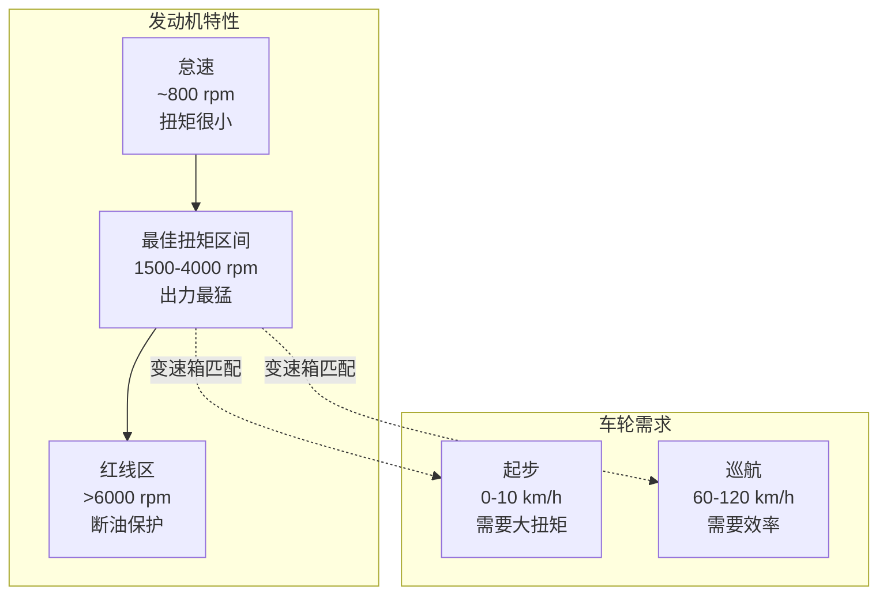
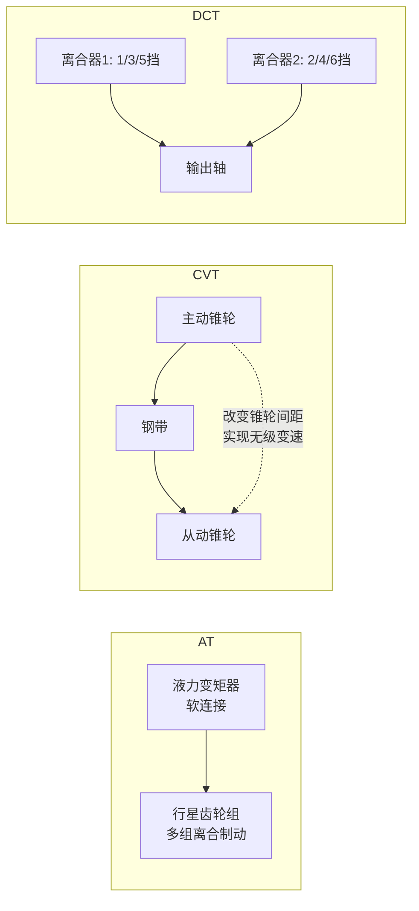

# 📖 变速箱在干什么？——从自行车说起

> **阅读时间**：9 分钟 | **难度**：零基础友好 | **关键词**：传动比、档位、AT/CVT/DCT、换挡逻辑

---

## ❓ 真实问题

> 「自动挡不就是踩油门就走吗，为什么还要关心是几AT还是CVT？」
> 「我骑自行车都不需要变速箱，为什么汽车非要这个又贵又复杂的玩意？」

这两个问题击中要害。实际上，**你骑的变速自行车就是最好的变速箱模型**。

---

## 🗺️ 结构总览：变速箱在整车中的位置



> **一个违反直觉的事实**：发动机和车轮是不能直接连在一起的——它们"转速不匹配"。让发动机始终保持最优转速，这个活就是变速箱干的。

---

## 🔬 核心原理：从自行车说起

### 你骑过变速自行车吗？

```
上坡时 → 挂大飞轮（后轮齿轮大） → 踩得轻但转很多圈才走一点
平路时 → 挂小飞轮（后轮齿轮小） → 踩得重但踩一圈走很远
```

汽车变速箱干的**完全是同一件事**：

| 自行车 | 汽车 | 原理 |
|--------|------|------|
| 上坡挂大飞轮 | 1 挡（低挡） | **减速增扭**：转速换扭矩 |
| 平路挂小飞轮 | 6 挡（高挡） | **增速减扭**：扭矩换转速 |

### 为什么必须换挡？——发动机的"舒适区"



> 发动机只在 **1500-4000 rpm** 最会出力。但车轮从 0 到 120 km/h，转速范围远超发动机的舒适区。变速箱就是做这个"转速翻译"的。

### 关键概念：传动比（Gear Ratio）

> **传动比 = 输入转速 ÷ 输出转速**

| 档位 | 传动比（典型值） | 效果 |
|------|-----------------|------|
| 1 挡 | 4.0 : 1 | 发动机转 4 圈 → 车轮转 1 圈，**扭矩放大 4 倍** |
| 6 挡 | 0.7 : 1 | 发动机转 0.7 圈 → 车轮转 1 圈，**省油巡航** |

**超速挡（Overdrive）**：传动比 < 1，发动机转速比车轮还慢——高速巡航省油的秘密。

---

## ⚙️ 变速箱三大类型（一张表说清）

| 类型 | 全称 | 原理 | 优点 | 缺点 | 代表车型 |
|------|------|------|------|------|----------|
| **AT** | 自动变速箱 (Automatic Transmission) | 液力变矩器 + 行星齿轮组 | 平顺、可靠、承受大扭矩 | 略费油、反应稍慢 | 宝马 3 系 (ZF 8AT) |
| **CVT** | 无级变速箱 (Continuously Variable Transmission) | 钢带 + 锥形轮，无固定档位 | **最平顺、最省油** | 承受扭矩有限、"橡皮筋感" | 日产轩逸、丰田卡罗拉 |
| **DCT** | 双离合变速箱 (Dual Clutch Transmission) | 两组离合器分别控制奇偶档位 | **换挡最快、运动感强** | 低速顿挫、结构复杂 | 大众高尔夫 (DSG)、保时捷 PDK |



---

## ⚡ 油电对比

| 维度 | 燃油车 | 电动车 |
|------|--------|--------|
| **是否需要变速箱** | **必须有**（发动机高效区间约 1500-4000 rpm） | **基本不需要**（电机高效区间 0-15000 rpm） |
| **挡位数量** | 6-10 挡 | 通常**单级减速**（1 个固定传动比） |
| **换挡过程** | 有动力中断/顿挫 | 无换挡，丝般顺滑 |
| **能量回收** | 无 | **电机反转发电**，相当于"电子刹车" |
| **倒挡实现** | 变速箱内增加惰轮反转 | **电机反转即可**，无需额外机构 |

> **为什么保时捷 Taycan 反而装了 2 速变速箱？** 这是特例——Taycan 追求 260 km/h 极速，单级减速难以兼顾起步扭矩和极速。它用了一个 2 速变速箱：1 挡管起步，2 挡管极速。除此之外，99% 的电动车都是单速。

---

## 🏭 车企场景

### 案例 1：为什么轩逸的 CVT 被说"肉"而思域的 CVT 被夸？

| 车型 | CVT 调校取向 | 驾驶感受 |
|------|-------------|----------|
| **日产轩逸** | 极致省油，转速压得很低 | 踩油门像踩棉花，"橡皮筋感"明显 |
| **本田思域** | 模拟挡位换挡逻辑，转速积极攀升 | 接近 AT 的响应感，运动模式甚至有"换挡"节奏 |

> **同一技术，截然不同的性格。** CVT 本身没变，变的是 ECU（变速箱电脑）的"换挡逻辑"——用软件模拟不同性格。

### 案例 2：大众 DSG 的顿挫是怎么来的？

DCT（双离合）换挡极快，但低速蠕行时（堵车跟车），离合器需要反复半联动——就像手动挡半离合会抖。大众初代 DQ200 干式双离合在堵车工况下顿挫明显，后来用湿式离合器（浸在油里散热）改善了很多。

---

## 📝 小测（3 题）

**Q1**：为什么 1 挡爬坡有力，6 挡跑高速省油？

<details>
<summary>点击看答案</summary>
1 挡传动比大（如 4:1），发动机转 4 圈车轮才转 1 圈，扭矩放大 4 倍，所以有力。6 挡传动比小（如 0.7:1），发动机转得比车轮还慢，内部摩擦损耗小，所以省油。
</details>

---

**Q2**："手自一体"和"自动挡"是一回事吗？

<details>
<summary>点击看答案</summary>
**不完全一样。** "手自一体"通常指 AT（带液力变矩器）但有手动换挡模式（拨片/档杆推拉）。"自动挡"是个更大范围的概念，包含 AT、CVT、DCT 等所有不需要踩离合的变速箱。
</details>

---

**Q3**：电动车没有变速箱，怎么实现倒车？

<details>
<summary>点击看答案</summary>
电机可以反转！给电机通反向电流，它就反着转。燃油发动机只能单向旋转，所以必须通过变速箱内的额外齿轮来反转方向（R 挡）。
</details>

---

> 💡 **记住**：骑变速自行车上坡换大飞轮 = 汽车挂 1 挡。你早就懂变速箱了，只是没意识到而已。

---

*下一篇预告：[差速器：为什么转弯时两个轮子转速不一样？](./03-差速器.md)*
