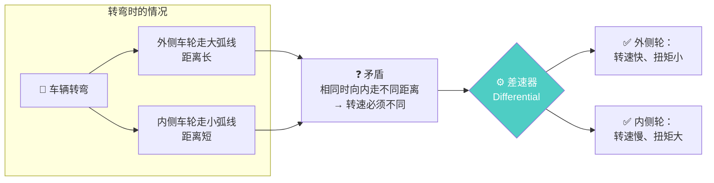
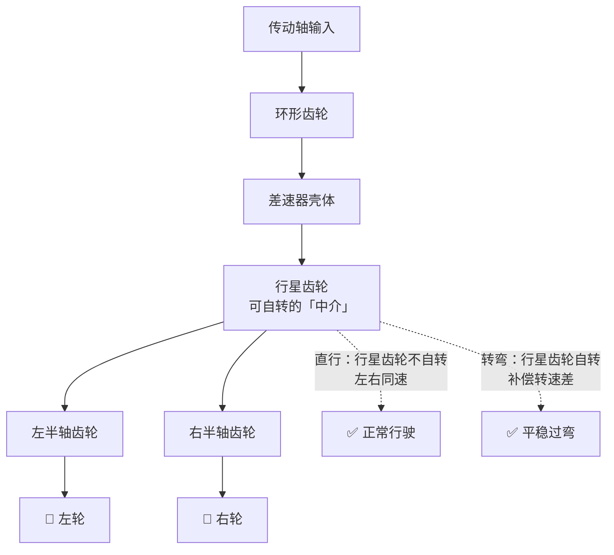
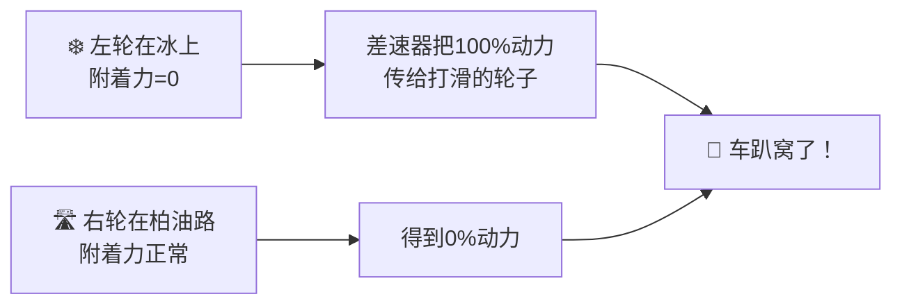
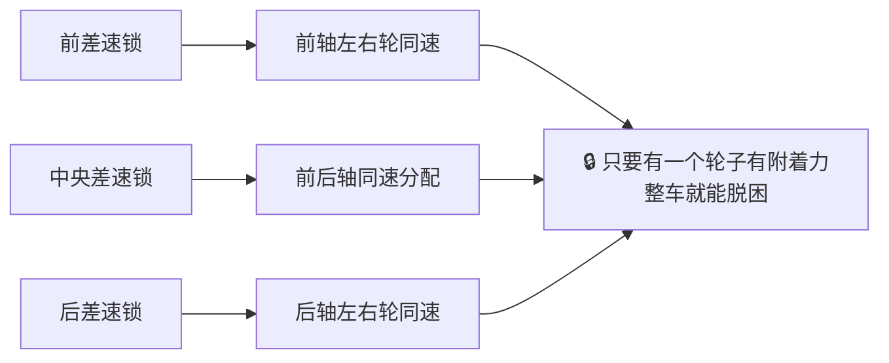

# 📖 差速器：为什么转弯时轮子转速不一样？

> **阅读时间**：8 分钟 | **难度**：零基础友好 | **关键词**：差速器、半轴、转弯半径、限滑差速器(LSD)

---

## ❓ 真实问题

> 「上次坐朋友的车过一个很急的弯，感觉车子快翻了，为什么外侧轮子不能和内侧转一样快？」
> 「四驱车是不是每个轮子都有差速器？差速器锁又是什么？」

差速器可能是汽车上**最反直觉**的部件——但它用一个极其简单的齿轮组合解决了一个看似无解的难题。

---

## 🗺️ 一图看懂：差速器解决什么问题



---

## 🔬 核心原理：两根晾衣杆的直觉

### 经典解释模型

1937 年，通用汽车拍了一段经典的教学视频《Around the Corner》。想象两根平行晾衣杆：

```
         ┌── 齿条 A（连接左轮）
         │
  ═══════╪═══════  小齿轮（连接传动轴，可自转+绕轴公转）
         │
         └── 齿条 B（连接右轮）
```

**直行时**：小齿轮不转，推着两根齿条同步走 → 左右轮同速
**转弯时**：一根齿条受阻（内侧轮走得慢），小齿轮开始自转 → 把动力分配给转动更快的那根齿条（外侧轮）

> 🎬 强烈推荐观看原版《Around the Corner》：YouTube/B站搜索 "通用汽车 差速器 1937"，5 分钟胜过千言万语。

### 三要素

| 元件 | 作用 |
|------|------|
| **环形齿轮（Ring Gear）** | 接收变速箱传来的动力 |
| **行星齿轮（Spider Gears）** | 差速器的"灵魂"——可以自由自转 |
| **半轴齿轮（Side Gears）** | 连接左右半轴，驱动车轮 |



---

## ⚠️ 差速器的"坑"

### 经典问题：为什么一个轮子打滑，另一个就不转了？



> 差速器的天性：在打滑时会把动力"流向"阻力小的那一侧。这个特性在正常转弯时是优点，但在打滑时变成了灾难。
>
> ⚙️ **严谨补充**：开放式差速器其实**始终把扭矩 50/50 平均分到两侧**。一旦一侧打滑，能传递的扭矩被低附着的那侧限制到≈0，于是**两侧都≈0**，车便趴窝。「把 100% 动力全给打滑轮」是通俗但不精确的说法——真正的问题是"两侧都没了"。

### 解决方案

| 技术 | 原理 | 效果 |
|------|------|------|
| **限滑差速器 (LSD)** | 当左右转速差过大时，内部摩擦片锁止 | 限制打滑，部分动力给有附着力的轮子 |
| **差速锁 (Diff Lock)** | 手动/自动彻底锁死差速器 | 左右轮刚性连接，强制同速——**硬派越野标配** |
| **电子限滑 (EDS/TCS)** | 用刹车单独刹住打滑的轮子 | 模拟差速锁效果，成本低、反应快 |

---

## ⚡ 油电对比

| 维度 | 燃油车 | 电动车 |
|------|--------|--------|
| **差速器位置** | 变速箱输出端，通过传动轴到差速器 | 可以在电机输出端，或直接取消 |
| **是否需要机械差速器** | **必须**（一个发动机带两个驱动轮） | **视布局而定**（双电机＝前后各一台电机，左右仍各用一个开放式差速器；四电机才能真正省去差速器） |
| **差速控制精度** | 依赖机械/液压机构 | **电机独立控制**——毫秒级响应 |
| **代表车型** | 所有燃油车 | 特斯拉 Model 3 双电机、极氪 001 |

### 电动车的降维打击：扭矩矢量控制（Torque Vectoring）

```
燃油车：发动机 → 变速箱 → 差速器 → 左右轮（被动分配）
电动车：左电机 → 左轮（主动控制扭矩）
         右电机 → 右轮（主动控制扭矩）
```

> 这里要分清两种情况：**真正的左右轮独立扭矩矢量**需要**四电机／轮边电机**（如仰望 U8 易四方，可左右反向出力，原地掉头）。而常见的**双电机**（如 Model 3 Performance）是前后各一台电机、左右仍用开放式差速器，其弯道表现来自**前后轴扭矩分配 + 单轮制动（brake-based vectoring）**来模拟矢量效果——响应比纯机械差速器快，但并不是左右轮各自独立的电机扭矩。

---

## 🏭 车企场景

### 案例 1：硬派越野的"三把锁"

奔驰 G-Class 和坦克 300 的卖点——**三把差速锁**：



> "三把锁全开"意味着：四个轮子强制等速旋转。哪怕三个轮子悬空，只要第四个挨着地面，就能把车拽出来。

### 案例 2：比亚迪仰望 U8 的"原地掉头"

仰望 U8 能原地转圈，靠的不是差速器——而是**四台独立电机**，左右两侧车轮反向旋转：
- 左侧车轮正转
- 右侧车轮反转
- = 车绕自身中心旋转

**这本质上是"取消了所有差速器，用四台电机的独立控制替代"。**

---

## 📝 小测（3 题）

**Q1**：为什么过弯时外侧轮要转得比内侧轮快？

<details>
<summary>点击看答案</summary>
外侧轮走的是大圆、路程长，内侧轮走的是小圆、路程短。相同时间内走不同距离 → 转速必须不同。如果左右轮用一根硬轴连死，转弯时必然一个轮子在地上蹭——不仅毁轮胎，还可能翻车。
</details>

---

**Q2**：为什么越野车陷泥地时，踩油门只有一个轮空转？

<details>
<summary>点击看答案</summary>
差速器天生把动力分配给阻力小的一侧。陷住的轮子在泥里几乎没阻力，所以获得了 100% 动力→空转。正下方的轮子有附着力（阻力大），反而分不到动力。解决方案：开差速锁，或换装了 LSD 的车。
</details>

---

**Q3**：Model 3 双电机版有差速器吗？

<details>
<summary>点击看答案</summary>
**没有传统机械差速器。** 前后各一个电机，每个电机通过开放式差速器（简单的减速齿轮）驱动同轴的两个轮子。但电机本身可以独立、瞬时地调节扭矩输出——这比任何机械 LSD 响应都快。更高端的车型（如 Model S Plaid）后轴是两个独立电机，完全不需要差速器。
</details>

---

> 💡 差速器的核心哲学：**用一对齿轮的自由转动，换取两个轮子的自由速度**。这是 1827 年法国人 Onésiphore Pecqueur 的发明，近 200 年来原理从未改变——只是控制方式从纯机械变成了电控。

---

*系列完 | [回到第一篇：扭矩 vs 马力](./01-扭矩与马力.md)*


---

> 📋 本篇经 QA（汽车网站-测试 Opus 4.8）内容审核，队长已修正：Model 3 双电机非「各管一个轮子」、左右扭矩矢量需四电机、开放式差速器扭矩 50/50 平均分配等表述（2026-06-18）。
