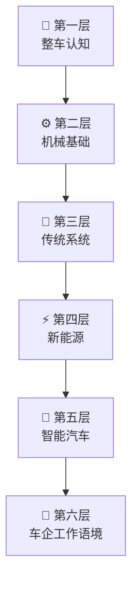

# 关于本站

> **面向非汽车专业新人** — 用可视化、场景化、路径化的方式，在入职前建立整车技术地图。

## 本站定位

汽车行业对新人的期待不是「会修车」，而是**能听懂工程语言、能把问题归到正确系统、能在跨团队协作中接上话**。本站专为三类场景设计：

| 场景 | 你的需求 | 本站回答 |
|------|----------|----------|
| 🎓 **入职前补课** | 机械/电子/软件背景，但对汽车一无所知 | 六层路径从零建立全局观 |
| 💼 **跨岗位沟通** | 产品/采购/制造/测试，需要和各工种对话 | 岗位导航锁定重点 + 术语卡解释高频缩写 |
| 📝 **面试/试用期** | 需要快速展示「懂车」 | 题库 + 错题本检验学习效果 |

## 六层知识体系

站点内容按「从整体到局部、从硬件到软件、从技术到协作」组织为六层：

| 层 | 名称 | 回答的核心问题 |
|---|------|---------------|
| 🚗 第一层 | 整车认知 | 一辆车由哪些「大块」组成？如何分类和评价？ |
| ⚙️ 第二层 | 机械基础 | 力怎么传？扭矩、传动、悬架跨系统概念 |
| 🔧 第三层 | 传统系统 | 从踩油门、踩刹车、打方向理解燃油、制动、转向 |
| ⚡ 第四层 | 新能源 | 电池、电机、BMS、混动/增程——看懂高压能量流 |
| 🧠 第五层 | 智能汽车 | 感知→决策→执行的智驾闭环，软件定义汽车 |
| 🏢 第六层 | 车企工作语境 | 术语、流程、岗位协作——听懂会议语言 |

每一层都遵循同样的内容模板：场景问题 → 结构图/表 → 原理（说人话）→ 油电对比 → 车企工作场景 → 小测。

## 如何使用本站

本站提供多种入口，按你的学习偏好选择：

| 入口 | 适合谁 | 路径 |
|------|--------|------|
| 🗺️ **30 天学习地图** | 想按节奏系统学完六层 | [查看地图 →](./path) |
| 🧭 **岗位导航** | 想知道「我的岗位该重点学什么」 | [查看岗位 →](./roles-guide/) |
| 🎓 **旗舰交互课** | 喜欢互动式学习 | [开始上课 →](./lessons/) |
| 📝 **练习题库** | 想做题检验学习效果 | [进入题库 →](./quiz/) |
| 📖 **术语表** | 遇到不认识的缩写随时查 | [打开术语表 →](./glossary) |
| 📊 **学习数据** | 追踪学习进度和错题分布 | [查看仪表盘 →](./dashboard) |

详细的入门指引请见 [如何使用本站](./how-to-use)。

## 内容规范

为保证可维护性和视觉一致性，全站内容遵循统一规范：

- **数学公式**：使用 `$...$`（行内）和 `$$...$$`（独立），由 MathJax 自动渲染
- **图表**：统一使用 Mermaid 代码块、Markdown 表格或内联 SVG，不使用 ASCII 手绘图
- **术语**：专业术语使用 `<TermCard term="缩写">缩写</TermCard>` 引入术语卡弹窗
- **配图**：全站 SVG 均为自绘，无版权风险；实物照片标注来源许可

## 技术栈

本站基于 [VitePress](https://vitepress.dev/) 构建，托管于 [GitHub Pages](https://croissantsong.github.io/car-knowledge-site/)。

- 📦 **构建**：VitePress + Mermaid + MathJax
- 🔍 **搜索**：本地全文搜索（无需外部服务）
- 🌓 **主题**：支持深色/浅色模式自动切换
- 📱 **响应式**：适配桌面、平板和移动端
- 🧩 **交互组件**：术语卡弹窗、进度追踪、QuizBlock 自测、错题本、学习仪表盘

## 作者与致谢

本站由 **Croissant Song** 创建并维护。

内容参考了以下来源（均已做理解和重述，非直接翻译）：

- SAE International 公开技术文献
- 中国汽车工程学会（SAE-China）公开报告
- 《汽车构造》《汽车理论》等经典教材的知识框架
- 各车企公开的技术白皮书与召回公告
- 汽车之家、懂车帝等垂直媒体的公开参数与评测数据

## 免责声明

::: warning 请注意

- 本站内容为**通识教育性质**，不构成任何工程建议或设计依据。实际工程决策请以企业标准、法规和验证数据为准。
- 数据（销量、渗透率、技术参数等）采集截止至 2026 年上半年，随行业发展可能变化。建议结合最新行业报告交叉验证。
- 文中提及的品牌、车型、技术方案仅用于**教学示例**，不代表作者对其的推荐或背书。
- 本站为**非商业性质**的个人学习资源，与任何车企、机构无商业关联。

:::

## 反馈与贡献

内容疏漏或建议？欢迎通过以下方式反馈：

- 🐛 [GitHub Issues](https://github.com/CroissantSong/car-knowledge-site/issues)
- ✏️ 每页底部的「在 GitHub 上编辑此页」链接
- 📧 站点持续更新中，你的反馈会直接影响后续版本的内容改进

---

> 📅 最后更新：2026-06 · 版本：v1.0
