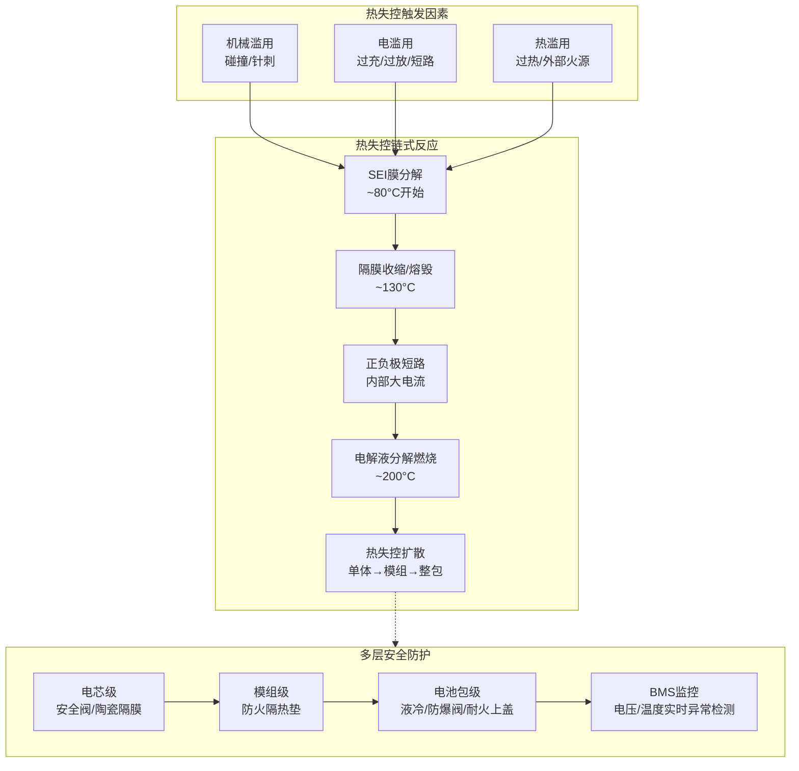
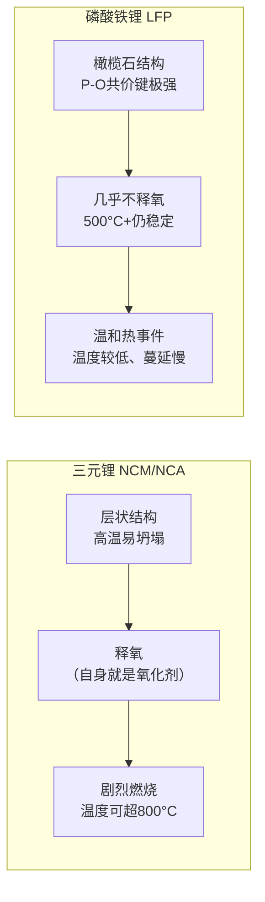
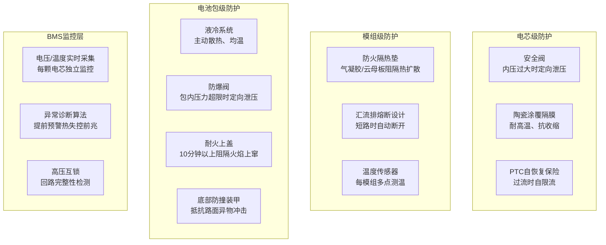
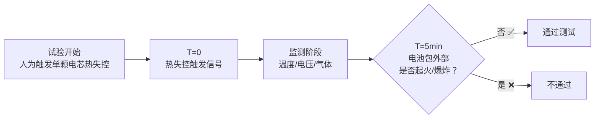

# 电池安全深度解析

> 电池安全是新能源车最受关注的话题之一。本文帮你从零开始理解：电池为什么会着火、不同电池谁更安全、车企如何层层设防、以及国标怎么测。

## 场景化问题

2025 年某天，你刷到一条新闻："某品牌电动车在充电站起火，消防员到场时车辆已被大火吞噬。"评论区炸了——"电动车就是不安全""电池技术还不成熟"。

作为刚入职车企的新人，老板让你跟进这件事：分析起火原因，形成内部技术报告。你发现整件事绕不开一个核心概念——**热失控（Thermal Runaway）**。

> 这篇文章就是你的知识底子。读完你能理解：热失控是怎么一步步发生的、为什么有的电池更难起火、车企在电池包里做了什么防护、以及国标要求怎么做测试。

## 结构图：电池安全全景

## 一、热失控原理

### 什么是热失控？

热失控不是「电池突然爆炸」，而是一个**链式化学反应**——一旦触发，温度会自我加速升高，不可逆转。

类比：就像多米诺骨牌。第一块牌（SEI膜分解）倒下时，温度还不高；但它推倒了第二块（隔膜收缩），第二块又推倒第三块（短路），最后整排牌全倒，电解液燃烧放出巨大热量。这个过程从开始到起火，可能只需要几分钟。

### 链式反应全过程

| 阶段 | 温度阈值 | 发生了什么 | 危险性 |
|------|----------|------------|--------|
| **SEI膜分解** | ~80°C | 负极表面的 SEI（固体电解质界面膜）开始分解，释放少量热量 | 热失控的起点，此时仍可逆 |
| **隔膜收缩/熔毁** | ~130°C | 聚乙烯/聚丙烯隔膜收缩闭合微孔（闭孔效应失效），正负极逐渐直接接触 | 关键转折点——一旦隔膜失效，短路由小到大 |
| **正负极内部短路** | ~150°C+ | 隔膜完全熔毁，正负极直接导通，短路电流急剧产热 | 温度开始不可控升高 |
| **电解液分解燃烧** | ~200°C | 电解液（LiPF₆ + 碳酸酯类溶剂）分解，释放 O₂ 和可燃气体，与负极锂反应剧烈燃烧 | 开始对外释放高温气体和火焰 |
| **热扩散** | >200°C | 单个电芯的热量传导至相邻电芯，触发连锁热失控 | 整包起火，威胁整车 |

> **关键理解**：SEI膜是电池正常工作的"保护层"，但它也是热失控的"导火索"。一旦温度超过约80°C，它就首先撑不住。这就是为什么 BMS 要把电池温度严格控制在 15-45°C 之间。

### 为什么会不可逆？

热失控过程中的产热速率随温度**指数级**增长：

$$Q_{gen} \propto e^{-E_a/(kT)}$$

其中 $E_a$ 为反应活化能，$k$ 为玻尔兹曼常数，$T$ 为绝对温度。温度每上升 10°C，反应速率大约翻倍，这就是热失控被称为"失控"的原因——正反馈一旦建立，任何外部干预都来不及。

## 二、三元锂 vs 磷酸铁锂的安全差异

### 核心差异

| 维度 | 三元锂（NCM/NCA） | 磷酸铁锂（LFP） |
|------|-------------------|------------------|
| **化学式** | Li(NiₓCoᵧMnₓ)O₂ / Li(NiₓCoᵧAlₓ)O₂ | LiFePO₄ |
| **晶体结构** | 层状结构（α-NaFeO₂型） | 橄榄石结构 |
| **热失控触发温度** | ~200°C | ~500°C+ |
| **热失控剧烈程度** | 高（释氧、反应猛烈） | 低（结构稳定、几乎不释氧） |
| **针刺测试** | 大多数不通过 | 轻松通过 |
| **能量密度** | 高（200-300 Wh/kg） | 较低（140-180 Wh/kg） |
| **循环寿命** | 800-2000 次 | 3000-5000 次+ |
| **成本** | 较高（含钴、镍） | 较低（铁、磷廉价） |
| **低温性能** | 较好 | 较差 |

### 为什么 LFP 更安全？

**说人话**：三元材料的层状晶体像"千层饼"——高温下结构容易坍塌，坍塌时还会释放氧气（氧化剂），氧+热+可燃电解液=火。LFP 的橄榄石结构像"坚固的晶体笼子"——铁和磷被氧原子牢牢框住，即使 500°C 高温也很难让氧原子逃出来。没有额外的氧气释放，燃烧就只能靠电解液本身那点氧，反应温和得多。

### 2024-2025 典型产品

**比亚迪刀片电池（Blade Battery）**
- 基于 LFP 化学体系，采用长条形"刀片"结构直接组成电池包（CTP 技术）
- 亮点：针刺测试后表面温度仅 30-60°C，无明火、无烟，鸡蛋放在上面不熟
- 空间利用率提升至 60%+（传统模组方案约 40%），弥补了 LFP 能量密度低的短板

**宁德时代神行电池（Shenxing Battery）**
- 同样 LFP 体系，2024 年量产装车
- 主打"超充"：10 分钟补能 400km（4C 超充），同时通过全方位安全测试
- 在 LFP 安全底子之上，通过电芯级隔热和智能 BMS 实现了超充与安全的平衡

> **油电对比**：燃油车的油箱是一层薄钢板，汽油闪点 -43°C，挥发气体遇明火即燃。电池不会在常温下挥发可燃气体，热失控需要特定的温度触发链条。但一旦触发，电池自带氧化剂（三元材料释氧），比燃油更难扑灭。所以两者的安全逻辑完全不同——油车是"防止泄漏+隔绝火源"，电车是"防止触发热失控链+遏制热扩散"。

## 三、电池包安全设计

电池包不是把电芯塞进铁盒子那么简单。它是一个多层防御系统——从电芯、模组到整包，每一层都有针对性的安全措施。

### 各层防护详解

**电芯级**
- **安全阀**（Safety Vent）：电芯顶部的薄弱点，当内部气压超过阈值（通常 0.5-1.5 MPa），安全阀定向打开，释放气体防止电芯爆裂。
- **陶瓷隔膜**：传统 PE/PP 隔膜在 130°C 左右收缩。陶瓷涂覆隔膜（Al₂O₃ 涂层）耐温可达 200°C+，为热失控争取更多逃生/响应时间。
- **PTC 涂层**：在正极集流体上涂覆正温度系数材料——温度升高时电阻急剧增大，自动限制短路电流。

**模组级**
- **防火隔热垫**：气凝胶（SiO₂纳米多孔材料）导热系数仅 ~0.02 W/(m·K)，比空气还隔热。云母板耐温 1000°C+。它们的作用不是阻止单颗电芯热失控，而是**防止热蔓延到相邻电芯**——给乘员赢得宝贵的逃生时间。
- **汇流排熔断**：类似家用保险丝，短路大电流时自动熔断，切断故障模组。

**电池包级**
- **液冷系统**：冷却液（50%水+50%乙二醇）流经电芯底部冷却板，带走热量。同时承担低温加热功能（PTC 或热泵），让电池始终在最佳温度窗口（25-35°C）工作。
- **防爆阀**：电池包通常 IP67 密封，但热失控会产生大量气体。防爆阀在内部压力超过设定值（如 10-20 kPa）时单向打开，定向排出高温气体，防止包体炸裂。
- **耐火上盖**：采用云母+钢板复合结构，阻隔火势向上蔓延到乘员舱。国标要求热失控后至少 5 分钟不烧穿。

### CTP / CTC / CTB 的结构集成趋势与安全挑战

| 技术 | 英文全称 | 核心理念 | 代表产品 | 安全挑战 |
|------|----------|----------|----------|----------|
| **CTP** | Cell to Pack | 取消模组，电芯直接集成到电池包 | 比亚迪刀片电池、宁德时代麒麟电池 3.0 | 热扩散防护更难，需要电芯本身足够安全 |
| **CTC** | Cell to Chassis | 电池包与底盘一体化，电芯嵌入底盘结构 | 特斯拉 4680 结构电池组 | 维修性差，底盘碰撞直接威胁电芯 |
| **CTB** | Cell to Body | 电池包与车身地板一体化，电池参与车身刚度 | 比亚迪海豹 CTB | 车身刚度提升但电池碰撞风险增加 |

> **关键洞察**：CTP/CTC/CTB 的核心优势是空间利用率（从 40% 到 60%+）和成本降低。但取消模组意味着失去了模组级的防火隔离层——当一颗电芯热失控时，相邻电芯间距更小、更难防护。这就是为什么**比亚迪坚持用 LFP（本身更难热失控）+ 刀片结构（长条散热好）**来做 CTP，而不是三元锂。

## 四、安全标准与测试

### 核心安全标准

| 标准 | 适用范围 | 发布/生效 | 核心要求 |
|------|----------|-----------|----------|
| **GB 38031-2020** | 中国强制标准（动力电池） | 2020/2021 | 针刺、热扩散（5分钟预警）、挤压、过充、短路等 |
| **GB 18384-2020** | 中国强制标准（整车安全） | 2020/2021 | 整车涉水、绝缘电阻、Reess 安全等 |
| **UN R100** | 联合国法规（欧洲等参考） | 2013 | 振动、热冲击、过充、短路等 |
| **ECE R100** | 欧盟型式认证 | 等同 UN R100 | 进入欧洲市场必须通过 |
| **UL 2580** | 美国保险商实验室 | 2013 | 电芯/模组/整包多层级安全测试 |

### 关键测试项目

**针刺测试（GB/T）**
- 用直径 5-8mm 的钢针，以 25±5 mm/s 速度刺入电芯，停留至少 1 小时
- 要求：不起火、不爆炸
- 背景：2020 版国标将其从强制改为"可协商选择"（因三元锂难以通过），但 2025 年修订版可能重新提高要求

**热扩散测试（GB 38031 第 5.2.7 条）**
- 人为触发电芯热失控，观察是否蔓延至整包
- 核心指标：**热失控触发后至少 5 分钟，电池包外部不起火、不爆炸**（给乘员逃生时间）
- 这是当前最受关注的安全测试——"5 分钟预警"成为行业基准

**挤压测试**
- 用半径 75mm 的半圆柱体以 100kN 力挤压电池包
- 要求：不起火、不爆炸
- 模拟严重侧面碰撞场景

**过充/过放测试**
- 以规定电流过充至满电电压的 110%-130%
- 要求：不起火、不爆炸
- 考验 BMS 保护策略的冗余设计

**短路测试**
- 将正负极外部短接，电阻 <5mΩ
- 要求：不起火、不爆炸
- 考验熔断器和汇流排保护设计

### 2025 年法规更新趋势

- **热扩散预警时间延长**：可能从 5 分钟提升到 10-15 分钟
- **针刺测试要求加严**：可能从"选做"回归"强制"
- **全生命周期安全**：新增老化电池（循环充放电后）的安全测试要求
- **底部碰撞防护**：新增模拟路面异物冲击的底部刮底/托底测试
- **充电安全**：大功率超充（≥350kW）场景下的热安全验证

### 现实数据

2025 年中国新能源车火灾率约为 **每万辆 0.03 起**，显著低于 2019 年的 0.1 起/万辆，且低于燃油车的火灾率。技术进步和法规加严带来的改善是肉眼可见的。

## 五、车企工作场景

### 场景一：BMS 工程师如何监控电芯异常

你刚进入电池研发团队，被分配到 BMS 策略组。你的日常工作包括：

1. **数据采集**：BMS 通过单体电压采集芯片（如 ADI LTC6811 / TI BQ79616）实时读取每颗电芯的电压（精度 ±1.5mV）和温度（精度 ±1°C）。

2. **异常诊断逻辑**：编写算法检测以下前兆：
   - 电压突降 > 200mV/s（内短路征兆）
   - 温升速率 > 2°C/min（热失控前兆）
   - 单体压差异常增大 > 100mV（一致性劣化）
   - 绝缘电阻 < 100Ω/V（漏电预警）

3. **分级响应**：
   | 级别 | 触发条件 | BMS 动作 |
   |------|----------|----------|
   | 一级预警 | 温差 > 5°C 或 SOC 偏高 | 增加冷却功率，写入故障码 |
   | 二级预警 | 电压异常波动或绝缘下降 | 限制充放电功率，点亮仪表故障灯 |
   | 三级预警 | 温升速率异常或电压骤降 | 立即断开高压继电器，发送 SOS 报警 |

### 场景二：热扩散测试现场

作为新员工，你被安排旁听一轮 GB 38031 热扩散测试：

**测试准备**
- 试验在防爆温控室中进行，全程高速摄像+红外热成像监控
- 在电池包内部预设触发装置（加热膜贴在指定电芯上，模拟热滥用触发）
- 温度传感器、电压采集线、气体传感器（H₂、CO、VOC）全部就位

**测试过程**
1. 对目标电芯持续加热，模拟热失控触发
2. BMS 检测到温度异常 → 记录触发时刻
3. 目标电芯安全阀打开（喷射白色电解液蒸汽）
4. 观察相邻电芯温度变化 → 判断热扩散是否蔓延
5. 计时：热失控触发信号发出后，5 分钟内电池包外部是否出现明火或爆炸

**你的职责**
- 协助数据记录：记录每个时间点的电芯温度、包内气压、气体浓度
- 拍照取证：记录安全阀开启、防爆阀动作等关键事件
- 撰写测试小节：输入到 DVP 报告模板中

### 场景三：电池包 DVP（设计验证计划）

新员工在入职后的 3-6 个月通常会被分配辅助执行 DVP 中的机械/安全测试项目。一份典型的电池包 DVP 包含：

| DVP 条目 | 测试标准 | 样品数量 | 通过标准 |
|----------|----------|----------|----------|
| 振动测试 | GB 38031-4.1 | 3 套 | 无泄漏、无裂纹、绝缘正常 |
| 机械冲击 | GB 38031-4.2 | 3 套 | 无泄漏、无裂纹、绝缘正常 |
| 挤压测试 | GB 38031-5.1 | 1 套 | 不起火、不爆炸（100kN） |
| 海水浸泡 | GB 38031-7.1 | 2 套 | 不起火、不爆炸，绝缘 >100Ω/V |
| 热扩散 | GB 38031-5.2.7 | 1 套 | 5 分钟预警，外部无明火/爆炸 |
| 过充保护 | GB 38031-5.2.1 | 2 套 | BMS 正常切断，不起火 |
| 短路保护 | GB 38031-5.2.2 | 2 套 | 熔断器动作，不起火 |

作为新人，你的角色是：
- 配合测试工程师安装传感器和连接线束
- 按 DVP 检查表逐项确认试验条件
- 记录原始数据并在测试后完成数据整理
- 如出现异常（如试验中途提前触发），第一时间通知主管

> **给新人的一句话**：电池安全不是"一块电池"的事，而是**电芯化学 + 结构设计 + BMS 监控 + 法规验证**四根支柱的共同结果。你不需要是化学博士，但要理解这条链条上的每一步。

## QA

**Q：LFP 比三元锂安全，为什么不是所有人都用 LFP？**
A：能量密度的差距是关键。三元锂系统能量密度可达 260 Wh/kg+（麒麟电池），LFP 通常在 160 Wh/kg 左右。对于续航 700km+ 的高端车，三元锂几乎是唯一选择。但中低端市场（400-600km 续航）LFP 已逐渐成为主流——安全、便宜、寿命长，性价比极高。

**Q：电动车泡水后会触电吗？**
A：不会。电池包设计防护等级通常为 IP67/IP68，且有高压互锁回路——一旦检测到绝缘电阻下降（如进水），BMS 会在毫秒级内断开高压继电器。GB 18384 要求浸水后绝缘电阻 ≥ 100Ω/V，远高于安全阈值。

**Q：快充是不是比慢充更危险？**
A：快充（尤其是 4C+ 超充）确实对电池的挑战更大。大电流导致电芯内部产热增加、锂枝晶生长风险增高。但 2024-2025 年的车型已针对超充场景强化了热管理（如宁德神行的超充+安全方案）。只要使用品牌认证充电桩，风险可控。

**Q：电池衰减和安全有关系吗？**
A：电池老化后，内阻增大、一致性下降，极端情况下可能增加热失控风险（析锂、微短路）。这也是 2025 年法规关注"全生命周期安全"的原因——不仅新车安全，8 年/16 万公里后也要安全。
