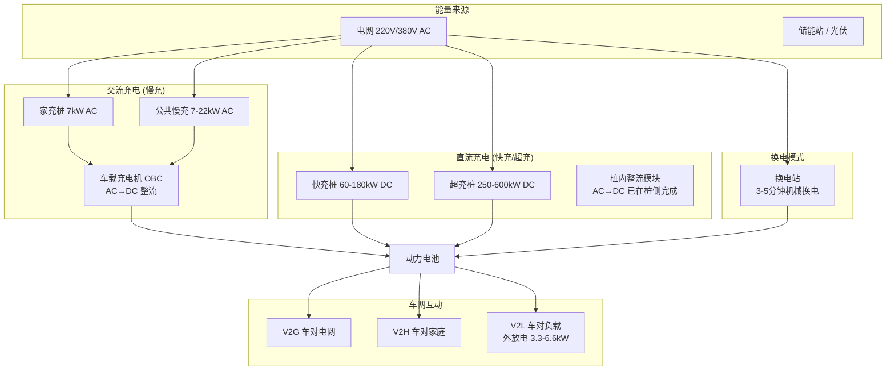
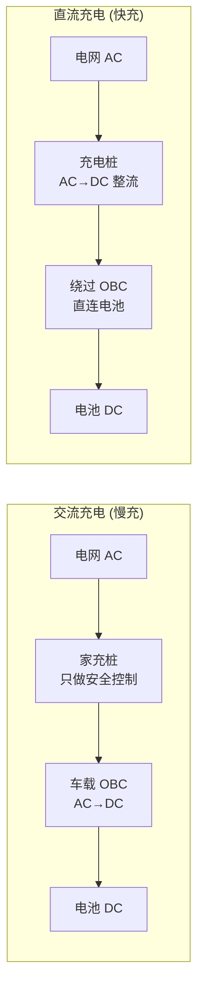
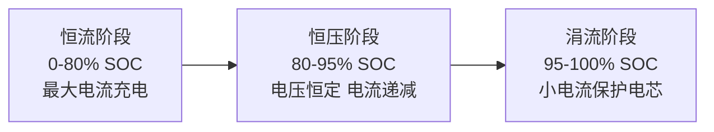
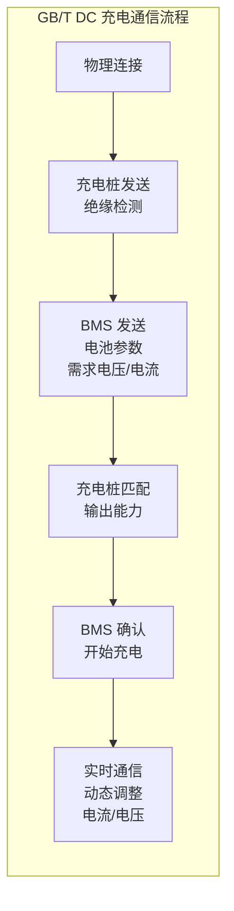
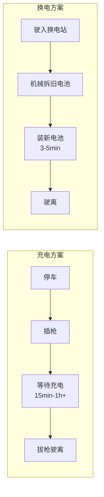
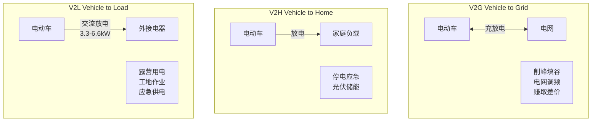

# 充电与补能体系深度解析

> 2025 年你入职车企第一天，同事就问你：「咱们新车支持 800V 超充吗？充电 5 分钟跑 200 公里是真的假的？」这篇文章帮你从零理解充电这件事——从物理原理到充电桩国标，从家充桩到换电站，从 400V 到 800V。

## 场景化问题

新员工小李入职某新能源车企的产品规划部。会议上，产品总监抛出几个问题：

- 「我们的新车要不要上 800V？上了 800V，用户在家里能充电吗？」
- 「为什么有的车充电 15 分钟就满了，有的要充 1 小时？」
- 「换电和超充，到底哪个是未来？」

小李一脸茫然——他只开过燃油车，加油 3 分钟搞定，从未想过「充电」还有这么多学问。

> 这篇文章就是小李的知识底子。读完你能理解：交流充电和直流充电的区别、功率是怎么限制的、800V 为什么快、换电的商业模式、以及新车企在补能体系上怎么布局。

## 结构图：补能体系全景

## 一、交流充电 vs 直流充电：根本区别

### 核心差异

交流充电（慢充）和直流充电（快充）的根本区别在于**整流（AC→DC）在哪里发生**：

| 维度 | 交流充电 AC | 直流充电 DC |
|------|-----------|-----------|
| **整流位置** | 车载充电机 OBC（车上） | 充电桩内部（桩上） |
| **充电功率** | 3.3kW / 7kW / 11kW / 22kW | 60kW / 120kW / 250kW / 480kW+ |
| **电压** | 220V 单相 / 380V 三相 | 400V-1000V DC 直出 |
| **充电时间（60kWh 电池）** | 6-18 小时 | 15-60 分钟 |
| **设备成本** | 低（家充桩 2000-5000 元） | 高（快充桩 3-15 万元） |
| **对电池的影响** | 极低（<0.5C 充电） | 有影响（1C-5C+ 快充产热大） |
| **主要场景** | 过夜充电、目的地充电 | 高速服务区、商场、应急补能 |

**原理（说人话）**：电池只吃直流电（DC），但电网送出来的是交流电（AC）。交流充电就是用车载充电机 <TermCard term="OBC">OBC</TermCard> 自己把交流变直流——OBC 装在车里，受限于体积和散热，功率做不大（通常 7-11kW）。直流充电是充电桩帮你把交流变直流，桩可以做得很大、散热好，功率可以冲到几百 kW，直接越过 OBC 往电池灌。

**类比**：交流充电像拿水杯从水龙头接水倒进桶里（OBC 是小杯子，速度受限）；直流充电像直接把消防水管接到桶上灌（桩上整流模块是大水管，速度快得多）。

### 功率是怎么算的？

充电功率的决定公式：

$$P_{charge} = V_{battery} \times I_{charge}$$

其中 $V_{battery}$ 为电池当前电压（随 SOC 变化），$I_{charge}$ 为充电电流。

实际充电不是恒功率的——电池管理系统 <TermCard term="BMS">BMS</TermCard> 会根据 SOC 和温度动态调整充电曲线：

这就是为什么厂商宣传「30 分钟充到 80%」而不是「充到 100%」——后 20% 为了保护电池，充电速度会大幅降低。

## 二、充电接口与标准

### 全球主要充电标准

| 标准 | 地区 | AC 接口 | DC 接口 | 最大功率 | 特点 |
|------|------|---------|---------|----------|------|
| **GB/T** | 中国 | Type 2（7 孔） | GB/T DC（9 孔） | 目前 250kW，ChaoJi 目标 900kW | 中国强制标准，2025 年全面升级 ChaoJi |
| **CCS1** | 北美 | J1772 | J1772+2Pin | 350kW | 通用/福特/宝马等采用 |
| **CCS2** | 欧洲 | Type 2 | Type 2+2Pin | 350kW | 欧洲强制标准 |
| **NACS** | 北美 | — | Tesla 专有（2022 开放） | 1000V/615kW | 福特/GM/Rivian 等宣布接入 |
| **CHAdeMO** | 日本 | — | 日标快充 | 400kW（3.0） | 日产/三菱主导，趋于边缘化 |
| **ChaoJi** | 中国/国际 | — | 新一代超充标准 | 目标 900kW | GB/T 2025 升级方向，兼容 IEC |

> **2025 关键动态**：中国正在推动 GB/T 充电标准向 ChaoJi（超级充电）升级，目标最大功率 900kW（1500V/600A），同时向下兼容老国标。北美市场 NACS（特斯拉充电标准）正在快速扩张——2024 年起福特、通用、Rivian、丰田等纷纷宣布接入特斯拉超充网络。

### 中国充电接口详解

**GB/T AC（交流慢充）**：
- 7 个端子：L1/L2/L3（三相电）、N（零线）、PE（接地）、CP（控制导引）、CC（连接确认）
- 控制导引 CP 信号用于车-桩通信：确认连接状态、协商最大充电电流

**GB/T DC（直流快充）**：
- 9 个端子：DC+/DC-（直流母线）、PE、S+/S-（CAN 通信）、CC1/CC2、A+/A-（辅助电源）
- 通过 CAN 总线通信：BMS 告诉充电桩「我现在能接受多少电流/电压」

## 三、超充技术：从 400V 到 800V、兆瓦级

### 800V 高压平台

充电功率 $P = V \times I$。要想充得快：
- **提高电压**（800V vs 400V）→ 同样电流下功率翻倍
- **提高电流** → 但电流翻倍，线缆发热 $P_{热} = I^2R$ 翻四倍

所以行业选择了「升压」路线。800V 平台的核心优势：

| 场景 | 400V 平台 | 800V 平台 | 提升 |
|------|----------|----------|------|
| 最大充电功率 | ~150kW | ~480kW | ×3.2 |
| 10%-80% 充电时间 | ~30 分钟 | ~12-15 分钟 | 减半 |
| 同功率下电流 | 大 | 小（一半） | 降发热 |
| 同功率下线缆重量 | 重 | 轻 | 减重降本 |

**关键部件——<TermCard term="SiC">SiC</TermCard>（碳化硅）功率器件**：

| 特性 | IGBT（硅） | SiC MOSFET（碳化硅） |
|------|-----------|---------------------|
| 开关频率 | 10-20 kHz | 100+ kHz |
| 开关损耗 | 较高 | 低 50-80% |
| 耐压 | 650-1200V | 1200-1700V |
| 成本 | 低 | 约 IGBT 的 2-3 倍 |

800V 车型必须有 SiC 器件支撑——传统 IGBT 在 800V 下的开关损耗急剧增加，效率大打折扣。

### 2025 年量产超充方案对比

| 品牌 | 技术平台 | 最大充电功率 | 充电速度 | 电池类型 | 技术亮点 |
|------|----------|-------------|----------|----------|----------|
| **理想 MEGA** | 800V + 麒麟 5C | 520kW | 12 分钟 10-80% | 宁德时代麒麟 5C | 5C 超充电池，充电倍率行业领先 |
| **小鹏 G9** | 800V SiC | 480kW | 15 分钟 10-80% | 三元锂 | 国内首款 800V 量产车（2022） |
| **极氪 001** | 800V 全栈 | 420kW | 15 分钟 10-80% | 宁德时代麒麟 | 全域 800V（电池/电机/电控/OBC） |
| **小米 SU7 Max** | 800V | 871V 最高电压 | 15 分钟 10-80% | 宁德时代神行/麒麟 | 准 900V 实际电压 |
| **特斯拉 Cybertruck** | 800V | 350kW | — | 4680 电池 | 特斯拉首个 800V 平台 |
| **比亚迪 海豹 06 GT** | e 平台 3.0 Evo | ~230kW | 25 分钟 30-80% | 刀片 LFP | 升压快充技术，兼容 800V 桩 |

> **充电倍率 C-rate**：1C = 1 小时充满。4C = 15 分钟充满。5C = 12 分钟充满。理想 MEGA 的 5C 意味着理论上 12 分钟可充满，实际充电策略在 10-80% 区间维持最高功率。

### 兆瓦级充电（MCS）：商用车的未来

商用车（重卡、大巴）的充电需求远超乘用车——一块 300kWh+ 的电池，用 350kW 桩也要充近 1 小时。兆瓦级充电系统（MCS, Megawatt Charging System）应运而生：

- 目标功率：1-3.75MW（3000A，1250V）
- 主要场景：电动重卡、港口/矿山作业车辆
- 标准进展：CharIN MCS 标准 2024 年发布，中国也在推进对应国标
- 国内代表：宁德时代骐骥换电（重卡换电方案）、特来电重卡大功率充电站

## 四、换电模式：另一种补能思路

### 换电 vs 充电

| 维度 | 超充 | 换电 |
|------|------|------|
| 补能时间 | 12-30 分钟 | 3-5 分钟 |
| 体验 | 接近加油 | 比加油更快 |
| 基础设施成本 | 单桩数十万 | 单站数百万（含电池） |
| 电池产权 | 用户拥有 | 可租可买（蔚来 BaaS） |
| 标准化难度 | 接口标准已基本统一 | 各品牌电池不通用 |
| 适用场景 | 乘用车主流 | 出租车/网约车/重卡 |

### 中国换电格局（2025）

| 品牌 | 换电站数量 | 商业模式 | 技术特点 |
|------|-----------|----------|----------|
| **蔚来 NIO** | 3000+ 座（含高速） | BaaS 电池租赁+换电 | 3 分钟换电，支持多车型兼容 |
| **宁德时代 EVOGO** | 200+ 座（快速扩张） | 「巧克力」模块化换电 | 按需租电块，一块≈200km |
| **奥动新能源** | 800+ 座 | 运营车辆为主 | 20 秒极速换电 |
| **吉利睿蓝** | 200+ 座 | 车型绑定 | 轿车/SUV 换电 |

**换电的商业模式创新——BaaS（Battery as a Service）**：

蔚来的 BaaS 模式：买车时不含电池（车价减 7 万），每月付电池租金（约 980 元/月）。好处：
1. 购车门槛降低
2. 电池衰减/升级由蔚来承担
3. 可以随时升级更大容量电池（如 70kWh→100kWh→150kWh）
4. 换电站可参与电网调频调峰（V2G），创造额外收益

> **2025 政策动态**：中国工信部将换电模式纳入新能源汽车产业发展规划重点支持方向，多个城市对换电站建设给予补贴（单站最高 50-100 万元）。

## 五、充电桩产业链与布局

### 中国充电基础设施规模（2025）

| 类型 | 数量 | 同比增长 | 主要分布 |
|------|------|----------|----------|
| 公共充电桩 | 350 万+ | +40% | 城市商圈、高速服务区 |
| 私人充电桩 | 750 万+ | +35% | 居民小区 |
| 换电站 | 4000+ 座 | +100% | 城市核心区、高速沿线 |
| 高速服务区充电覆盖率 | 96%+ | — | 全国高速公路 |

**车桩比**：中国新能源车保有量约 3000 万辆，公桩车桩比约 8.6:1（含私桩约 2.7:1），仍存在充电焦虑，尤其是在节假日高速公路场景。

### 充电桩的功率等级

| 类型 | 功率 | 电压 | 电流 | 典型充电时间 |
|------|------|------|------|-------------|
| 家充桩 | 3.3 / 7 kW | 220V AC | 16 / 32A | 8-18h |
| 目的地慢充 | 11 / 22 kW | 380V AC 三相 | 16 / 32A | 3-6h |
| 普通快充 | 60-120kW | 200-500V DC | 120-250A | 30-60min |
| 超充 | 180-250kW | 400-800V DC | 200-400A | 20-30min |
| 极速超充 | 350-520kW | 800-1000V DC | 400-600A | 10-15min |

### 充电桩的核心部件

| 部件 | 功能 | 成本占比 |
|------|------|----------|
| **充电模块（功率模块）** | AC→DC 整流，是桩的「心脏」 | 40-50% |
| **充电枪 + 线缆** | 连接车辆，含液冷系统（超充用） | 10-15% |
| **控制系统** | 计费/通信/安全保护 | 10-15% |
| **配电系统** | 变压器/开关柜/滤波 | 15-20% |
| **其他** | 机柜/散热/安装 | 10-15% |

> 国内充电模块头部厂商：华为数字能源、特来电、盛弘股份、通合科技、英可瑞。华为推出的「充电一分钟续航 200 公里」全液冷超充方案，单枪最大功率 600kW。

### 车企补能体系对比

| 品牌 | 自建充电桩 | 超充桩功率 | 特色服务 |
|------|-----------|-----------|----------|
| **特斯拉** | 超充站 2300+ 座（中国） | 250kW V3 / 350kW V4 | 超充 + 目的地充，全球超 6 万桩 |
| **蔚来** | 充电桩 2 万+ 换电站 3000+ | 500kW 超快充 | 「可充可换可升级」三位一体 |
| **小鹏** | 自营超充站 2200+ 座 | 480kW S4 超快充 | 超充 + 免费充电额度 |
| **理想** | 超充站 600+ 座（2025 快速扩张） | 520kW 5C 超充 | 高速超充网络布局 |
| **比亚迪** | 充电桩布局以合作为主 | — | 双枪快充技术（部分车型） |
| **华为** | 合作建设「一秒一公里」超充 | 600kW | 全液冷技术方案输出 |

## 六、车网互动 V2X

电动车不仅是交通工具，更是「带轮子的储能站」。一辆 60kWh 电池的电动车，足够一个家庭用 3-5 天。

### V2X 的三种形态

**V2L 外放电（最普及）**：比亚迪、蔚来、理想等多数新能源车已标配。最大功率通常 3.3-6.6kW，可通过交流插座直接给电磁炉、投影仪、电钻等供电。2023-2025 年「露营经济」火爆是 V2L 在国内普及的关键推动力。

**V2G 削峰填谷的商业逻辑**：电价峰谷价差约 0.5-1 元/kWh。一辆 60kWh 的车，谷时充电（0.3 元/kWh），峰时放电（1.3 元/kWh），每度电赚 1 元，一天一个循环赚 60 元——年收益理论可达 2 万元。但目前受限于：
- 电池循环寿命担忧（消费者不愿让电池额外充放电）
- 双向充电桩普及率低
- 电力市场交易机制尚不完善

> **2025 政策**：国家发改委、国家能源局发布《关于加强新能源汽车与电网融合互动的实施意见》，明确提出 2025 年初步建成车网互动技术标准体系，2030 年车网互动实现规模化应用。

## 七、车企工作场景

### 场景一：充电策略定义

你进入新能源车企三电部门，被分配到充电策略组。你的日常工作：

1. **充电 Map 定义**：与 BMS 团队和电池供应商（宁德时代/弗迪等）一起定义不同温度下的充电 Map（SOC-温度-电流三维表）
2. **竞品充电对标**：用功率分析仪实测竞品的充电曲线——起始功率、维持功率、降功率点、全程充电时间
3. **用户充电场景分析**：从车联网后台提取用户充电数据，分析 SOC 起始值分布、充电时长分布、快慢充比例——指导营销话术和用户手册

### 场景二：超充桩-车兼容性测试

新车型上市前，必须做一轮超充兼容性测试：

1. **测试矩阵**：
   - 桩侧：国家电网/特来电/星星充电/特斯拉/蔚来/小鹏等主流运营商
   - 车型：试制样车 × 2-3 台
   - 工况：常温/高温/低温，低 SOC/高 SOC，反复插拔

2. **常见问题**：
   - 通信握手失败（CAN 协议版本不匹配）
   - 充电中途降功率（BMS 策略过保守或桩侧温度限功率）
   - 电子锁卡死拔不下枪
   - 充电口过热（大电流下接触电阻大）

3. **输出物**：兼容性测试报告 + 问题跟踪表，问题闭环后才可 SOP 量产。

### 场景三：家充桩安装策略

很多新人不知道——家充桩的安装涉及的不只是「把桩挂墙上」：

1. **电力报装**：用户向物业/国家电网申请独立电表（通常 220V/40A 或 380V/63A）
2. **布线施工**：配电间到车位可能要走几十米甚至上百米电缆
3. **车企角色**：大多数车企赠送家充桩并包 30 米基础安装，超出部分用户自费

**新人面试常见问题**：如果用户住 20 楼、车位在负二层，家充桩怎么装？答案：取决于小区电容余量、物业配合度和布线距离——很多老旧小区电容不足，根本装不了。这也是为什么公共充电对很多人仍然是刚需。

> **给新人的一句话**：补能不是「桩有多快」的问题，而是「桩在哪、好不好用、能不能充上」的综合体验。理解了充电的全链条（电网→变压器→充电桩→充电枪→OBC/BMS→电池），你才能理解为什么「800V 超充」和「小区装不了桩」可以同时存在。

## QA

**Q：800V 的车能在 400V 的桩上充电吗？**
A：需要看车型设计。部分 800V 车型内置了升压/降压模块（如小鹏 G9 的「升压充电」技术），可在 400V 桩上充电但功率受限。部分车型（如部分早期保时捷 Taycan）必须有直流变压模块才兼容。2025 年新出的 800V 车型大多已标配兼容方案。

**Q：快充到底伤不伤电池？**
A：高频快充确实会加速电池老化（锂枝晶生长、电解液分解加速），但 2024-2025 年的电池和 BMS 策略已大幅优化——通过精准热管理和智能充电曲线，在保证安全的前提下将老化控制在可接受范围（8 年/16 万公里仍满足 80% 容量要求）。

**Q：换电站放那么多电池，会不会爆炸？**
A：换电站内电池通常维持在 50-70% SOC（最安全的区间），且有液冷温控系统 24 小时监控每块电池的温度。电池仓之间有防火隔离。蔚来第三代换电站内置了消防喷淋系统。

**Q：为什么节假日高速充电排长队，多建桩不行吗？**
A：充电桩的利用率是「极度不均衡」的——节假日高峰时段利用率 90%+，平日利用率可能不到 10%。单纯多建桩的经济账算不过来。解决路径：① 超充缩短单次充电时间 ② 高速服务区动态调配（节假日移动充电机器人、有序排队预约）③ 提升车辆续航以减少中途补能需求。
