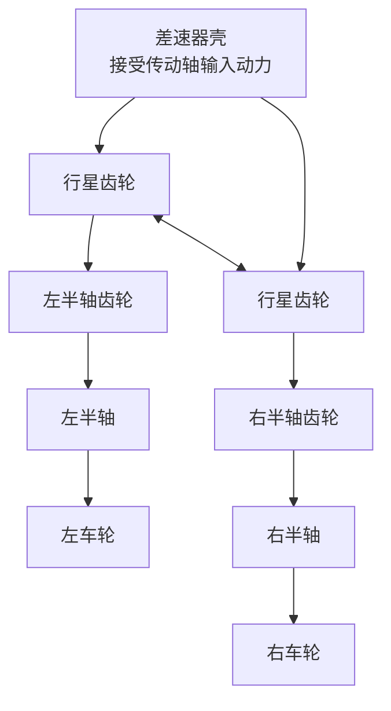
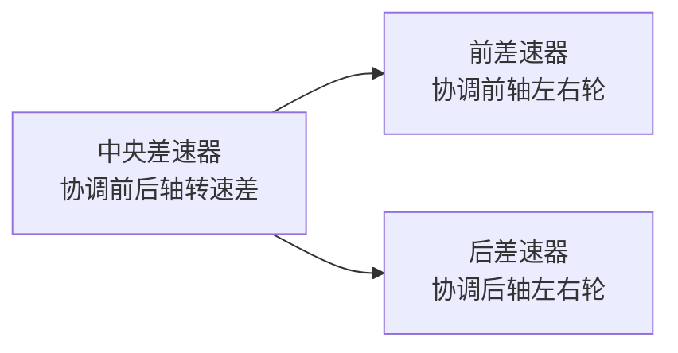

# 差速器

> 一个让所有初学者恍然大悟的装置：它解决了汽车转弯时左右轮转速不同的问题。

## 问题：转弯时左右轮转速不同

当汽车转弯时：

<svg class="auto-diagram" viewBox="0 0 720 260" role="img" aria-label="车辆转弯时外侧车轮路径更长、内侧车轮路径更短">
  <defs>
    <marker id="turn-arrow" markerWidth="10" markerHeight="10" refX="8" refY="3" orient="auto" markerUnits="strokeWidth">
      <path d="M0,0 L0,6 L9,3 z" fill="currentColor" />
    </marker>
  </defs>
  <path class="auto-diagram-axis" d="M120 210 C210 40, 510 40, 600 210" marker-end="url(#turn-arrow)" />
  <path class="auto-diagram-emphasis" d="M230 205 C285 105, 435 105, 490 205" marker-end="url(#turn-arrow)" />
  <rect class="auto-diagram-node" x="130" y="178" width="110" height="42" rx="8" />
  <rect class="auto-diagram-node" x="480" y="178" width="110" height="42" rx="8" />
  <text x="360" y="42" text-anchor="middle">外侧车轮：路径更长，需要转得更快</text>
  <text x="360" y="134" text-anchor="middle">内侧车轮：路径更短，需要转得更慢</text>
  <text x="185" y="205" text-anchor="middle">内轮</text>
  <text x="535" y="205" text-anchor="middle">外轮</text>
</svg>

> 内侧车轮走的路径短，外侧走的路径长。但在相同时间内，两边必须走完各自的路程→内轮要转得慢、外轮要转得快。

如果左右轮是刚性连接的（同一根轴），转速完全相同 → 转弯时会磨损轮胎、损坏传动系统。

## 差速器的解决方案

差速器允许左右轮**以不同的转速旋转**，同时将动力分配给两边。

### 工作原理

差速器由四个伞齿轮组成：

- **直线行驶**：行星齿轮不自转，左右半轴等速旋转
- **转弯时**：行星齿轮自转，允许一侧快、一侧慢，同时两边总转速保持不变

> 简单理解：差速器内部的齿轮组像一个「跷跷板」，一边慢下来，另一边就会快起来。

## 差速器的局限：打滑问题

普通差速器有一个天然缺陷：**扭矩总是流向阻力小的那一侧**。

场景：一侧车轮在冰面（低附着），一侧在柏油路（高附着）。

| 车轮位置 | 路面附着 | 普通差速器表现 |
|----------|----------|----------------|
| 冰面侧车轮 | 低附着、阻力小 | 容易空转，获得大部分转速 |
| 柏油路侧车轮 | 高附着、阻力大 | 获得的有效驱动力不足 |
| 整车结果 | 两侧扭矩受低附着侧限制 | 车辆可能原地不走 |

这就是为什么你会看到冬天一辆陷在雪里的车只有一侧轮子狂转。

## 解决打滑的方案

### 限滑差速器（LSD）

LSD（Limited Slip Differential）在两侧转速差过大时，限制滑动：

| 类型 | 原理 | 特点 |
|------|------|------|
| **机械式（离合器式/托森）** | 转速差激活内部锁止 | 纯机械，反应快 |
| **电子限滑** | ESP 系统制动打滑车轮 | 成本低，靠制动模拟 |

托森差速器（Torsen）是奥迪 quattro 全时四驱系统的核心——蜗轮蜗杆结构的自锁特性让它在检测到打滑的瞬间将扭矩转移到有附着力的车轮。

### 差速锁

越野车上的终极方案——直接**锁死**差速器，让左右轮强制等速旋转。

- 适合极端越野（攀岩、泥地、沙地）
- 铺装路面使用会严重磨损轮胎和传动系统

## 四驱与差速器

四驱车需要**三个差速器**（或等效装置）：

**中央差速器**解决前后轴之间的转速差问题。

## QA

**Q：前驱车有差速器吗？**  
A：有，集成在变速箱内。前驱车的差速器和变速箱是一个总成（称为「变速箱总成」或「transaxle」）。

**Q：差速器和差速锁是一个东西吗？**  
A：不是。差速器**允许**转速差（转弯必须），差速锁**消除**转速差（脱困时用）。有些车的差速锁是手动开关的，平时是普通差速器。

**Q：ESP 和差速器有什么关系？**  
A：ESP 可以通过**制动打滑车轮**来间接实现限滑效果——制动让打滑轮看起来「阻力大」，扭矩自然流向另一边。这比安装机械 LSD 成本低得多，所以现在很多车用「电子限滑」代替。

## 电动车时代的差速器新玩法

### 电动四驱省掉了中央差速器

传统燃油四驱车需要中央差速器（或分动箱）来协调前后轴的转速差。但电动四驱**从根本上不需要中央差速器**——前后轴各有一个独立电机驱动，前后轴的转速和扭矩由整车控制器 <TermCard term="VCU">VCU</TermCard> 通过软件精确分配。

| 方案 | 原理 | 优势 |
|------|------|------|
| **燃油四驱** | 发动机→分动箱/中央差速器→前后传动轴→前后差速器→车轮 | 结构复杂、重量大 |
| **电动四驱** | 前电机→前差速器→前轮；后电机→后差速器→后轮 | VCU 软件分配、响应毫秒级 |

**优势**：前后轴扭矩分配由软件控制，前驱/后驱/四驱模式可动态切换（如日常后驱省电，打滑瞬间前轴介入）。

### 扭矩矢量控制（Torque Vectoring）

这是差速器技术的「终极进化」——不仅允许左右轮转速不同，还能**主动将更多扭矩分配给外侧车轮**，帮助车辆更快更稳地过弯。

| 方案 | 原理 | 代表 |
|------|------|------|
| **制动式矢量控制** | ESP 制动内侧后轮，模拟扭矩外移 | 多数主流车型 |
| **机械式扭矩矢量差速器** | 差速器内含多片离合器和行星齿轮组，主动分配扭矩 | 奥迪 Sport Differential、宝马 M |
| **双电机独立驱动** | 后轴左右轮各一个电机，扭矩独立控制 | 极氪 001 FR（四电机）、Rivian R1T |

**极氪 001 FR 的四电机方案**：四个车轮各有一个独立电机驱动，连差速器都不需要了——左轮和右轮之间没有机械连接，扭矩由软件精准控制各轮，实现坦克掉头（左右轮反向旋转）、原地转圈等传统差速器无法做到的动作。

> **2025 趋势**：扭矩矢量控制正在从高端性能车向 30 万级电动轿跑普及。比亚迪、蔚来、小鹏等的高端车型陆续搭载双电机/三电机/四电机方案，配合软件实现电子扭矩矢量分配。

## 差速器在车企工作中的应用

### 场景一：差速器齿轮设计

作为刚入职传动系统部门的新人，你可能会参与差速器齿轮的设计验证：

1. **齿轮强度校核**：用 KISSsoft / Romax 软件对伞齿轮做弯曲强度和接触强度计算
2. **NVH 测试**：在台架上跑差速器噪声测试——齿轮啮合噪声是差速器 NVH 的主要来源
3. **差速器限滑标定**：如果是电子限滑/LSD 车型，需要在冰雪/对开路面上做标定

### 场景二：整车路试中的差速器问题排查

冬季路试中常见问题：

| 现象 | 可能原因 | 排查方向 |
|------|----------|----------|
| 转弯时后轴「咯噔」响 | 差速器齿轮间隙过大 | 测齿隙，检垫片 |
| 对开路面起步不走 | 电子限滑标定过保守 | 调整 ESP 制动干预阈值 |
| 转弯时内侧轮响胎 | 差速器限滑力矩过大 | 降低 LSD 预紧力 |
| 高速行驶后轴啸叫 | 差速器齿轮啮合噪声 | 做齿轮修形优化 |

> **给新人的一句话**：差速器看起来只是个小齿轮箱，但它在传动系统中的地位很关键——一方面要让车轮在转弯时自由差速，另一方面要保证在打滑时能把动力传给有附着力的车轮。这个「既要自由、又要有约束」的矛盾，是差速器工程师每天面对的核心命题。

<figure class="knowledge-figure">
  
  <figcaption>图：车辆转弯时外侧车轮路径更长，差速器允许左右轮形成转速差。本站自绘 SVG。</figcaption>
</figure>
