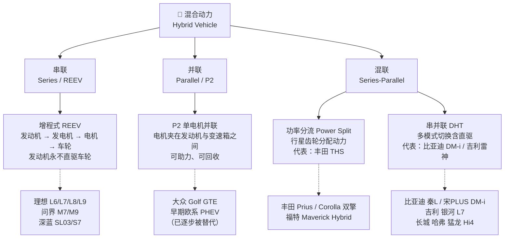
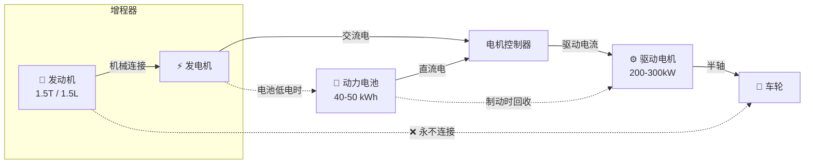
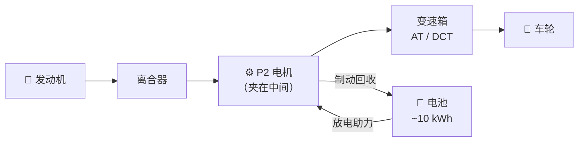
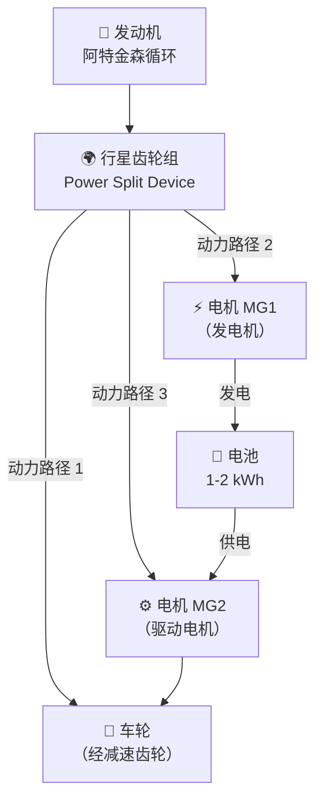
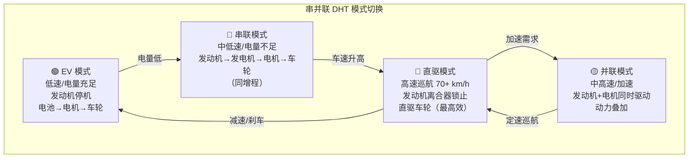
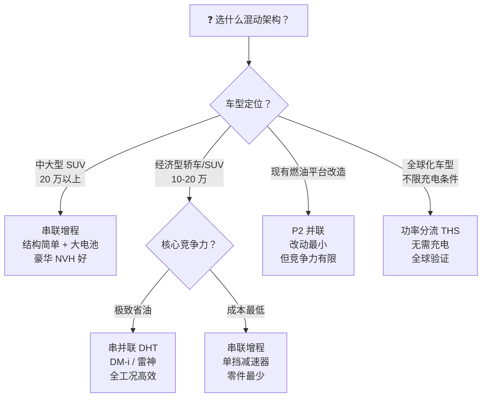

# 混动架构深度对比：串联 / 并联 / 混联到底怎么选？

> 2025 年的中国车市，混动车销量已和纯电车平分秋色。但"混动"背后至少有四种完全不同的技术路线——本文一次性帮你理清。

---

## 1. 混动分类框架

### 场景化问题

你去看车，销售说"这是混动"，打开另一家也说"我们是混动"——但有的必须充电、有的不用充、有的高速特别省、有的高速反而更费油。为什么都叫混动，差别这么大？

### 结构图

### 原理（说人话）

混动不是"一种技术"，而是一个**技术大类**，核心区别只有一个问题：**发动机能不能直接驱动车轮？如果能，什么时候介入？**

| 架构 | 发动机直驱？ | 核心思想 |
|------|:-----------:|----------|
| 串联（增程） | ❌ 永不 | 发动机只当"发电机"，车轮永远是电机驱动 |
| 并联（P2） | ✅ 可以 | 电机"挂在"发动机和变速箱之间，像给发动机加了个助手 |
| 混联-功率分流 | ✅ 可以 | 行星齿轮实时分配"多少力驱动、多少力发电" |
| 混联-串并联 DHT | ✅ 可以 | 低速时串联省油，高速时发动机直驱更省——两全其美 |

---

## 2. 串联（增程式 REEV）

### 场景化问题

增程车背着汽油发动机，凭什么敢叫自己"电动车"？高速跑 120 的时候，发动机在干嘛？

### 结构图

> **关键特征**：发动机与车轮之间永远没有机械连接。发动机的唯一任务是在高效转速区间稳定发电。

### 原理（说人话）

增程式电动车 = 纯电动车 + 一个"随车汽油发电机"。平时市内通勤完全用电池，零油耗零排放；跑长途电量不足时，发动机启动——但它**不连车轮**，只以最省油的 2000-3000rpm 稳定转速带动发电机发电。

为什么市区省油？燃油车堵车时发动机怠速空转，效率极低（10-15%）；增程器要么不转，要么在最佳效率点（~38-42%）稳定运行——这就是为什么理想 L6 这种中大型 SUV 市区油耗能控制在 6-7L/100km。

为什么高速费油？高速巡航时，能量路径是：汽油化学能 → 发动机机械能 → 发电机发电 → 电机驱动。**两次能量转换**（机械→电→机械）各损失约 8-10%，综合效率被打八五折。这就是增程车高速油耗不如同级燃油车的原因。

### 油电对比 / 生活类比

> **增程式 = 露营时带的汽油发电机**。你用发电机的电驱动电器（电机），发电机本身不推你的帐篷。传统燃油车是"发动机扛着你跑"，增程是"发动机发电，电机扛着你跑"。

| 场景 | 增程式表现 | 传统燃油车表现 |
|------|-----------|---------------|
| 市区通勤 | ⭐⭐⭐⭐⭐ 纯电零油耗 | ★★★ 堵车油耗高 |
| 高速巡航 | ★★★ 两次能量转换有损耗 | ★★★★ 直驱效率高 |
| 长途出行 | ★★★★ 加油方便，无续航焦虑 | ★★★★ 同加油方便 |
| NVH | ⭐⭐⭐⭐⭐ 增程器稳转，安静 | ★★★ 转速波动噪声大 |

### 2025 年代表车型

| 车型 | 定位 | 纯电续航 | 综合续航 | 备注 |
|------|------|----------|----------|------|
| **理想 L6** | 中大型 SUV | 212km (CLTC) | 1390km | 2025 年增程销量冠军 |
| **问界 M7** | 中大型 SUV | 240km (CLTC) | 1300km | 华为 ADS 智驾加持 |
| **问界 M9** | 大型 SUV | 275km (CLTC) | 1402km | 旗舰级，六座布局 |
| **深蓝 SL03** | 中型轿车 | 200km (CLTC) | 1200km | 长安旗下，性价比之选 |

### 车企工作场景

增程器匹配工程师需要选择合适排量的小型发动机（如 1.5T 四缸），标定其最佳热效率工作区间（BSFC Map），并将其与发电机进行扭矩-转速匹配。关键挑战：增程器在冬季冷启动时，NVH 会显著恶化——这是增程车冬季口碑的关键瓶颈。

---

## 3. 并联（P2 单电机）

### 场景化问题

有的混动车标着"插电混动"，但开起来和燃油车没什么区别——这种"挂了个电机的燃油车"是怎么回事？

### 结构图

> **P2 的位置**："P" 代表 Position（位置），P2 指电机位于发动机之后、变速箱之前——夹在中间。

### 原理（说人话）

P2 并联是最"简单粗暴"的混动方案：在传统燃油车的发动机和变速箱之间，塞进一个电机。电机可以：
- **助力**：加速时电机额外出力，和发动机一起推
- **回收**：刹车时电机发电存进电池
- **纯电行驶**：断开离合器，发动机停机，电机单独驱动（但纯电续航很短，通常 30-60km）

核心问题是：**电机只有一个**，不能同时发电和驱动。你没法一边用电驱动车轮、一边用发动机给电池充电——这是 P2 并联的先天缺陷。

为什么叫"并联"？因为发动机和电机都可以直接驱动车轮，两股动力**并排**输出，可以叠加。

### 油电对比 / 生活类比

> **P2 并联 = 在传统自行车上加了个电动助力轮**。你可以自己蹬（发动机），也可以靠电动轮推（电机），也可以两个一起使劲——但你不能一边蹬一边给电池充电，除非停下来用脚蹬发电机。

| 优点 | 缺点 |
|------|------|
| ✅ 改造成本低——基于现有燃油平台 | ❌ 不能边开边充电（充电需离合器接合） |
| ✅ 动力叠加，加速猛 | ❌ 纯电续航短（30-60km） |
| ✅ 高速直驱效率高 | ❌ 低速效率不如串并联 |
| ✅ 技术成熟，可靠 | ❌ 控制逻辑简单，无法优化全工况 |

### 代表车型

| 车型 | 电机位置 | 纯电续航 | 备注 |
|------|----------|----------|------|
| 大众 Golf GTE | P2 | ~50km | 欧洲经典 P2 插混 |
| 宝马 X5 xDrive45e | P2 | ~85km | 豪华品牌 P2 方案 |
| 早期奥迪 A3 e-tron | P2 | ~50km | 已被更先进方案替代 |

> **2025 年趋势**：P2 并联在欧洲 OEMS 中仍有使用（与现有燃油平台兼容），但在中国市场已被串并联 DHT 全面超越，新车型已极少采用纯 P2 方案。

### 车企工作场景

平台工程师在做"油改混"时，P2 是最快的选择——把电机塞进现有变速箱壳体，改动最小。但需要平衡电机尺寸（扭矩密度）和变速箱的轴向空间限制。P2 方案往往伴随变速箱内部结构的重新设计（如去掉液力变矩器）。

---

## 4. 混联 — 功率分流（Power Split）

### 场景化问题

丰田的混动既不叫增程、也不叫插混，却满大街跑了几十年还贼省油——它到底用的什么黑科技？

### 结构图

> **行星齿轮**是整套系统的核心——一个齿轮组同时连接发动机、发电机和驱动电机，实时分配动力流向。

### 原理（说人话）

丰田的 <TermCard term="THS">THS</TermCard>（Toyota Hybrid System）用一组**行星齿轮**做了一件天才的事：

发动机的动力进入行星齿轮后，被**无级地**分成两路：
- 一路直接驱动车轮（机械路径，最高效）
- 一路带动 MG1 发电机发电（电力路径，调节负载）

MG2 驱动电机拿 MG1 发的电（或电池的电）来额外驱动车轮。通过调节 MG1 的发电负载（即转速），系统可以让发动机**始终运行在最高效率曲线上**，无论车速快慢。

这就是为什么丰田混动城市油耗能做到 3-4L/100km——发动机要么不转，要么在最佳效率点转。行星齿轮本身就是一套"无级变速器"，完全取代了传统变速箱。

$$
\text{行星齿轮转速关系：}\ n_{engine} = \frac{R}{1+R} \cdot n_{MG1} + \frac{1}{1+R} \cdot n_{wheels}
$$

其中 $R$ 是齿圈与太阳轮的齿数比。通过控制 MG1 的转速，可以任意调节发动机转速与车轮转速的比例——这就是无级变速的数学本质。

### 油电对比 / 生活类比

> **功率分流 = 公司 CFO 实时调度资金**。公司收入（发动机动力）进入总账后，CFO（行星齿轮 + ECU）实时决定：多少用于当前业务（直驱车轮）、多少存入备用金（发电存电池）。需要冲刺时再从备用金里拿钱出来（电机助力）。全程动态调度，始终最优。

| 优点 | 缺点 |
|------|------|
| ✅ 全工况高效，市区油耗极低 | ❌ 高速巡航效率不如直驱（仍有能量转换） |
| ✅ 无级变速，极致平顺 | ❌ 行星齿轮制造精度要求极高 |
| ✅ 无需外部充电 | ❌ 纯电续航极短（1-2km，仅起步用） |
| ✅ 可靠性极高，全球验证数千万台 | ❌ 专利壁垒高，其他厂商难复制 |

### 代表车型

| 车型 | 系统 | 综合油耗 | 备注 |
|------|------|----------|------|
| 丰田 Prius | THS II | ~4.0L/100km | 混动鼻祖，1997 年问世 |
| 丰田 Corolla 双擎 | THS II | ~4.1L/100km | 全球最畅销混动轿车 |
| 丰田 RAV4 双擎 | THS II | ~5.0L/100km | 紧凑型 SUV 混动标杆 |
| 福特 Maverick Hybrid | Ford HF45 | ~5.6L/100km | 福特与丰田技术合作产物 |

> **好消息**：丰田 THS 核心专利在 2017-2023 年间陆续到期，这为中国串并联 DHT 的爆发扫清了专利障碍。

### 车企工作场景

动力总成架构师使用 Simulink / AMESim 建立行星齿轮动力学模型，标定 MG1/MG2 在不同 SOC 和车速下的扭矩分配策略。关键参数是行星齿轮的齿数比 $R$——它决定了发动机与电机的功率分配比例，是整个系统设计的起点。

---

## 5. 混联 — 串并联 DHT（中国主流）

### 场景化问题

比亚迪 DM-i 一出来就把混动市场卷翻了——市区比丰田省、高速比增程省，它是怎么做到的？

### 结构图

> **DHT = Dedicated Hybrid Transmission（专用混动变速箱）**。核心思想：不同工况用不同模式，一个都不浪费。

### 原理（说人话）

串并联 DHT 是中国车企对混动技术的"终极答案"——把串联和并联的优点合二为一，加了**离合器**这个关键元件：

| 模式 | 车速 | 离合器 | 能量流 | 为什么选它 |
|------|------|:------:|--------|------------|
| EV | 低速 | 断开 | 电池→电机→车轮 | 零油耗，安静 |
| 串联 | 中低速 | 断开 | 发动机→发电机→电机→车轮 | 发动机稳定高效发电 |
| 直驱 | 高速 70+ | **锁止** 🔒 | 发动机→车轮 | 跳过两次能量转换，效率最高 |
| 并联 | 加速/爬坡 | 锁止 | 发动机+电机→车轮 | 两股力一起上 |

关键创新在于**高速直驱模式**：当车速超过约 70km/h，离合器锁止，发动机直接连到车轮——避开了增程式在高速时"两次能量转换"的效率损失。这就是为什么比亚迪 DM-i 高速油耗也能做到 4-5L。

### 比亚迪 DM 5.0（2024 发布）核心数据

| 指标 | DM 5.0 | DM 4.0（上一代） | 提升 |
|------|--------|------------------|------|
| 发动机热效率 | **46.06%** | 43.04% | +3pp |
| 电驱系统效率 | 92% | 89% | +3pp |
| 综合续航（秦L） | **2100+ km** | 1245km | +69% |
| 百公里油耗（亏电） | **2.9L** | 3.8L | -24% |

> 46.06% 的热效率是什么概念？目前全球量产汽油发动机热效率天花板在 45-46% 区间，DM 5.0 的 1.5L 骁云发动机是目前全球热效率最高的量产汽油机之一。

### 其他中国 DHT 方案

| 厂商 | 系统名称 | 挡位数 | 特点 | 代表车型 |
|------|----------|:------:|------|----------|
| **比亚迪** | DM 5.0 | 单挡 | 极致简化，成本最低 | 秦L、宋PLUS DM-i |
| **吉利** | NordThor EM-i（雷神） | 3 挡 | 中低速即可直驱 | 银河 L7、领克 08 |
| **长城** | Hi4 | 2 挡 | 四驱混动，P2+P4 | 哈弗猛龙、坦克 500 Hi4-T |
| **奇瑞** | DHT Super Hybrid | 3 挡 | 双电机驱动，动力强 | 瑞虎 8 Pro 新能源 |
| **长安** | 智电 iDD | 6 挡（基于 DCT） | P2 构型但有直驱 | UNI-K iDD |

> **单挡 vs 多挡之争**：比亚迪坚持单挡（够用、便宜、可靠），吉利/长城走多挡路线（更早进入直驱、高速更省）。2025 年趋势是多挡 DHT 成本正在下降，逐渐向上渗透。

### 油电对比 / 生活类比

> **串并联 DHT = 智能手表的 Always-On Display**。你不需要的时候，手表熄屏省电（EV 模式）；需要看时间时，只亮部分像素低功耗显示（串联）；抬手看详细内容时，屏幕全亮（直驱高效）；游戏时 CPU+GPU 全开（并联发力）。不同场景调不同资源，总共最省电——车也一样。

### 车企工作场景

DHT 标定工程师最核心的工作是把那个**模式切换逻辑**写到 <TermCard term="ECU">ECU</TermCard> 里：什么车速切串联、什么车速锁离合器、什么负载触发并联——这一切由一张巨大的"模式切换 MAP 图"决定。标定工作需要在台架和实车上反复测试数千个工况点，确保切换时驾驶员完全无感（扭矩无中断）。

---

## 6. 选择指南：四种架构终极对比

### 场景化问题

你加入车企，被分到混动系统项目组。项目立项会上，老板问：我们这款 15 万级别的 A 级 SUV 应该用哪种混动架构？你能给出答案吗？

### 全维度对比表

| 维度 | 串联（增程 REEV） | 并联（P2） | 混联-功率分流（THS） | 混联-串并联 DHT |
|------|:---:|:---:|:---:|:---:|
| **结构复杂度** | ★★☆ 最简单 | ★★☆ 简单 | ★★★★ 复杂 | ★★★★ 复杂 |
| **改造成本** | ★★☆ 中等 | ★☆☆ 最低（油改混） | ★★★★ 高（全新平台） | ★★★ 中高 |
| **市区油耗** | ⭐⭐⭐⭐ 优秀 | ★★★ 一般 | ⭐⭐⭐⭐⭐ 最优 | ⭐⭐⭐⭐⭐ 最优 |
| **高速油耗** | ★★★ 一般 | ⭐⭐⭐⭐ 优秀 | ★★★★ 良好 | ⭐⭐⭐⭐⭐ 最优 |
| **纯电续航** | ⭐⭐⭐⭐⭐ 200km+ | ★★ 30-60km | ★ 1-2km | ⭐⭐⭐⭐ 100-200km |
| **动力性** | ⭐⭐⭐⭐ 电机特性好 | ⭐⭐⭐⭐ 可叠加 | ★★★ 平顺但不猛 | ⭐⭐⭐⭐⭐ 多模式最优 |
| **NVH** | ⭐⭐⭐⭐ 增程器稳转 | ★★★ 电机介入偶有顿挫 | ⭐⭐⭐⭐⭐ 极致平顺 | ⭐⭐⭐⭐ 切换无感 |
| **高速效率** | ★★★ 两次转换损失 ~15% | ⭐⭐⭐⭐ 直驱高效 | ★★★★ 仍有一次转换 | ⭐⭐⭐⭐⭐ 直驱最优 |
| **技术成熟度** | ⭐⭐⭐⭐ 已验证 | ⭐⭐⭐⭐⭐ 最成熟 | ⭐⭐⭐⭐⭐ 验证数千万台 | ⭐⭐⭐⭐ 快速迭代中 |
| **2025 代表车型** | 理想 L6、问界 M7/M9 | Golf GTE（渐退） | 丰田 Corolla 双擎 | 比亚迪秦L、吉利银河 L7 |

### 选型决策树

### 2025 年中国市场趋势

1. **增程：继续跑马圈地**。2025 年增程销量冠军理想 L6 月销稳定在 2 万+，问界 M9 在 50 万+市场持续热销。增程的核心优势（简单、大电池、无续航焦虑）在中大型 SUV 市场几乎无敌。

2. **串并联 DHT：技术大爆发**。比亚迪 DM 5.0 把综合续航推到 2000km 以上，吉利雷神 EM-i 用 3 挡 DHT 补齐高速短板，长城 Hi4 以低成本实现四驱混动。中国品牌在混动领域已全面领先合资品牌。

3. **P2 并联：边缘化**。除豪华品牌（宝马、奔驰）仍在部分车型使用外，主流价格带的 P2 方案已基本被 DHT 取代。

4. **功率分流：坚守阵地**。丰田全球混动年销仍超 300 万辆，THS 的可靠性和极致平顺性仍有忠实用户。但中国市场丰田的份额在下降。

### 通俗总结

| 如果你要…… | 选…… | 为什么 |
|------------|------|--------|
| 城市开得多、偶尔跑高速 | 增程式 | 市区纯电极省，高速油耗可接受 |
| 经常跑高速、要极致省油 | 串并联 DHT | 高速直驱，全工况最优 |
| 不想充电、就当省油燃油车开 | 功率分流 THS | 不用充、不用想，永远在最优点 |
| 公司在做油改混、预算紧张 | P2 并联 | 最快最低成本出混动方案 |

---

## 小测

**Q1：以下哪种混动架构中，发动机永远不会直接驱动车轮？**

A. 丰田 THS 功率分流  
B. P2 并联  
C. 串联式（增程式）  
D. 比亚迪 DM-i 串并联 DHT

> **答案：C**。串联式（增程式）混动中，发动机与车轮之间没有任何机械连接，永远只负责发电。A/B/D 中的发动机在特定工况下都可以直接驱动车轮。

**Q2：比亚迪 DM-i 在高速巡航时，为什么比理想增程式更省油？**

A. DM-i 的发动机热效率更高  
B. DM-i 高速时发动机通过离合器锁止直驱车轮，跳过"机械→电→机械"两次能量转换  
C. DM-i 的电池更大  
D. DM-i 的高速风阻系数更低

> **答案：B**。串并联 DHT 的核心优势在于高速直驱模式——离合器锁止后发动机直接连接车轮，避免了增程式在高速时"发动机→发电机→电机→车轮"路径上的两次能量转换损失（约 15%）。

**Q3：为什么丰田 THS 能够实现无级变速？**

A. 它用了 CVT 钢带变速箱  
B. 通过行星齿轮组调节 MG1 发电机转速，实现发动机转速与车轮转速的无级比例变化  
C. 发动机本身可以任意转速运行  
D. 它没有变速箱，靠电机调速

> **答案：B**。THS 的行星齿轮组将发动机、MG1（发电机）、MG2（驱动电机/车轮）三者耦合，通过电控调节 MG1 的转速，可以在不改变发动机转速的情况下无级调节车轮的等效传动比。行星齿轮本身就是"电子无级变速器（e-CVT）"。

**Q4：如果你负责开发一款 15 万级别的 A 级轿车混动版，以下哪个方案在 2025 年最合理？**

A. 采购丰田 THS 系统  
B. 在现有燃油平台上加 P2 电机  
C. 自研单挡串并联 DHT  
D. 做增程式但只配 20kWh 小电池

> **答案：C**。2025 年 15 万级别 A 级轿车的最佳方案是自研单挡串并联 DHT（如比亚迪 DM-i 路线）——全工况油耗最优、成本可控、技术已成熟。A 受专利/采购成本限制，B 已过时竞争力不足，D 的小电池配置更适合增程式 SUV 而非轿车。

---

> **延伸阅读**：想了解混动中具体的电池和电机技术？→ [混合动力与增程](/new-energy/hybrid-range-extender)  
> **核心概念回顾**：混动系统的发动机仍然遵循传统内燃机原理 → [发动机原理](/mechanics/engine)
