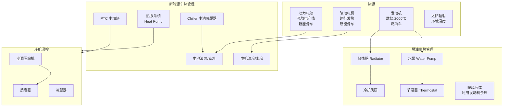
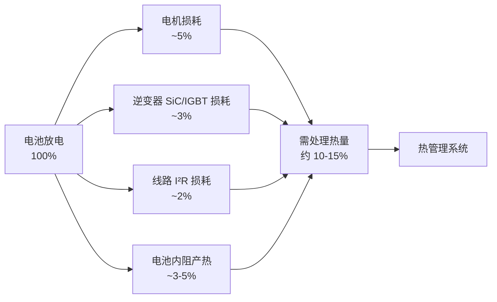
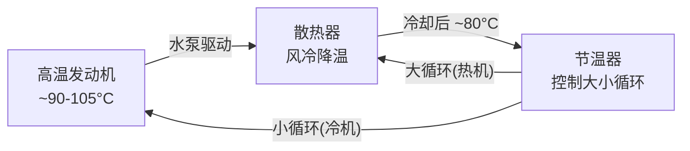
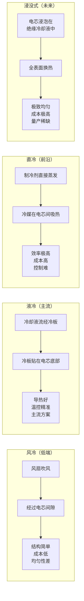
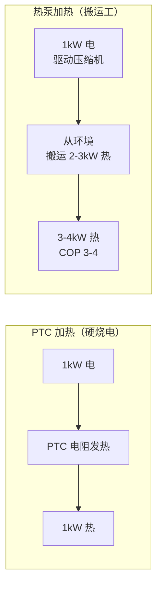

# 汽车热管理系统深度解析

> 热管理是汽车工程中最「看不见但离不了」的系统。燃油车要防发动机过热，电动车要防止电池热失控，座舱还要让乘客冬暖夏凉——所有这些都指向同一个问题：热量去哪了？怎么管？

## 场景化问题

2025 年夏天，你开着一辆新能源车从上海出发去南京，室外 38°C。你开着空调 22°C，同时在服务区用 480kW 超充桩充电。仪表盘突然弹出提示：「充电功率受限，电池温度偏高」。

你想不通——充电的时候车不是停着吗？为什么电池还会热？

> 读完这篇文章你能回答：燃油车的热量怎么散、电动车的热量从哪来、热泵空调为什么省电、800V 超充为什么更需要热管理，以及为什么「热管理工程师」是新能源车企最紧缺的岗位之一。

## 结构图：热管理全景

## 一、为什么需要热管理？

### 热管理的三大目标

| 目标 | 燃油车 | 新能源车 | 解释 |
|------|--------|----------|------|
| **散热** | 发动机燃烧温度 ~2000°C，必须持续散热 | 电池最佳温度区间 25-35°C，超充可达 50°C+ | 防止过热损坏 |
| **保温** | 发动机冷启动磨损大，需快速暖机 | 冬季电池活性下降，续航大幅缩水 | 维持最佳工作温度 |
| **座舱舒适** | 利用发动机余热取暖（免费） | 用电加热或热泵（耗电，影响续航） | 乘员舱 20-26°C |

**关键理解**：燃油车的热管理只有一个大热源（发动机），热量只多不少——问题是「怎么散掉多余的热」。新能源车没有发动机这个大热源，但电池和电机有自己的「舒适温度区间」——太热了危险、太冷了续航崩，所以问题是「精准控温」。

### 热量从哪来？去哪了？

**燃油车能量流**：1 升汽油含约 8.9 kWh 能量。汽油机热效率约 30-40%，意味着燃烧产生的热量中：
- 30-40% → 变成有用功（推动车轮）
- 30-35% → 被冷却系统带走（散热器散到空气中）
- 25-35% → 从排气管喷出（废气）
- 5-10% → 摩擦/辅件损耗

也就是说，一箱油超过一半的能量变成了「废热」，必须靠热管理系统处理掉。

**电动车能量流**（效率远高于燃油车，但仍有热量需要管理）：

充电时也一样——大电流充电时，电池内阻 $R_{internal}$ 的发热 $P_{heat} = I^2 \times R_{internal}$，电流越大产热越大。这就是为什么超充时热管理压力最大。

## 二、燃油车热管理：成熟但不可移植

### 冷却系统工作原理

燃油车冷却系是一个**液冷闭式循环**：

**节温器**是核心控制元件——发动机冷启动时，节温器关闭（小循环），冷却液只在发动机内部循环，帮助快速暖机。水温达到 ~82-95°C 后节温器打开（大循环），冷却液流经散热器散热。

**取暖（免费的热）**：
燃油车座舱取暖不需要额外耗能——发动机冷却液温度 90+°C，只需把冷却液引到暖风芯体（一个小型的车内散热器），鼓风机吹过就是热风。这是燃油车相比电动车的一个天然优势：冬天取暖不额外耗能。

### 核心部件

| 部件 | 功能 | 常见问题 |
|------|------|----------|
| **散热器** | 将冷却液热量散到空气中 | 堵塞/腐蚀/泄漏 |
| **水泵** | 驱动冷却液循环 | 轴承磨损/漏水 |
| **节温器** | 控制大小循环切换 | 卡滞（常开或常闭） |
| **冷却风扇** | 低速/堵车时强制通风 | 电机故障/扇叶破损 |
| **膨胀壶** | 补偿冷却液热胀冷缩 | 液位不足 |
| **冷却液** | 乙二醇+水（50:50），冰点 -35°C，沸点 108°C+ | 老化/变质，建议 4 年更换 |

### 涡轮增压的热管理升级

涡轮增压器的废气涡轮端温度可达 **800-1000°C**（发红的热），对整个热管理系统提出更高要求：
- 需要更大的散热器和中冷器（冷却增压后的高温空气）
- 停机后需要电子水泵继续运转冷却涡轮（防止机油结焦）
- 涡轮增压发动机对「热 soak」（停车后温度回升）更敏感

## 三、新能源车热管理：三电系统的温度调控

### 电池热管理

电池的最佳工作温度窗口非常窄：

| 温度区域 | 电池状态 | BMS 动作 |
|----------|----------|----------|
| **< 0°C** | 电解液粘度增大，锂离子迁移慢，内阻急剧增大 | 限制充电功率，启动 PTC/热泵加热 |
| **0-15°C** | 可用但效率偏低，快充受限 | 适度限制充电功率 |
| **15-35°C** | ✅ 最佳工作区间 | 正常充放电 |
| **35-45°C** | 偏高，加速老化 | 加大冷却功率，限制快充电流 |
| **45-60°C** | ⚠️ 危险区间 | 大幅限制功率，触发主动冷却 |
| **> 60°C** | 🚨 可能触发热失控 | 断开高压，启动紧急冷却 |

**电池热管理的核心挑战**：电池包内数百颗电芯紧挨在一起，中心区域的电芯散热难、升温更快。电芯之间的温差如果超过 5°C，就会导致一致性劣化——这就是液冷系统设计的核心难题：**均匀性 > 绝对降温能力**。

### 电池冷却方案对比

| 冷却方式 | 代表车型 | 优势 | 劣势 |
|----------|----------|------|------|
| **风冷** | 早期低端电动车 | 结构简单、成本低 | 温差大（可达 10°C+）、快充受限 |
| **液冷** | 绝大多数新能源车 | 均匀性好、可精确控制 | 系统复杂，增加重量 |
| **直冷（冷媒）** | 宝马 i3、比亚迪海豹（局部） | 换热效率极高 | 控制难度大、维修复杂 |
| **浸没式** | 部分超跑/概念车 | 极致均温 | 冷却液昂贵、密封要求高 |

**液冷系统的核心设计参数**：
- 冷却液：50% 水 + 50% 乙二醇
- 流量：通常 5-15 L/min（随热负荷变化）
- 冷板设计：铝制微通道冷板，导热路径要求 <2mm
- 温差目标：电池包内电芯最大温差 <5°C（理想 <3°C）

### 电机与电控热管理

驱动电机在运行中也会产热，主要来源：
- 铜损（绕组电阻发热）：$P_{cu} = I^2R$
- 铁损（磁滞和涡流损耗）
- 机械摩擦

电机冷却方式演进：

| 冷却方式 | 功率密度 | 代表 |
|----------|----------|------|
| **自然风冷** | 低（<3kW/kg） | 早期小微面 |
| **强制风冷** | 中（3-5kW/kg） | 部分 A0 级车 |
| **水冷（水套）** | 高（5-8kW/kg） | 大多数主流车型 |
| **油冷（喷淋/浸油）** | 极高（8-12kW/kg） | 特斯拉、华为 DriveONE、比亚迪 e 平台 3.0 |

油冷的优势：冷却油直接接触绕组（不导电），换热路径极短，可以使电机持续输出更高功率而不过热——这就是为什么高性能电动车越来越多用油冷电机。

**电机控制器 MCU 的散热**：SiC/IGBT 功率模块的热流密度极高（>100W/cm²），需要液冷板直接贴合散热。主流的 SiC 模块结温上限约 175-200°C，热管理必须确保不超温。

## 四、座舱热管理：热泵 vs PTC

### 制冷：基本一致

燃油车和电动车的空调制冷原理相同（蒸汽压缩制冷循环），区别在于：
- 燃油车：压缩机由发动机曲轴皮带驱动（机械压缩机）
- 电动车：压缩机由高压电驱动（电动压缩机），效率更高、噪音更低

### 制热：根本不同

这是燃油车和电动车差异最大的地方：

| 维度 | 燃油车 | 电动车 PTC | 电动车热泵 |
|------|--------|-----------|-----------|
| **热源** | 发动机冷却液余热（免费） | 电力直接加热（PTC 电阻） | 从环境空气/电池废热「搬运」热量 |
| **效率 COP** | — | COP=1（1kW 电=1kW 热） | COP=2-4（1kW 电=2-4kW 热） |
| **冬季续航影响** | 几乎无 | 严重（-30% 以上） | 明显改善（-15~20%） |
| **-10°C 以下性能** | 无影响 | 无影响 | COP 下降（~1.5-2） |
| **成本** | — | 低 | 较高（+2000-4000 元） |

**热泵原理（说人话）**：热泵其实就是「反向空调」——夏天空调把室内的热「搬」到室外，冬天热泵把室外的热「搬」进室内。即便室外 -10°C，空气中仍然有热量（绝对零度是 -273°C）。热泵用 1 度电驱动压缩机，可以从外界「搬运」2-4 度电的热量进来，所以制热 COP 可达 2-4，远优于 PTC 这种「硬烧电」的方式。

**典型热泵构型（2024-2025）**：

| 品牌 | 热泵技术 | COP 宣传值 | 特色 |
|------|----------|-----------|------|
| **特斯拉** | 八通阀超级热泵 | 高效集成 | 一阀调度全车热量，废热回收 |
| **比亚迪** | 宽温域热泵 | -30°C~60°C 工作 | 低温下仍可制热 |
| **小鹏** | 一体化热泵 | — | 电机废热回收供暖 |
| **蔚来** | 热泵+PTC 辅助 | — | 极低温时 PTC 辅助补热 |

> **2025 趋势**：热泵已从高端车专属配置变成 15 万以上车型标配。整车热管理从「各管各的」（电池管电池、座舱管座舱）走向「系统集成」——通过多通阀/八通阀等装置，把电池、电机、座舱的热量统一调度：该散热的地方把热量给需要加热的地方，实现系统级节能。

## 五、超充与热管理：速度的代价

超充是热管理的「极限工况」：

**超充时的热负荷**：
- 5C 超充（如理想 MEGA 520kW）时，充电电流可达 600A+
- 电池内阻 ~0.5mΩ × 600A² = 180W 的单体发热
- 一个 100+kWh 的电池包有数百颗电芯同时充电，总产热可达 10-20kW——相当于 3-5 台家用空调的制冷量全部砸在一个电池包上

**热管理策略**：
1. **预冷**：导航到超充站时提前启动最大冷却（把电池从 35°C 降到 25°C），为即将到来的大电流预留温升空间
2. **充中强冷**：压缩机全速运转，Chiller（电池冷却器）全开
3. **充后持续冷却**：拔枪后继续冷却 2-5 分钟，防止温度反弹

> 这就是超充速度的物理极限——不是桩的功率不够，而是电池「吃太快会烫嘴」，热管理系统决定了超充的真实速度上限。

## 六、车企工作场景

### 场景一：整车热管理平衡

整车热管理工程师需要同时考虑多个系统的热量「收支」：

| 工况 | 电池 | 电机 | 座舱 | 环境 | 策略 |
|------|------|------|------|------|------|
| 夏季高速 | 正常 | 中热 | 强冷 | 38°C | 全散热模式，压缩机全力运转 |
| 夏季超充 | 强热 | 停机 | 强冷 | 38°C | 集中冷却电池，座舱冷量可能被分流 |
| 冬季城市 | 偏冷 | 低热 | 强热 | -10°C | 电机废热回收供暖，PTC 辅助 |
| 冬季高速 | 正常 | 中热 | 强热 | -10°C | 电机废热回收+热泵供暖 |

### 场景二：热管理仿真与测试

热管理开发流程：
1. **1D 仿真**：用 GT-SUITE / AMESim 做整车热管理系统建模，仿真各工况下的温度变化
2. **3D CFD**：用 STAR-CCM+ / Fluent 做电池包内流场和温度场仿真，优化冷板流道设计
3. **台架测试**：在环境仓（-40°C ~ 60°C）跑 WLTC/CLTC 循环，验证仿真结果
4. **整车路试**：三高测试（高温/高寒/高原），验证实际道路表现

**新人可能被分配的任务**：
- 协助工程师在环境仓中安装热电偶（电池包内可能要布 50-100+ 个测温点）
- 用 CANalyzer / INCA 记录 BMS、压缩机、水泵、风扇的实时数据
- 整理测试数据，对比仿真与实测的偏差

> **给新人的一句话**：热管理工程师既要懂传热学（$Q = hA \Delta T$），又要懂控制策略（什么时候开压缩机、开多大功率），还要会标定（PID 参数调优）——是新能源三电领域最「跨界」的岗位。理解了热管理，你才能真正理解一辆车在 -30°C 到 50°C 的各种环境下如何保持可靠运行。

## QA

**Q：冬天电动车续航缩水，主要原因是什么？**
A：三个原因叠加：(1) 电池本身低温活性下降、内阻增大，可用容量减少 10-20%；(2) PTC/热泵取暖耗电，冬季暖风功率 2-5kW，一小时就是 2-5kWh；(3) 低温空气密度大，风阻增大。综合起来续航缩水 20-40% 是正常的，有热泵的车型可改善到 15-25%。

**Q：电池过热和过冷的伤害哪个更大？**
A：过热更大且更危险——过热可能触发热失控，不可逆。过冷主要影响性能（续航缩水），恢复温度后电池可恢复，但长期低温使用也会加速老化。所以 BMS 的优先级是「防过热 > 防过冷」。

**Q：800V 超充的车是不是更需要好热管理？**
A：是的。超充时电流大，发热 $P = I^2R$ 随电流平方增长。如果 400V/250A 发热是 X，那么 800V/500A（同功率翻倍电流）发热是 4X。虽然 800V 平台的电流一般不会这么极端（同功率下电流减半），但追求极速超充的 5C 电池仍面临巨大热负荷，对热管理要求极高。

**Q：燃油车的发动机散热器为什么在前面？**
A：因为需要迎风——车速越快，迎面风量越大，散热越好。这也是为什么堵车时电子扇会狂转（没有迎面风，只能靠风扇强制通风）。
