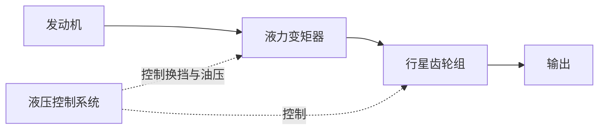
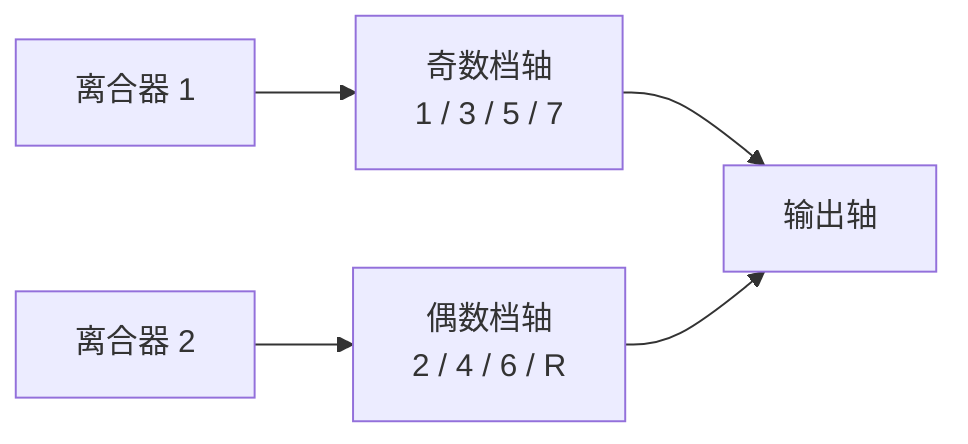

# 变速箱

> 发动机再好，没有变速箱匹配也发挥不出来。理解变速箱是理解动力响应的关键。

## 为什么需要变速箱？

内燃机有一个「甜蜜区间」——在这个转速范围内，扭矩和效率都比较好。但车轮的转速从 0 到 2000+ rpm 变化范围极大，需要变速箱来「翻译」。

类比：**自行车变速器**。
- 起步/爬坡 → 小齿比（省力、但踩得快走得慢）
- 巡航 → 大齿比（费力、但踩得慢走得快）

汽车变速箱做的是同一件事：把发动机的「高转速、小扭矩」转化为车轮需要的「低转速、大扭矩」，或反过来。

## 传动比（Gear Ratio）

$$
\text{传动比} = \frac{\text{输入转速}}{\text{输出转速}}
$$

- **大传动比（低档位）**：输出转速低，扭矩放大倍数大 → 适合起步/爬坡
- **小传动比（高档位）**：输出转速高，扭矩放大倍数小 → 适合高速巡航

## 主流类型

### 手动变速箱（MT）

驾驶者通过离合器踏板和换挡杆手动选择档位。

| 优点 | 缺点 |
|------|------|
| 结构简单、可靠 | 操作复杂（新手易熄火） |
| 传动效率高 | 城市堵车左脚累 |
| 维修成本低 | 驾驶乐趣因人而异 |

### 自动变速箱（AT）

液力变矩器 + 行星齿轮组，通过液压控制自动换挡。

| 优点 | 缺点 |
|------|------|
| 平顺、舒适 | 结构复杂、成本高 |
| 承受扭矩大 | 油耗略高于 MT |
| 成熟可靠 | 换挡速度不如双离合 |

> AT 的核心是**液力变矩器**——用油液传递动力，替代了离合器，同时起放大扭矩的作用。这就是 AT 起步平顺不熄火的原因。

### 双离合变速箱（DCT / DSG）

两套离合器，一套负责奇数档（1/3/5/7），一套负责偶数档（2/4/6）+ 倒档。

换挡时，下一档位**预先啮合**好，只需切换离合器——极快（毫秒级）。

| 优点 | 缺点 |
|------|------|
| 换挡极快 | 低速蠕行可能有顿挫 |
| 传动效率高（接近MT） | 结构复杂 |
| 运动感强 | 干式DCT散热问题 |

### 无级变速箱（CVT）

没有固定档位，通过钢带和可变直径的锥轮实现连续无级变速。

- 始终将发动机保持在高效率转速 → 最省油
- 完全无换挡顿挫感
- 缺点是「橡皮筋感」（深踩油门时发动机转速飙升但车速爬升慢）

## 各类型对比

| 特性 | MT | AT | DCT | CVT |
|------|-----|-----|-----|-----|
| 平顺性 | ★★ | ★★★★★ | ★★★ | ★★★★★ |
| 换挡速度 | ★★ | ★★★ | ★★★★★ | — |
| 效率 | ★★★★★ | ★★★ | ★★★★ | ★★★★ |
| 成本 | ★ | ★★★★ | ★★★ | ★★ |
| 运动感 | ★★★★★ | ★★★ | ★★★★★ | ★ |
| 可靠性 | ★★★★★ | ★★★★ | ★★★ | ★★★ |

## 电动车有变速箱吗？

大多数纯电动车**没有多档变速箱**——电机从 0 到 15000+ rpm 都能高效输出。通常只有一个**固定减速比**的单级减速器。

但部分高性能电动车（保时捷 Taycan）装了 2 速变速箱，兼顾低速加速和高速效率。

## QA

**Q：AT 和 CVT 怎么选？**  
A：AT 最全面、最成熟，适合大多数人。CVT 极致平顺省油，但激进驾驶有「橡皮筋感」。日系家用车 CVT 居多，德系 AT/DCT 居多。

**Q：DCT 好不好？**  
A：湿式 DCT（有油液冷却）已经很成熟。干式 DCT 在严重拥堵路况可能出现过热问题。大众的 DSG、现代的 DCT 如今已广泛验证。

**Q：为什么 CVT 会打滑？**  
A：CVT 钢带正常不会打滑（打滑即报废）。你感受到的「橡皮筋感」是发动机转速拉升而传动比缓慢调整的过程，不是真正的打滑。

::: tip 配图提示
建议配图：MT/AT/DCT/CVT内部结构对比图、DCT双轴结构示意图、CVT锥轮+钢带工作原理动图、液力变矩器剖面图。
:::
