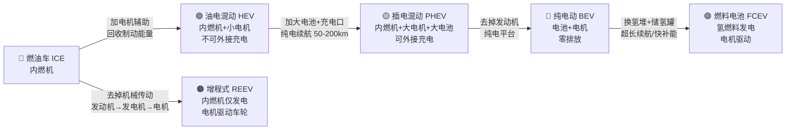

# 汽车分类与结构

## 汽车的定义

根据[全国标准信息公共服务平台](https://std.samr.gov.cn/gb/search/gbDetailed?id=F159DFC2A7F747EFE05397BE0A0AF334)和[国家标准全文公开系统](https://openstd.samr.gov.cn/bzgk/std/newGbInfo?hcno=E915DC09E28E0C78B2D04AA8794A5B1D)，GB/T 3730.1-2001 已于 2023-07-01 废止；现行版本为 **GB/T 3730.1-2022《汽车、挂车及汽车列车的术语和定义 第1部分：类型》**，发布日期 2022-12-30，实施日期 2023-07-01。

本站下文采用现行标准的车型术语口径，并用新人可读的方式简化理解：汽车通常指由动力驱动、在道路上运行、用于载运人员和/或货物的车辆；具体车型、挂车和汽车列车术语以 GB/T 3730.1-2022 原文为准。

## 分类体系

### 按用途分类

| 类别 | 说明 | 示例 |
|------|------|------|
| **乘用车** | 主要用于载运乘客及其随身行李 | 轿车、SUV、MPV |
| **商用车** | 主要用于载运货物或人员（营运） | 货车、客车、牵引车 |
| **特种车** | 用于特殊用途 | 消防车、救护车、工程车 |

### 按车身形式分类（乘用车）

| 形式 | 特点 | 代表车型 |
|------|------|----------|
| **三厢车（Sedan）** | 发动机舱+乘员舱+行李舱，三厢分明 | 大众迈腾、丰田凯美瑞 |
| **两厢车（Hatchback）** | 乘员舱与行李舱连通 | 大众高尔夫、本田飞度 |
| **SUV** | 运动型多用途车，高底盘、大空间 | 哈弗H6、特斯拉Model Y |
| **MPV** | 多功能乘用车，7座布局 | 别克GL8、丰田赛那 |
| **跑车（Sport Car）** | 低重心、强调性能 | 保时捷911、小米SU7 Ultra |

### 按动力类型分类

**场景化问题：** 朋友说想买一台"省油又没有续航焦虑"的车，4S 店推荐了插混、增程、油混三种，到底有什么区别？该选哪个？

**结构图 —— 五大动力类型演进路线：**

> **注：** 增程式（REEV，Range-Extended EV）在国内常被归入 PHEV 大类管理，但技术路径不同——增程的发动机**不直接驱动车轮**，仅作为发电机给电池充电或直接供电给电机。代表车型：理想 L6、问界 M7、深蓝 SL03。

**详细对比表：**

| 动力类型 | 动力源 | 是否需要充电 | 纯电续航 | 代表车型（2025） | 适合人群 |
|----------|--------|:----------:|----------|-----------------|----------|
| **ICE** 燃油车 | 汽油/柴油 | ❌ 只需加油 | 无 | 大众迈腾、丰田凯美瑞 | 无充电条件、长途为主 |
| **HEV** 油电混动 | 汽油 + 小电机/电池 | ❌ 不可外接充电 | 仅 2~5 km（低速蠕行） | 丰田凯美瑞双擎、本田雅阁 e:PHEV | 想省油但无充电桩 |
| **PHEV** 插电混动 | 汽油 + 大电机/电池 | ✅ 需要充电 | 50~200 km | 比亚迪秦 L DM-i、比亚迪宋 Plus DM-i | 市区用电、长途用油 |
| **REEV** 增程式 | 汽油（发电） + 大电池/电机 | ✅ 需要充电 | 150~300 km | 理想 L6、问界 M7、深蓝 SL03 | 追求纯电体验、偶尔长途 |
| **BEV** 纯电动 | 电池 + 电机 | ✅ 必须充电 | 400~1000 km | 特斯拉 Model Y、小米 SU7、比亚迪海鸥 | 有家充桩、日常通勤 |
| **FCEV** 燃料电池 | 氢气 + 燃料电池堆 | ❌ 加氢 | 500~800 km | 丰田 Mirai、现代 Nexo | 商用车/示范运营（加氢站少） |

**原理（说人话）：**

- **ICE（燃油车）**：烧油 → 发动机转 → 变速箱变速 → 车轮转。加油 3 分钟跑 600 km，但发动机在城市堵车时效率极低（怠速干烧油），排放也不环保。就像老式煤炉——点火就热，但废气多、热效率不高。

- **HEV（油电混动）**：在燃油车基础上加了一台小电机和一块小电池。起步和低速时用电（省油），刹车时把能量回收存进电池（白嫖能量），高速巡航用油。全程自动切换，你不用管。**核心优势：省油 30%-40%，无需充电。** 就像骑电动助力自行车——你蹬的时候电机帮你一把，下坡还能给电池回充。

- **PHEV（插电混动）**：HEV 的"大电池版"。电池容量 10-40 kWh，纯电能跑 50-200 km。日常通勤当纯电车开（省钱），长途烧油（没续航焦虑）。**比亚迪 DM 5.0（2024 年发布）满油满电综合续航突破 2000 km**，发动机热效率 46.06%。就像手机+充电宝——平时插座充电（家充），出门带充电宝（油箱）应急。

- **REEV（增程式）**：一辆纯电车，背了一台小型汽油发电机。发动机永远不直接驱动车轮，只负责发电。驾驶感受完全像纯电车（安静、平顺、加速快），但加油就能跑长途。**理想 L6 2025 年月销稳定 2 万+**，证明增程路线的市场接受度极高。就像柴油发电机给电动车供电——车始终是电驱动，发电机只是"移动充电站"。

- **BEV（纯电动）**：没有发动机、没有油箱、没有排气管。结构极简，电机直接驱动车轮，加速丝滑、安静、零排放。2025 年中国 NEV 渗透率约 50%，充电基础设施飞速建设。**缺点是长途需要规划充电，节假日服务区排队。** 就像手机——回家插上充电，出门满电出发，但重度使用需要找充电宝（快充站）。

- **FCEV（燃料电池）**：氢气通过燃料电池堆发电，产物只有水。加氢 3 分钟，续航 500-800 km。听起来完美——但加氢站全国只有几百座（2025 年），氢气的制取、运输、储存成本非常高。目前主要用于商用车和示范运营。就像氢能自行车——技术很酷，但换气瓶的地方太少了。

<TermCard term="NEV 渗透率" definition="新能源汽车（NEV，含 BEV+PHEV+REEV+FCEV）在整体新车销量中的占比。2025 年中国 NEV 渗透率约 50%，意味着每卖出 2 台新车，就有 1 台是新能源。" />

**油电对比：**

| 对比维度 | 传统燃油车 ICE | 新能源车 NEV |
|----------|:--------------:|:------------:|
| 能量补充 | 加油站 3 分钟 | 充电 30min（快充）/ 家充过夜 |
| 使用成本 | 约 0.5-0.8 元/km | 纯电约 0.05-0.15 元/km |
| 驾驶感受 | 发动机振动+噪音+换挡顿挫 | 电机平顺、安静、响应快 |
| 保养项目 | 机油、机滤、火花塞、正时皮带… | 电机几乎免保养，主要更换空调滤/刹车油 |
| 冬季续航 | 影响小 | 低温续航打 6-7 折（电池特性） |
| 补能网络密度 | 极高（加油站遍布全国） | 充电桩快速增长中，节假日仍有压力 |

**车企工作场景：** 产品规划团队需要根据目标用户画像选择动力类型方案。例如：一二线城市有家充条件的用户，BEV 或 PHEV 最合适；三四线城市充电不便的用户，HEV 或长续航 PHEV 更合适；商用车队则可能考虑换电模式或 FCEV。2025 年 NEV 渗透率已到 ~50%，不懂动力类型的人无法参与产品定义讨论。

**小测：** 增程式（REEV）和插电混动（PHEV）最本质的区别是什么？
A. 电池容量大小不同  B. 发动机是否直接驱动车轮  C. 是否有充电口  D. 纯电续航里程不同

**答案：B。** 增程式的发动机**只发电**，不直接驱动车轮，车轮始终由电机驱动。插电混动的发动机在高速巡航等工况下可以通过变速箱**直接驱动车轮**。这是两者在技术路线上的根本差异（虽然国内政策常将 REEV 归入 PHEV 管理）。

## 动力链对比：四种技术路径

<iframe src="../powertrain-compare.html" width="100%" height="820" style="border:1px solid #30363d;border-radius:8px;margin:16px 0;" title="动力链交互对比图"></iframe>

> 上方为交互式动力链对比图。鼠标悬停各节点可查看中文术语解释。切换「驱动/巡航/制动回收」模式观察能量流变化。也可[独立打开](../powertrain-compare.html)查看。

## 车辆识别代号 VIN

VIN（Vehicle Identification Number）是车辆的全球唯一标识，由 17 位字符组成：

| 位段 | 作用 | 示例说明 |
|------|------|----------|
| 第 1 位 | 地理区域 | `L` 通常表示中国制造 |
| 第 2-3 位 | 制造商识别 | 例如一汽大众、上汽大众、广汽本田等厂商代码 |
| 第 4-7 位 | 车型特征 | 车身、系列、约束系统等车辆描述信息 |
| 第 8 位 | 动力或发动机相关信息 | 不同厂商编码规则不同 |
| 第 9 位 | 校验位 | 用于校验 VIN 编码是否有效 |
| 第 10-17 位 | 年款、工厂与流水号 | 用于定位生产年份、工厂和单车序列 |

### VIN 解读要点

- **第 1 位**：地理区域（L=中国，J=日本，W=德国，1/4/5=美国）
- **第 2-3 位**：制造商代码（FV=一汽大众，SV=上汽大众，HG=广汽本田）
- **第 10 位**：车型年份（M=2021，N=2022，P=2023，R=2024，S=2025，T=2026）

## 整车结构组成

汽车由四大系统构成：

| 系统 | 英文 | 典型组成 | 主要作用 |
|------|------|----------|----------|
| 车身 | Body | 车身壳体、车门、车窗、内外饰 | 提供乘员空间、碰撞结构和外观基础 |
| 底盘 | Chassis | 传动、行驶、转向、制动系统 | 让车辆稳定地走、转向和停下 |
| 动力总成 | Powertrain | 发动机/电机、变速箱/减速器、能源系统 | 把燃油或电能转换为轮端驱动力 |
| 电气电子 | Electrical/Electronic | 电源、线束、控制器、照明、仪表 | 负责供电、通信、感知和控制 |

## 场景化学习卡

### 1. 汽车定义与分类

**场景问题：** 市场同事说"这台车是 SUV、PHEV、四驱"，这三个词为什么不是一个分类？

**简要结构图：**

| 分类维度 | 常见类别 | 主要回答的问题 |
|----------|----------|----------------|
| 用途/车身 | 轿车、SUV、MPV、商用车 | 这台车用来装什么、怎么布置空间 |
| 能源/动力 | ICE、HEV、PHEV、BEV、FCEV | 能量从哪里来、动力链怎么工作 |
| 驱动形式 | 前驱、后驱、四驱 | 驱动力从哪些车轮传到地面 |

**原理（说人话）：** 汽车分类要分维度看。车身形式说明它怎么装人和货，动力类型说明能量从哪里来，驱动形式说明力从哪些轮子传到地面。同一辆车可以同时是"中型 SUV、插电混动、四驱"，这些标签互补，不互相替代。

**对比/类比：** 像描述电脑：笔记本是形态，处理器平台是动力来源，独显/集显是图形能力。

**车企工作场景：** 产品定义、竞品分析、公告申报和销售话术都依赖分类口径统一。把增程、插混、纯电混写，会影响补能、能耗、成本和法规判断。

**小测：** "纯电 SUV"和"四驱 SUV"分别说明了哪两个不同维度？
**答案：** 「纯电」说明的是动力/能源维度，「SUV」说明的是车身形式维度，「四驱」说明的是驱动形式维度。同一辆车可以同时拥有这些标签，它们不互相替代。

### 2. 车辆识别代号 VIN

**场景问题：** 质量同事让你查某批车辆的 VIN，你应该知道它能定位什么？

**简要结构图：**

| VIN 区段 | 典型含义 | 新人要抓住的点 |
|----------|----------|----------------|
| WMI | 制造商识别 | 谁生产的 |
| VDS | 车型、车身、动力等描述 | 是哪类车型配置 |
| VIS | 年份、工厂、流水号 | 哪一年、哪座工厂、哪一台 |

**原理（说人话）：** VIN 是车辆身份号码，用于追踪生产、销售、维修、召回和质量问题。它不像车牌会更换，通常伴随车辆全生命周期。车型公告参数则像车辆的公开技术档案，记录尺寸、质量、动力、轮胎和能耗等合规口径。

**对比/类比：** VIN 像身份证号，公告参数像岗位档案；前者定位"是谁"，后者说明"按什么规格被批准"。

**车企工作场景：** 当出现批量问题时，工程、质量、售后会按 VIN、生产日期、供应商批次锁定影响范围。新人不必背完 17 位规则，但必须知道 VIN 是追溯入口。

**小测：** 一台车更换车牌后，VIN 会随之改变吗？为什么？
**答案：** 不会。VIN 是车辆出厂时打刻在车身上的唯一身份标识（通常在前风挡左下角、B柱铭牌等位置），伴随车辆全生命周期。车牌是交通管理部门发放的行驶许可标识，可以更换。VIN 用于追溯生产、销售、维修和召回。

### 3. 整车结构组成

**场景问题：** 新人第一次听"这个问题是动力、底盘还是电气"，该怎么判断归属？

**简要结构图：**

| 排查层级 | 要问的问题 |
|----------|------------|
| 现象 | 用户看到、听到或感受到什么 |
| 所在系统 | 更像车身、底盘、动力还是电气电子 |
| 关联对象 | 涉及哪些零部件、控制器、线束或软件逻辑 |
| 主责与证据 | 哪个团队牵头，靠什么数据关闭问题 |

**原理（说人话）：** 整车不是零件清单，而是多个系统围绕"让人安全、舒适、可控地移动"协同工作。动力系统提供驱动力，底盘让车稳定地走和停，车身提供空间与安全壳，电气电子负责供电、通信、感知和控制。

**对比/类比：** 车身像房子，底盘像地基和轮子，动力像供能设备，电气电子像神经系统。

**车企工作场景：** 问题分析会上先归类，再找证据。例如"低速过坎异响"优先看底盘和车身连接，"仪表黑屏"优先看座舱域、电源和通信。

**小测：** 空调不制冷但风量正常，第一轮排查更像车身问题、底盘问题，还是热管理/电气问题？
**答案：** 更像热管理/电气问题。风量正常说明鼓风机和风道（电气/车身部分）工作正常；不制冷说明制冷循环（压缩机、冷凝器、膨胀阀、蒸发器）或控制逻辑出了问题——这属于热管理系统，在新能源车上也可能与电池热管理共用回路，优先排查热管理域控制器和制冷回路。

  <figure class="knowledge-figure">
    
    <figcaption>图：VIN 铭牌示例。来源：<a href="https://commons.wikimedia.org/wiki/File:Vin_Sample.jpg">Wikimedia Commons</a> / SipleDailyUser，许可证：<a href="https://creativecommons.org/licenses/by-sa/4.0/">CC BY-SA 4.0</a>。</figcaption>
  </figure>
  <figure class="knowledge-figure">
    
    <figcaption>图：整车四大系统与常见 VIN 读取位置示意。本站自绘 SVG。</figcaption>
  </figure>

