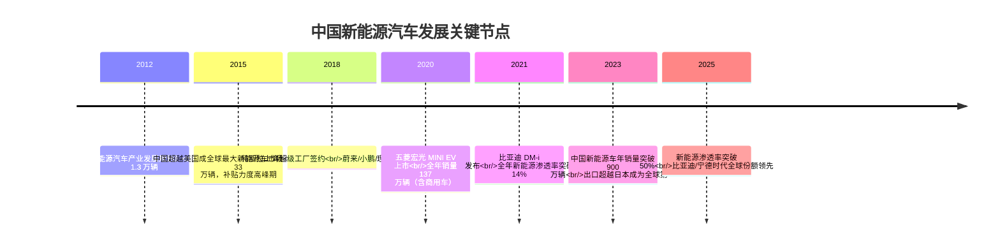

# 第一层：整车认知 🚗

《了解一辆车由哪些「大块」组成，建立全局观》

整车认知是学习所有汽车知识的起点。在这一层，你将建立对一辆汽车的**宏观理解**——它由哪些系统构成，各系统大致做什么，以及如何通过参数指标评价一辆车。

## 本层知识点

| # | 知识点 | 说明 |
|---|--------|------|
| 1 | 汽车定义与分类 | 乘用车 / 商用车 / 特种车的基本划分 |
| 2 | 车辆识别代号 VIN | 17 位编码的含义与解读 |
| 3 | 整车结构组成 | 车身、底盘、动力总成、电气四大系统 |
| 4 | 车身类型 | 三厢 / 两厢 / SUV / MPV / 跑车等 |
| 5 | 车身材料 | 钢 / 铝合金 / 碳纤维的应用场景 |
| 6 | 车身制造工艺 | 冲压 → 焊接 → 涂装 → 总装 |
| 7 | 底盘系统概述 | 传动、行驶、转向、制动四子系统 |
| 8 | 整车尺寸参数 | 轴距 / 轮距 / 长宽高 / 离地间隙 |
| 9 | 整车性能指标 | 加速 / 极速 / 制动距离 / 油耗 / 排放 |

## 汽车发展简史

汽车的诞生从 1886 年卡尔·本茨的三轮汽油车开始。真正让汽车走入千家万户的，是 1913 年亨利·福特引入的**流水线生产**——将单车制造时间从 12 小时压缩到 93 分钟，把汽车从贵族玩具变成大众消费品。

进入 21 世纪，全球汽车产业最大的变局来自**中国新能源崛起**：

**关键数据**：

| 年份 | 中国新能源车年销量 | 渗透率 | 标志事件 |
|------|-----------------|--------|----------|
| 2015 | ~33 万辆 | ~1.3% | 补贴高峰，骗补事件爆发 |
| 2019 | ~121 万辆 | ~4.7% | 补贴大幅退坡，行业洗牌 |
| 2021 | ~352 万辆 | ~14.8% | 比亚迪 DM-i 引爆混动市场 |
| 2023 | ~950 万辆 | ~35.7% | 出口 491 万辆超越日本 |
| 2025 | ~1280 万辆 | ~51% | 渗透率首次超过燃油车 |

**原理（说人话）**：中国新能源汽车能快速崛起，是三个因素叠加的结果：**政策驱动**（补贴 + 牌照优惠 + 双积分政策）→ **产业链成熟**（宁德时代电池、比亚迪垂直整合、国产芯片/传感器）→ **产品力领先**（国产电车在智能化、续航、性价比全面超越同价位合资燃油车）。这就像智能手机取代功能机——不是因为你讨厌按键，而是触屏体验确实更好。

**车企工作场景**：行业研究/产品规划岗位需要持续追踪渗透率、补贴政策和竞品节奏，这些数据直接影响新车立项和定价策略。

**小测**：中国新能源车年销量首次突破 500 万辆大约在哪一年？

## 学习路径

- [汽车分类与结构](/guide/classification) — 了解汽车的种类和基本构造
- [车身与底盘](/guide/body-chassis) — 深入车身工艺和底盘系统

::: tip 配图提示
建议配图：整车结构分解图（爆炸图），标注四大系统。
:::

