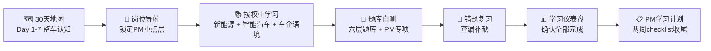

# 如何使用本站 🧭

> 第一次来？本页帮你 5 分钟搞清楚：站里有什么、怎么学、去哪找。

## 快速概览

本站围绕「让非汽车专业新人建立整车技术地图」设计，核心资源如下：

| 资源 | 是什么 | 一句话说明 |
|------|--------|-----------|
| 🗺️ [30 天学习地图](./path) | 每日学习任务清单 | 跟着走，4 周建立系统认知 |
| 📚 [六层知识点](./#六层学习路径) | 54 个知识点的正文 | 每层 3 页，每页含多知识点 |
| 🎓 [旗舰交互课](./lessons/) | 6 节互动式课程 | 手把手拆解能量流和控制流 |
| 🧭 [岗位导航](./roles-guide/) | 按岗位筛选必修知识 | 产品/采购/制造/测试各有侧重 |
| 📝 [练习题库](./quiz/) | 42 题（单选/多选/判断） | 自测 + 答案解析 |
| 📕 [错题本](./quiz/error-book) | 自动收录答错的题 | 答对后自动移出 |
| 📊 [学习数据](./dashboard) | 进度仪表盘 | 环形总进度 + 层级明细 + 错题分布 |
| 📖 [术语表](./glossary) | 关键缩写速查 | 支持搜索和筛选 |
| 📋 [岗位学习计划](./roles-guide/pm-plan) | 4 岗位 × 2 周 checklist | 可执行的学习计划 |

## 选择你的入口

### 🅰️ 我想系统学 → 30 天学习地图

适合：离入职还有 2-4 周，想按节奏建立完整知识体系。

1. 打开 [30 天学习地图](./path)
2. 从 Day 1 开始，每天 1-2 小时
3. 每页底部点「标记完成」记录进度
4. 每周末用对应层级的[题库](./quiz/)自测
5. 答错的题会自动进入[错题本](./quiz/error-book)，方便复习

::: tip 📊 追踪进度
学习进度会自动保存在浏览器本地。你也可以打开[学习仪表盘](./dashboard)查看环形总进度和各层详情。
:::

### 🅱️ 我想按岗位学 → 岗位导航

适合：已经知道自己的岗位方向（产品/采购/制造/测试），想对症下药。

1. 打开 [岗位导航](./roles-guide/)
2. 找到你的岗位，查看知识权重矩阵（★★★ 必须学 / ★★☆ 重要 / ★☆☆ 了解）
3. 进入专属精简路径，按顺序学习
4. 使用岗位专项[题库](./quiz/)检验（role-pm / role-procurement / role-manufacturing / role-testing）
5. 可选：执行对应的[两周学习计划](./roles-guide/pm-plan)（可打印 checklist）

### 🅲 我想体验互动 → 旗舰交互课

适合：不喜欢纯阅读，希望动手拆解能量流和控制流。

1. 打开 [旗舰交互课总览](./lessons/)
2. 从 ① 整车系统组成开始，逐课推进
3. 每节课含交互式步骤，拖拽/点击/切换查看不同工况
4. 课后有即时小测，答错会提示正确答案和解析

### 🅳 我遇到术语不懂 → 术语表

适合：阅读正文时遇到缩写（GVDP、FMEA、SOP…）想快速查询。

1. 正文中的 `<TermCard term="缩写">缩写</TermCard>` 链接可点击弹窗卡片
2. 也可以直接打开 [术语表](./glossary) 全局搜索
3. 术语表支持按类别筛选（流程 / 质量 / 制造 / 智能驾驶 / 新能源）

## 典型学习路径示例

以「产品/项目管理岗位新人」为例：

## 学习建议

1. **先建立全局图，再深入细节**。不要第一天就钻进发动机结构——先知道一辆车由四大系统协同工作，再逐层拆解。
2. **用场景连接知识**。每个知识点都绑定了「车企新人会听到的问题」，试着在工作中遇到类似话题时回想对应知识点。
3. **油电对比，不要孤立学**。传统燃油系统和新能源不是两个世界——混动/增程把两者串在了一起。本站每层都有对比表。
4. **做题检验，不要只阅读**。每学完一层，去[题库](./quiz/)做对应练习。错题自动收录，定期回顾错题本。
5. **术语卡随手点**。遇到不认识的缩写（SOP/FMEA/APQP…），点一下术语卡链接就能看到全称和解释，不需要跳转页面。
6. **反馈帮助改进**。内容有误或想补充知识点？页面底部有「在 GitHub 上编辑此页」链接，或直接提 [GitHub Issue](https://github.com/CroissantSong/car-knowledge-site/issues)。

## 常见问题

### Q：我是纯文科背景，能看懂吗？

能。本站不预设机械/电子/软件基础。每一层都从「这是什么、干什么用」讲起，再逐步深入到原理。关键概念都有类比和生活化解释。

### Q：每天大概要花多少时间？

- **30 天地图**：每天 1-2 小时
- **按岗位学**：精选路径约 10-15 小时完成
- **旗舰课**：每节约 20-30 分钟

### Q：学完后我能在车企会议上听懂多少？

按六层完整学完 + 题库自测通过，你能听懂约九成的技术讨论。剩下的在实践中积累即可。

### Q：内容会更新吗？

会。站点持续维护中，数据（销量/渗透率/技术参数）会随行业发展更新，新知识点也会逐步补充。关注 [GitHub 仓库](https://github.com/CroissantSong/car-knowledge-site) 获取更新。

### Q：学习进度会丢失吗？

进度保存在浏览器本地存储（localStorage）。如果你清除浏览器数据或更换设备，进度会丢失。重要节点建议手动记录。未来可能增加云端同步功能。

---

> 📖 准备好了？[从整车认知开始 →](./guide/)
