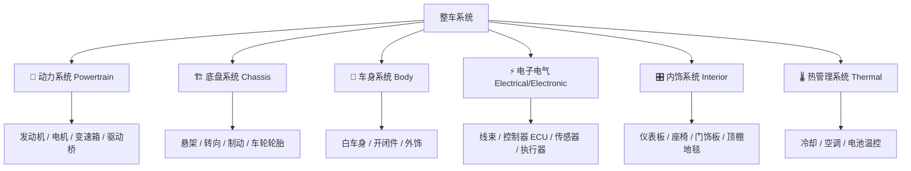
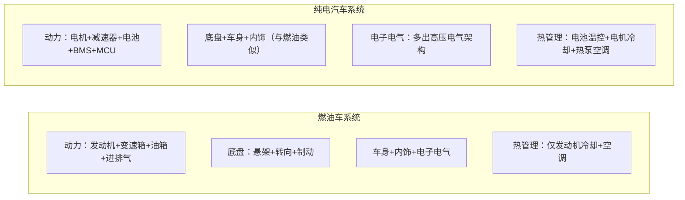

# 第一课：一辆车由哪些系统组成

## 场景化问题

你刚入职某车企研发中心，第一天参加整车布置评审会。屏幕上的 3D 数模密密麻麻全是有颜色的模块——你的组长指着不同的区域说：「动力总成这边碰撞空间不够，底盘需要把电池包嵌进去，热管理管路要和高压线束分开走，座舱域这边 HMI 改了……」你完全看不懂这些模块分别属于哪个系统。你需要在 **30 分钟内** 建立「一辆车由哪些系统组成」的框架认知，否则接下来的每一次会议你都会迷失在术语里。

## 第一步：整车系统全景图

## 第二步：六大系统分别做什么

| 系统 | 一句话职责 | 核心部件 | 新人最容易混淆的点 |
|------|-----------|----------|-------------------|
| **动力系统** | 让车动起来 | 发动机/电机、变速箱、驱动桥 | 燃油车叫 Powertrain，电动车叫 E-Powertrain（少了变速箱多了电机控制器） |
| **底盘系统** | 控制怎么动 | 悬架、转向、制动、车轮 | 「底盘」包括制动和转向，不是指车底那层铁板 |
| **车身系统** | 承载一切 | 白车身（焊接骨架）、车门、引擎盖 | 白车身 ≠ 整车外观——它是未喷漆的裸金属骨架 |
| **电子电气** | 连接和控制一切 | 线束、ECU、传感器、域控制器 | ECU 不是一台大电脑，而是几十上百个小控制器分散在各处 |
| **内饰系统** | 人接触的一切 | 仪表板、座椅、门饰板、方向盘 | 仪表板不是仪表盘——仪表板是整个前围大塑料件，仪表盘只是嵌在里面的屏幕 |
| **热管理** | 管好温度 | 散热器、空调、电池冷却/加热 | 电动车的热管理比燃油车复杂得多——电池怕冷也怕热 |

## 第三步：燃油车 vs 电动车——系统数量差异

| 对比维度 | 燃油车 | 纯电动车 | 工程影响 |
|----------|--------|----------|----------|
| 动力系统零件数 | ~2000+ | ~200 | 电动车动力系统简化 90% |
| 电子控制单元 ECU | 50-100 个 | 20-50 个 | 域集中/中央计算在减少 ECU 数量 |
| 热管理回路 | 1-2 个（发动机冷却+空调） | 3-5 个（电池/电机/座舱/充电回路） | 电动车热管理是新增的工程复杂度 |
| 高压部件 | 无 | 电池/BMS/MCU/OBC/DC-DC/PTC/压缩机 | 电动车多了整套高压电气架构 |

## 第四步：新人面对整车数模的速查思路

当你面对一张整车布置图或 3D 数模时，从外到内、从上到下快速定位六大系统：

| 观察部位 | 对应系统 | 识别特征 |
|----------|----------|----------|
| 车头机舱 | 动力 + 热管理 | 最大的那块铁（发动机）或方盒子（电机控制器） |
| 底部中央 | 动力（电池包）/ 底盘 | 电动车看平铺大平板，燃油车看传动轴隧道 |
| 四个轮子区域 | 底盘（悬架+制动） | 弹簧/减震器（螺旋状），制动卡钳（抱在刹车盘上） |
| 整体框架 | 车身 | 看焊接骨架和钣金件 |
| 贯穿全车的线 | 电子电气 | 线束像血管一样串联所有区域 |
| 座舱内 | 内饰 | 仪表板、座椅、方向盘 |

## 关键术语

| 术语 | 英文 | 含义 |
|------|------|------|
| 白车身 | BIW (Body in White) | 焊接完成但未喷漆的金属车身骨架 |
| 动力总成 | Powertrain | 产生动力并传递到车轮的全套系统 |
| 布置 | Packaging | 在整车空间内安排所有部件的三维位置 |
| 域控制器 | Domain Controller | 用一个高算力芯片接管某个功能域的所有 ECU |
| 热管理回路 | Thermal Loop | 冷却液或制冷剂循环的路径 |

## 油电对比 / 生活类比

- **油电对比**：燃油车动力系统最复杂（发动机+变速箱+进排气+油箱+后处理），电动车的复杂度转移到了电池和热管理。一辆车无论油电，底盘/车身/内饰这三个系统的工程逻辑大致相通。
- **生活类比**：整车六大系统就像人体的六大系统——动力是心脏+肌肉，底盘是骨骼+关节（控制姿态和运动），车身是皮肤+骨架，电子电气是神经系统（感知和控制），内饰是衣服+家具，热管理是体温调节。

## 车企工作场景

整车布置工程师最头疼的事——当动力总成说「需要多 30mm 空间」，底盘说「副车架不能移」，车身说「前纵梁已经定型」，最后必须开「冲突协调会」，由整车总布置做取舍。新人可以先记住：**碰撞安全 > 动力总成 > 底盘 > 内饰空间**——这是布置的优先级逻辑。

## 小测

### 第一题
以下哪个系统不属于传统汽车六大系统？
A. 动力系统
B. 底盘系统
C. 娱乐影音系统
D. 热管理系统

> **答案：C**。娱乐影音系统（信息娱乐/座舱域）是电子电气系统的一部分，不属于单独的六大系统之一。

### 第二题
「白车身」指的是什么？
A. 白色的车身外漆
B. 焊接完成但未喷漆的金属车身骨架
C. 车身的内饰部分
D. 底盘大梁

> **答案：B**。白车身（BIW）是焊接完成、未喷漆的裸金属车身骨架，是整车结构安全的核心。

### 第三题
燃油车和纯电动车在系统层面最大的差异是什么？
A. 底盘完全不同
B. 电动车动力系统极大简化，但热管理和高压电气更复杂
C. 车身结构完全不同
D. 内饰完全不同

> **答案：B**。电动车用电机+减速器替代了发动机+变速箱，动力系统简化但新增了高压电气架构和更复杂的热管理系统。

---

<ProgressBadge path="/lessons/01-car-systems" mode="checkbox" />

