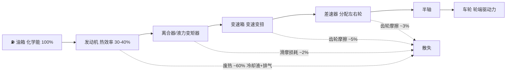
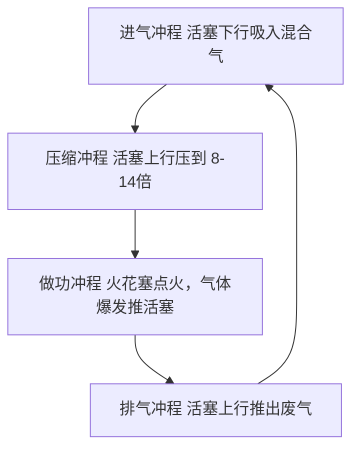

# 第二课：燃油车如何把燃油变成轮端驱动力

## 场景化问题

你正在参与一个动力总成匹配项目，听到发动机工程师说「这台 2.0T 在 1750rpm 就能输出 350N·m」，变速箱工程师反驳「但你的扭矩曲线在 1500rpm 以下太软，涡轮迟滞会让用户抱怨起步肉」。你心里想：燃油到底是怎么经过一系列「翻译」变成车轮上的推动力的？为什么中间有这么多环节？每个环节又「吃掉」了多少能量？

## 第一步：从油箱到车轮的完整能量链路

> 从燃油化学能到车轮实际驱动力，**整体效率仅 15-25%**——每加 100 元油，真正推动车前进的能量只值 15-25 元。

## 第二步：逐一解剖各环节

### 环节一：发动机——把燃烧热变成旋转力

| 子步骤 | 发生了什么 | 关键数据 |
|--------|-----------|----------|
| **喷油** | 喷油嘴将汽油雾化喷入气缸（缸内直喷） | 喷射压力 200-350 bar |
| **混合** | 燃油蒸汽与空气混合（理想空燃比 14.7:1） | 14.7g 空气配 1g 汽油 |
| **点火** | 火花塞在压缩上止点前点火 | 点火提前角 10-40° |
| **燃烧** | 混合气爆燃，温度瞬间达 2000-2500°C，压力推到峰值 | 峰值缸压 50-100 bar |
| **推动活塞** | 高压气体推动活塞下行 → 连杆 → 曲轴旋转 | 曲轴输出扭矩 |

> 四个冲程里只有 **做功冲程** 产生动力，其余三步全靠飞轮惯性带动。

### 环节二：离合器/液力变矩器——「软连接」

| 类型 | 原理 | 使用场景 |
|------|------|----------|
| **摩擦离合器（MT/AMT/DCT）** | 压盘把离合器片压在飞轮上，靠摩擦力传递扭矩 | 手动挡、双离合 |
| **液力变矩器（AT/CVT）** | 泵轮搅动变速箱油 → 油流冲击涡轮 → 涡轮跟着转 | 自动挡 |

液力变矩器的精髓：允许发动机和变速箱之间有**转速差**——红灯停车时发动机继续转（泵轮搅油），但涡轮可以不转（车轮静止），这是 AT 变速箱能「踩刹车挂 D 挡不熄火」的原因。

### 环节三：变速箱——「翻译官」

发动机的舒适转速范围（1500-4000 rpm）很窄，但车轮转速从 0 到 1000+ rpm 一直在变。变速箱的作用就是用不同齿比的齿轮组，把发动机的「高转速低扭矩」翻译成车轮需要的「低转速高扭矩」（起步）或「高转速低扭矩」（高速巡航）。

| 变速箱类型 | 缩写 | 特点 |
|-----------|------|------|
| 手动变速箱 | MT | 驾驶者手动选挡，结构最简单 |
| 自动变速箱（液力） | AT | 液力变矩器 + 行星齿轮，平顺但油耗稍高 |
| 无级变速箱 | CVT | 钢带+锥轮，无固定挡位，最平顺 |
| 双离合变速箱 | DCT | 两套离合器预选下一挡，换挡最快 |

### 环节四：差速器——「外交官」

车辆转弯时，外侧车轮走的弧线比内侧长。差速器的行星齿轮结构允许左右轮**以不同速度旋转**——外侧快、内侧慢。如果没有差速器，转弯时一个轮子会被拖着滑，轮胎迅速磨损。

### 环节五：半轴 → 车轮

半轴把差速器输出的旋转运动传递给车轮轮毂。到这一步，燃油从化学能经过五层翻译，终于变成了推车前进的力。

## 第三步：一张表看懂各环节「吃」了多少能量

| 环节 | 能量去向 | 累计剩余效率 |
|------|----------|-------------|
| 燃油化学能 | 100% | 100% |
| → 发动机输出 | 热损失 ~60%，泵气/摩擦 ~5% | **~35%** |
| → 变速箱输出 | 齿轮摩擦/搅油损失 ~5% | **~33%** |
| → 差速器输出 | 齿轮摩擦 ~3% | **~32%** |
| → 半轴/轮毂 | 万向节/轴承 ~2% | **~31%** |
| → 轮端实际驱动力 | 上述均为台架数据，实车还需扣除附件消耗（水泵/发电机/空调压缩机 ~2%） | **约 15-25%** |

## 关键术语

| 术语 | 英文 | 含义 |
|------|------|------|
| 热效率 | Thermal Efficiency | 燃料化学能转化为机械功的比例 |
| 空燃比 | Air-Fuel Ratio (AFR) | 空气质量与燃油质量的比值，理论最佳 14.7:1 |
| 涡轮迟滞 | Turbo Lag | 踩下油门到涡轮增压器建立正压之间的延迟 |
| 液力变矩器 | Torque Converter | 用液体传递动力的「软连接」，代替离合器 |
| 齿比 | Gear Ratio | 输入转速 ÷ 输出转速，齿比越大扭矩放大倍数越大 |
| 差速器 | Differential | 允许左右驱动轮以不同速度旋转的齿轮机构 |

## 油电对比 / 生活类比

- **油电对比**：电动车的能量链路极短——电池（化学能）→ MCU（逆变）→ 电机（电能→机械能）→ 减速器 → 车轮。中间没有燃烧、没有多挡变速箱、没有液力变矩器，从电池到车轮的综合效率约 70-80%，是燃油车的 3-4 倍。
- **生活类比**：燃油车的动力链路就像古代的驿站传信——马跑一段换一匹马（发动机→离合器→变速箱→差速器→半轴），每一站都有损耗。电动车就像打手机——能量几乎瞬间传递。

## 车企工作场景

动力总成匹配工程师的核心工作是「画匹配曲线」——把发动机的万有特性曲线（油耗/扭矩在不同转速的分布）和变速箱的齿比叠加，找出每个车速下发动机落在最优油耗区间的方案。一台车的「动力总成匹配水平」直接决定了油耗、加速和 <TermCard term="NVH">NVH</TermCard> 品质。

## 小测

### 第一题
从燃油化学能到车轮驱动力，传统燃油车的综合效率大约是多少？
A. 50-60%
B. 30-40%
C. 15-25%
D. 5-10%

> **答案：C**。发动机热效率约 30-40%，但经过变速箱、差速器、半轴等一系列机械传递损耗后，轮端实际效率仅 15-25%。

### 第二题
四冲程发动机中，哪一个冲程对外输出动力？
A. 进气冲程
B. 压缩冲程
C. 做功冲程
D. 排气冲程

> **答案：C**。只有做功冲程中混合气爆燃推动活塞产生动力，其余三个冲程由飞轮惯性带动。

### 第三题
液力变矩器最重要的一项能力是什么？
A. 提高发动机热效率
B. 允许发动机和变速箱之间有转速差（红灯停车不熄火）
C. 减少变速箱齿轮数量
D. 替代差速器功能

> **答案：B**。液力变矩器通过液体传递动力，允许泵轮（发动机侧）和涡轮（变速箱侧）以不同速度旋转，是 AT 变速箱能实现「踩刹车挂 D 挡不熄火」的关键。

---

<ProgressBadge path="/lessons/02-fuel-to-wheel" mode="checkbox" />

