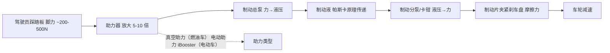
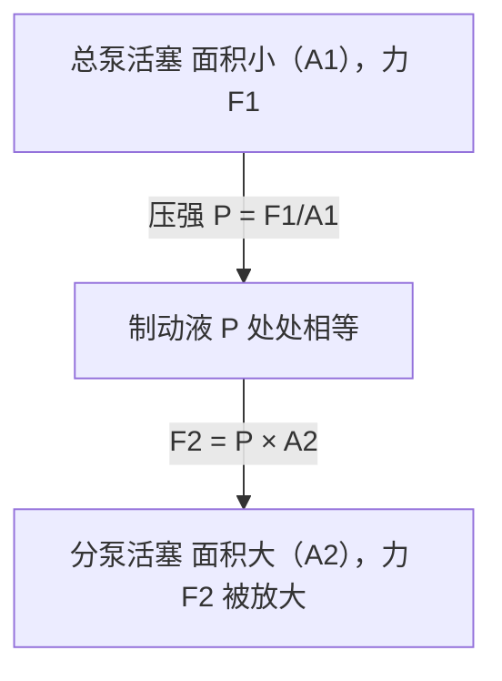
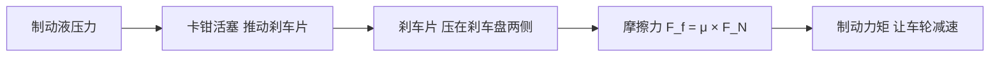

# 第三课：踩刹车时力/液压如何传递

## 场景化问题

你正在参与一次制动系统评审，底盘工程师指着屏幕说：「真空助力器在电动车上去掉了，换成博世 iBooster，踏板感需要重新标定。」制动系统工程师补充：「制动液含水量超过 3% 就必须更换，否则连续下坡时沸点不够，踏板会一脚踩到底。」你心里一堆问号：踩刹车的脚力到底经过了多少层「放大」才变成让两吨重的车停下来的巨大制动力？液压在这里面扮演什么角色？

## 第一步：从刹车踏板到车轮——力的传递全链路

## 第二步：逐层解剖——力是如何放大的

### 第一层：助力器——把脚力放大 5-10 倍

> 一台重 2 吨的车，紧急制动需要的制动力高达 15000-20000N。人脚最多踩出 500N，必须靠助力器「放大」。

| 助力类型 | 原理 | 应用 |
|----------|------|------|
| **真空助力器** | 利用发动机进气歧管产生的真空度，膜片两侧压差辅助推杆 | 传统燃油车 |
| **电动助力 iBooster** | 电机直接驱动齿轮+蜗杆推动主缸活塞，可编程控制 | 电动车、L2+ 智驾车 |
| **电液助力 EHB** | 高压蓄能器 + 电磁阀独立控制各轮制动压力 | 高阶智驾车、线控制动 |

**真空助力器的致命弱点**：依赖发动机运转产生真空，发动机熄火后真空只能维持 1-2 次刹车。电动车没有发动机，所以必须用电助力。

**iBooster 的革命性**：助力大小由软件定义——运动模式下踏板「硬」、舒适模式下踏板「软」。更重要的是，iBooster 能主动建压（不需要人踩），这是 AEB 自动紧急制动和自适应巡航主动刹车的基础。

### 第二层：制动总泵——把力翻译成液压

踩踏板的推力推动制动总泵的活塞，挤压密闭管路中的制动液，把「力」变成「液压」。

$$P = \frac{F}{A}$$

- $F$ = 推杆力（经过助力器放大后约 2000-5000N）
- $A$ = 总泵活塞面积
- $P$ = 管路液压（紧急制动时可达 80-120 bar）

### 第三层：制动液与帕斯卡原理——液压的魔法

**帕斯卡原理**：密闭液体中，压强处处相等。

> 如果总泵活塞面积 $A_1 = 2$ cm²，分泵活塞面积 $A_2 = 10$ cm²，则 $F_2 = F_1 \times \frac{A_2}{A_1} = 5F_1$——仅靠活塞面积差就实现了 5 倍力放大。

**制动液的苛刻要求**：

| 指标 | DOT 3 | DOT 4 | DOT 5.1 | 含义 |
|------|-------|-------|---------|------|
| 干沸点 | ≥ 205°C | ≥ 230°C | ≥ 260°C | 新油的沸腾温度 |
| 湿沸点 | ≥ 140°C | ≥ 155°C | ≥ 180°C | 含水 3.5% 后的沸腾温度 |
| 粘度（-40°C） | ≤ 1500 | ≤ 1800 | ≤ 900 | 低温流动性 |

> ⚠️ 制动液吸湿后沸点大幅下降。连续下坡时制动盘温度可达 300-600°C，热量传给制动液，含水 3% 的旧油可能在 140°C 就沸腾产生气泡——气泡可压缩 → 踏板一脚踩到底 → **刹车失灵（气阻现象）**。

### 第四层：卡钳与刹车片——液压变回摩擦力

| 参数 | 典型值 | 意义 |
|------|--------|------|
| 制动盘直径 | 前 280-400mm / 后 260-350mm | 直径越大制动力臂越长 |
| 刹车片摩擦系数 μ | 0.30-0.45（工作温度） | 片和盘的「粘涩度」 |
| 卡钳活塞数 | 1-6 个 | 越多夹紧力越均匀 |
| 制动盘最高温度 | 300-600°C（连续制动） | 超过刹车片设计温度会热衰退 |

## 第三步：全过程力放大倍数汇总

| 放大环节 | 放大倍数 | 累计放大 | 
|----------|----------|----------|
| 脚踩踏板力 | — | ~300N |
| → 踏板杠杆比（踏板支点设计） | ~3-4× | ~1000N |
| → 助力器（真空/电动） | ~5-10× | ~5000-10000N |
| → 总泵→分泵面积比 | ~3-6× | ~20000-50000N |
| → 单轮制动力 | — | **~5000-12500N/轮** |

> 从 300N 脚力到四轮合计 20000-50000N 的制动力——**总放大倍数约 70-170 倍**，全靠机械杠杆 + 助力器 + 液压面积差逐级放大。

## 第四步：为什么大货车下坡刹车会「失灵」

大货车满载 49 吨，下长坡时制动器持续摩擦，温度飙到 600-800°C。此时：
1. 刹车片树脂粘结剂高温分解 → 摩擦系数 μ 骤降（**热衰退**）
2. 制动液沸腾产生气泡（**气阻**）
3. 制动鼓/盘热膨胀 → 接触面积减小

**应对方案**：大货车标配**辅助制动**——发动机制动（排气蝶阀）、液力缓速器（利用油液剪切力减速），分担主制动器的负担。

## 关键术语

| 术语 | 英文 | 含义 |
|------|------|------|
| 帕斯卡原理 | Pascal's Principle | 密闭液体中压强处处相等 |
| 气阻 | Vapor Lock | 制动液沸腾产生气泡导致踏板失效 |
| 热衰退 | Brake Fade | 高温导致刹车片摩擦系数下降 |
| iBooster | iBooster | 博世的电动制动助力器，取代真空助力 |
| 制动液 DOT | DOT (Department of Transportation) | 制动液等级标准，数字越大沸点越高 |
| 再生制动 | Regenerative Braking | 电动车用电机反转发电来实现减速 |

## 油电对比 / 生活类比

- **油电对比**：燃油车用真空助力——依赖发动机，结构简单但不可编程。电动车必须用电助力，反而获得了「线控制动」的能力——AEB、ACC、单踏板模式都建立在电助力制动可编程的基础上。另外，电动车多了一套再生制动（松油门电机发电回收动能），所以刹车片磨损比燃油车慢很多。
- **生活类比**：制动系统就像用「液压千斤顶」放大力量——你用手轻轻压一个小活塞（脚踩踏板），千斤顶就能顶起一辆车（卡钳夹紧制动盘）。制动液=千斤顶里的液压油。

## 车企工作场景

制动系统工程师在做踏板感标定时，要在**踏板力**和**减速度**之间建立线性关系——用户期望踩 30% 的踏板行程获得约 30% 的最大减速度。太「贼」（轻踩就猛刹）会引起追尾，太「软」（踩到底还不怎么刹）会让用户恐慌。电动车因为再生制动和摩擦制动的「混合」，踏板感标定比燃油车复杂得多——需要在两种制动力之间平滑过渡。

## 小测

### 第一题
帕斯卡原理在制动系统中的作用是什么？
A. 把旋转运动变成直线运动
B. 利用活塞面积差放大制动力
C. 提高制动液沸点
D. 降低刹车片温度

> **答案：B**。帕斯卡原理保证密闭液体中压强处处相等，利用总泵小活塞→分泵大活塞的面积差，实现力的放大。

### 第二题
为什么制动液必须定期更换（通常 2 年/4 万公里）？
A. 制动液会挥发减少
B. 制动液吸湿后沸点下降，连续制动可能沸腾产生气阻
C. 制动液颜色会变深影响美观
D. 制动液会腐蚀管路

> **答案：B**。制动液（聚乙二醇基）有强吸湿性，含水后湿沸点大幅下降，重载下坡时可能沸腾→气泡→气阻→刹车失灵。

### 第三题
电动车为什么不能继续用传统真空助力器？
A. 真空助力器太贵
B. 电动车没有发动机持续产生真空
C. 真空助力器太重
D. 真空助力器制动力不够

> **答案：B**。真空助力器依赖发动机进气歧管的真空度，电动车没有发动机，无法持续产生真空，必须换用电助力（iBooster 等）。
