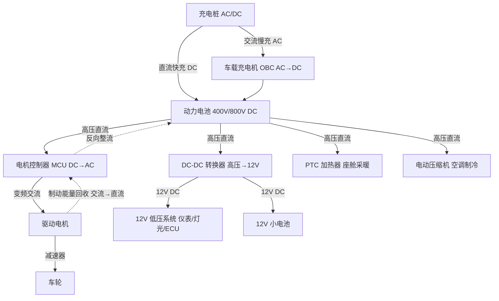
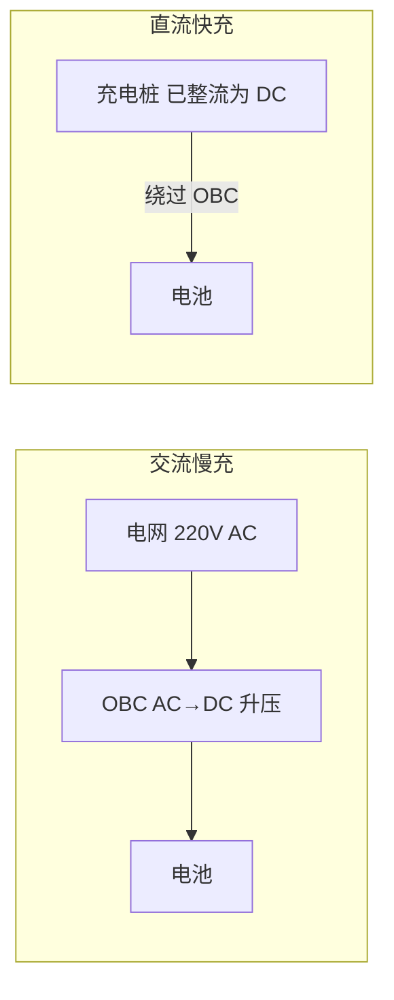

# 第四课：电动车高压能量流

## 场景化问题

你正在参加三电系统评审会，高压架构工程师说：「800V 平台下 OBC 要从 6.6kW 升级到 11kW，DC-DC 功率也要翻倍，但 SiC 模块供货还有风险。」BMS 工程师补充：「快充策略需要在 35°C 环境温度下验证电芯温差不超过 5°C。」你盯着屏幕上那张布满箭头的高压电气架构图——从充电枪插进去到车轮转起来，电流到底走了哪些路？400V 和 800V 的差别又在哪里？

## 第一步：电动车高压能量流全景图

## 第二步：逐段解剖高压能量流

### 第一段：充电——把电网能量装进电池

| 充电方式 | 电压/电流 | 功率范围 | 充满时间（80kWh 电池） | 经过路径 |
|----------|----------|----------|----------------------|----------|
| **交流慢充（家充桩）** | 220V AC / 32A | 3.3-7 kW | 8-12 小时 | 充电桩 → OBC（整流升压）→ 电池 |
| **交流快充** | 380V AC / 63A | 11-22 kW | 3-5 小时 | 充电桩 → OBC → 电池 |
| **直流快充（400V）** | 400V DC / 250A | 60-150 kW | 30-60 分钟（30-80%） | 充电桩直接到电池（绕过 OBC） |
| **直流超充（800V）** | 800V DC / 500A | 250-480 kW | 12-18 分钟（30-80%） | 充电桩直接到电池 |

> 交流慢充时，OBC（车载充电机）负责把电网的交流电整流成直流电并升压到电池电压。直流快充时充电桩已经做好了整流，直接以直流电灌入电池，OBC 被绕过了。

### 第二段：放电——电池到车轮

| 环节 | 功能 | 关键器件 | 效率 |
|------|------|----------|------|
| 电池放电 | 化学能 → 直流电能 | 三元锂/磷酸铁锂电芯 | ~98% |
| MCU 逆变 | 直流 → 变频交流 | IGBT（400V）/ SiC MOSFET（800V） | ~95-98% |
| 电机 | 电能 → 机械能 | 永磁同步电机 PMSM | ~93-97% |
| 减速器 | 降速增扭 | 单级齿轮副 | ~96-98% |
| **综合效率** | — | — | **~85-92%** |

> 对比燃油车 15-25% 的综合效率，电动车从电池到车轮的效率是燃油车的 4-5 倍。

### 第三段：能量回收——刹车也能充电

松油门或踩刹车时，电机从「电动机」切换为「发电机」——车轮的惯性反过来拖动电机转子旋转，产生交流电，MCU 反向整流为直流电充回电池。一次中等强度的制动可以回收 **60-80%** 的动能。

### 第四段：高压→低压——给 12V 系统供电

电动车没有发动机带动的发电机（ alternator），12V 系统全靠 DC-DC 转换器从高压电池取电：

| 负载 | 功率 | 说明 |
|------|------|------|
| 仪表/中控屏 | ~100-200W | 持续用电 |
| 灯光（全开） | ~200-400W | 夜间 |
| ECU/传感器 | ~100-200W | 持续 |
| 座椅加热/通风 | ~200-400W/座 | 冬季/夏季 |
| 音响 | ~50-200W | — |
| 12V 小电池充电 | ~100W | 浮充 |

> DC-DC 转换器约 2-3 kW，效率 ~95%。12V 小电池（通常为锂电池）作为缓冲——高压断电时保证车门解锁、双闪灯等安全功能仍能工作。

### 第五段：高压→热管理——电池怕冷也怕热

| 工况 | 热管理动作 | 能耗 |
|------|-----------|------|
| 低温冷启动（-20°C） | PTC 加热器 + 热泵给电池加热 | 3-6 kW |
| 快充（电池升温） | 压缩机 + 冷却液循环散热 | 2-4 kW |
| 夏季高温 | 压缩机为座舱+电池同时制冷 | 2-5 kW |
| 冬季采暖 | PTC 或热泵为座舱供暖 | 1-3 kW（热泵）/ 3-6 kW（PTC） |

> 冬季是电动车的「能耗噩梦」——电池要加热（否则充不进电也放不出功率），座舱要采暖，两项加起来可能消耗 **20-40%** 的续航。

## 第三步：400V vs 800V——高压架构的进化

| 维度 | 400V 平台 | 800V 平台 | 变化 |
|------|----------|----------|------|
| 系统电压 | ~400V | ~800V | ×2 |
| 充电功率 | 100-150 kW | 250-480 kW | ×2-3 |
| 充电时间（30-80%） | ~30 分钟 | ~12-18 分钟 | 减半 |
| 同功率下电流 | 大 | 小（一半） | 降发热 |
| 功率器件 | IGBT（硅） | SiC MOSFET（碳化硅） | 更高效率 |
| 整车成本增量 | — | +3000-8000 元 | 核心增量在 SiC 和高耐压部件 |

**核心公式**：

$$P = V \times I \quad \quad P_{热} = I^2 \times R$$

电压翻倍（400V→800V），同样功率下电流减半，发热降至 1/4。这是 800V 能「充电更快 + 损耗更低」的根本原因。

## 关键术语

| 术语 | 英文 | 含义 |
|------|------|------|
| OBC | On-Board Charger | 车载充电机，AC→DC 整流升压 |
| MCU | Motor Control Unit | 电机控制器，DC→AC 逆变器 |
| DC-DC | DC-DC Converter | 高压→12V 转换器 |
| PTC | Positive Temperature Coefficient | 陶瓷加热器，座舱采暖 |
| SiC | Silicon Carbide | 碳化硅功率器件，耐高压/高频/高温 |
| BMS | Battery Management System | 电池管理系统，SOC/均衡/热管理/安全 |
| 再生制动 | Regenerative Braking | 电机反转发电回收动能 |
| 单踏板模式 | One-Pedal Driving | 松油门即强回收制动，减少踩刹车频率 |

## 油电对比 / 生活类比

- **油电对比**：燃油车的能量流是「单向」的——油箱→发动机→车轮，能量只能消耗不能回收。电动车的能量流是「双向」的——电池⇄车轮，刹车时能量反流回电池。燃油车靠发电机+皮带驱动 12V 系统，电动车靠 DC-DC 从高压电池取电。
- **生活类比**：电动车的能量流就像家庭电路——充电是「交电费充值」，放电是「用电」，能量回收是「装太阳能板把多余电卖回电网」。400V vs 800V 则像普通水管 vs 高压消防管——同样的粗细，加压后水量翻倍。

## 车企工作场景

高压架构定义是三电系统的顶层设计——一旦选定 400V 或 800V 路线，所有高压部件（电池/BMS/MCU/OBC/DC-DC/PTC/压缩机/高压线束/充电接口）都要跟随选型。这是一个整车平台级别的重大决策，切换成本极高。三电系统工程师还需确保高压安全——IPXXB/IPXXD 防护等级、绝缘监测、主动放电（碰撞后 5 秒内将高压降至 60V 以下）。

## 小测

### 第一题
直流快充和交流慢充的关键区别是什么？
A. 直流快充电压更低
B. 直流快充时充电桩已整流，直接灌入电池，绕过 OBC
C. 交流慢充更快
D. 交流慢充不需要 OBC

> **答案：B**。直流快充桩直接输出高压直流电给电池，绕过了车载充电机（OBC）。交流慢充则需要 OBC 把交流电整流升压。

### 第二题
800V 高压平台相比 400V 平台的核心优势是什么？
A. 电池容量翻倍
B. 相同电流下功率翻倍，且线路发热降至 1/4
C. 电机功率翻倍
D. 不需要 BMS

> **答案：B**。$P = V \times I$（电压翻倍→功率翻倍），$P_{热} = I^2R$（同功率时电流减半→发热 1/4）。

### 第三题
电动车的 12V 低压系统从哪里取电？
A. 发动机带动的发电机（alternator）
B. 独立的小型汽油发电机
C. DC-DC 转换器从高压电池取电
D. 直接由高压电池降压供电，没有 12V 系统

> **答案：C**。电动车没有发动机，无法用传统发电机，12V 系统（仪表/灯光/ECU 等）通过 DC-DC 转换器从高压电池取电。12V 小电池仅作缓冲和备份。

---

<ProgressBadge path="/lessons/04-ev-energy-flow" mode="checkbox" />

