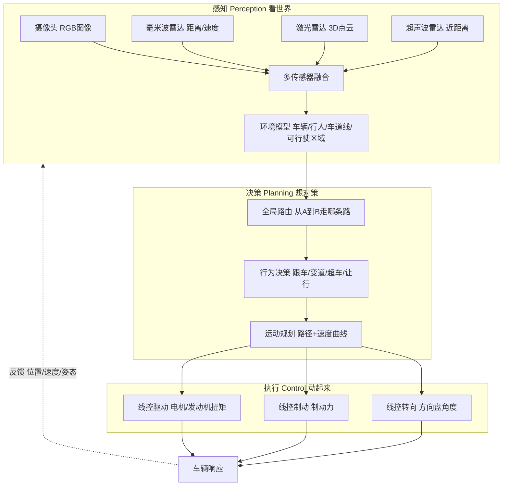
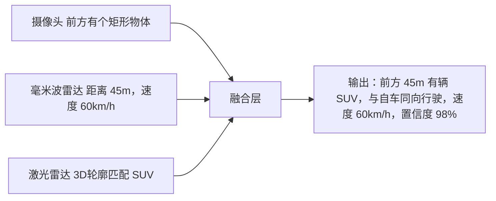
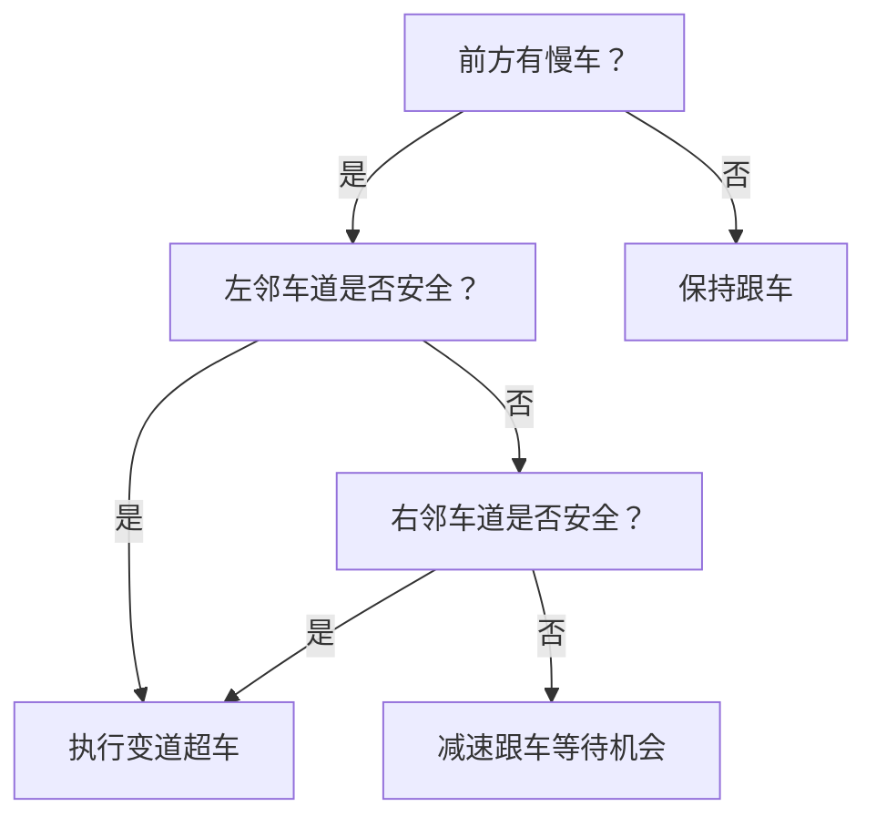

# 第五课：智能驾驶一次感知-决策-执行闭环

## 场景化问题

你正在参加智能驾驶团队的周会，感知组说：「昨天路测遇到一个异形锥桶，<TermCard term="BEV">BEV</TermCard> 模型把它识别成行人，导致幽灵刹车。」规划组反驳：「感知置信度给得太低，我们决策层不敢绕过它。」控制组补刀：「但真刹了用户会投诉体验差。」你听着三方互相甩锅，心里想：从摄像头拍到前方路况到车辆做出反应，中间到底发生了什么？「感知-决策-执行」这三个词分别对应什么？

## 第一步：智能驾驶闭环全景



> 智能驾驶的本质是**永不间断的闭环**——每 10-100 毫秒完成一次「看→想→动→反馈→再看」的循环。

## 第二步：感知——让车「看懂」周围

### 四种传感器各看什么

| 传感器 | 看到的 | 擅长 | 短板 | 安装位置 |
|--------|--------|------|------|----------|
| **摄像头（8-13 个）** | 颜色/纹理/形状/交通标志/车道线 | 分类识别 | 怕强光/雨雾/黑夜 | 前后左右+环视 |
| **毫米波雷达（1-5 个）** | 目标距离/相对速度 | 全天候/测速精准 | 分辨率低/没有颜色 | 前后保险杠 |
| **激光雷达（0-3 个）** | 三维空间点云 | 精确测距/3D 结构 | 恶劣天气衰减/成本高 | 车顶/前脸 |
| **超声波雷达（12 个）** | 近距离障碍物（<5m） | 近距离精准 | 距离短/速度慢 | 前后保险杠 |

### 融合感知的「三步走」



| 融合步骤 | 做什么 | 挑战 |
|----------|--------|------|
| **空间对齐** | 把所有传感器的坐标统一到同一参考系 | 标定偏差 1°，100m 外偏移 1.7m |
| **时间同步** | 不同传感器采样时间不同，需对齐时间戳 | 雷达 20ms vs 摄像头 33ms |
| **目标关联** | 判断摄像头看到的物体和雷达看到的点是不是同一个 | 多目标时容易「张冠李戴」 |

### 感知输出的「环境模型」

```
┌─────────────────────────────────────┐
│ 可行驶区域：自车道+左邻车道        │
│ 动态目标：[车A: 前30m/80km/h]       │
│           [行人B: 右前15m/5km/h]     │
│ 静态目标：[锥桶C: 左前20m]           │
│ 车道线：实线（左）/虚线（右）       │
│ 交通标志：限速80 / 前方施工          │
│ 信号灯：绿灯 剩余12秒               │
└─────────────────────────────────────┘
```

## 第三步：决策——从「看到了」到「怎么办」

### 三层决策架构

| 层级 | 问题 | 输出 | 更新频率 |
|------|------|------|----------|
| **全局路由** | 从 A 到 B 走哪条路？ | 导航路线 | 分钟级 |
| **行为决策** | 当前场景下：跟车/变道/超车/让行/停车？ | 高层驾驶动作 | 100-500ms |
| **运动规划** | 具体怎么走：路径+速度曲线 | 轨迹点序列 | 50-100ms |

### 行为决策的典型逻辑（遇到前方慢车）



### 运动规划的「四大约束」

| 约束类型 | 要求 | 违反的后果 |
|----------|------|-----------|
| **安全约束** | 不与任何障碍物碰撞，保持安全距离 | ——这不用说了 |
| **交通规则** | 不压实线、不闯红灯、不超速 | 违章/事故 |
| **舒适性** | 侧向加速度 < 0.3g，纵向加加速度 < 2.5 m/s³ | 乘客晕车/投诉 |
| **车辆动力学** | 不过度超出轮胎附着极限 | 失控 |

## 第四步：执行——把轨迹变成车辆动作

| 执行通道 | 传统车 | 智能车（线控） | 响应延迟 |
|----------|--------|---------------|----------|
| **转向** | 方向盘→转向柱→转向机 | <TermCard term="EPS">EPS</TermCard> 电机直接执行角度指令 | <50ms |
| **制动** | 踏板→真空助力→主缸 | iBooster/<TermCard term="AEB">EHB</TermCard> 电子建压 | <100ms |
| **驱动** | 油门踏板→节气门/喷油 | 电子扭矩指令→电机/发动机 | <50ms（电）/ 200ms（油） |

> 「线控」的最大意义：控制指令不再需要人操作，系统可以直接向执行器发命令——这是 L3+ 自动驾驶的硬件基础。

### 为什么电车控制更快

电动车的电机扭矩响应时间约 **10-50ms**，燃油发动机的扭矩响应时间约 **200-500ms**（受限于进气/燃烧/涡轮迟滞）。在需要快速微调速度的场景（如堵车跟车、紧急避障），电车比燃油车有本质优势。

## 第五步：一次典型闭环的时间线

```
T=0ms    感知：摄像头捕获一帧图像
T=30ms   感知：目标检测完成，识别出前方车辆
T=50ms   融合：多传感器数据对齐，更新环境模型
T=80ms   决策：行为判断「前车减速，需要跟车减速」
T=100ms  规划：计算减速度曲线（-2m/s²，舒适）
T=120ms  控制：发出制动力指令
T=150ms  执行：iBooster 建压，刹车片夹紧
T=200ms  车辆开始减速
T=250ms  反馈：IMU 检测到减速度，更新自车状态
T=300ms  下一帧图像到达，新循环开始
```

> 从「看到」到「开始响应」约 **150-200ms**，与人类反应时间（约 200-300ms）相当甚至更快——但系统不会疲劳、不会分心、不会路怒。

## 关键术语

| 术语 | 英文 | 含义 |
|------|------|------|
| 感知 | Perception | 用传感器+算法理解周围环境 |
| 融合 | Sensor Fusion | 将多传感器数据综合成统一环境模型 |
| 行为决策 | Behavioral Decision | 选择跟车/变道/让行等高层驾驶动作 |
| 运动规划 | Motion Planning | 生成无碰撞的路径和速度曲线 |
| 线控 | X-by-Wire | 电信号取代机械连接控制转向/制动/驱动 |
| BEV | Bird's Eye View | 鸟瞰视角感知，将多摄像头画面转为俯视图 |
| 幽灵刹车 | Phantom Braking | 系统误判障碍物导致不该刹车时刹车 |

## 油电对比 / 生活类比

- **油电对比**：智能驾驶对执行器的响应速度要求很高（频繁微调扭矩），电动车的电机控制天然快于燃油发动机。这也是为什么高阶智驾几乎都首发在电动车上——不是燃油车不能装，而是体验差一个档次。
- **生活类比**：智能驾驶闭环就像你过马路——眼睛看路（感知），大脑判断车距和时机（决策），腿脚控制步速和方向（执行），一边走一边继续看（反馈循环）。

## 车企工作场景

智能驾驶系统工程师最常遇到的三类问题：
1. **感知漏检/误检**：真实障碍物没识别 → 可能撞上；塑料袋识别为石块 → 幽灵刹车
2. **决策犹豫**：变道变一半又缩回来 → 用户觉得「这车不会开」
3. **控制突兀**：刹车太猛或太软 → 乘客晕车或觉得刹不住

三个环节中任何一环出问题，用户感受到的都是「智驾不好用」。三方互相甩锅是日常——感知说「我置信度给够了」，决策说「你给的是错的」，控制说「你们争完再告诉我」。

三个环节中任何一环出问题，用户感受到的都是「智驾不好用」。三方互相甩锅是日常——感知说「我置信度给够了」，决策说「你给的是错的」，控制说「你们争完再告诉我」。

## 小测

### 第一题
智能驾驶中「感知」环节的核心工作是什么？
A. 控制方向盘角度
B. 用传感器和算法理解周围环境（车辆/行人/车道线等）
C. 计算最优导航路线
D. 调节空调温度

> **答案：B**。感知是智能驾驶的「眼睛」——用摄像头、雷达、激光雷达等传感器捕获数据，再用算法识别物体、车道线和可行驶区域。

### 第二题
为什么特斯拉摄像头被大雾遮挡时智驾会降级？
A. 芯片算力不够处理大雾场景
B. 摄像头成像模糊，视觉感知模型无法准确理解环境
C. GPS 在大雾中信号丢失
D. 轮胎在大雾中打滑

> **答案：B**。纯视觉方案依赖摄像头成像质量，大雾/暴雨/强逆光使画面模糊或过曝，感知输出置信度骤降，系统被迫降级。

### 第三题
「线控制动」相比传统真空助力制动的核心优势是什么？
A. 成本更低
B. 系统可以不经驾驶员操作而主动建压（AEB/ACC 的基础）
C. 制动力更大
D. 不需要制动液

> **答案：B**。线控制动（如 iBooster）由电信号控制建压，不需要人踩踏板就能主动制动——这是 AEB 自动紧急制动、ACC 自适应巡航等 L2+ 功能的硬件基础。

---

<div style="text-align:center; margin-top:24px; padding:16px; background:var(--vp-c-brand-soft); border-radius:10px;">

<ProgressBadge path="/lessons/05-adas-loop" mode="checkbox" />

</div>
