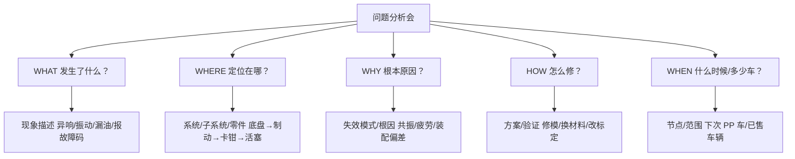

# 第六课：新人第一次参加问题分析会如何听懂术语

## 场景化问题

入职第三周，你第一次被拉进制动异响问题分析会。15 个人围着桌子，质量工程师开场：「这台 VP 车右前轮过搓板路有异响，我们怀疑是 caliper 的 shim 共振，也可能是 pad 的 chamfer 角度不对。」你笔记本上记了一堆拼写都不确定的单词，完全跟不上讨论节奏。一小时后你走出会议室，除了「异响」两个字，什么都没听懂。

**这一课的目标不是让你成为术语词典，而是给你三把「万能钥匙」——快速拆解陌生术语的方法论。**

## 第一步：先建立「会议总是在讨论什么」的框架

任何汽车工程问题分析会，讨论的内容必然落在这五个维度之一：

## 第二步：第一把钥匙——按「系统层级」拆解

遇到陌生名词时，最快的定位方法是问「它属于哪一级」：

| 层级 | 示例 | 新人速判法 |
|------|------|-----------|
| **整车级** | NVH、操稳、热平衡、碰撞安全 | 说整台车表现的词 |
| **系统级** | 制动系统、转向系统、空调系统 | 说一整套功能的词 |
| **子系统级** | 制动器、转向机、压缩机 | 说一个大部件的词 |
| **零件级** | 制动卡钳、转向拉杆、冷凝器 | 说一个具体零件的词 |
| **特征级** | 活塞回位量、齿条间隙、翅片间距 | 说一个具体尺寸/参数的词 |

**实战练习**：听到「caliper 的 shim 共振」
- caliper（卡钳）= 制动系统 → 子系统级 → 零件级
- shim（消音片）= 卡钳上的一个金属薄片 → 特征级
- 共振 = 失效模式（WHY）

→ 翻译成人话：「刹车卡钳上的消音片在特定频率下抖动发出响声」

## 第三步：第二把钥匙——按「开发流程节点」定位

| 缩写 | 全称 | 出现频率 | 新人需要知道什么 |
|------|------|----------|-----------------|
| **VP** | Verification Prototype | ★★★★★ | 验证样车——第一轮造出来检查设计行不行的车，异响/装配问题最多 |
| **TT** | Tooling Tryout | ★★★★ | 工装样车——用正式产线模具造的车，检验产线能力 |
| **PP** | Pilot Production | ★★★★ | 试生产车——按量产节拍造的「演习车」，接近商品车状态 |
| **SOP** | Start of Production | ★★★★★ | 量产开始——商品车正式下线，错过这个节点=延期 |
| **EOP** | End of Production | ★★★ | 量产结束——车型停产 |
| **DVP** | Design Verification Plan | ★★★★ | 设计验证计划——这个零件要做哪些试验才算合格 |
| **ECR/ECO** | Engineering Change Request/Order | ★★★★ | 工程变更——改一个东西的正式流程 |
| **BOM** | Bill of Materials | ★★★ | 物料清单——一台车所有零件的清单 |

> 💡 听到「这台 VP 车」立刻知道：这是早期验证样车，问题多是正常的——如果有人说「这个问题 PP 阶段必须关掉」，意思是量产前必须解决。

## 第四步：第三把钥匙——按「问题解决八步法（8D）」拆解

当会议陷入争论时，通常是在 8D 的不同步骤上卡住了：

| 步骤 | 8D 名称 | 会议上常听到的话 | 新人观察点 |
|------|---------|-----------------|-----------|
| D1 | 组建团队 | 「这个要找 NVH 的人来看」 | 谁还没被拉进来？ |
| D2 | 描述问题 | 「到底是 40km/h 还是 60km/h 响？」 | 问题的时间和条件说清了吗？ |
| D3 | 围堵措施 | 「已售车辆要不要发 TSB？」 | 有没有车已经在客户手里？ |
| D4 | 根因分析 | 「做个频谱分析看看是不是共振」 | 是猜的还是测出来的？ |
| D5 | 永久纠正措施 | 「改 shim 厚度从 0.5 到 0.8mm」 | 改了会不会引发新问题？ |
| D6 | 验证措施有效 | 「下周装车跑耐久」 | 怎么证明问题真的解决了？ |
| D7 | 预防再发生 | 「FMEA 要更新」 | 以后怎么避免同类问题？ |
| D8 | 总结表彰 | （通常没有这一步） | — |

## 第五步：新人「活过」问题分析会的实战话术

### 可以随时问的「安全三问」

| 你可以这样问 | 实际在确认什么 |
|-------------|---------------|
| 「这个问题是在哪个阶段的车子上发现的？」 | 确认 VP/TT/PP/SOP（判断严重程度） |
| 「影响范围是多少台车？」 | 确认是单车偶发还是批量问题 |
| 「最晚什么时候需要关掉？」 | 确认节点（影响项目进度吗？） |

### 绝对不能问的（暴露完全外行）

| 不要这样问 | 为什么 |
|-----------|--------|
| 「ABS 是什么？」 | 基础术语，应该课前补 |
| 「这个零件长什么样？」 | 会后自己查 3D 数模或实物 |
| 「为什么不用更简单的方案？」 | 99% 的情况下之前已经试过了 |

### 会中沉默、会后猛补的高效策略

1. **把陌生缩写全记下来（不管拼写）**，会后在内部术语库、图纸或零件目录中对照
2. **画一张「问题的关系图」**：现象→可疑零件→可能根因→候选方案→验证计划
3. **找老员工确认一句**：「会上说的 shim 共振，是说这个金属片在某个频率抖对吧？」

## 关键术语速查表

### 开发流程缩写

| 缩写 | 全称 | 一句话含义 |
|------|------|-----------|
| VP | Verification Prototype | 第一轮验证样车 |
| TT | Tooling Tryout | 用产线模具造的样车 |
| PP | Pilot Production | 量产前试生产车 |
| SOP | Start of Production | 开始批量生产 |
| DVP | Design Verification Plan | 零件要做的全部试验清单 |
| ECR | Engineering Change Request | 发起一个修改请求 |
| ECO | Engineering Change Order | 批准修改并执行 |
| BOM | Bill of Materials | 整车零件清单 |

### 底盘/制动术语

| 术语 | 英文 | 含义 |
|------|------|------|
| 卡钳 | Caliper | 夹住刹车盘的「手指」 |
| 消音片 | Shim | 卡钳和刹车片之间的金属薄片，防异响 |
| 倒角 | Chamfer | 刹车片边缘切掉的斜角，减少制动尖叫 |
| 制动盘厚度差 | DTV (Disc Thickness Variation) | 刹车盘厚薄不均，引起制动抖动 |
| 拖滞力矩 | Drag Torque | 不刹车时刹车片仍然轻微摩擦，费油/费电 |

### NVH 术语

| 术语 | 英文 | 含义 |
|------|------|------|
| NVH | Noise, Vibration, Harshness | 噪音、振动、粗糙感——用户感知最直接的三个维度 |
| 共振 | Resonance | 激励频率和零件固有频率吻合时振幅急剧放大 |
| 频谱分析 | Spectrum Analysis | 把复杂的振动信号分解成不同频率，定位峰值频率 |
| 啸叫 | Squeal | 高频制动噪音（1-16 kHz），像指甲刮黑板 |
| 轰鸣 | Boom | 低频车内噪音（20-200 Hz），像隧道里的沉闷声 |

### 问题解决术语

| 术语 | 英文 | 含义 |
|------|------|------|
| 根因 | Root Cause | 问题的根本原因（不是表面现象） |
| 围堵 | Containment | 先切断影响（比如冻结库存零件），不等根因分析完 |
| 耐久 | Durability | 反复使用后是否还能正常工作 |
| TSB | Technical Service Bulletin | 给 4S 店的技术服务公告（批量问题的官方修理指南） |
| 8D | 8 Disciplines | 问题解决的标准八个步骤 |
| FMEA | Failure Mode and Effects Analysis | 事前分析「哪里会坏、坏了多严重、怎么防」 |

## 油电对比 / 生活类比

- **油电对比**：燃油车和电动车的会议术语大部分相通——VP/TT/PP/SOP、8D、FMEA 是行业通用语言。差异主要在动力系统缩写上——燃油车聊「ECU/TCU/HCU/ECM」，电动车聊「VCU/MCU/BMS/OBC」。跨动力类型轮岗的新人只需补「动力域缩写」这一块。
- **生活类比**：汽车工程术语就像医生查房时的「医学术语」——「窦性心律不齐」听起来吓人，其实就是心跳节奏有点不规律。新人的任务不是背词典，而是掌握「由大到小、由表及里」的拆解逻辑。

## 车企工作场景

问题分析会是新人的「加速学习器」——比自己看资料快 10 倍，因为你能看到老工程师的思维方式：他们如何从一堆现象中锁定两三个最可疑的零件、如何设计一个简单的实验来排除或确认猜想、如何在「完美方案」（太贵/太慢）和「够用方案」（能关掉问题就行）之间做权衡。**建议新人在前三个月多旁听，笔记本上记的不是「结论」，而是「他们为什么这么想」。**

## 小测

### 第一题
会上听到「这个问题 PP 阶段必须关掉」，意思是？
A. 量产前必须解决
B. 这个问题不重要
C. 留到下一代车型再修
D. 把这个问题关在文件夹里

> **答案：A**。PP（试生产）是 SOP（量产）前的最后一个验证阶段，「PP 阶段关掉」= 量产前必须解决。

### 第二题
NVH 是哪三个单词的缩写？
A. Noise, Vehicle, Heat
B. Noise, Vibration, Harshness
C. New Vehicle Handling
D. Normal Vehicle Height

> **答案：B**。NVH = Noise（噪音）、Vibration（振动）、Harshness（粗糙感），是汽车用户体验最核心的三个感知维度。

### 第三题
当质量工程师对供应商说「先做围堵，根因下周再分析」，「围堵」是指？
A. 把出问题的零件用围栏圈起来
B. 先紧急切断问题影响范围（如冻结库存/排查已发车辆），不等根因分析完
C. 把供应商围起来不让走
D. 把问题报告锁在柜子里

> **答案：B**。「围堵」是 8D 的 D3 步骤——先止住血（切断影响），再慢慢查病因（根因分析）。比如发现某批次刹车片有问题，立刻冻结该批次库存并通知 4S 店暂停使用，这就是围堵。
