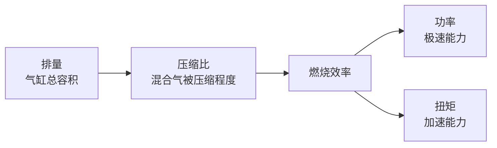
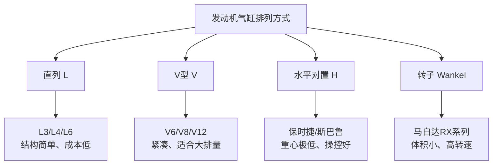
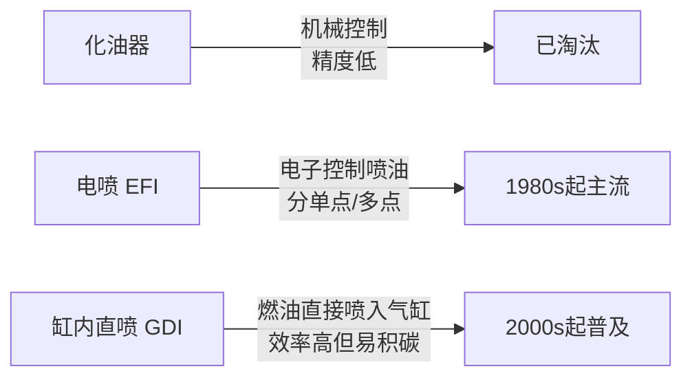

# 发动机原理

### 10. 内燃机工作循环（四冲程：进气→压缩→做功→排气）

**场景化问题**：为什么发动机启动后不踩油门自己也会转？四个冲程里到底哪个在出力？

**结构图**：

```
冲程 1: 进气（Intake）    冲程 2: 压缩（Compression）
┌──────────────┐          ┌──────────────┐
│ 进气门  开    │          │ 进/排气门  关 │
│ 排气门  关    │          │ 活塞    上行   │
│ 活塞    下行   │          │ 混合气  被压缩 │
│ 吸入混合气    │          │ 温度 ↑ 压力 ↑  │
└──────────────┘          └──────────────┘

冲程 3: 做功（Power）    冲程 4: 排气（Exhaust）
┌──────────────┐          ┌──────────────┐
│ 进/排气门  关 │          │ 进气门  关    │
│ 火花塞    点火 │          │ 排气门  开    │
│ 混合气    爆燃 │          │ 活塞    上行   │
│ 推动活塞  下行 │          │ 排出废气      │
└──────────────┘          └──────────────┘
```

> 四个冲程中，只有**做功冲程**产生动力，其余三个冲程依靠飞轮的惯性完成。

**原理（说人话）**：发动机就像人的呼吸——吸气（进气）、憋气压缩（压缩）、爆炸发力（做功）、呼气排出（排气）。四个动作里只有「爆炸发力」那一下是活塞被推下去产生动力，其余三步全靠飞轮的惯性带动。飞轮就像陀螺，一旦转起来就会保持旋转，拖着活塞完成另外三步。

**油电对比 / 生活类比**：
- 油电对比：电动车没有冲程概念，电机通电就转，全程都在出力，这也是电车起步即最大扭矩的原因。
- 生活类比：四冲程就像用打气筒打气——压下把手（进气→压缩），气打进轮胎那一刻发力（做功），抬起把手准备下一次（排气）。

**车企工作场景**：动力匹配工程师在做发动机万有特性曲线标定时，需要逐工况分析每个冲程的燃烧效率，找出最佳点火提前角。

**小测**：四冲程发动机中，哪个冲程真正对外做功？
A. 进气冲程  B. 压缩冲程  C. 做功冲程  D. 排气冲程
**答案：C**

---

### 11. 发动机主要参数（排量/压缩比/功率/扭矩）

**场景化问题**：2.0T 和 2.0L 有什么区别？为什么有的 1.5T 比 2.0L 还有劲？

**结构图**：



**原理（说人话）**：

- **排量（Displacement）**：发动机所有气缸工作容积的总和，单位：升（L）。排量 ≈ 单缸工作容积 × 气缸数。常见排量：1.5L、2.0L、3.0L。一般排量越大，动力越强，油耗越高（涡轮增压可以打破这个规律）。
- **压缩比（Compression Ratio）**：气缸最大容积与最小容积的比值。压缩比 = (活塞下止点容积) / (活塞上止点容积)。汽油机压缩比通常 8:1 ~ 14:1，柴油机 14:1 ~ 23:1（柴油机靠压燃，需要更高压缩比）。压缩比越高，热效率越高，但对燃油标号要求也越高。
- **功率（Power）**：单位时间内做的功，表示发动机的「极速能力」。单位：kW（千瓦）或 PS（马力）。1 PS ≈ 0.735 kW。
- **扭矩（Torque）**：发动机输出的旋转力矩，表示发动机的「加速能力」。单位：N·m（牛·米）。扭矩大 = 起步快、超车有力。

> 详见 [扭矩与马力](/core-notes/torque-vs-hp)。

**油电对比 / 生活类比**：
- 油电对比：电机的功率和扭矩从 0 转就开始爆发，不需要像燃油机那样等转速爬升；但电机高速后扭矩会衰减，燃油机靠变速箱能持续输出。
- 生活类比：排量 = 肺活量（越大越能吸），压缩比 = 把弹簧压多紧（越紧弹得越远），扭矩 = 你推东西的爆发力，功率 = 你能跑多快。

**车企工作场景**：产品规划工程师在定义新车动力总成时，会根据目标用户场景（城市通勤 vs 高速巡航）匹配排量、增压方案和功率扭矩曲线。

**小测**：下列哪个参数直接决定了发动机的「加速能力」？
A. 排量  B. 压缩比  C. 功率  D. 扭矩
**答案：D**

---

### 12. 发动机类型（直列/V型/水平对置/转子）

**场景化问题**：为什么宝马坚持用直列六缸，而奔驰用 V6？保时捷的「水平对置」到底好在哪？

**结构图**：



**原理（说人话）**：

| 类型 | 排列方式 | 特点 | 代表 |
|------|----------|------|------|
| **直列（L）** | 气缸成一列 | 结构简单、成本低 | L3/L4/L6 |
| **V型（V）** | 气缸成V形两列 | 紧凑、适合大排量 | V6/V8/V12 |
| **水平对置（H）** | 气缸水平对向 | 重心极低、宽体 | 保时捷、斯巴鲁 |
| **转子（Wankel）** | 三角形转子旋转 | 体积小、高转速、油耗高 | 马自达 RX 系列 |
| **W型** | V+V 组合 | 极致紧凑的大排量方案 | 大众 W12/W16 |

**油电对比 / 生活类比**：
- 油电对比：电动车没有气缸排列的概念，电机体积远小于发动机，可以灵活放置在前后桥甚至轮边（轮毂电机），彻底解放了前舱布局。
- 生活类比：直列 = 人排成一队（简单但占地方），V型 = 两队人斜着站（紧凑但复杂），水平对置 = 两个人躺平对向蹬腿（稳但宽）。

**车企工作场景**：底盘工程师在选择发动机类型时，需要综合考虑机舱空间、重心高度和碰撞安全，V6 和直六的选择直接影响整车布置方案。

**小测**：以下哪种发动机类型以极低重心著称？
A. 直列四缸  B. V型六缸  C. 水平对置  D. 转子发动机
**答案：C**

---

### 13. 曲柄连杆机构（活塞/连杆/曲轴）

**场景化问题**：活塞上下跑，车轮却是转的——这个「直线→旋转」的转换是怎么实现的？

**结构图**：

```
活塞 → 连杆 → 曲轴 → 飞轮 → 离合器 → 变速箱
```

**原理（说人话）**：曲柄连杆机构就像自行车脚踏板——你的腿上下蹬（活塞往复），脚踏板和链条盘却转得飞快（曲轴旋转）。关键部件：
- **活塞**：承受燃烧压力，在气缸内往复运动，相当于自行车的脚踏受力面。
- **活塞环**：三道环（气环×2 + 油环×1），负责密封燃烧室、刮掉缸壁上多余的机油、把热量传给缸壁。
- **连杆**：连接活塞与曲轴，把上下运动传给曲轴，力臂角度随时在变。
- **曲轴**：核心转换器，把往复运动转为旋转运动输出，曲柄的偏心距决定了活塞行程。

**油电对比 / 生活类比**：
- 油电对比：电动车没有曲柄连杆机构，电机的转子直接输出旋转运动，结构简单得多，零件数量减少 90% 以上。
- 生活类比：曲柄连杆 = 缝纫机踏板——脚踩上下运动，通过连杆和曲柄变成飞轮的旋转运动。

**车企工作场景**：NVH 工程师在做曲轴扭振分析时，需要计算曲轴在各个转速下的扭转振动幅值，避免共振导致曲轴断裂。

**小测**：曲柄连杆机构中，将往复直线运动变为旋转运动的核心部件是？
A. 活塞  B. 连杆  C. 曲轴  D. 飞轮
**答案：C**

---

### 14. 配气机构（气门/凸轮轴/正时）

**场景化问题**：发动机怎么知道什么时候开门进气、什么时候关门爆炸？气门开得不对会怎样？

**结构图**：


**原理（说人话）**：配气机构就是发动机的「呼吸系统」，精确控制什么时候吸气、什么时候呼气。
- **气门（Valve）**：每个气缸通常有 2-4 个气门（进气/排气各 1-2 个），相当于进排气的「门」。
- **凸轮轴（Camshaft）**：一根带「凸包」的轴，旋转时凸包顶开气门，凸包形状决定气门开多大、开多久。
- **正时系统**：通过皮带或链条保证曲轴和凸轮轴同步旋转，一旦错位就是「正时错乱」，严重的会顶弯气门。
- **可变气门正时（VVT）**：根据工况智能调整气门开闭时机——低速要稳、高速要猛，一个时机没法两头兼顾。

**油电对比 / 生活类比**：
- 油电对比：电动车没有配气机构，不需要进排气，电机自身不需要「呼吸」，省去了正时皮带/链条、凸轮轴等一整套机械。
- 生活类比：配气机构 = 呼吸节奏——慢走时呼吸平缓（小气门升程），冲刺时大口呼吸（大气门升程），VVT 就是自动调节呼吸节奏。

**车企工作场景**：标定工程师在台架上做 VVT 策略标定时，需要在油耗、排放和动力之间找最优解，每一个工况点都要反复调参。

**小测**：可变气门正时（VVT）的主要作用是？
A. 提高压缩比  B. 根据工况调整气门开闭时机  C. 增加排量  D. 减少气缸数
**答案：B**

---

### 15. 燃油供给方式（化油器→电喷→缸内直喷）

**场景化问题**：为什么现在的新车都不装化油器了？「缸内直喷」和「多点电喷」到底哪个好？

**结构图**：



**原理（说人话）**：

| 方式 | 时期 | 特点 |
|------|------|------|
| **化油器** | 早期 | 机械控制，精度低，已被淘汰 |
| **电喷（EFI）** | 1980s起 | 电子控制喷油量，分单点/多点喷射 |
| **缸内直喷（GDI）** | 2000s起 | 燃油直接喷入气缸，效率更高，但易积碳 |

化油器就像用浇花的洒水壶喷油——粗放。电喷像精确注射器，电脑算好喷多少。缸内直喷则像直接往气缸里打针，雾化更好、燃烧更充分，缺点是进气门背面没有汽油冲刷，容易积碳。很多新车采用「混合喷射」（歧管喷射 + 缸内直喷）来兼顾两者优势。

**油电对比 / 生活类比**：
- 油电对比：电动车完全没有燃油供给系统，能量来自电池，通过电线传输，不需要喷油嘴、高压油泵等精密燃油部件。
- 生活类比：化油器 = 泼水（大致泼上去），电喷 = 喷雾瓶（雾化均匀），缸内直喷 = 注射器（精确定点注射）。

**车企工作场景**：排放标定工程师在做 WLTC 工况测试时，需要优化喷油策略（喷油时刻、次数、油量），确保满足国六 b 排放法规。

**小测**：缸内直喷（GDI）相比进气道喷射的主要优势是？
A. 成本更低  B. 结构更简单  C. 燃油雾化更好、热效率更高  D. 不易积碳
**答案：C**

---

::: tip 配图提示
建议配图：四冲程动画截帧（进气/压缩/做功/排气各一帧）、直列vsV型发动机实物对比图、曲柄连杆机构示意图、配气机构剖面图。
:::
