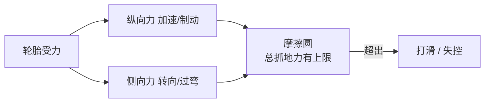
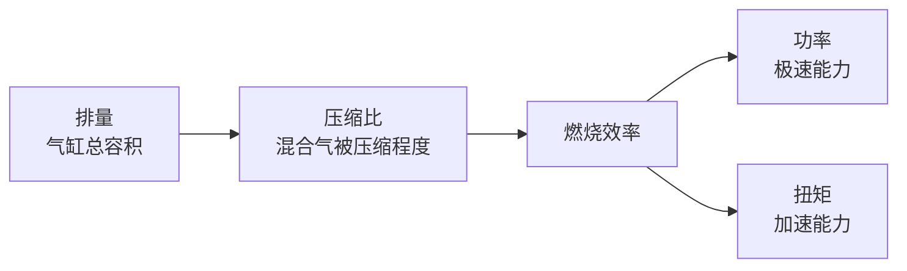
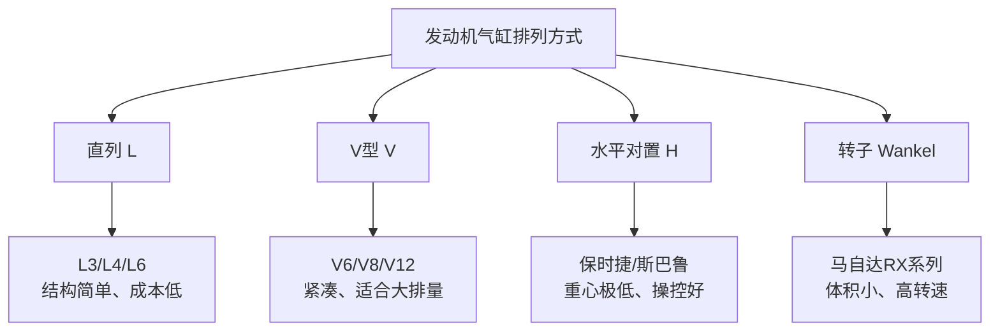
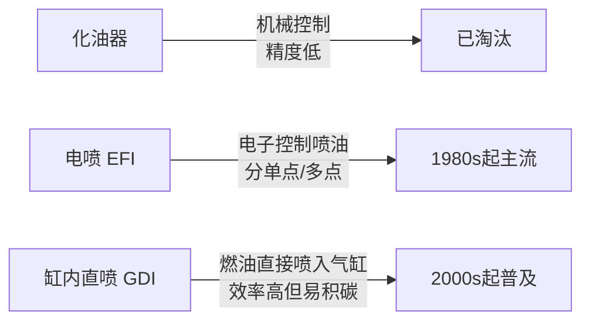

# 发动机原理

## 力学基础

### 力学基础：牛顿定律在汽车中的应用

**场景化问题**：为什么大货车需要更长的刹车距离？为什么跑车过弯要减速？

**结构图**：

| 牛顿定律 | 公式 | 汽车中的应用 |
|----------|------|-------------|
| **第一定律（惯性）** | 物体保持静止或匀速直线运动 | 不系安全带时急刹车人会前冲；车辆巡航时维持匀速需要的力最小 |
| **第二定律（加速度）** | $F = ma$ | 加速：$F_{驱} - F_{阻} = ma$；车越重（m越大），同样力加速越慢 |
| **第三定律（作用反作用）** | $F_{AB} = -F_{BA}$ | 轮胎向后推地面 → 地面向前推车（驱动力来源）；碰撞时两车受力相等 |

**原理（说人话）**：

- **为什么大货车刹车距离长？** $F = ma$ 告诉你：给定同样的制动力 F，质量 m 翻倍，减速度 a 就减半。大货车满载 49 吨，小车 1.5 吨，同样踩死刹车，大货车要滑出 3-5 倍的距离。
- **为什么跑车过弯要减速？** 过弯需要向心力 $F_{向心} = \frac{mv^2}{r}$——速度 v 翻倍，需要的向心力翻 4 倍。如果轮胎抓地力不够，车就会推头/甩尾冲出弯道。

**油电对比 / 生活类比**：
- 油电对比：电动车瞬时扭矩大，$F = ma$ 中 F 来得更快，所以同功率电车起步加速更猛。
- 生活类比：推购物车越重越难推（牛顿第二定律），转急弯时推太快会翻（向心力）。

**车企工作场景**：底盘工程师用牛顿定律计算制动距离、转弯极限和碰撞加速度，这些数据直接写入车型参数表和法规认证文件。

**小测**：一辆 1500kg 的车以 100 km/h 行驶，急刹时平均制动力为 8000N。估算刹车距离大约是多少米？
（提示：先用 $F=ma$ 算 a，再用 $v^2 = 2as$ 算 s）

---

### 热力学基础：卡诺循环与热效率

**场景化问题**：为什么发动机热效率只有 40% 左右？为什么不能把所有热能都变成动力？

**结构图**：

| 概念 | 说明 | 汽车中的体现 |
|------|------|-------------|
| **热源** | 高温热源（燃烧室，约 2000°C） | 汽油在气缸内燃烧 |
| **冷源** | 低温热源（环境空气，约 25°C） | 冷却系统、排气管散掉的废热 |
| **卡诺效率上限** | $\eta_{Carnot} = 1 - \frac{T_{冷}}{T_{热}}$ | 理论上限约 87%（实际远达不到） |
| **实际热效率** | 奥托循环 25-35%，阿特金森 38-41% | 大部分能量被冷却液带走、从排气管喷出 |

**原理（说人话）**：热力学第二定律告诉你——热量不可能 100% 变成机械功，一定会有一部分废热必须排给冷源。卡诺循环是理论上的理想循环，热效率上限取决于热源和冷源的温度差：温差越大，效率越高。汽油机燃烧温度约 2000°C，环境温度约 25°C，理论效率上限约 87%，但实际受限于摩擦/不完全燃烧/散热损失等，通常只有 25-35%。丰田/比亚迪的高效发动机（采用阿特金森循环+高压缩比）能到 40-41%。

**关键数据**：1 升汽油含约 8.9 kWh 能量，但只有约 2.7-3.6 kWh 变成轮端动力（热效率 30-40%），其余都以热的形式散失了。

**油电对比 / 生活类比**：
- 油电对比：电机效率通常在 90-97%，远高于发动机。电动车从电池到车轮的综合效率约 70-80%，燃油车仅 15-25%。
- 生活类比：热机就像用水车发电——上游热水冲到下游冷水，水位差越大发的电越多，但永远不可能把整条河的水全部变成电。

**车企工作场景**：发动机标定工程师的核心工作之一就是在台架上寻找最佳点火提前角和空燃比，让每一滴油的热效率最大化。热效率每提升 1%，整车油耗可降低约 2-3%。

**小测**：如果燃烧室温度不变（2000°C），但排气温度降低（冷源从 300°C 降到 100°C），卡诺效率上限是变高还是变低？

---

### 摩擦与润滑：轮胎抓地力从哪来

**场景化问题**：为什么 F1 赛车过弯可以贴地飞行，而家用车在雨天容易打滑？

**结构图**：

**原理（说人话）**：轮胎能提供的总抓地力是一个「摩擦圆」——纵向加速/制动力和侧向转向力共享这个圆的半径。当你全力加速时，侧向抓地力几乎为零（所以急加速时打方向车不太听话）；过弯压到极限时，再踩刹车就容易冲出弯道（因为刹车吃掉了留给转向的抓地力）。

| 摩擦类型 | 摩擦系数范围 | 汽车中的应用场景 | 特点 |
|----------|------------|-----------------|------|
| **静摩擦** | 0.7-1.0（干沥青） | 正常行驶、ABS 未介入 | 最大抓地力，不希望突破 |
| **滑动摩擦** | 0.3-0.5（干沥青） | 轮胎抱死打滑、漂移 | 抓地力骤降，失控 |
| **滚动摩擦** | 0.01-0.02 | 正常直线行驶 | 阻力小，希望尽量低 |

> 摩擦圆的含义：$F_{纵向}^2 + F_{侧向}^2 \leq (\mu \cdot F_{法向})^2$ —— 纵向力和侧向力的合力不能超过地面能提供的最大摩擦力。

**油电对比 / 生活类比**：
- 油电对比：电动车重心更低、瞬时扭矩更大，干地起步抓地力优势明显；但车更重，在低附着路面（冰雪）制动距离更长，对轮胎和 ABS 标定要求更高。
- 生活类比：摩擦圆就像你的每月工资——房贷（纵向力）和日常消费（侧向力）要一起花，总额有限，一边花多了另一边就得少。

**车企工作场景**：底盘调校工程师在冬季测试场做低附着路面（冰雪）标定，反复调整 ABS/TCS/ESC 的介入阈值，确保在摩擦系数仅 0.1-0.3 的路面上车辆依然可控。

**小测**：为什么急刹车时打方向躲避的难度远大于正常行驶时转向？

---

### 材料力学入门：应力-应变曲线

**场景化问题**：为什么 A 柱用了热成型钢，碰撞测试时驾驶舱几乎不变形？钢和铝到底哪个更「结实」？

**结构图**：

| 阶段 | 特征 | 工程意义 |
|------|------|----------|
| **弹性区** | 变形可恢复（像橡皮筋） | 正常行驶下车身必须在此区域 |
| **屈服点** | 材料开始永久变形 | 这是设计"吸能区"的关键参考 |
| **塑性区** | 永久变形但不立即断裂 | 碰撞吸能的核心阶段 |
| **颈缩 → 断裂** | 局部缩颈后断裂 | 材料彻底失效 |

**原理（说人话）**：材料力学不是比较「谁更硬」，而是同时看**屈服强度**（多大力开始永久变形）和**抗拉强度**（多大力会拉断）。汽车车身设计是精妙的平衡：A/B 柱用超高强度热成型钢（屈服 >1000 MPa），碰撞时尽量不变形保护乘员；前后纵梁用中等强度钢，碰撞时像手风琴一样有节奏地溃缩吸能。**刚度≠强度**：玻璃很硬（刚度高）但一碰就碎（强度低）；橡皮筋很软但拉不断。

| 车身材料 | 屈服强度 (MPa) | 典型应用部位 |
|----------|---------------|-------------|
| 低碳钢 | 200-300 | 外覆盖件（车门/翼子板） |
| 高强度钢 HSS | 300-600 | 地板横梁、顶盖加强 |
| 先进高强钢 AHSS | 600-1000 | 前纵梁（吸能区） |
| 热成型钢 PHS | 1000-1500+ | A/B 柱、车门防撞杆 |
| 铝合金 6xxx | 200-350 | 引擎盖、副车架（减重） |
| 碳纤维 | 500-1500+ | 超跑车身、高端饰件 |

**油电对比 / 生活类比**：
- 油电对比：电动车电池包通常放在底盘下方，本身就是一个刚性极强的结构件，能显著提升整车扭转刚度——很多电动车扭转刚度远超同级别燃油车。但电池包本身不能充当吸能件，碰撞保护策略完全不同。
- 生活类比：屈服强度像一个人的「扛重极限」——超过就会弯腰（永久变形）；抗拉强度像「完全压垮」的极限。

**车企工作场景**：CAE 碰撞仿真工程师用 LS-DYNA 建立整车有限元模型，模拟正面/侧面/偏置碰撞，校验每个零件的应力是否在设计区间内——该吸能的吸能，该保型的保型。

**小测**：为什么汽车 A 柱要用热成型钢，而前纵梁只用高强度钢就够？

---

### 流体力学初步：空气阻力从哪来

**场景化问题**：为什么电动车跑高速续航缩水比市区多得多？「风阻系数 Cd 0.20」比 0.30 到底省多少电？

**结构图**：

| 阻力类型 | 占比（高速巡航） | 公式/影响因素 | 工程对策 |
|----------|-----------------|--------------|----------|
| **空气阻力** | 60-70% | $F_{air} = \frac{1}{2} \rho C_d A v^2$ | 降低 Cd、减小迎风面积 |
| **滚动阻力** | 20-25% | $F_{roll} = C_{rr} \cdot mg$ | 低滚阻轮胎、轻量化 |
| **传动损耗** | 10-15% | 齿轮/轴承摩擦 | 高效减速器 |

> 公式解读：空气阻力与速度的**平方**成正比——车速从 80 km/h 提到 120 km/h，风阻增大 2.25 倍（$(120/80)^2 = 2.25$）！

**原理（说人话）**：Cd（风阻系数）越小，车的「空气友好度」越高。但风阻 = 系数 × 迎风面积，所以大 SUV 即使 Cd 做到 0.23，实际风阻仍大于 Cd 0.23 的低矮轿车。关键不是单一数字，而是 **$C_d \times A$**（风阻面积）的综合效果。

| 车型 | Cd 值 | 迎风面积 (m²) | $C_d \times A$ | 说明 |
|------|-------|-------------|---------------|------|
| 奔驰 EQS | 0.20 | ~2.5 | ~0.50 | 量产轿车最低 Cd |
| 特斯拉 Model S | 0.208 | ~2.4 | ~0.50 | 极致空气动力学 |
| 理想 MEGA | 0.215 | ~3.0 | ~0.65 | MPV 也能做到低风阻 |
| 小米 SU7 | 0.195 | ~2.2 | ~0.43 | 国产轿车新低 |
| 五菱宏光 | ~0.40 | ~2.8 | ~1.12 | 实用至上，风阻靠边 |
| 悍马 EV | ~0.50+ | ~3.5 | ~1.75 | 硬派越野，不 care 风阻 |

**油电对比 / 生活类比**：
- 油电对比：燃油车高速巡航时发动机在高效区间，风阻增大的影响被部分缓解；电动车电机效率在不同转速下差别不大，风阻增大直接转换为更多电耗，所以高速续航缩水明显。特斯拉等厂商用隐藏式门把手、平整底盘、空气悬架降高度等手段死磕风阻。
- 生活类比：Cd 像你迎风走的姿势——弯腰低头（低 Cd）比挺胸抬头（高 Cd）省力；但如果你本来就块头大（迎风面积大），姿势再好也比小个子费劲。

**车企工作场景**：空气动力学工程师在风洞中反复测试，优化前脸格栅开闭、底盘平整度、后视镜造型和尾部分离区，每降低 0.01 Cd，高速续航可提升约 5-8 km（纯电）。

**小测**：车速从 100 km/h 提升到 140 km/h，空气阻力大约增大多少倍？

---

## 内燃机工作循环

### 10. 内燃机工作循环（四冲程：进气→压缩→做功→排气）

**场景化问题**：为什么发动机启动后不踩油门自己也会转？四个冲程里到底哪个在出力？

**结构图**：

| 冲程 | 活塞方向 | 进气门 | 排气门 | 火花塞 | 说明 |
|------|----------|--------|--------|--------|------|
| **1. 进气** | 下行 | 开 | 关 | — | 吸入燃油+空气混合气 |
| **2. 压缩** | 上行 | 关 | 关 | — | 压缩混合气，温升压升 |
| **3. 做功** | 下行 | 关 | 关 | 点火 | 混合气爆燃，推动活塞 |
| **4. 排气** | 上行 | 关 | 开 | — | 排出燃烧废气 |

> 四个冲程中，只有**做功冲程**产生动力，其余三个冲程依靠飞轮的惯性完成。

**原理（说人话）**：发动机就像人的呼吸——吸气（进气）、憋气压缩（压缩）、爆炸发力（做功）、呼气排出（排气）。四个动作里只有「爆炸发力」那一下是活塞被推下去产生动力，其余三步全靠飞轮的惯性带动。飞轮就像陀螺，一旦转起来就会保持旋转，拖着活塞完成另外三步。

**油电对比 / 生活类比**：
- 油电对比：电动车没有冲程概念，电机通电就转，全程都在出力，这也是电车起步即最大扭矩的原因。
- 生活类比：四冲程就像用打气筒打气——压下把手（进气→压缩），气打进轮胎那一刻发力（做功），抬起把手准备下一次（排气）。

**车企工作场景**：动力匹配工程师在做发动机万有特性曲线标定时，需要逐工况分析每个冲程的燃烧效率，找出最佳点火提前角。

**小测**：四冲程发动机中，哪个冲程真正对外做功？
A. 进气冲程  B. 压缩冲程  C. 做功冲程  D. 排气冲程
**答案：C**

---

### 11. 发动机主要参数（排量/压缩比/功率/扭矩）

**场景化问题**：2.0T 和 2.0L 有什么区别？为什么有的 1.5T 比 2.0L 还有劲？

**结构图**：

**原理（说人话）**：

- **排量（Displacement）**：发动机所有气缸工作容积的总和，单位：升（L）。排量 ≈ 单缸工作容积 × 气缸数。常见排量：1.5L、2.0L、3.0L。一般排量越大，动力越强，油耗越高（涡轮增压可以打破这个规律）。
- **压缩比（Compression Ratio）**：气缸最大容积与最小容积的比值。压缩比 = (活塞下止点容积) / (活塞上止点容积)。汽油机压缩比通常 8:1 \~ 14:1，柴油机 14:1 \~ 23:1（柴油机靠压燃，需要更高压缩比）。压缩比越高，热效率越高，但对燃油标号要求也越高。
- **功率（Power）**：单位时间内做的功，表示发动机的「极速能力」。单位：kW（千瓦）或 PS（马力）。1 PS ≈ 0.735 kW。
- **扭矩（Torque）**：发动机输出的旋转力矩，表示发动机的「加速能力」。单位：N·m（牛·米）。扭矩大 = 起步快、超车有力。

> 详见 [扭矩与马力](/core-notes/torque-vs-hp)。

**油电对比 / 生活类比**：
- 油电对比：电机的功率和扭矩从 0 转就开始爆发，不需要像燃油机那样等转速爬升；但电机高速后扭矩会衰减，燃油机靠变速箱能持续输出。
- 生活类比：排量 = 肺活量（越大越能吸），压缩比 = 把弹簧压多紧（越紧弹得越远），扭矩 = 你推东西的爆发力，功率 = 你能跑多快。

**车企工作场景**：产品规划工程师在定义新车动力总成时，会根据目标用户场景（城市通勤 vs 高速巡航）匹配排量、增压方案和功率扭矩曲线。

**小测**：下列哪个参数直接决定了发动机的「加速能力」？
A. 排量  B. 压缩比  C. 功率  D. 扭矩
**答案：D**

---

### 12. 发动机类型（直列/V型/水平对置/转子）

**场景化问题**：为什么宝马坚持用直列六缸，而奔驰用 V6？保时捷的「水平对置」到底好在哪？

**结构图**：

**原理（说人话）**：

| 类型 | 排列方式 | 特点 | 代表 |
|------|----------|------|------|
| **直列（L）** | 气缸成一列 | 结构简单、成本低 | L3/L4/L6 |
| **V型（V）** | 气缸成V形两列 | 紧凑、适合大排量 | V6/V8/V12 |
| **水平对置（H）** | 气缸水平对向 | 重心极低、宽体 | 保时捷、斯巴鲁 |
| **转子（Wankel）** | 三角形转子旋转 | 体积小、高转速、油耗高 | 马自达 RX 系列 |
| **W型** | V+V 组合 | 极致紧凑的大排量方案 | 大众 W12/W16 |

**油电对比 / 生活类比**：
- 油电对比：电动车没有气缸排列的概念，电机体积远小于发动机，可以灵活放置在前后桥甚至轮边（轮毂电机），彻底解放了前舱布局。
- 生活类比：直列 = 人排成一队（简单但占地方），V型 = 两队人斜着站（紧凑但复杂），水平对置 = 两个人躺平对向蹬腿（稳但宽）。

**车企工作场景**：底盘工程师在选择发动机类型时，需要综合考虑机舱空间、重心高度和碰撞安全，V6 和直六的选择直接影响整车布置方案。

**小测**：以下哪种发动机类型以极低重心著称？
A. 直列四缸  B. V型六缸  C. 水平对置  D. 转子发动机
**答案：C**

---

### 13. 曲柄连杆机构（活塞/连杆/曲轴）

**场景化问题**：活塞上下跑，车轮却是转的——这个「直线→旋转」的转换是怎么实现的？

**结构图**：

**原理（说人话）**：曲柄连杆机构就像自行车脚踏板——你的腿上下蹬（活塞往复），脚踏板和链条盘却转得飞快（曲轴旋转）。关键部件：
- **活塞**：承受燃烧压力，在气缸内往复运动，相当于自行车的脚踏受力面。
- **活塞环**：三道环（气环×2 + 油环×1），负责密封燃烧室、刮掉缸壁上多余的机油、把热量传给缸壁。
- **连杆**：连接活塞与曲轴，把上下运动传给曲轴，力臂角度随时在变。
- **曲轴**：核心转换器，把往复运动转为旋转运动输出，曲柄的偏心距决定了活塞行程。

**油电对比 / 生活类比**：
- 油电对比：电动车没有曲柄连杆机构，电机的转子直接输出旋转运动，结构简单得多，零件数量减少 90% 以上。
- 生活类比：曲柄连杆 = 缝纫机踏板——脚踩上下运动，通过连杆和曲柄变成飞轮的旋转运动。

**车企工作场景**：NVH 工程师在做曲轴扭振分析时，需要计算曲轴在各个转速下的扭转振动幅值，避免共振导致曲轴断裂。

**小测**：曲柄连杆机构中，将往复直线运动变为旋转运动的核心部件是？
A. 活塞  B. 连杆  C. 曲轴  D. 飞轮
**答案：C**

---

### 14. 配气机构（气门/凸轮轴/正时）

**场景化问题**：发动机怎么知道什么时候开门进气、什么时候关门爆炸？气门开得不对会怎样？

**结构图**：

**原理（说人话）**：配气机构就是发动机的「呼吸系统」，精确控制什么时候吸气、什么时候呼气。
- **气门（Valve）**：每个气缸通常有 2-4 个气门（进气/排气各 1-2 个），相当于进排气的「门」。
- **凸轮轴（Camshaft）**：一根带「凸包」的轴，旋转时凸包顶开气门，凸包形状决定气门开多大、开多久。
- **正时系统**：通过皮带或链条保证曲轴和凸轮轴同步旋转，一旦错位就是「正时错乱」，严重的会顶弯气门。
- **可变气门正时（VVT）**：根据工况智能调整气门开闭时机——低速要稳、高速要猛，一个时机没法两头兼顾。

**油电对比 / 生活类比**：
- 油电对比：电动车没有配气机构，不需要进排气，电机自身不需要「呼吸」，省去了正时皮带/链条、凸轮轴等一整套机械。
- 生活类比：配气机构 = 呼吸节奏——慢走时呼吸平缓（小气门升程），冲刺时大口呼吸（大气门升程），VVT 就是自动调节呼吸节奏。

**车企工作场景**：标定工程师在台架上做 VVT 策略标定时，需要在油耗、排放和动力之间找最优解，每一个工况点都要反复调参。

**小测**：可变气门正时（VVT）的主要作用是？
A. 提高压缩比  B. 根据工况调整气门开闭时机  C. 增加排量  D. 减少气缸数
**答案：B**

---

### 15. 燃油供给方式（化油器→电喷→缸内直喷）

**场景化问题**：为什么现在的新车都不装化油器了？「缸内直喷」和「多点电喷」到底哪个好？

**结构图**：

**原理（说人话）**：

| 方式 | 时期 | 特点 |
|------|------|------|
| **化油器** | 早期 | 机械控制，精度低，已被淘汰 |
| **电喷（EFI）** | 1980s起 | 电子控制喷油量，分单点/多点喷射 |
| **缸内直喷（GDI）** | 2000s起 | 燃油直接喷入气缸，效率更高，但易积碳 |

化油器就像用浇花的洒水壶喷油——粗放。电喷像精确注射器，电脑算好喷多少。缸内直喷则像直接往气缸里打针，雾化更好、燃烧更充分，缺点是进气门背面没有汽油冲刷，容易积碳。很多新车采用「混合喷射」（歧管喷射 + 缸内直喷）来兼顾两者优势。

**油电对比 / 生活类比**：
- 油电对比：电动车完全没有燃油供给系统，能量来自电池，通过电线传输，不需要喷油嘴、高压油泵等精密燃油部件。
- 生活类比：化油器 = 泼水（大致泼上去），电喷 = 喷雾瓶（雾化均匀），缸内直喷 = 注射器（精确定点注射）。

**车企工作场景**：排放标定工程师在做 WLTC 工况测试时，需要优化喷油策略（喷油时刻、次数、油量），确保满足国六 b 排放法规。

**小测**：缸内直喷（GDI）相比进气道喷射的主要优势是？
A. 成本更低  B. 结构更简单  C. 燃油雾化更好、热效率更高  D. 不易积碳
**答案：C**

---

::: tip 配图提示
建议配图：四冲程动画截帧（进气/压缩/做功/排气各一帧）、直列vsV型发动机实物对比图、曲柄连杆机构示意图、配气机构剖面图、应力-应变曲线图、卡诺循环P-V图、摩擦圆示意图。
:::
