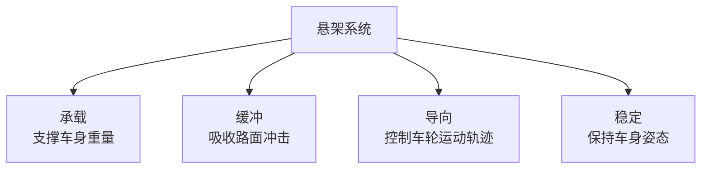

# 传动与悬架

### 16. 离合器原理

**场景化问题**：为什么手动挡换挡必须踩离合？不踩会怎样？

**结构图**：

```
踩下离合踏板 → 压盘松开 → 离合器片与飞轮分离 → 动力断开
松开离合踏板 → 压盘压紧 → 离合器片与飞轮接合 → 动力传递
```

**原理（说人话）**：离合器就像两片紧贴的砂纸——一片连着发动机（飞轮），一片连着变速箱（离合器片）。正常行驶时两片紧紧压在一起，发动机的动力通过摩擦传给车轮。踩下离合踏板，两片被拉开，动力断开，你可以安全换挡。慢慢松开离合，两片逐渐摩擦接触（半联动），车就能平顺起步。

- **离合器片（摩擦片）**：易损件，磨损后需更换（俗称「换离合三件套」）。
- **半联动**：离合器片与飞轮有相对滑动，用于平顺起步，也是驾校坡道起步的「秘籍」。

**油电对比 / 生活类比**：
- 油电对比：绝大多数电动车没有离合器（使用单速减速器），电机可以直接从 0 转速开始输出，不需要离合器来缓冲起步，所以电动车起步极其平顺。
- 生活类比：离合器 = 两个面对面旋转的砂轮——靠在一起就一起转（动力传递），拉开就各转各的（动力断开），半联动就是若即若离地摩擦。

**车企工作场景**：变速箱匹配工程师在做离合器滑摩点标定时，需要精确设定半联动结合点，保证起步平顺与离合器寿命之间的平衡。

**小测**：离合器「半联动」状态的主要作用是？
A. 增加发动机功率  B. 实现平顺起步  C. 提高燃油经济性  D. 降低噪音
**答案：B**

---

### 17. 传动轴与万向节

**场景化问题**：方向盘打满时车轮还能正常转，动力是怎么「拐弯」传过去的？

**结构图**：

**传动路径（前置前驱 FF）：**
```
变速箱 → 差速器（集成在变速箱内）→ 半轴 → 车轮
```

**传动路径（前置后驱 FR）：**
```
变速箱 → 传动轴 → 差速器 → 半轴 → 车轮
```

**原理（说人话）**：传动轴的任务是把变速箱出来的旋转力传到车轮。但车轮不仅要转，还要上下跳动（过坑洼）和左右转向，传动轴必须能「拐弯」——这就是万向节的用武之地。

常见万向节类型：
- **十字轴万向节**：结构简单、成本低，像两根交叉的轴通过十字架连接。缺点是不等速——主动轴匀速转，从动轴转速会忽快忽慢。
- **球笼式万向节（等速万向节）**：用于前驱车半轴，无论转向多大角度，输出转速始终保持恒定，保证车轮不打滑、不抖动。

**油电对比 / 生活类比**：
- 油电对比：电动车的传动路径更短（电机靠近车轮甚至放在轮边），传动轴大幅缩短或省略，能量损耗更小。但四驱电动车仍保留半轴和等速万向节。
- 生活类比：万向节 = 人体手腕——手臂和前臂不在一条直线上旋转时，手腕关节能让力「拐弯」传过去，球笼万向节就像能 360° 灵活转动的腕关节。

**车企工作场景**：底盘工程师在做半轴包络分析时，需要确保车轮在全行程跳动和最大转向角下，万向节不超出许用工作角度，否则会导致抖动甚至断裂。

**小测**：前驱车半轴通常使用哪种万向节来保证转向时等速输出？
A. 十字轴万向节  B. 球笼式万向节  C. 柔性万向节  D. 滑块式万向节
**答案：B**

---

### 18. 悬架系统

**场景化问题**：为什么有的车过减速带「嘭」一下很颠，有的车却像坐船一样晃过去？

**结构图**：

**悬架功能：**


**麦弗逊悬架（最常用前悬架形式）：**
```
        车身
         │
    ┌────┴────┐
    │  减震器  │ ← 兼做转向主销
    │    │    │
    └────┬────┘
         │  螺旋弹簧
    ┌────┴────┐
    │  转向节  │
    └────┬────┘
    ┌────┴────┐
    │ 下摆臂   │
    └────┬────┘
         │
    副车架/车身
```

**原理（说人话）**：悬架由三大件组成——弹簧负责「吃」冲击（你过坑时弹簧压缩吸收能量），减震器负责「拉」住弹簧不让它来回蹦（没有减震器的车会像皮球一样弹个不停），导向机构负责「管」住车轮的运动方向（让车轮在正确轨迹上跳动）。

| 类型 | 子类型 | 特点 | 应用 |
|------|--------|------|------|
| **非独立悬架** | 扭力梁 | 结构简单、成本低、空间好 | 经济型车后悬 |
| **独立悬架** | 麦弗逊 | 结构紧凑、成本适中 | 大多数前悬 |
| **独立悬架** | 双叉臂 | 操控性好、侧向支撑强 | 运动/豪华车前悬 |
| **独立悬架** | 多连杆 | 舒适与操控最佳 | 中高端车后悬 |
| **空气悬架** | — | 高度可调、舒适极佳 | 豪华车/SUV |

麦弗逊：结构紧凑、零件少、成本低；缺点是侧向支撑不如双叉臂，不适合高性能车。

**油电对比 / 生活类比**：
- 油电对比：电动车电池包重达 300-700 kg，悬架需要更硬的弹簧和阻尼来支撑，同时电动车对 NVH 要求更高（没有发动机噪音掩盖），空气悬架+CDC 可变阻尼在电车上更常见。
- 生活类比：悬架 = 好的运动鞋——鞋底气垫是弹簧（缓冲冲击），鞋面支撑是导向机构（控制脚不乱晃），鞋带是减震器（勒紧不让脚在鞋里来回窜）。

**车企工作场景**：底盘调校工程师在试车场进行主客观评价时，需要反复测试不同减震器阻尼阀片组合，平衡操控性与舒适性，一个车型的悬架调校通常耗时数月。

**小测**：以下哪种悬架类型以操控性和侧向支撑见长，常用于运动型轿车的前悬？
A. 麦弗逊  B. 扭力梁  C. 双叉臂  D. 空气悬架
**答案：C**

---

## 变速箱

见 [核心笔记：变速箱](/core-notes/transmission)

::: tip 配图提示
建议配图：离合器结构示意图（飞轮/离合器片/压盘）、麦弗逊悬架结构图、多连杆后悬架实拍图。
:::
