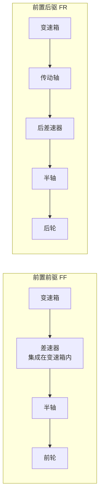
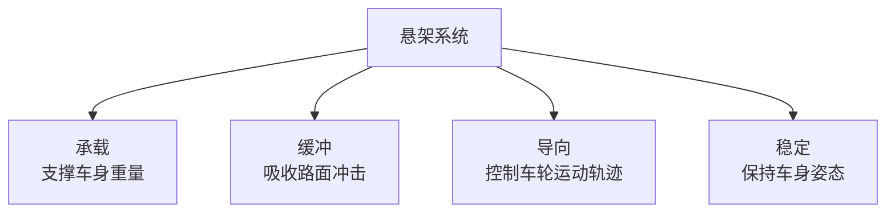
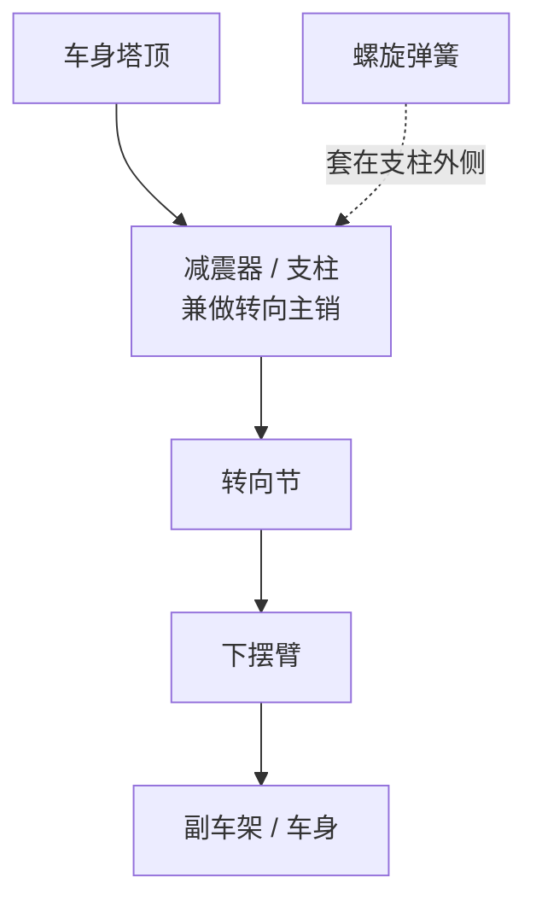

# 传动与悬架

### 16. 离合器原理

**场景化问题**：为什么手动挡换挡必须踩离合？不踩会怎样？

**结构图**：


**原理（说人话）**：离合器就像两片紧贴的砂纸——一片连着发动机（飞轮），一片连着变速箱（离合器片）。正常行驶时两片紧紧压在一起，发动机的动力通过摩擦传给车轮。踩下离合踏板，两片被拉开，动力断开，你可以安全换挡。慢慢松开离合，两片逐渐摩擦接触（半联动），车就能平顺起步。

- **离合器片（摩擦片）**：易损件，磨损后需更换（俗称「换离合三件套」）。
- **半联动**：离合器片与飞轮有相对滑动，用于平顺起步，也是驾校坡道起步的「秘籍」。

**油电对比 / 生活类比**：
- 油电对比：绝大多数电动车没有离合器（使用单速减速器），电机可以直接从 0 转速开始输出，不需要离合器来缓冲起步，所以电动车起步极其平顺。
- 生活类比：离合器 = 两个面对面旋转的砂轮——靠在一起就一起转（动力传递），拉开就各转各的（动力断开），半联动就是若即若离地摩擦。

**车企工作场景**：变速箱匹配工程师在做离合器滑摩点标定时，需要精确设定半联动结合点，保证起步平顺与离合器寿命之间的平衡。

**小测**：离合器「半联动」状态的主要作用是？
A. 增加发动机功率  B. 实现平顺起步  C. 提高燃油经济性  D. 降低噪音
**答案：B**

---

### 17. 传动轴与万向节

**场景化问题**：方向盘打满时车轮还能正常转，动力是怎么「拐弯」传过去的？

**结构图**：

**传动路径（前置前驱 FF）：**

**传动路径（前置后驱 FR）：**


**原理（说人话）**：传动轴的任务是把变速箱出来的旋转力传到车轮。但车轮不仅要转，还要上下跳动（过坑洼）和左右转向，传动轴必须能「拐弯」——这就是万向节的用武之地。

常见万向节类型：
- **十字轴万向节**：结构简单、成本低，像两根交叉的轴通过十字架连接。缺点是不等速——主动轴匀速转，从动轴转速会忽快忽慢。
- **球笼式万向节（等速万向节）**：用于前驱车半轴，无论转向多大角度，输出转速始终保持恒定，保证车轮不打滑、不抖动。

**油电对比 / 生活类比**：
- 油电对比：电动车的传动路径更短（电机靠近车轮甚至放在轮边），传动轴大幅缩短或省略，能量损耗更小。但四驱电动车仍保留半轴和等速万向节。
- 生活类比：万向节 = 人体手腕——手臂和前臂不在一条直线上旋转时，手腕关节能让力「拐弯」传过去，球笼万向节就像能 360° 灵活转动的腕关节。

**车企工作场景**：底盘工程师在做半轴包络分析时，需要确保车轮在全行程跳动和最大转向角下，万向节不超出许用工作角度，否则会导致抖动甚至断裂。

**小测**：前驱车半轴通常使用哪种万向节来保证转向时等速输出？
A. 十字轴万向节  B. 球笼式万向节  C. 柔性万向节  D. 滑块式万向节
**答案：B**

---

### 18. 悬架系统

**场景化问题**：为什么有的车过减速带「嘭」一下很颠，有的车却像坐船一样晃过去？

**结构图**：

**悬架功能：**


**麦弗逊悬架（最常用前悬架形式）：**


**原理（说人话）**：悬架由三大件组成——弹簧负责「吃」冲击（你过坑时弹簧压缩吸收能量），减震器负责「拉」住弹簧不让它来回蹦（没有减震器的车会像皮球一样弹个不停），导向机构负责「管」住车轮的运动方向（让车轮在正确轨迹上跳动）。

| 类型 | 子类型 | 特点 | 应用 |
|------|--------|------|------|
| **非独立悬架** | 扭力梁 | 结构简单、成本低、空间好 | 经济型车后悬 |
| **独立悬架** | 麦弗逊 | 结构紧凑、成本适中 | 大多数前悬 |
| **独立悬架** | 双叉臂 | 操控性好、侧向支撑强 | 运动/豪华车前悬 |
| **独立悬架** | 多连杆 | 舒适与操控最佳 | 中高端车后悬 |
| **空气悬架** | — | 高度可调、舒适极佳 | 豪华车/SUV |

麦弗逊：结构紧凑、零件少、成本低；缺点是侧向支撑不如双叉臂，不适合高性能车。

**油电对比 / 生活类比**：
- 油电对比：电动车电池包重达 300-700 kg，悬架需要更硬的弹簧和阻尼来支撑，同时电动车对 NVH 要求更高（没有发动机噪音掩盖），空气悬架+CDC 可变阻尼在电车上更常见。
- 生活类比：悬架 = 好的运动鞋——鞋底气垫是弹簧（缓冲冲击），鞋面支撑是导向机构（控制脚不乱晃），鞋带是减震器（勒紧不让脚在鞋里来回窜）。

**车企工作场景**：底盘调校工程师在试车场进行主客观评价时，需要反复测试不同减震器阻尼阀片组合，平衡操控性与舒适性，一个车型的悬架调校通常耗时数月。

**小测**：以下哪种悬架类型以操控性和侧向支撑见长，常用于运动型轿车的前悬？
A. 麦弗逊  B. 扭力梁  C. 双叉臂  D. 空气悬架
**答案：C**

---

### 19. 制动系统

**场景化问题：** 下雨天过弯时突然发现前方有障碍，为什么不能一脚把刹车踩死？驾校教练说的"点刹"到底是啥原理？

**结构图 —— 制动系统工作流程：**


**原理（说人话）：** 刹车不是"靠蛮力夹停"，而是把动能转化为热能。你踩下踏板 → 助力器放大你的力量 → 制动主缸把力量变成高压制动液 → 制动液通过管路传到四个车轮的卡钳 → 卡钳推动刹车片夹紧刹车盘 → 摩擦力让车轮减速。整个过程的能量转换：**动能 → 热能（刹车盘和刹车片发热）**。

**盘式刹车 vs 鼓式刹车：**

| 对比维度 | 盘式刹车（Disc） | 鼓式刹车（Drum） |
|----------|:--------------:|:------------:|
| 结构 | 刹车片夹住外露的刹车盘 | 刹车蹄片撑开内藏刹车鼓 |
| 散热 | ✅ 敞露设计，散热好 | ❌ 封闭结构，散热差 |
| 涉水恢复 | 快（水被离心力甩掉） | 慢（水困在鼓内） |
| 制动力 | 线性可控、抗热衰退 | 初始制动力大但容易衰退 |
| 成本 | 高 | 低 |
| 常见位置 | 前轮（大多数车）+ 后轮（中高端车） | 后轮（经济型车） |
| 典型应用 | 所有乘用车前轮 | 经济型车后轮、部分卡车 |

> **趋势：** 2025 年新车几乎全系前轮盘刹，后轮盘刹也越来越普及。鼓刹因成本优势仍在部分 A0 级小车后轮使用。

**ABS（防抱死制动系统）—— 核心安全技术：**

```mermaid
flowchart TD
    SENS["轮速传感器<br/>监测每个车轮转速"] --> ECU["ABS 控制单元<br/>检测到车轮即将抱死"]
    ECU --> VALVE["电磁阀<br/>快速调节制动液压"]
    VALVE --> RELEASE["瞬间释放压力 → 车轮恢复转动"]
    RELEASE --> REAPPLY["立即恢复压力 → 继续制动"]
    REAPPLY --> ECU
    ECU --> RESULT["每秒循环 10-30 次<br/>车轮始终在"滑与滚"的边界"]
```

**ABS 原理（说人话）：** 车轮一旦完全抱死不转（锁死），就像一块橡皮擦在地面上滑动——不仅制动距离变长，方向盘也完全失效（前轮锁死后无法转向）。ABS 通过快速"松-紧-松-紧"制动压力，让车轮始终保持**即将抱死但还能转**的状态，这样你既能最短距离刹停，又能打方向避让。**ABS 灯亮起时不是故障——是系统在工作。**

<TermCard term="制动热衰退" definition="刹车系统连续高强度使用后（如下长坡长时间踩刹车），刹车片和刹车盘温度飙升，摩擦系数急剧下降，制动力明显衰减的现象。盘刹散热好于鼓刹，所以热衰退更轻微。新能源车的再生制动可大幅减少摩擦制动的使用频率，缓解热衰退。" />

**再生制动（Regenerative Braking）—— 电动车独有：**

电动车松开加速踏板或轻踩刹车时，驱动电机**反向工作变成发电机**：车轮的惯性带动电机转子旋转 → 电机产生电能 → 电能存回电池。这一过程本身就对车辆产生阻力（制动效果），同时"免费回收"能量回充电池。特斯拉的"单踏板模式"就是利用强力再生制动，让你很少需要踩刹车踏板。

**油电对比：**

| 对比维度 | 传统燃油车 | 新能源电动车 |
|----------|:--------------:|:------------:|
| 制动助力源 | 发动机真空（真空助力器） | 电动助力泵（因无发动机真空） |
| 能量回收 | ❌ 刹车动能全变热量浪费 | ✅ 再生制动回收 20%-30% 动能 |
| 刹车磨损 | 较快（全靠摩擦制动） | 极慢（再生制动承担大部分减速） |
| 制动系统 | 传统真空助力 | iBooster/IPB 线控制动，踏板感可调 |
| 特殊功能 | — | 单踏板模式、CRBS 协调回收 |

> **iBooster（博世）/IPB（博世集成式制动）**：新能源车普遍采用的**线控制动（Brake-by-Wire）**方案。刹车踏板不再是液压直连——踏板信号传给 ECU，ECU 决定多少制动力来自再生制动（电机反拖），多少来自摩擦制动（卡钳夹紧）。这让踏板感觉可软件定义，也为未来的自动驾驶冗余制动提供了基础。

**车企工作场景：** 制动匹配工程师需要在 ABS 标定中反复测试不同路面（低附着力路、对开路、对接路），确保 ABS 介入时机合理、制动距离达标、方向盘可控。再生制动标定则涉及电机回馈扭矩与液压制动的协调控制（CRBS），标定不当会导致刹车踏板"忽轻忽重"的糟糕体验。

**小测：** ABS 在工作时，制动踏板感觉会有什么变化？为什么？
A. 踏板踩不动，说明 ABS 故障  B. 踏板频繁弹脚/震动，因为 ABS 在快速调节制动压力  C. 踏板完全松软，制动失效  D. 踏板没有任何感觉变化

**答案：B。** ABS 工作时电磁阀快速通断切换，制动液压的脉动通过制动液管路反馈到制动踏板，驾驶员会感到踏板"弹脚"（高频震动），这是 ABS 正在正常工作的标志，**此时应继续踩住踏板不要松开**。

---

### 20. 转向系统

**场景化问题：** 为什么停车入库时方向盘一个手指就能拨动，但高速上方向盘却变得沉重沉稳？难道是转向机"自己知道"该多重吗？

**结构图 —— 齿轮齿条式转向系统：**


**原理（说人话）—— EPS 电动助力转向：**

转向系统的核心是**齿轮齿条机构**：方向盘的旋转 → 转向柱传递 → 转向机里的小齿轮转动 → 带动齿条左右平移 → 横拉杆推拉转向节 → 车轮偏转。

但光靠人手去拧这么大的力显然不行——你需要助力。传统燃油车用**液压助力（HPS）**：发动机皮带驱动液压泵，液压油帮你推齿条。缺点是发动机一直带着泵转，费油，且助力大小是固定的。

**EPS（Electric Power Steering，电动助力转向）**：用电机代替液压泵，ECU 根据**车速**、**方向盘转角**、**扭矩**实时计算需要多少助力。低速时（如停车入库）电机全力助你，方向盘轻盈如羽毛；高速时（如高速巡航）电机几乎不出力，方向盘沉重稳定，防止你误操作。这就是"随速可变助力"的奥妙。

| 对比维度 | HPS 液压助力（老技术） | EPS 电动助力（主流） |
|----------|:--------------:|:------------:|
| 助力源 | 发动机驱动液压泵 | 电机 |
| 随速可变 | ❌ 固定助力比 | ✅ 低速轻、高速重 |
| 能耗 | 持续消耗发动机功率 | 仅转向时耗电，节能 3%-5% |
| 结构复杂度 | 液压泵+油管+油壶 | 电机+ECU，更紧凑 |
| 路感反馈 | 丰富的路面信息 | 可软件调校（优劣并存） |
| 支持高阶功能 | ❌ | ✅ 车道保持、自动泊车、线控转向 |

**齿轮齿条式 vs 循环球式：**

| 类型 | 结构 | 特点 | 典型应用 |
|------|------|------|----------|
| **齿轮齿条式** | 小齿轮+齿条直接啮合 | 结构简单、响应直接、路感清晰 | 几乎所有乘用车 |
| **循环球式** | 螺杆+循环钢球+摇臂 | 承载能力强、摩擦小但结构复杂 | 重型卡车、大型 SUV、越野车 |

**线控转向（Steer-by-Wire）—— 未来趋势：**

传统转向系统中，方向盘和车轮之间有**机械连接**（转向柱）。线控转向完全取消了这根铁杆——方向盘转角传感器采集你的意图 → ECU 计算 → 电机直接驱动车轮偏转。方向盘的手感由"力反馈电机"模拟生成，可随意编程（运动/舒适模式一键切换手感）。

**优势：** 可变转向比（停车时方向盘打 180° 车轮转 40°，高速时打 180° 只转 5°）、彻底消除路面冲击传到方向盘、为自动驾驶提供完全的转向冗余。**代表量产车型：雷克萨斯 RZ、特斯拉 Cybertruck（2024 款起）。**

**油电对比：**

| 对比维度 | 传统燃油车 | 新能源电动车 |
|----------|:--------------:|:------------:|
| 转向助力 | HPS 液压（老）/ EPS（新） | EPS 为标配 |
| 高级转向功能 | 受限于液压系统 | EPS 原生支持 LKA、自动泊车 |
| 线控转向 | 极少（12V 供电能力有限） | 高压平台供电充足，更适合线控 |
| 后轮转向 | 高端燃油车独享 | 越来越多中型电车搭载（如智己 L6） |

> **后轮转向（RWS，Rear-Wheel Steering）：** 低速时后轮与前轮**反向**偏转（减少转弯半径，像缩短了轴距），高速时后轮与前轮**同向**偏转（提高变道稳定性）。传统上是奔驰 S 级、宝马 7 系等百万豪车的配置，如今**智己 L6（20 万级）已标配后轮转向**，这得益于电动平台架构的灵活性。

**车企工作场景：** 转向调校工程师在 EPS 标定时需要映射不同车速下的助力曲线，同时兼顾"路感"——路感太强会让用户觉得颠手，路感太弱则"电子味浓"缺乏驾驶信心。这是一门在客观数据和主观评价之间反复权衡的手艺。

**小测：** 以下哪项不是 EPS（电动助力转向）相比 HPS（液压助力转向）的优势？
A. 随速可变助力  B. 更高的路感反馈丰富度  C. 更低能耗  D. 支持自动泊车等高级功能

**答案：B。** HPS（液压助力）因为机械直连，天然会传递丰富的路面信息到方向盘（路感丰富），而 EPS 的助力电机和减速机构会"过滤"掉部分路感。虽然现代 EPS 通过软件调校能模拟出路感，但"路感反馈丰富度"恰恰是传统 HPS 的优势项而非 EPS 的优势项。A/C/D 都是 EPS 的明显优势。

---

## 变速箱

见 [核心笔记：变速箱](/core-notes/transmission)

<figure class="knowledge-figure">
  
  <figcaption>图：离合器接合动力，麦弗逊支柱节省空间，多连杆用多根连杆精细控制车轮定位。本站自绘 SVG。</figcaption>
</figure>
