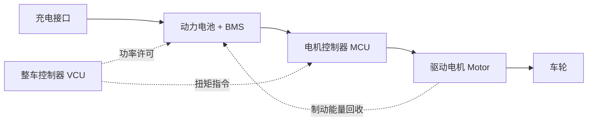
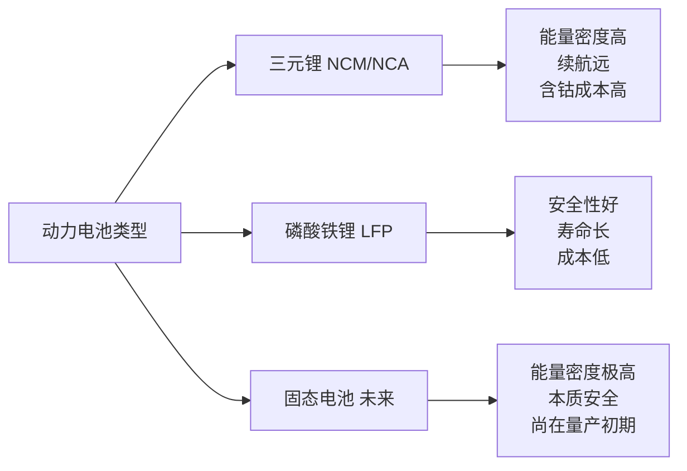
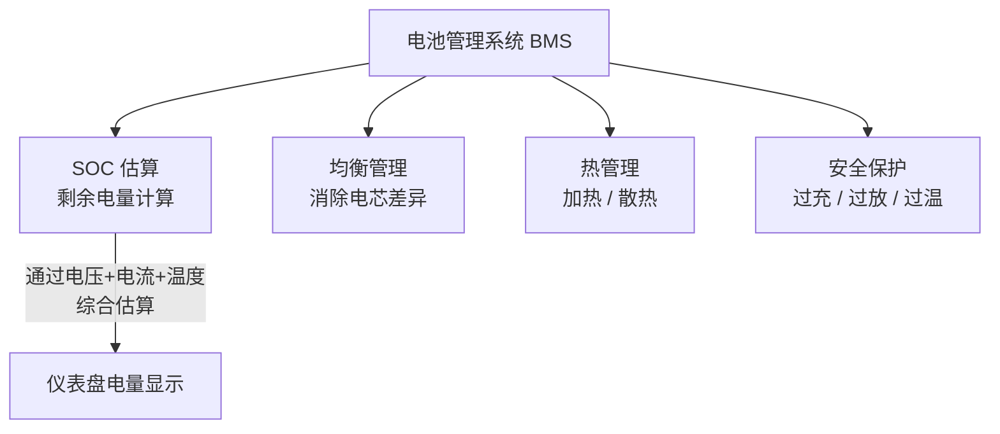
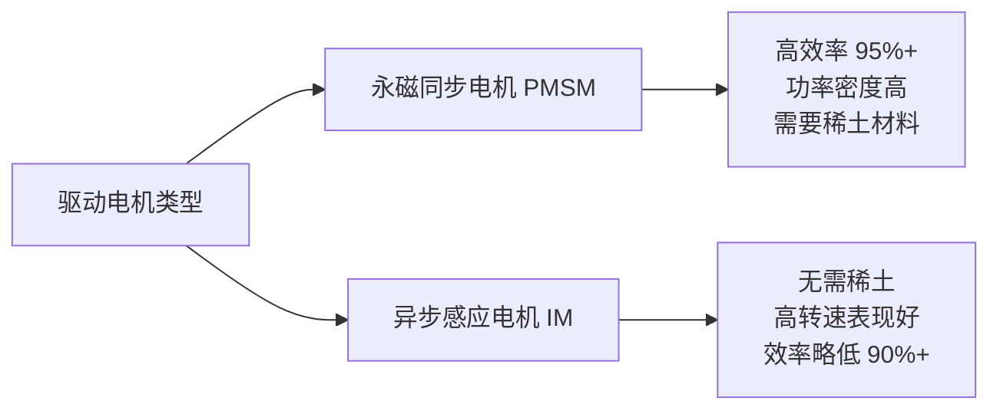
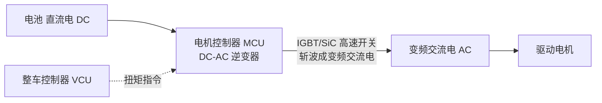

# 电池与电机

### 28. 纯电动汽车架构

**场景化问题**：为什么电动车没有变速箱，却能瞬间提速、跑起来还特别安静？

**结构图**：

**原理（说人话）**：纯电动车只有三样核心部件——电池（储能）、电机控制器（变频器）、电机（动力）。整车控制器 VCU 相当于"大脑"，根据你踩油门的深度，指挥电池释放多少电、控制器怎么调频、电机怎么转。没有发动机、离合器、多挡变速箱这一大串机械零件，动力响应极快、结构极简。

**油电对比/生活类比**：燃油车像手摇磨豆机——发动机→离合器→变速箱→传动轴，层层损耗，换挡还有顿挫。纯电车像电动磨豆机——开关一按直接转，中间零机械传递损耗。所以电动车一起步就能输出峰值扭矩，红绿灯起步秒杀燃油车。

**车企工作场景**：做 VCU 策略开发时，需定义三电系统之间的扭矩分配逻辑和 CAN 通讯协议，确保电池功率、电机输出、能量回收三者协调。

**小测**：纯电动汽车的"大脑"是哪个部件？
A. BMS（电池管理系统）
B. MCU（电机控制器）
C. VCU（整车控制器）
D. ECU（发动机控制器）

> **答案：C**。VCU（Vehicle Control Unit）是全车最高决策者，协调三电系统。BMS 只管电池，MCU 只管电机，ECU 是燃油车才有的发动机控制器。

### 29. 动力电池类型

**场景化问题**：买车时销售说"三元锂续航长，磷酸铁锂安全"，到底怎么选？

**结构图**：

**原理（说人话）**：电池的本质是"充电宝"——靠锂离子在正负极之间来回搬家来充放电。三元锂正极含镍钴锰，能量密度高但热稳定性差，碰撞后易着火。磷酸铁锂正极是磷酸铁，结构更稳，针刺都不起火，但能量密度偏低，冬天续航缩水多。固态电池把电解液换成固体，能量密度翻倍还不易燃，但目前成本极高、量产困难。

**油电对比/生活类比**：三元锂像高性能跑车胎——性能拉满但娇气怕磕；磷酸铁锂像全地形 AT 胎——皮实耐用但滚阻大。买三元锂等于"多跑 50 公里但小心别磕底盘"，买磷酸铁锂等于"少跑 50 公里但随便造"。

| 特性 | 三元锂 NCM/NCA | 磷酸铁锂 LFP | 固态电池（未来） |
|------|---------------|-------------|----------------|
| 能量密度 | 高（200-260 Wh/kg） | 中（140-180 Wh/kg） | 极高（400+ Wh/kg） |
| 安全性 | 热失控温度低 | 热失控温度高，更安全 | 本质安全 |
| 循环寿命 | 800-1500 次 | 2000-4000 次 | 长 |
| 成本 | 较高（含钴/镍） | 低（无贵金属） | 目前极高 |
| 低温性能 | 较好 | 较差 | 待验证 |

**车企工作场景**：电池选型工程师需根据车型定位（长续航/性价比/高性能）匹配电池类型，并验证电池包的热失控防护方案通过国标 GB 38031 安全测试。

**小测**：关于磷酸铁锂电池，以下哪项说法正确？
A. 能量密度比三元锂高
B. 针刺实验容易起火
C. 循环寿命比三元锂更长
D. 低温性能比三元锂好

> **答案：C**。磷酸铁锂电池的循环寿命可达 2000-4000 次，远高于三元锂的 800-1500 次。其优点是安全性高、寿命长、成本低，缺点是能量密度偏低、低温性能较差。

### 30. 电池管理系统 BMS

**场景化问题**：为什么手机电量显示到 1% 还能扛一会儿，电动车电量显示却很精准？

**结构图**：

**原理（说人话）**：BMS 是电池包的"保姆管家"。几百颗电芯串并联在一起，就像几百个性格不同的小孩——有的充电快、有的放电快、有的怕冷、有的怕热。BMS 的工作是实时监控每颗电芯的电压和温度，确保步调一致：谁充太满就偷偷放电（均衡），谁太热就开风扇降温（热管理），任何一颗出异常立刻断电保护。

**油电对比/生活类比**：燃油车油量表就是浮子在油箱里漂，简单粗暴。BMS 则像请了个专职会计师——不仅告诉你还剩多少钱（SOC），还监控每笔收支（充放电电流）、防止透支（过放）和超额存款（过充），顺便调节室温（热管理）。

**车企工作场景**：BMS 软件工程师需设计 SOC 估算算法（常用卡尔曼滤波 + 安时积分），在台架上跑 WLTC 循环验证精度，确保 SOC 误差小于 3%。

**小测**：BMS 的均衡管理是在做什么？
A. 让电池和电机重量相等
B. 消除各电芯间的电压 / 容量差异
C. 平衡前后轴的驱动扭矩
D. 调节车内空调温度

> **答案：B**。均衡管理用于消除串联电芯间的电压 / 容量不一致，防止"木桶效应"——最差的那颗电芯决定了整个电池包的可用容量。

### 31. 驱动电机类型

**场景化问题**：有些电动车起步特别猛但高速乏力，有些却是后劲十足——差在哪？

**结构图**：

**原理（说人话）**：永磁同步电机的转子自带"永久磁铁"（稀土造），通电后定子的旋转磁场直接拽着转子跑，效率高、起步猛，绝大多数国产纯电车都用它。异步感应电机转子没有永磁体，靠电磁感应产生磁场——起步没有永磁那么猛，但高转速时表现好，而且不需要昂贵的稀土。特斯拉部分车型**前异步后永磁**搭配：后轴永磁电机提供起步爆发力，前轴异步电机在高速巡航时参与驱动，兼顾效率和成本。

**油电对比/生活类比**：永磁同步电机像百米短跑运动员——起跑爆发力惊人，从静止就能输出峰值扭矩，但跑马拉松不是强项。异步感应电机像长跑运动员——起跑不抢眼，但持续高速稳定。双电机搭配就像让博尔特跑前半程、基普乔格跑后半程。

| 类型 | 特点 | 应用 |
|------|------|------|
| **永磁同步电机（PMSM）** | 高效率、高功率密度、需稀土 | 大多数国产电动车 |
| **异步感应电机（IM）** | 无需稀土、高转速好、效率稍低 | 特斯拉前电机（部分车型） |

**车企工作场景**：电机匹配工程师根据整车性能目标（百公里加速 / 最高车速 / 能耗），在永磁同步和异步感应之间选型或组合，并用 AVL Cruise 等软件仿真 NEDC/WLTC 工况效率。

**小测**：永磁同步电机的最大优势是什么？
A. 不需要稀土材料
B. 高转速时效率最高
C. 从零转速即可输出峰值扭矩
D. 成本比异步电机低

> **答案：C**。永磁同步电机最大特点是 0 转速就能输出峰值扭矩，所以电动车起步极快。但它需要稀土材料，成本不低；异步感应电机才是不需稀土、高转速表现更好的那一类。

### 32. 电机控制器 MCU

**场景化问题**：电池输出的是直流电，电机需要的却是交流电——中间怎么"翻译"？

**结构图**：

**原理（说人话）**：电池输出的是恒定的直流电（DC），但驱动电机需要频率和电压都可变的交流电（AC）。MCU 就像一个"电力翻译官"，通过 IGBT（或新一代 SiC 碳化硅）开关器件，每秒上万次地快速开断，把直流电切成不同宽度的方波，模拟出交流电输出。你踩油门深，MCU 就提高输出频率和电压，电机转得更快更有力；松油门，MCU 反向操作，让电机变成发电机回收能量。

**油电对比/生活类比**：燃油车靠节气门控制进气量来调节发动机输出，响应有延迟。MCU 像音响的功放——旋钮一拧声音立刻变大，几乎零延迟。IGBT 就是传统功放，SiC 碳化硅是新一代高效数字功放，更省电、发热更少。

**车企工作场景**：MCU 硬件工程师选型 IGBT/SiC 功率模块、设计散热方案，并配合软件工程师做台架标定，确保控制器在全转速区间的扭矩精度和响应速度满足整车要求。

**小测**：电机控制器 MCU 的核心功能是什么？
A. 将交流电整流为直流电
B. 估算电池 SOC
C. 将直流电逆变为可变频率的交流电
D. 管理整车热平衡

> **答案：C**。MCU 的核心功能是 DC-AC 逆变，把电池的直流电变成频率和电压可调的交流电来驱动电机。A 是 OBC（车载充电机）做的事，B 归 BMS 管，D 是热管理系统的职责。

::: tip 配图提示
建议配图：三电系统架构图、磷酸铁锂vs三元锂结构对比、电池包CTP结构图（电芯→模组→Pack）、永磁同步电机剖面图。
:::
