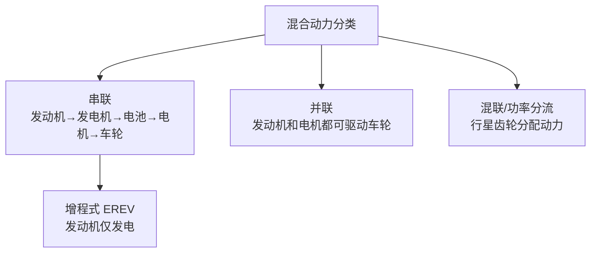
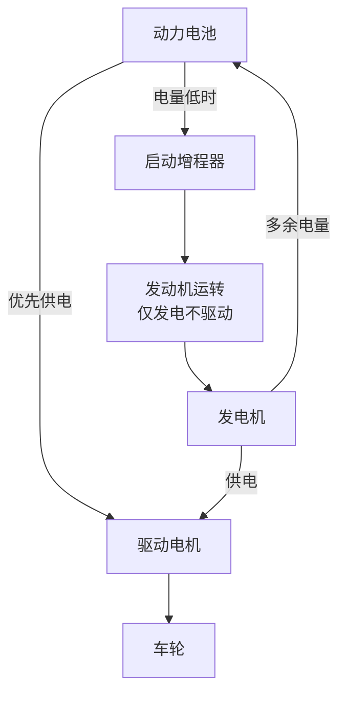
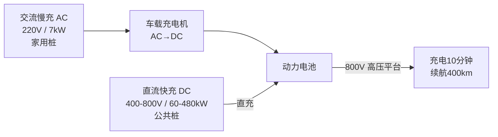

# 混合动力与增程

### 33. 混合动力分类

**场景化问题**：满大街的混动车都上绿牌，有的不用充电、有的必须充电——到底分几类？

**结构图**：

**原理（说人话）**：混动车有三大流派。串联（增程）最简单——发动机只管发电，不参与驱动，像带了个汽油发电机跑。并联是发动机和电机都能直接驱动车轮，动力可叠加；纯并联结构在当下已相对少见，但并联思想（P2 单电机并联）在插混/轻混中仍很常见。混联（功率分流）是丰田的看家本领——通过一组行星齿轮，让发动机一部分力驱动车轮、一部分力发电，全速域都高效。

**油电对比/生活类比**：串联增程像轮船——柴油机只发电，电动机推进。并联像两人抬轿——发动机和电机一起使劲。混联像电脑的任务管理器——CPU（发动机）被精准调度，一部分处理前台任务（驱动），一部分处理后台（发电存起来）。

**各方案对比**：

| 方案 | 代表 | 优点 | 缺点 |
|------|------|------|------|
| 串联（增程） | 理想 ONE/L 系列 | 结构简单、发动机始终高效运行 | 高速油耗较高 |
| 并联 | 早期方案 | 两套动力叠加 | 控制复杂，纯并联已相对少见 |
| 混联（功率分流） | 丰田 THS | 全工况高效 | 机制复杂 |

**按电动化程度**：

| 类型 | 电池容量 | 纯电续航 | 充电方式 | 代表 |
|------|----------|----------|----------|------|
| 轻混（MHEV） | 极小（48V） | 不能纯电行驶 | 能量回收 | 多数新车标配 |
| 全混（HEV） | 1-2 kWh | 几公里 | 能量回收 | 丰田 THS、本田 i-MMD |
| 插混（PHEV） | 10-40 kWh | 50-200 km | 可外部充电 | 比亚迪 DM-i |

**车企工作场景**：混动系统架构师用 Simulink 搭建不同拓扑结构的仿真模型，比对各工况油耗和排放，决定采用串联、并联还是功率分流方案。

**小测**：以下哪种混动方案中，发动机不直接驱动车轮？
A. 并联式
B. 混联式（功率分流）
C. 串联式（增程式）
D. P2 单电机并联

> **答案：C**。串联式（增程式）混动中发动机仅作为发电机使用，动力完全由电动机提供。并联和混联方案中发动机都可参与直接驱动。

### 34. 增程式电动车

**场景化问题**：增程车背着个发动机，为啥还敢叫电动车？

**结构图**：

**原理（说人话）**：增程式电动车本质上就是一台纯电动车——始终由电机驱动，发动机只是一个"随车充电宝"。平时市内通勤纯电行驶零油耗；跑长途电量不足时发动机启动，但它不连接车轮，只顾发电。发动机在 2000-3000 转的最佳区间稳定运行，所以即使烧油也比同尺寸燃油车省油——燃油车走走停停转速忽高忽低，大量能量被浪费。

**油电对比/生活类比**：增程式像露营时带了个汽油发电机——电器（电机）始终用发电机的电，发电机不直接驱动你任何设备。传统燃油车则是"发动机直接拖着你走"，堵车怠速时发动机空转烧油什么都没干。增程就是让汽油机只干它最擅长的事：在恒定高效转速下发电。

**车企工作场景**：增程器匹配工程师需选择合适排量的发动机（如 1.5T 四缸），标定其高效工作区间，并与发电机进行扭矩-转速匹配，确保增程模式下 NVH（噪声振动）可控。

**小测**：增程式电动车的发动机在哪个场景下工作？
A. 起步时辅助驱动，减轻电机负担
B. 高速巡航时直接驱动车轮
C. 电池电量低时启动，仅用于发电
D. 全程持续运转，和电机同时驱动

> **答案：C**。增程式电动车发动机仅在电池电量不足时启动发电，且不直接驱动车轮（无机械连接），始终由电机驱动车辆。日常短途可完全纯电行驶。

### 35. 充电技术

**场景化问题**：快充桩写着 120kW，我的车充电功率却只有 60kW——谁在说谎？

**结构图**：

**原理（说人话）**：充电分两种。慢充（交流桩）只给你提供一个 220V 插座，车内自带充电机（OBC）把交流变直流，功率被 OBC 限制在通常 7kW，充满要 6-12 小时——适合晚上睡觉时充。快充（直流桩）是外部充电桩直接往电池灌直流电，功率可达几十甚至几百千瓦。但实际充电速度由车和桩"协商"决定——桩的 120kW 只是上限能力，你的车 BMS 会根据电池温度、SOC 状态决定实际接收量。电池在 20%-80% 区间接收最快，太满或太冷都会降速。

**油电对比/生活类比**：慢充像用吸管喝奶茶——细水长流，一晚上管饱。快充像消防水管注水——猛烈但得悠着来，注太满会溢（过充保护）。800V 高压平台就是把水管加粗、水压提高，注水速度直接翻倍。

| 充电方式 | 功率 | 充满时间 | 适用场景 |
|----------|------|----------|----------|
| 交流慢充 | 3.3-7kW | 6-12 小时 | 家充 / 夜间 |
| 直流快充 | 60-480kW | 20-60 分钟 | 高速服务区 |
| 换电 | - | 3-5 分钟 | 蔚来换电站 |
| 无线充电 | 7-11kW | 同慢充 | 尚未普及 |

**车企工作场景**：充电系统工程师需要标定电池在不同温度、不同 SOC 下的充电功率 MAP 图（充电 Map），确保充电速度和安全性的最佳平衡，并验证 800V 高压平台的电气安全。

**小测**：直流快充和交流慢充的本质区别是什么？
A. 直流快充用的电压更高
B. 慢充需经过车载充电机（OBC）整流，快充直接对电池充电
C. 快充只能在高速服务区使用
D. 慢充充满后电池更耐用

> **答案：B**。交流慢充需要通过车载充电机（OBC）将交流电转为直流电再充入电池，OBC 功率有限（3-7kW）。直流快充由外部充电桩完成 AC-DC 转换后直接对电池充电，功率可达数百 kW。

### 36. 能量回收系统

**场景化问题**：电动车为什么越堵越省电？松油门溜车时续航里程反而涨了？

**结构图**：

**原理（说人话）**：制动能量回收利用了电机的天性——电机通电就转（电动机），反过来转它就能发电（发电机）。当你松开油门或轻踩刹车时，车辆惯性反过来带动电机旋转，电机变成"发电机"，把车子的动能转化成电能充回电池。这就像推一辆带发电机的自行车——推车时发的电存进电池，下次起步就能用。单踏板模式把体验做到极致：松开加速踏板就等于中度刹车，日常工况基本不用踩刹车踏板。

**油电对比/生活类比**：燃油车刹车时动能被刹车片摩擦变成热量白白散掉——每次刹车都是"烧钱"。电动车刹车就像把空瓶丢进回收机——刹车动作不仅减速，还能退你点"押金"（回收电量）。类比生活：燃油车刹车是直接扔掉矿泉水瓶，电动车刹车是塞进回收机换押金。

**车企工作场景**：底盘控制工程师需标定制动力分配策略（电机制动回收 vs 液压制动），在保证制动安全的前提下最大化能量回收效率，同时避免回收过强导致车轮抱死。

**小测**：关于制动能量回收，以下哪项正确？
A. 能量回收效率和车速无关
B. 回收的能量通常占总消耗的 15-30%
C. 回收时电池会向电机供电
D. 机械刹车比电机制动回收效率更高

> **答案：B**。实际驾驶中制动能量回收通常能回收总消耗能量的 15-30%。城市工况回收效果最好（频繁启停），高速工况回收较少。回收时电机向电池充电，不是电池向电机供电。

<iframe src="../powertrain-compare.html" width="100%" height="820" style="border:1px solid #30363d;border-radius:8px;margin:16px 0;" title="动力链交互对比图"></iframe>

> 使用上方交互图切换模式直观对比四种技术路径的能量流差异。也可[独立打开](../powertrain-compare.html)。

::: tip 配图提示
建议配图：三种混动结构（串联/并联/混联）示意图、增程式工作模式切换图、快充充电曲线（SOC-时间）。
:::
