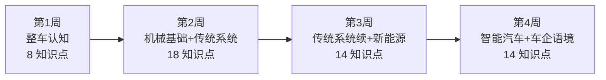

# 🗺️ 30 天学习地图

> **面向非汽车专业应届生**：用一辆车贯穿全站，按入职前 30 天可跟随的节奏，把六层 54 个知识点编成每日学习任务。
> 每天约 1–2 小时，周末可集中补齐。学完后你能在车企会议上听懂九成技术讨论。

::: tip 📊 我的学习进度

整体进度：<ProgressBadge :path="['/guide/', '/guide/classification', '/guide/body-chassis', '/mechanics/', '/mechanics/engine', '/mechanics/transmission-suspension', '/traditional/', '/traditional/fuel-system', '/traditional/braking-steering', '/new-energy/', '/new-energy/battery-motor', '/new-energy/hybrid-range-extender', '/smart-car/', '/smart-car/adas', '/smart-car/v2x-ota', '/industry/', '/industry/terminology', '/industry/roles']" mode="bar" />

每页底部有「标记完成」按钮，勾选后进度会自动保存到浏览器。
:::

## 总体路线

| 阶段 | 天数 | 覆盖层 | 目标 |
|------|------|--------|------|
| 🚗 第 1 周 | Day 1–7 | 第1层 整车认知（8 知识点） | 看懂一辆车由哪些系统组成，能把问题归到正确系统 |
| ⚙️ 第 2 周 | Day 8–14 | 第2层 机械基础（8）+ 第3层 传统系统（10） | 看懂动力怎么传、底盘怎么稳、制动怎么停 |
| ⚡ 第 3 周 | Day 15–21 | 第3层 传统系统续（5）+ 第4层 新能源（9） | 看懂高压能量流和三电系统，理解电动化核心 |
| 🧠 第 4 周 | Day 22–30 | 第5层 智能汽车（10）+ 第6层 车企语境（9） | 看懂软件定义汽车，听懂车企会议里的工程语言 |

---

## 🚗 第 1 周：建立整车全局图

> **目标**：不用背零件名，先知道一辆车由车身、底盘、动力总成、电气电子四大系统协同工作。

### Day 1 · 从历史到分类

| 知识点 | 说明 | 入口 |
|--------|------|------|
| 汽车发展简史 | 1886→福特流水线→丰田精益→电动化浪潮，建立行业时间感 | [汽车分类与结构](./guide/classification) |
| 汽车定义与分类 | 乘用车/商用车；轿车/SUV/MPV；A/B/C/D 级车划分 | [汽车分类与结构·分类体系](./guide/classification#分类体系) |

> **今日小测**：SUV 是按什么维度做的分类？「纯电 SUV」包含了几个分类维度？

### Day 2 · 四大系统

| 知识点 | 说明 | 入口 |
|--------|------|------|
| 整车基本结构 | 车身 + 底盘 + 动力总成 + 电气电子，各自职责与边界 | [汽车分类与结构·整车结构](./guide/classification#整车结构组成) |

> **今日小测**：「低速过坎异响」优先看底盘和车身连接，为什么？

### Day 3 · 尺寸与驱动

| 知识点 | 说明 | 入口 |
|--------|------|------|
| 车辆坐标系与基本尺寸 | 轴距、轮距、长宽高、接近角/离去角、离地间隙 | [车身与底盘](./guide/body-chassis) |
| 驱动形式 | FWD/RWD/AWD/4WD 各形式的优缺点与典型车型 | [汽车分类与结构·动力类型](./guide/classification#按动力类型分类) |

> **今日小测**：轴距对后排空间和操控稳定性分别有什么影响？

### Day 4 · VIN 码与身份证

| 知识点 | 说明 | 入口 |
|--------|------|------|
| VIN 码与车辆身份证 | 17 位 VIN 结构：WMI + VDS + VIS 三段 | [汽车分类与结构·VIN](./guide/classification#车辆识别代号-vin) |

> **今日小测**：一台车更换车牌后，VIN 会随之改变吗？为什么？

### Day 5 · 车身类型与平台

| 知识点 | 说明 | 入口 |
|--------|------|------|
| 车身类型与平台 | 三厢/两厢/掀背/旅行/跑车；MQB/TNGA/CMA 平台化概念 | [汽车分类与结构·车身形式](./guide/classification#按车身形式分类乘用车) |

> **今日小测**：平台化到底「复用」了什么？为什么车企要推平台战略？

### Day 6 · 术语扫盲

| 知识点 | 说明 | 入口 |
|--------|------|------|
| 常用术语扫盲 | 马力/扭矩、排量、燃油标号、整备质量/满载质量、NEDC/WLTC/CLTC | [核心笔记·扭矩与马力](./core-notes/torque-vs-hp) |

> **今日小测**：一辆车「最大扭矩 250N·m @ 1750rpm」——这个 1750rpm 意味着什么？

### Day 7 · 第一周总复习

- 用一张参数表（可在汽车之家选任一车型）实战阅读所有本周学过的术语
- 复习四大系统归类法：看到一个问题 → 判断归属 → 找到负责团队
- 完成本周所有小测

---

## ⚙️ 第 2 周：看懂动力与底盘

> **目标**：理解力从发动机传到车轮的全链路，看懂悬架、转向、制动的协同。

### Day 8 · 力与摩擦

| 知识点 | 说明 | 入口 |
|--------|------|------|
| 力与运动 | 牛顿三定律在汽车中的体现：加速/制动/转向受力 | [核心笔记·扭矩与马力](./core-notes/torque-vs-hp) |
| 摩擦与润滑 | 滑动/滚动摩擦、油膜形成 → 轮胎抓地、发动机润滑 | [发动机原理](./mechanics/engine) |

> **今日小测**：为什么轮胎要有花纹？花纹磨平后为什么危险？

### Day 9 · 传动基础

| 知识点 | 说明 | 入口 |
|--------|------|------|
| 传动基础 | 扭矩/转速/功率关系（P=τ·ω）、齿轮传动比、减速增扭 | [核心笔记·变速箱](./core-notes/transmission) |

> **今日小测**：为什么爬坡需要低挡位？低挡位如何「放大」扭矩？

### Day 10 · 材料与结构

| 知识点 | 说明 | 入口 |
|--------|------|------|
| 材料力学入门 | 应力-应变、屈服/抗拉强度、疲劳寿命 → 碰撞安全 | [发动机原理](./mechanics/engine) |
| 工程材料概述 | 高强钢/热成型钢/铝合金/碳纤维/工程塑料在车身的分布 | [车身与底盘](./guide/body-chassis) |

> **今日小测**：白车身为什么不全用铝合金？高强钢在哪些部位不可替代？

### Day 11 · 热力学与气动

| 知识点 | 说明 | 入口 |
|--------|------|------|
| 热力学基础 | 热功转换、卡诺循环、热效率 → 奥托/阿特金森循环 | [发动机原理](./mechanics/engine) |
| 流体力学初步 | F=½ρCdAv²、风阻系数 Cd → 为什么跑车要低趴 | [传动与悬架](./mechanics/transmission-suspension) |

> **今日小测**：车速翻倍，空气阻力变为原来的几倍？

### Day 12 · NVH + 发动机原理

| 知识点 | 说明 | 入口 |
|--------|------|------|
| 振动与噪声入门 | 频率/振幅/共振、NVH 基本概念 | [传动与悬架](./mechanics/transmission-suspension) |
| 发动机工作原理 | 四冲程、直列/V型/水平对置、自吸/涡轮/机械增压 | [发动机原理](./mechanics/engine) |

> **今日小测**：涡轮增压的「涡轮」靠什么驱动？涡轮迟滞是怎么回事？

### Day 13 · 发动机参数 + 变速箱

| 知识点 | 说明 | 入口 |
|--------|------|------|
| 发动机关键参数 | 排量/压缩比/最大功率与扭矩曲线/升功率/热效率 | [发动机原理](./mechanics/engine) |
| 变速箱 | MT/AT/CVT/DCT 四种结构对比与优缺点 | [核心笔记·变速箱](./core-notes/transmission) |

> **今日小测**：CVT 为什么没有「换挡顿挫」？DCT 为什么换挡快？

### Day 14 · 底盘入门

| 知识点 | 说明 | 入口 |
|--------|------|------|
| 底盘系统总览 | 传动+行驶+转向+制动 四大子系统切分 | [传动与悬架](./mechanics/transmission-suspension) |
| 悬架系统 | 麦弗逊/多连杆/双叉臂 vs 扭力梁；弹簧+减振器 | [传动与悬架](./mechanics/transmission-suspension) |

> **今日小测**：麦弗逊悬架和双叉臂悬架，分别适合什么定位的车？

---

## ⚡ 第 3 周：从传统到电动

> **目标**：对比理解传统系统与电动化替代，看懂三电系统（电池、电机、电控）和混动架构。

### Day 15 · 转向与制动

| 知识点 | 说明 | 入口 |
|--------|------|------|
| 转向系统 | 齿轮齿条、HPS/EPS 助力转向、转弯半径 | [制动与转向](./traditional/braking-steering) |
| 制动系统 | 盘式/鼓式、ABS、ESC → 为线控制动铺垫 | [制动与转向](./traditional/braking-steering) |

> **今日小测**：ABS「防抱死」为什么能缩短制动距离？ESC 和 ABS 有什么区别？

### Day 16 · 电气与排放

| 知识点 | 说明 | 入口 |
|--------|------|------|
| 汽车电气系统 | 12V 电路、CAN 总线基础 → 为域控制器铺垫 | [制动与转向](./traditional/braking-steering) |
| 排放与后处理 | 三元催化器、GPF、国六b → 排气管里的「口罩」 | [燃油动力系统](./traditional/fuel-system) |

> **今日小测**：CAN 总线为什么比传统点对点布线更优？（提示：考虑 ECU 数量和线束重量）

### Day 17 · 热管理（承上启下）

| 知识点 | 说明 | 入口 |
|--------|------|------|
| 空调与热管理 | 制冷四部件循环、热泵制热 → 为电池热管理铺垫 | [燃油动力系统](./traditional/fuel-system) |

> **今日小测**：为什么电动车冬天续航缩水比油车更明显？

### Day 18 · 电池基础

| 知识点 | 说明 | 入口 |
|--------|------|------|
| 动力电池基础 | 电芯/模组/PACK 三级；Li⁺ 工作原理；三元锂 vs 磷酸铁锂 | [电池与电机](./new-energy/battery-motor) |
| 电池关键指标 | 容量(Ah)/能量(kWh)/能量密度/SOC/SOH/循环寿命/C 倍率 | [电池与电机](./new-energy/battery-motor) |

> **今日小测**：三元锂和磷酸铁锂各有什么优势和短板？分别适合什么场景？

### Day 19 · 驱动电机

| 知识点 | 说明 | 入口 |
|--------|------|------|
| 驱动电机 | PMSM vs 感应电机；电机特性曲线（恒扭矩区/恒功率区）；扁线/油冷 | [电池与电机](./new-energy/battery-motor) |

> **今日小测**：电机在低速时就能输出最大扭矩——这对起步加速意味着什么？

### Day 20 · 电控系统

| 知识点 | 说明 | 入口 |
|--------|------|------|
| 电控系统 | MCU（逆变/整流）、VCU（扭矩分配）、BMS（SOC/均衡/热管理） | [电池与电机](./new-energy/battery-motor) |

> **今日小测**：BMS 为什么要做「电芯均衡」？不均衡会带来什么风险？

### Day 21 · 混动架构

| 知识点 | 说明 | 入口 |
|--------|------|------|
| 混动架构 | 串联(增程)/并联/混联；P0–P4 电机位置；DM-i/理想增程/THS 案例 | [混合动力与增程](./new-energy/hybrid-range-extender) |

> **今日小测**：增程式混动和插电混动（PHEV）的核心区别是什么？

---

## 🧠 第 4 周：智能汽车 + 车企工作语境

> **目标**：理解软件定义汽车的技术栈，并进入车企的工程语言和工作流程。

### Day 22 · 充电与热管理

| 知识点 | 说明 | 入口 |
|--------|------|------|
| 充电系统 | AC 慢充 vs DC 快充；国标 GB/T / CCS / NACS；充电曲线 | [混合动力与增程](./new-energy/hybrid-range-extender) |
| 电池热管理 | 风冷/液冷/直冷；低温影响；热泵节能 | [混合动力与增程](./new-energy/hybrid-range-extender) |

> **今日小测**：从 30% 充到 80% 为什么比从 80% 充到 100% 快得多？

### Day 23 · 高压架构 + 燃料电池

| 知识点 | 说明 | 入口 |
|--------|------|------|
| 高压电气架构 | 400V→800V 平台演进；SiC 碳化硅优势 | [混合动力与增程](./new-energy/hybrid-range-extender) |
| 燃料电池 FCEV | PEM 工作原理、储氢、加氢站现状与挑战 | [新能源总览](./new-energy/) |

> **今日小测**：800V 平台为什么能实现「充电 5 分钟续航 200 公里」？

### Day 24 · 电子电气架构

| 知识点 | 说明 | 入口 |
|--------|------|------|
| 电子电气架构演进 | 分布式 ECU → 域集中 → 中央计算+区域控制 | [ADAS 与自动驾驶](./smart-car/adas) |
| 域控制器 | 座舱域 vs 智驾域；高算力 SoC（8295/Orin/征程）；行泊一体 | [ADAS 与自动驾驶](./smart-car/adas) |

> **今日小测**：「减少 ECU 数量」为什么是行业趋势？域集中架构解决了哪些问题？

### Day 25 · 智能座舱 + 辅助驾驶

| 知识点 | 说明 | 入口 |
|--------|------|------|
| 智能座舱 | 车机 OS、多屏交互、HUD、语音助手、OTA | [V2X 与 OTA](./smart-car/v2x-ota) |
| 辅助驾驶分级 | L0–L5（SAE J3016）；AEB/ACC/LKA → NOA（高速/城市领航） | [ADAS 与自动驾驶](./smart-car/adas) |

> **今日小测**：L2 和 L3 的本质分界线是什么？为什么很多车企「跳过 L3」？

### Day 26 · 感知系统

| 知识点 | 说明 | 入口 |
|--------|------|------|
| 感知系统 | 摄像头/毫米波雷达/超声波雷达/激光雷达 — 原理与优劣势 | [ADAS 与自动驾驶](./smart-car/adas) |
| 高精定位与地图 | GNSS/RTK/IMU 组合定位；高精地图 vs SD Map；BEV 感知；无图化 | [V2X 与 OTA](./smart-car/v2x-ota) |

> **今日小测**：为什么说「纯视觉方案」和「激光雷达方案」之争本质是成本 vs 冗余的权衡？

### Day 27 · 决策与控制 + SDV + 安全 + V2X

| 知识点 | 说明 | 入口 |
|--------|------|------|
| 决策规划与控制 | 感知→预测→规划→控制 流水线；端到端 vs 模块化；影子模式 | [ADAS 与自动驾驶](./smart-car/adas) |
| 软件定义汽车 SDV | SOA 架构、车载以太网、SOME/IP；特斯拉/蔚小理 OTA 案例 | [V2X 与 OTA](./smart-car/v2x-ota) |
| 安全与功能安全 | ISO 26262（ASIL）、ISO 21434 网络安全、SOTIF | [ADAS 与自动驾驶](./smart-car/adas) |
| V2X 车联网 | V2V/V2I/V2P/V2N；C-V2X vs DSRC；车路云一体化 | [V2X 与 OTA](./smart-car/v2x-ota) |

> **今日小测**：「影子模式」是什么？它为什么不需要车自己决策就能帮算法迭代？

### Day 28 · 车企研发流程

| 知识点 | 说明 | 入口 |
|--------|------|------|
| 整车开发流程 V-Cycle | 概念→设计→验证→集成→整车验证→SOP | [车企工作语境·总览](./industry/) |
| 研发节点与里程碑 | 骡子车(Mule Car)、EP/OTS/PPAP/SOP 节点含义 | [常用术语与流程](./industry/terminology) |

> **今日小测**：「这车还在 EP 阶段」是什么意思？EP 之后还有哪些关键节点？

### Day 29 · 岗位与黑话

| 知识点 | 说明 | 入口 |
|--------|------|------|
| 车企岗位分工 | 产品规划/造型/工程/试验/工艺/质量/采购/项目管理 | [岗位与协作](./industry/roles) |
| 行业黑话词典 | 对标/平台化/点头侧倾推头甩尾/白车身/爬产拉量/改款 | [常用术语与流程](./industry/terminology) |

> **今日小测**：「对标（Benchmarking）」在车企产品定义阶段起什么作用？

### Day 30 · 供应链与制造 + 毕业

| 知识点 | 说明 | 入口 |
|--------|------|------|
| 供应链体系 | Tier1/Tier2/Tier3；博世/大陆/电装/宁德时代/地平线 | [岗位与协作](./industry/roles) |
| 法规认证与检测 | 工信部公告、CCC、国六、C-NCAP/E-NCAP、三包法 | [常用术语与流程](./industry/terminology) |
| 生产制造入门 | 冲/焊/涂/总 四大工艺；JPH；柔性生产线 | [岗位与协作](./industry/roles) |
| 项目管理概念 | APQP、DFMEA、8D 问题解决法 | [常用术语与流程](./industry/terminology) |
| 行业媒体与信息源 | 汽车之家/懂车帝/易车；SAE；工信部公告 | [车企工作语境·总览](./industry/) |

---

## 📊 知识覆盖总览

| 层 | 知识点数 | 对应周 | 已覆盖链接 |
|----|----------|--------|-----------|
| 第1层 整车认知 | 8 | 第 1 周 | ✅ [guide/](./guide/) |
| 第2层 机械基础 | 8 | 第 2 周 | ✅ [mechanics/](./mechanics/) + [core-notes/](./core-notes/) |
| 第3层 传统系统 | 10 | 第 2–3 周 | ✅ [traditional/](./traditional/) |
| 第4层 新能源 | 9 | 第 3–4 周 | ✅ [new-energy/](./new-energy/) |
| 第5层 智能汽车 | 10 | 第 4 周 | ✅ [smart-car/](./smart-car/) |
| 第6层 车企语境 | 9 | 第 4 周 | ✅ [industry/](./industry/) |
| **合计** | **54** | **30 天** | |

---

## 💡 使用建议

1. **每天 1–2 小时**，先看结构图建立全局感，再读原理说明，最后做小测自检
2. **小测不追求满分**——答错时把出错点记下来，那是你最值得回顾的概念
3. **跨周灵活调整**：有工科背景可从第 2 周切入，补第 1 周术语即可
4. **学完 30 天后**：用你在车企工作中遇到的真实问题反查知识地图，巩固「问题→归类→定位」的能力

::: tip 30 天是起点，不是终点
这 30 天帮你建立技术骨架。入职后你会发现每个知识点背后还有更深的内容——那时你已经有地图了，知道自己缺哪块就去补哪块。
:::
