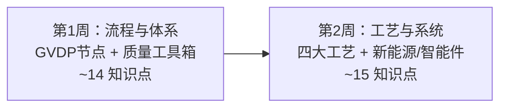

# 制造/质量通识路径 🏭

> **面向车企制造工程师 / 质量工程师新人**：在 2 周内建立从冲压到总装、从来料检验到售后闭环的技术骨架。全路径复用本站六层知识点，补充**"为什么制造/质量要懂这个"**的场景批注和推荐学习顺序，不重写知识点本身。

::: tip 📊 学习进度
整体进度：<ProgressBadge :path="['/roles-guide/', '/roles-guide/manufacturing-quality-path']" mode="bar" />

每页底部有「标记完成」按钮，勾选后进度会自动保存到浏览器。
:::

---

## 制造/质量路径总览

> 对比[全站 30 天路径](/path)：制造/质量路径跳过产品定义和竞品分析，聚焦**工艺可行性、过程控制、失效预防、量产一致性**四类问题。2 周≈每天 1–2 小时。

---

## 为什么制造/质量需要技术通识

你不是设计师，但你每天面对这些问题：

- "焊接车间反馈白车身精度超差，是冲压件本身的问题还是夹具定位的问题？"
- "总装线上电池包螺栓扭矩曲线异常——是电池PACK来料问题、工具校准问题还是工艺参数问题？"
- "PFMEA 里某个工序 RPN 值 180（严重度 9×发生度 5×检测度 4），质量会怎么要求改进？"
- "8D 报告写到第 4 步「根因分析」就卡住了——你怎么区分直接原因和根本原因？"

**制造/质量的技术能力不在于会画图纸，而在于能把缺陷归因到正确的工序、工具、材料或工艺参数。** 这条路径帮你建立判断力——知道生产线上每个异常的技术根因在哪里。

---

## 🏢 第 1 周 Day 1–3：流程与质量体系

> **目标**：先建立制造和质量的语言——APQP/PPAP/PFMEA/SPC/8D 是日常工具。这是制造和质量人的第一优先级。

### Day 1 · 整车开发流程（制造视角）

| 知识点 | 制造必须懂的理由 | 入口 |
|--------|:---|------|
| 整车开发流程 GVDP | 制造关注的是从 OTS→PP→SOP 这段：什么时候样件到产线、什么时候试生产、什么时候爬坡到量产节拍 | [常用术语与流程·GVDP](/industry/terminology#整车开发流程-gvdp) |
| 研发节点与里程碑 | EP/OTS/PP/SOP 每个节点制造要准备什么——工装设备、产线调试、人员培训、物料就绪 | [常用术语与流程·典型节点](/industry/terminology#典型节点) |
| 样车阶段 | Mule Car/VP/TT/PP 的区别。制造重点关注 TT（工装样车）和 PP（试生产）——这是暴露工艺问题的关键窗口 | [常用术语与流程·样车阶段](/industry/terminology#样车阶段) |

> **制造小测**：为什么 TT 阶段（工装样车）暴露的制造问题比 VP 阶段多得多？

### Day 2 · 质量工具箱

| 知识点 | 质量必须懂的理由 | 入口 |
|--------|:---|------|
| FMEA 失效模式分析 | DFMEA（设计端）和 PFMEA（制造端）。PFMEA 是你的核心工具——它告诉你每个工序可能怎么出错、后果多严重、怎么检测 | [常用术语与流程·FMEA](/industry/terminology#fmea-失效模式与影响分析) |
| PPAP 生产件批准程序 | PPAP 18 项要素里至少 5 项直接跟制造过程相关（PFMEA/过程流程图/控制计划/过程能力 CPK/PSW） | [常用术语与流程·PPAP](/industry/terminology#ppap-生产件批准程序) |
| IATF 16949 / SPC / CPK | SPC（统计过程控制）是产线上每天盯着控制图的人的语言。CPK≥1.67 是量产准入基线——不合格就要排查 | [常用术语与流程·IATF](/industry/terminology#iatf-16949) |

> **质量小测**：CPK=1.0 vs CPK=1.67 对产线意味着什么？为什么 PPAP 要求 CPK≥1.67？

### Day 3 · 问题解决与协作

| 知识点 | 制造/质量必须懂的理由 | 入口 |
|--------|:---|------|
| 8D 问题解决八步法 | D1 组建团队→D2 描述问题→D3 围堵→D4 根因分析→D5 永纠措施→D6 验证→D7 预防→D8 庆祝。质量问题不能止于"修好了" | [常用术语与流程·缩写速查](/industry/terminology#关键缩写速查) |
| V-model 开发流程 | 制造要理解：为什么改了生产工艺要重新跑验证？V-model 的左侧（设计）和右侧（验证/测试）的对应关系 | [常用术语与流程·V-model](/industry/terminology#v-model-开发流程) |
| 研发组织架构 | 问题出来时，你要知道找底盘工程还是车身工程、需要试制支持还是试验支持 | [岗位与协作·研发组织](/industry/roles#研发组织架构) |

> **质量小测**：产线发现批量制动异响——8D 的 D3（围堵）和 D4（根因分析）分别要做什么？为什么不能跳过 D3 直接找原因？

---

## ⚡ 第 1 周 Day 4–7：新能源制造

> **目标**：电池包装配、高压安全是制造车间的新挑战。三电系统的制造与传统的冲焊涂总完全不同。

### Day 4 · 电池制造

| 知识点 | 制造/质量必须懂的理由 | 入口 |
|--------|:---|------|
| 动力电池基础 | 电芯→模组→PACK 三级结构。PACK 装配线涉及激光焊接（Busbar）、涂胶（导热/结构胶）、气密检测——每一步都有独特的质量特性 | [电池与电机·电池基础](/new-energy/battery-motor#_29-动力电池类型) |
| 电池关键指标 | SOH（健康度）不只是售后概念——PACK 下线时的初始 SOH 和一致性决定了质保期内的容量衰减曲线 | [电池与电机·关键指标](/new-energy/battery-motor#_29-动力电池类型) |

> **制造小测**：为什么电池 PACK 的车身螺栓扭矩要求比普通底盘螺栓高一个级别——扭矩失效的后果是什么？

### Day 5 · 电池安全制造

| 知识点 | 制造/质量必须懂的理由 | 入口 |
|--------|:---|------|
| 三元锂 vs LFP | LFP 热稳定性好、三元锂热失控温度低——这两种电池在 PACK 车间的安全规程完全不同 | [电池与电机·电池类型对比](/new-energy/battery-motor#_29-动力电池类型) |
| 电池热管理 | 液冷板装配时的气密测试和焊接质量——微漏会在 6 个月后导致电池包进水 | [混合动力与增程·电池热管理](/new-energy/battery-motor#_30-电池管理系统-bms) |

> **质量小测**：为什么 GB 38031 要求电池包过针刺、挤压、外部火烧——制造工艺中的哪些偏差可能导致这些测试失败？

### Day 6 · 电机/电控制造

| 知识点 | 制造/质量必须懂的理由 | 入口 |
|--------|:---|------|
| 驱动电机 | 永磁同步电机的磁钢装配工艺（胶粘/机械固定）直接影响电机耐久性。质量要关注磁钢脱落和退磁风险 | [电池与电机·驱动电机](/new-energy/battery-motor#_31-驱动电机类型) |
| 电控系统 | MCU（逆变器）的功率模块焊接质量——IGBT/SiC 模块的焊点失效 = 整车动力丢失 | [电池与电机·电控系统](/new-energy/battery-motor#_32-电机控制器-mcu) |

> **制造小测**：为什么电机转子动平衡的精度要求比发动机曲轴高——电机的转速范围比燃油发动机宽多少？

### Day 7 · 四大工艺（冲焊涂总）

| 知识点 | 制造/质量必须懂的理由 | 入口 |
|--------|:---|------|
| 整车基本结构 | 白车身是焊接和涂装的载体。车身精度（间隙/面差）是外观质量的基础 | [汽车分类与结构·整车结构](/guide/classification#整车结构组成) |
| 车身类型与平台 | 平台化减少工装切换次数。同一平台的多个车型共用焊装线——产线布局和质量控制点设计的基础 | [汽车分类与结构·平台](/guide/body-chassis#车身平台化开发) |

> **制造小测**：为什么激光焊接比传统点焊的焊点强度高——但为什么不是所有焊缝都用激光焊？

---

## 🧠 第 2 周 Day 8–10：智能件装配与检测

> **目标**：电子件装配、刷写、标定是总装新工序。域控制器装配、OTA 初始化——这些不是传统四大工艺。

### Day 8 · 智驾系统装配

| 知识点 | 制造/质量必须懂的理由 | 入口 |
|--------|:---|------|
| 感知系统 | 摄像头/雷达/激光雷达装在车身上，每一颗都有安装角度公差。1° 的角度偏差 = 100 米外偏 1.75 米 | [ADAS 与自动驾驶·感知系统](/smart-car/adas#感知传感器) |
| 域控制器 | 智驾域控制器在总装线末端在线刷写和标定。如果刷写失败——是网络问题、ECU 版本问题还是硬件问题？ | [ADAS 与自动驾驶·域控制器](/smart-car/adas#域控制器-高算力-soc-对比) |

> **制造小测**：为什么智驾感知传感器的标定必须在四轮定位之后做——标定工序的先后顺序由什么决定？

### Day 9 · 功能安全与制造

| 知识点 | 制造/质量必须懂的理由 | 入口 |
|--------|:---|------|
| 安全与功能安全 | ISO 26262 ASIL 分级决定了制造过程中的防错等级。ASIL D 件的产线必须有 100% 在线检测 | [ADAS 与自动驾驶·功能安全](/smart-car/v2x-ota#安全与功能安全) |
| 软件定义汽车 SDV | OTA 前要做产线初始化——包括 VIN 写入、密钥灌装、基础标定。这是一道新工序 | [V2X 与 OTA·SDV](/smart-car/v2x-ota#软件定义汽车-sdv) |

> **质量小测**：为什么 ASIL D 级别的制动系统装配线，连螺栓扭矩的拧紧曲线都要实时上传和追溯？

### Day 10 · 座舱装配与总装

| 知识点 | 制造/质量必须懂的理由 | 入口 |
|--------|:---|------|
| 智能座舱 | 中控屏/仪表/HUD/语音的装配和功能检测在总装末端完成。每个功能都需要在线检测工位 | [V2X 与 OTA·智能座舱](/smart-car/adas#智能座舱-车机-os-对比) |

> **制造小测**：总装线末端的"淋雨检测"和"功能检测"是两个不同站位——为什么不能合并？

---

## 🚗 第 2 周 Day 11–12：传统系统制造

> **目标**：底盘合装、发动机装配、制动系统装配——这些是总装核心工序，几十年积累的制造知识。

### Day 11 · 底盘与动力总成合装

| 知识点 | 制造/质量必须懂的理由 | 入口 |
|--------|:---|------|
| 制动系统 | 制动管路装配后必须做真空加注和排空——管路里有气泡 = 制动失效。制造要严格管控加注工序 | [制动与转向·制动系统](/traditional/braking-steering#_24-制动系统类型) |
| 发动机关键参数 | 发动机冷试（Cold Test）是装配线末端的必检项——用电机拖动发动机测扭矩波动、振动、压力 | [发动机原理·关键参数](/mechanics/engine#_11-发动机主要参数-排量-压缩比-功率-扭矩) |

> **制造小测**：为什么发动机装配后要做冷试而不是直接点火热试——冷试能检测什么热试检测不到的？

### Day 12 · 尺寸与追溯

| 知识点 | 制造/质量必须懂的理由 | 入口 |
|--------|:---|------|
| 车辆尺寸参数 | 轴距/轮距/离地间隙在总装后必须在线测量——超差意味着底盘合装或悬架安装有问题 | [车身与底盘·尺寸参数](/guide/body-chassis#关键尺寸参数) |
| VIN 码 | VIN 码打刻是制造环节——车身上的 VIN 码位置、清晰度、防篡改都有法规要求 | [汽车分类与结构·VIN](/guide/classification#车辆识别代号-vin) |
| 行业术语速查 | ECR/ECO 工程变更——制造要理解：工程变更谁来发起、谁验证、谁批准、什么时候可以切换产线 | [常用术语与流程·缩写速查](/industry/terminology#关键缩写速查) |

> **质量小测**：VIN 码第 10 位是车型年份——为什么这对质量追溯至关重要？

---

## ⚙️ 第 2 周 Day 13–14：材料与系统（快速扫读）

> **目标**：补齐材料特性、疲劳、应力等工程概念。质量问题根因分析经常落到"材料"或"应力"上。

### Day 13 · 材料与应力

| 知识点 | 制造/质量必须懂的理由 | 入口 |
|--------|:---|------|
| 汽车分类体系 | 乘用车/商用车等分类决定了制造工艺和法规要求——商用车的车架和乘用车的车身是完全不同的制造路线 | [汽车分类与结构·分类体系](/guide/classification#分类体系) |
| 差速器 | 差速器齿轮的啮合噪音是总装下线时的常见质量抱怨——装配间隙和齿轮加工精度是两大来源 | [核心笔记·差速器](/core-notes/differential) |

> **质量小测**：差速器齿轮啸叫声在 60km/h 时出现但在 80km/h 消失——这是什么原因？如何通过制造工艺改善？

### Day 14 · 传动与驱动

| 知识点 | 制造/质量必须懂的理由 | 入口 |
|--------|:---|------|
| 变速箱 | DCT（双离合）的离合器装配间隙控制在微米级——制造精度不够直接导致换挡冲击 | [核心笔记·变速箱](/core-notes/transmission) |
| 扭矩与马力 | 发动机台架测试时扭矩曲线不合格——是 ECU 标定问题、传感器偏差还是机械装配问题？ | [核心笔记·扭矩vs马力](/core-notes/torque-vs-hp) |
| 驱动形式 | FWD/RWD/AWD/4WD 的合装工位完全不同。四驱车型总装线上多了前/后桥连接工序 | [汽车分类与结构·动力类型](/guide/classification#按动力类型分类) |

> **制造小测**：四驱车型比两驱版在总装线上多了哪些工序和质量控制点？

---

## 📊 制造/质量路径知识点覆盖总览

| 层 | 全站知识点 | 制造/质量精选 | 阅读时间 |
|----|:---:|:---:|:---:|
| 第1层 整车认知 | 8 | 4 | ~1h |
| 第2层 机械基础 | 8 | 3 | ~1h |
| 第3层 传统系统 | 10 | 2 | ~0.5h |
| 第4层 新能源 | 9 | 7 | ~2.5h |
| 第5层 智能汽车 | 10 | 5 | ~1.5h |
| 第6层 车企语境 | 9 | 8 | ~2h |
| **合计** | **54** | **29** | **~8.5h/2周** |

---

## 💡 使用建议

1. **按本路径顺序学**——先建质量体系语言（Day 1–3），再进入新能源制造和智能装配，最后补齐传统工艺和材料概念
2. **制造和质量两个角色可以分重点读**——制造方向重点关注 Day 4–12 的装配工序和质量控制点；质量方向重点关注 Day 2–3 的 FMEA/SPC/8D 工具
3. **小测不追求满分**——答错的地方就是你最需要向产线老技师请教的地方
4. **学完后去车间走一圈，对照知识看工序**——冲压、焊接、涂装、总装各站，每个知识点在产线上都有对应的工位

::: tip 制造/质量的技术成长路径
2 周路径帮你建立骨架。当你能在早会上说"这个焊接飞溅是因为板材间隙超差，建议检查冲压件来料公差并提高夹具定位精度"——你就已经是合格的制造/质量工程师了。
:::

---

> **参考来源**：本站六层知识体系（[整车认知](/guide/)、[机械基础](/mechanics/)、[传统系统](/traditional/)、[新能源](/new-energy/)、[智能汽车](/smart-car/)、[车企工作语境](/industry/)）与 SON-41 PM 路径模式。
