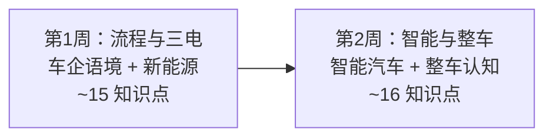

# 产品/项目管理通识路径 📋

> **面向车企产品经理 / 项目经理新人**：在 2 周内建立岗位必需的技术骨架。全路径复用本站六层知识点，补充**"为什么 PM 要懂这个"**的场景批注和推荐学习顺序，不重写知识点本身。

::: tip 📊 学习进度
整体进度：<ProgressBadge :path="['/roles-guide/', '/roles-guide/pm-path']" mode="bar" />

每页底部有「标记完成」按钮，勾选后进度会自动保存到浏览器。
:::

---

## PM 路径总览

> 对比[全站 30 天路径](/path)：PM 路径跳过纯机械计算和底层力学，聚焦**产品定义、成本结构、用户价值、项目推进**四类问题。2 周≈每天 1–2 小时。

---

## 为什么 PM 需要技术通识

PM 不是工程师，但你每天面对这些问题：

- "这个智驾方案用 Orin-X 还是征程 5？对成本、功耗和 OTA 能力有什么影响？"
- "为什么增程比插混更适合这个车型定位？增程的短板在哪？"
- "项目已经到 EP 节点了，为什么突然要改制动方案？影响 SOP 的风险有多大？"
- "三元锂 vs 磷酸铁锂怎么选？对续航、成本、安全、快充各有什么代价？"

**PM 的技术能力不在于会算，而在于能听懂权衡。** 这条路径帮你建立判断力——知道每个技术决策牵连了什么。

---

## 🏢 第 1 周 Day 1–2：车企流程与节点

> **目标**：先建立项目语言——听懂会上的节点、流程和质量术语。这是 PM 的第一优先级。

### Day 1 · 研发流程

| 知识点 | PM 必须懂的理由 | 入口 |
|--------|:---|------|
| 整车开发流程 GVDP | 这是你推进项目的总地图：从概念到 SOP 有哪些阶段、每个阶段产出什么、谁签字 | [车企工作语境·总览](/industry/) |
| V-model 开发流程 | 为什么"需求没闭环"是红灯？左右对应关系（需求↔系统测试、架构↔集成测试、详设↔单元测试）决定了验证周期 | [常用术语与流程·V-model](/industry/terminology#v-model-开发流程) |
| 研发节点与里程碑 | Mule Car / EP / OTS / PPAP / SOP — 每个节点都要你协调资源、跟踪进度、组织评审 | [常用术语与流程·典型节点](/industry/terminology#典型节点) |

> **PM 小测**：如果零部件工程师说「这个件还在 EP 阶段」，你应该问哪三个问题？

### Day 2 · 质量与交付

| 知识点 | PM 必须懂的理由 | 入口 |
|--------|:---|------|
| APQP / PPAP | 供应商承诺"能按时按质量供货"之前，你必须知道 PPAP 包含什么、PSW 签字的含义 | [常用术语与流程·APQP](/industry/terminology#apqp-先期产品质量策划) |
| DFMEA / PFMEA | RPN = S×O×D 是风险量化语言。评审会上工程师说"RPN 超 100 了"，你要听懂严重度/发生度/检测度哪一项推高了风险 | [常用术语与流程·FMEA](/industry/terminology#fmea-失效模式与影响分析) |
| 项目管理与节点 | 里程碑 vs 阀点、交付物清单（BOM/DVP/FMEA/成本）、跨部门推进的核心动作 | [岗位与协作·项目管理](/industry/roles#项目管理与节点) |

> **PM 小测**：为什么 PPAP 需要 18 项要素而不是简单的"样品合格"？缺一项意味着什么？

### Day 3 · 组织与供应链

| 知识点 | PM 必须懂的理由 | 入口 |
|--------|:---|------|
| 研发组织架构 | 造型/工程/试制/试验 各板块的责任边界。问题出来时你知道该找谁、为什么需要多团队会诊 | [岗位与协作·研发组织](/industry/roles#研发组织架构) |
| 供应链角色 | Tier1/Tier2/Tier3 的分工。为什么要引入 Tier1 而不是所有件自研？什么时候必须自研？ | [岗位与协作·供应链](/industry/roles#供应链角色) |
| 行业术语速查 | SOP/EOP/BOM/DVP/ECR/ECO/8D — 会议里每分钟出现的缩写 | [常用术语与流程·缩写速查](/industry/terminology#关键缩写速查) |

> **PM 小测**：为什么一个"简单"的新座椅按摩功能，变更要同时牵扯硬件、软件、线束、供应商、测试和法规？

---

## ⚡ 第 1 周 Day 4–7：新能源与三电

> **目标**：理解整车最贵、差异化最强的部分。PM 定义产品时，三电方案决定了成本、续航、性能和市场定位。

### Day 4 · 电池基础

| 知识点 | PM 必须懂的理由 | 入口 |
|--------|:---|------|
| 动力电池基础 | 电芯→模组→PACK 三级结构。C2C/CTP/CTC 等集成路线直接影响成本、空间和换电可行性 | [电池与电机·电池基础](/new-energy/battery-motor#_29-动力电池类型) |
| 电池关键指标 | 能量密度决定续航上限、C 倍率决定快充、SOH 决定残值。PM 对比竞品参数时就是比这些 | [电池与电机·关键指标](/new-energy/battery-motor#_29-动力电池类型) |

> **PM 小测**：一辆标称续航 600km（CLTC）的车，实际冬季高速可能只有 380km——这是为什么？CLTC/WLTC/NEDC 的差异在哪？

### Day 5 · 三元锂 vs 磷酸铁锂

| 知识点 | PM 必须懂的理由 | 入口 |
|--------|:---|------|
| 三元锂 vs LFP | 三元锂能量密度高但成本高+热稳定性差；LFP 成本低+安全好但能量密度低+低温差。PM 做产品定义时这是第一个选择题：你的目标用户在乎续航还是价格？ | [电池与电机·电池类型对比](/new-energy/battery-motor#_29-动力电池类型) |
| 电池热管理 | 为什么冬天续航缩水？热泵 vs PTC 制热对续航影响差 10–20%。PM 需要判断是否值得为热泵增加单车成本 | [混合动力与增程·电池热管理](/new-energy/battery-motor#_30-电池管理系统-bms) |

> **PM 小测**：定价 15 万 vs 30 万的车，电池类型选择逻辑有什么不同？

### Day 6 · 电机与电控

| 知识点 | PM 必须懂的理由 | 入口 |
|--------|:---|------|
| 驱动电机 | PMSM（永磁同步）vs 感应电机：低速扭矩、高速效率、稀土依赖。为什么 Model 3 前感应后永磁？ | [电池与电机·驱动电机](/new-energy/battery-motor#_31-驱动电机类型) |
| 电控系统 | MCU（逆变/整流）、VCU（扭矩分配）、BMS（SOC/均衡/热管理）。BMS 均衡好坏直接影响电池寿命——这是成本模型的一部分 | [电池与电机·电控系统](/new-energy/battery-motor#_32-电机控制器-mcu) |

> **PM 小测**：为什么电机在低速就能输出最大扭矩——这对起步加速的产品体验意味着什么？

### Day 7 · 混动架构与充电

| 知识点 | PM 必须懂的理由 | 入口 |
|--------|:---|------|
| 混动架构 | 增程（串联）vs 插混（混联）vs 丰田 THS。理想为什么选增程？比亚迪 DM-i 为什么能"以电为主"？每种架构的成本、油耗、NVH 各有取舍 | [混合动力与增程·混动架构](/new-energy/hybrid-range-extender#_33-混合动力分类) |
| 充电系统 | 400V→800V 平台演进 + SiC 碳化硅优势。"充电 5 分钟续航 200 公里"背后是电压、电流、电池材料、热管理的协同 | [混合动力与增程·充电系统](/new-energy/hybrid-range-extender#_35-充电技术) |

> **PM 小测**：增程和插混都是"可油可电"，核心区别是什么？分别适合什么用户和场景？

---

## 🧠 第 2 周 Day 8–10：智能汽车

> **目标**：理解软件定义汽车的技术栈。这是当下产品定义最大的差异化战场，也是 PM 面试的高频题。

### Day 8 · 智驾分级与感知

| 知识点 | PM 必须懂的理由 | 入口 |
|--------|:---|------|
| 辅助驾驶分级 | L0–L5（SAE J3016）。为什么很多车企"跳过 L3"？L2 和 L3 的责任转移是法律和产品的分水岭 | [ADAS 与自动驾驶·分级](/smart-car/adas#自动驾驶分级-sae-j3016) |
| 感知系统 | 摄像头 vs 毫米波雷达 vs 激光雷达 vs 超声波——每种传感器的优势、短板、成本。为什么特斯拉坚持纯视觉、蔚来理想上激光雷达？ | [ADAS 与自动驾驶·感知系统](/smart-car/adas#感知传感器) |

> **PM 小测**：纯视觉和激光雷达方案之争，本质是成本、冗余、数据闭环的什么权衡？

### Day 9 · 芯片与座舱

| 知识点 | PM 必须懂的理由 | 入口 |
|--------|:---|------|
| 域控制器 | 高通 8295（座舱）/ 英伟达 Orin-X（智驾）/ 地平线征程 5——算力、功耗、成本、生态的差异决定产品上限 | [ADAS 与自动驾驶·域控制器](/smart-car/adas#域控制器-高算力-soc-对比) |
| 智能座舱 | 车机 OS（Android Automotive / 鸿蒙 / NIO OS）+ HUD + 语音。座舱体验是用户每天接触的，PM 要能拆解"好用的座舱"的技术支撑 | [V2X 与 OTA·智能座舱](/smart-car/adas#智能座舱-车机-os-对比) |

> **PM 小测**：为什么座舱芯片和智驾芯片通常用不同 SoC——除了算力差异还有什么原因？

### Day 10 · SDV、OTA 与安全

| 知识点 | PM 必须懂的理由 | 入口 |
|--------|:---|------|
| 软件定义汽车 SDV | SOA 架构 + OTA 更新。特斯拉通过 OTA 缩短了刹车距离、蔚来 OTA 新增雪地模式——PM 要理解 OTA 能改什么、不能改什么、需要什么硬件预留 | [V2X 与 OTA·SDV](/smart-car/v2x-ota#软件定义汽车-sdv) |
| 安全与功能安全 | ISO 26262（ASIL A/B/C/D）、ISO 21434 网络安全、SOTIF。安全分级的成本差异巨大，PM 要理解"够用"和"冗余"的边界 | [ADAS 与自动驾驶·功能安全](/smart-car/v2x-ota#安全与功能安全) |

> **PM 小测**：为什么"影子模式"不需要车自己决策就能帮算法迭代——PM 为什么关心这个？

---

## 🚗 第 2 周 Day 11–12：整车认知

> **目标**：建立全局观——平台化、驱动形式、车身结构这些是产品定义的基础参数。

### Day 11 · 结构与分类

| 知识点 | PM 必须懂的理由 | 入口 |
|--------|:---|------|
| 整车基本结构 | 车身+底盘+动力总成+电气电子 四大系统。PM 做竞品对标时，问题出在哪个系统要能一眼判断 | [汽车分类与结构·整车结构](/guide/classification#整车结构组成) |
| 汽车分类 | 轿车/SUV/MPV/跑车 + A/B/C/D 级 + 乘用车/商用车。细分市场定位是 PM 的起点 | [汽车分类与结构·分类体系](/guide/classification#按车身形式分类-乘用车) |
| 驱动形式 | FWD/RWD/AWD/4WD 的优缺点。前驱 vs 后驱对空间、操控、成本的系统性影响——这不是工程决策，是产品决策 | [汽车分类与结构·动力类型](/guide/classification#按动力类型分类) |

> **PM 小测**：为什么特斯拉 Model 3 选择后驱版而非前驱版——对成本、空间和操控各有什么影响？

### Day 12 · 平台与尺寸

| 知识点 | PM 必须懂的理由 | 入口 |
|--------|:---|------|
| 车身类型与平台 | MQB/TNGA/CMA/SEA——平台化到底复用什么？为什么同一平台能出 SUV+轿车+旅行车？对产品规划、成本分摊和项目周期的影响 | [汽车分类与结构·平台](/guide/body-chassis#车身平台化开发) |
| 车辆尺寸参数 | 轴距/轮距/接近角/离去角/离地间隙。PM 定义产品"硬点"时，这些参数锁定了空间、通过性和比例的边界 | [车身与底盘·尺寸参数](/guide/body-chassis#关键尺寸参数) |
| VIN 码 | 17 位 VIN 结构。PM 做竞品信息和法规追踪时，VIN 是最准确的车辆身份证 | [汽车分类与结构·VIN](/guide/classification#车辆识别代号-vin) |

> **PM 小测**：一台车「轴距 2800mm」——这个数字对后排空间、操控稳定性和转弯半径各有什么含义？

---

## 🔧 第 2 周 Day 13：传统系统（精选）

> **目标**：不要求懂设计，但能听懂工程师在说什么。PM 重点掌握动力总成的类型对比和制动系统。

| 知识点 | PM 必须懂的理由 | 入口 |
|--------|:---|------|
| 发动机关键参数 | 排量/压缩比/功率/扭矩/热效率。PM 看参数表时必须能看出"这台发动机什么水平" | [发动机原理·关键参数](/mechanics/engine#_11-发动机主要参数-排量-压缩比-功率-扭矩) |
| 变速箱 | MT/AT/CVT/DCT 四种结构的优缺点。为什么 CVT 无顿挫但 DCT 换挡快？为什么电动车不需要变速箱？ | [核心笔记·变速箱](/core-notes/transmission) |
| 制动系统 | 盘式/鼓式、ABS/ESC。制动是安全底线，任何涉及制动方案的变更，PM 都要高度警惕对验证周期和法规的影响 | [制动与转向·制动系统](/traditional/braking-steering#_24-制动系统类型) |

> **PM 小测**：为什么电动车可以没有变速箱？少数电动车（如保时捷 Taycan）为什么又加了两挡变速箱？

---

## 📝 第 2 周 Day 14：核心概念（快速扫读）

> **目标**：补齐最核心的工程概念，确保看到参数表时不会陌生。每个概念只需 15–20 分钟。

| 知识点 | PM 必须懂的理由 | 入口 |
|--------|:---|------|
| 扭矩与马力 | 扭矩决定加速感、马力决定最高时速。"最大扭矩出现在 1750rpm"意味着什么？ | [核心笔记·扭矩vs马力](/core-notes/torque-vs-hp) |
| 差速器 | 为什么转弯时左右轮转速不同？开放式 vs 限滑差速器的差别 | [核心笔记·差速器](/core-notes/differential) |

> **PM 小测**：「扭矩大起步快、马力大极速高」——这个说法对吗？

---

## 📊 PM 路径知识点覆盖总览

| 层 | 全站知识点 | PM 精选 | 阅读时间 |
|----|:---:|:---:|:---:|
| 第1层 整车认知 | 8 | 5 | ~1.5h |
| 第2层 机械基础 | 8 | 2 | ~0.5h |
| 第3层 传统系统 | 10 | 3 | ~1h |
| 第4层 新能源 | 9 | 7 | ~2h |
| 第5层 智能汽车 | 10 | 6 | ~2h |
| 第6层 车企语境 | 9 | 8 | ~2h |
| **合计** | **54** | **31** | **~9h/2周** |

---

## 💡 使用建议

1. **按本路径顺序学**——不是按数字层序。先建流程语言（Day 1–3），再攻产品定义核心（三电+智能），最后补整车认知和传统系统
2. **每个知识点先看场景批注**——知道"为什么 PM 要懂"再读内容，效率更高
3. **小测不追求满分**——答错的地方记下来，那正是你和工程师交流时最可能卡住的点
4. **学完后对照竞品参数表实战阅读**——在[汽车之家](https://www.autohome.com.cn/)或[懂车帝](https://www.dongchedi.com/)选 3 款竞品对比参数，看能否独立判断产品定位差异

::: tip PM 的技术成长路径
2 周路径帮你建立骨架。入职后每个项目会给你更具体的产品知识。当你能在评审会上说"这个方案的 RPN 偏高是因为检测度不够，建议加一个下线检"——你就已经是合格的 PM 了。
:::

---

> **参考来源**：本站六层知识体系（[整车认知](/guide/)、[机械基础](/mechanics/)、[传统系统](/traditional/)、[新能源](/new-energy/)、[智能汽车](/smart-car/)、[车企工作语境](/industry/)）与 SON-30 竞品调研报告。
