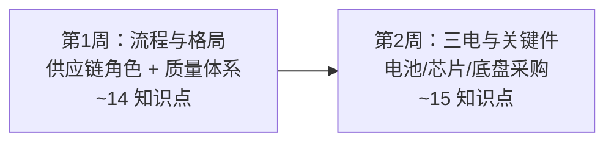

# 采购/供应链通识路径 🛒

> **面向车企采购 / 供应链新人**：在 2 周内建立供应商评估、成本结构、供应链风险管理的技术骨架。全路径复用本站六层知识点，补充**"为什么采购要懂这个"**的场景批注和推荐学习顺序，不重写知识点本身。

::: tip 📊 学习进度
整体进度：<ProgressBadge :path="['/roles-guide/', '/roles-guide/procurement-supply-chain-path']" mode="bar" />

每页底部有「标记完成」按钮，勾选后进度会自动保存到浏览器。
:::

---

## 采购/供应链路径总览

> 对比[全站 30 天路径](/path)：采购路径跳过纯机械计算和底层力学，聚焦**供应商格局、成本结构、质量体系、供应风险**四类问题。2 周≈每天 1–2 小时。

---

## 为什么采购需要技术通识

你不是工程师，但你每天面对这些问题：

- "这家 Tier 1 的三元锂电池包报价比竞品高 15%，技术上有溢价理由吗？"
- "英伟达 Orin-X 和地平线征程 5 在算力、功耗、生态上有什么差异——选哪家会影响采购谈判？"
- "为什么底盘副车架有钢制和铝制两种方案？重量、成本、供应商切换周期各差多少？"
- "供应商说产能不足——是真的，还是 PPAP 没过的借口？"

**采购的技术能力不在于会设计，而在于能判断报价是否合理、产能承诺是否可行、风险是否可控。** 这条路径帮你建立判断力——知道每个采购决策牵连的技术和商务因素。

---

## 🏢 第 1 周 Day 1–3：供应链格局与流程

> **目标**：先建立采购语言——理解 Tier1/Tier2/OEM 分工、供应商批准流程和质量体系。这是采购的第一优先级。

### Day 1 · 供应链角色

| 知识点 | 采购必须懂的理由 | 入口 |
|--------|:---|------|
| 供应链层级 | Tier1/Tier2/Tier3 的分工。采购要理解：什么时候自研、什么时候外包？为什么博世能同时向奔驰和大众供货？ | [岗位与协作·供应链](/industry/roles#供应链角色) |
| 研发组织架构 | 造型/工程/试制/试验各板块的责任边界。供应商问"这需求谁签字"时，你要知道指向谁 | [岗位与协作·研发组织](/industry/roles#研发组织架构) |
| 行业术语速查 | SOP/EOP/BOM/DVP/ECR/ECO/8D——供应商邮件里的高频缩写 | [常用术语与流程·缩写速查](/industry/terminology#关键缩写速查) |

> **采购小测**：为什么同一款制动系统，博世和大陆的报价可能差 20%——除了品牌溢价，技术上有哪些可能？

### Day 2 · 供应商准入

| 知识点 | 采购必须懂的理由 | 入口 |
|--------|:---|------|
| APQP 先期产品质量策划 | 供应商"承诺能按时按质量供货"之前，你要知道 APQP 五阶段中哪个阶段最容易暴露问题 | [常用术语与流程·APQP](/industry/terminology#apqp-先期产品质量策划) |
| PPAP 生产件批准程序 | PPAP 18 项要素就是你的供应商审核清单。PSW 签字意味着供应商承诺量产稳定——如果没准备好，你会在 SOP 前被质量问题淹掉 | [常用术语与流程·PPAP](/industry/terminology#ppap-生产件批准程序) |
| IATF 16949 | 汽车行业质量管理体系标准——供应商过不了 16949 认证，连投标资格都没有 | [常用术语与流程·IATF](/industry/terminology#iatf-16949) |

> **采购小测**：一家新供应商说"我们给消费电子供过类似产品，汽车也没问题"——你应该拿哪 3 项 PPAP 要素来反驳？

### Day 3 · 整车开发流程

| 知识点 | 采购必须懂的理由 | 入口 |
|--------|:---|------|
| 整车开发流程 GVDP | 供应商交样（OTS）和量产节点（SOP）之间的时间窗口，决定了你有多少谈判空间 | [常用术语与流程·GVDP](/industry/terminology#整车开发流程-gvdp) |
| 研发节点与里程碑 | Mule Car / EP / OTS / PPAP / SOP——每个节点供应商要交付什么？延期会触发什么罚款条款？ | [常用术语与流程·典型节点](/industry/terminology#典型节点) |
| FMEA 失效模式分析 | DFMEA（设计失效）和 PFMEA（过程失效）的 RPN 值直接告诉你供应商方案的风险点。采购要在定点前看懂供应商的 FMEA | [常用术语与流程·FMEA](/industry/terminology#fmea-失效模式与影响分析) |

> **采购小测**：为什么 PPAP 18 项要素中有 3 项直接跟"过程能力 CPK"相关——这意味着什么风险？

---

## ⚡ 第 1 周 Day 4–7：新能源采购核心

> **目标**：电池是整车成本最高的部件，电机电控的供应链格局直接影响采购策略。这是采购路径的核心。

### Day 4 · 电池采购基础

| 知识点 | 采购必须懂的理由 | 入口 |
|--------|:---|------|
| 动力电池基础 | 电芯→模组→PACK 三级结构。C2C/CTP/CTC 集成路线不同 → 供应商的交付形态不同（电芯模组 vs 整包）。直接影响采购标的和价格 | [电池与电机·电池基础](/new-energy/battery-motor#动力电池基础) |
| 电池关键指标 | 能量密度决定续航上限、C 倍率决定快充能力、SOH 决定质保成本。供应商用哪项指标吹嘘时要能识破 | [电池与电机·关键指标](/new-energy/battery-motor#电池关键指标) |

> **采购小测**：宁德时代和比亚迪都供应 LFP 电池——为什么同样标称 200Wh/kg，实际 Pack 级能量密度不同？差距在哪里？

### Day 5 · 电池类型与成本

| 知识点 | 采购必须懂的理由 | 入口 |
|--------|:---|------|
| 三元锂 vs LFP | 三元锂能量密度高但钴价波动大、LFP 成本低但低温差。采购做定点决策时，材料成本曲线决定了报价合理区间 | [电池与电机·电池类型对比](/new-energy/battery-motor#三元锂-vs-磷酸铁锂) |
| 电池热管理 | 热泵 vs PTC 制热对续航影响差 10–20%。采购要判断：为了热泵多花 2000 元单车成本，值不值得？ | [混合动力与增程·电池热管理](/new-energy/hybrid-range-extender#电池热管理) |

> **采购小测**：钴价从 30 万涨到 60 万一吨，三元锂电池包成本涨多少？这笔风险该由谁承担——OEM 还是电池供应商？

### Day 6 · 电机与电控

| 知识点 | 采购必须懂的理由 | 入口 |
|--------|:---|------|
| 驱动电机 | PMSM（永磁同步）依赖稀土磁体——稀土供应集中在中国，这是供应链最大地缘风险之一。感应电机用铜不用稀土 | [电池与电机·驱动电机](/new-energy/battery-motor#驱动电机) |
| 电控系统 | MCU（逆变器）的核心是功率半导体 IGBT/SiC。SiC 贵但效率高——采购要能算：省下的电池成本能不能覆盖 SiC 的溢价？ | [电池与电机·电控系统](/new-energy/battery-motor#电控系统) |

> **采购小测**：为什么特斯拉 Model 3 前感应电机 + 后永磁同步——这个组合对采购意味着什么决策？

### Day 7 · 混动与充电

| 知识点 | 采购必须懂的理由 | 入口 |
|--------|:---|------|
| 混动架构 | 增程（串联）vs 插混（混联）的供应链复杂度完全不同：增程需要大电池+发电机，插混需要复杂的变速箱+离合器 | [混合动力与增程·混动架构](/new-energy/hybrid-range-extender#混动架构) |
| 充电系统 | 400V→800V 平台演进要求所有高压件升级（OBC/DCDC/PDU/高压连接器）。采购要提前规划供应商切换节奏 | [混合动力与增程·充电系统](/new-energy/hybrid-range-extender#充电系统) |

> **采购小测**：从 400V 切换到 800V 平台，哪些零部件必须换供应商？哪些可以和现有供应商联合开发？

---

## 🧠 第 2 周 Day 8–10：智能汽车采购

> **目标**：芯片和传感器的供应安全是近年最大风险。英伟达/高通的供货周期、地平线的国产替代策略——采购要能独立判断。

### Day 8 · 智驾芯片与传感器

| 知识点 | 采购必须懂的理由 | 入口 |
|--------|:---|------|
| 域控制器 SoC | 英伟达 Orin-X（254 TOPS）vs 高通 8650（100 TOPS）vs 地平线征程 5（128 TOPS）——算力、功耗、开发生态、供货稳定性的差异决定定点决策 | [ADAS 与自动驾驶·域控制器](/smart-car/adas#域控制器) |
| 感知系统 | 摄像头（索尼/OV/安森美）vs 毫米波雷达（博世/大陆/华为）vs 激光雷达（禾赛/速腾聚创/Innoviz）——每个赛道的供应商格局完全不同 | [ADAS 与自动驾驶·感知系统](/smart-car/adas#感知系统) |

> **采购小测**：为什么英伟达 Orin-X 供货周期可能长达 26 周——这背后是什么半导体供应链风险？

### Day 9 · 智驾分级

| 知识点 | 采购必须懂的理由 | 入口 |
|--------|:---|------|
| 辅助驾驶分级 L0–L5 | L2→L3 的跳跃不仅是技术升级，还意味着责任转移（从驾驶员到车企）。采购要理解：为什么 L3 项目对供应商的合同条款完全不同？ | [ADAS 与自动驾驶·分级](/smart-car/adas#辅助驾驶分级) |

> **采购小测**：为什么 L3 智驾方案比 L2+ 的方案供应商报价高 3 倍以上——除了硬件，多出来的是什么？

### Day 10 · 座舱与安全

| 知识点 | 采购必须懂的理由 | 入口 |
|--------|:---|------|
| 智能座舱 | 高通 8295 是目前座舱主力 SoC。座舱的屏幕、HUD、语音供应商和智驾供应商通常是分开的——采购要做两套技术评估 | [V2X 与 OTA·智能座舱](/smart-car/v2x-ota#智能座舱) |
| 安全与功能安全 | ISO 26262（ASIL A/B/C/D）对供应商级别要求不同。ASIL D 级系统（如制动、EPS）供应商准入门槛远高于 ASIL A 级 | [ADAS 与自动驾驶·功能安全](/smart-car/adas#安全与功能安全) |

> **采购小测**：为什么 ASIL D 级别的制动系统，全球能供货的 Tier 1 不到 5 家？

---

## 🚗 第 2 周 Day 11–12：传统件与整车采购

> **目标**：底盘件、制动系统仍是大宗采购项。平台化降低零件定制比例→增加通用件采购杠杆。

### Day 11 · 底盘采购

| 知识点 | 采购必须懂的理由 | 入口 |
|--------|:---|------|
| 制动系统 | 盘式/鼓式制动、ABS/ESC。制动是安全件，供应商必须过 ASIL D 认证。采购要在"够用"和"冗余"之间做成本权衡 | [制动与转向·制动系统](/traditional/braking-steering#制动系统) |
| 车身类型与平台 | MQB/TNGA/CMA/SEA——平台化到底复用什么？采购的杠杆在于：同一平台的多个车型共用件采购量翻倍，谈判地位完全不同 | [汽车分类与结构·平台](/guide/classification#车身类型与平台) |

> **采购小测**：为什么大众 MQB 平台能覆盖 Polo 到 Tiguan——这给采购带来了什么谈判优势？

### Day 12 · 整车结构与VIN

| 知识点 | 采购必须懂的理由 | 入口 |
|--------|:---|------|
| 整车基本结构 | 车身+底盘+动力总成+电气电子四大系统。供应商报价时，采购要能判断"这个报价对应的是哪个系统、什么级别" | [汽车分类与结构·整车结构](/guide/classification#整车结构组成) |
| 车辆尺寸参数 | 轴距/轮距/离地间隙。尺寸参数的微调可能影响整个底盘件的采购规格 | [车身与底盘·尺寸参数](/guide/body-chassis#车辆坐标系与基本尺寸) |
| VIN 码 | 17 位 VIN 结构。采购用 VIN 码追溯供应商批次质量问题——精确到工厂和车型年份 | [汽车分类与结构·VIN](/guide/classification#车辆识别代号-vin) |

> **采购小测**：从 VIN 码第 11 位（装配厂代码）能看出什么采购信息？

---

## ⚙️ 第 2 周 Day 13–14：核心概念（快速扫读）

> **目标**：补齐最核心的工程概念，确保审核供应商技术方案时不陌生。

### Day 13 · 动力总成概念

| 知识点 | 采购必须懂的理由 | 入口 |
|--------|:---|------|
| 发动机关键参数 | 排量/压缩比/功率/扭矩/热效率。采购看发动机供应商报价时，参数表就是你的评估基线 | [发动机原理·关键参数](/mechanics/engine#发动机关键参数) |
| 变速箱 | MT/AT/CVT/DCT 四种结构。为什么 DCT 成本比 AT 低但 NVH 可能更差——采购要理解供应商技术方案的取舍 | [核心笔记·变速箱](/core-notes/transmission) |
| 扭矩与马力 | 扭矩决定加速感、马力决定最高时速。供应商说"我们电机扭矩更大"，你要知道这意味什么 | [核心笔记·扭矩vs马力](/core-notes/torque-vs-hp) |

> **采购小测**：为什么电动车可以不要变速箱——这省掉了多少采购项和供应商管理成本？

### Day 14 · 差速器与供应商策略

| 知识点 | 采购必须懂的理由 | 入口 |
|--------|:---|------|
| 差速器 | 开放式 vs 限滑差速器——差价 3–5 倍。采购要判断产品定义是否需要限滑差速器 | [核心笔记·差速器](/core-notes/differential) |
| 驱动形式 | FWD/RWD/AWD/4WD。不同驱动形式的传动系统供应商完全不同，影响采购包的拆分方式 | [汽车分类与结构·动力类型](/guide/classification#按动力类型分类) |

> **采购小测**：一台四驱电动车的采购包，跟同平台两驱版相比多了哪些供应商项目？

---

## 📊 采购/供应链路径知识点覆盖总览

| 层 | 全站知识点 | 采购精选 | 阅读时间 |
|----|:---:|:---:|:---:|
| 第1层 整车认知 | 8 | 4 | ~1h |
| 第2层 机械基础 | 8 | 2 | ~0.5h |
| 第3层 传统系统 | 10 | 2 | ~0.5h |
| 第4层 新能源 | 9 | 7 | ~2.5h |
| 第5层 智能汽车 | 10 | 5 | ~1.5h |
| 第6层 车企语境 | 9 | 7 | ~2h |
| **合计** | **54** | **27** | **~8h/2周** |

---

## 💡 使用建议

1. **按本路径顺序学**——先建供应链语言（Day 1–3），再攻核心采购项（三电+智能），最后补齐传统件和工程概念
2. **每个知识点先看场景批注**——知道"为什么采购要懂"再读内容，效率更高
3. **小测不追求满分**——答错的地方记下来，那正是你和供应商谈判时最可能被技术细节绕进去的点
4. **学完后拿一份真实 RFQ（报价请求）对照阅读**——看能否从技术参数中独立判断供应商报价的合理性

::: tip 采购的技术成长路径
2 周路径帮你建立骨架。入职后每个品类会给你更具体的供应商格局知识。当你能在供应商评审会上说"这个 LFP 电池方案的低温性能短板可以用热泵补偿，但热泵供应商的产能要提前锁定"——你就已经是合格的采购了。
:::

---

> **参考来源**：本站六层知识体系（[整车认知](/guide/)、[机械基础](/mechanics/)、[传统系统](/traditional/)、[新能源](/new-energy/)、[智能汽车](/smart-car/)、[车企工作语境](/industry/)）与 SON-41 PM 路径模式。
