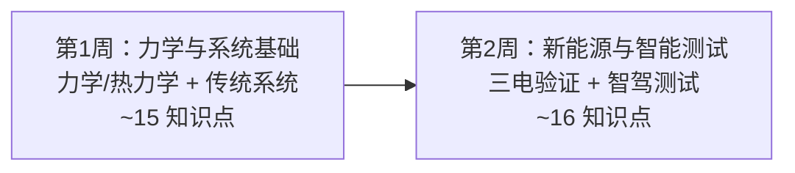

# 测试/研发通识路径 🔬

::: tip 🎯 可执行学习计划：已上线 [《2周学习计划 checklist》](./testing-rd-plan) —— 分天列出任务、时长、掌握标准，勾选打卡。
:::

> **面向车企测试工程师 / 研发工程师新人**：在 2 周内建立从子系统设计到台架/实车验证的技术骨架。全路径复用本站六层知识点，补充**"为什么测试/研发要懂这个"**的场景批注和推荐学习顺序，不重写知识点本身。

::: tip 📊 学习进度
整体进度：<ProgressBadge :path="['/roles-guide/', '/roles-guide/testing-rd-path']" mode="bar" />

每页底部有「标记完成」按钮，勾选后进度会自动保存到浏览器。
:::

---

## 测试/研发路径总览

> 对比[全站 30 天路径](/path)：测试/研发路径是全站最深入的——你不仅要懂原理，还要理解每个子系统的失效模式和验证方法。2 周≈每天 1.5–2 小时。

---

## 为什么测试/研发需要技术通识

你是技术最深入的角色，每天面对这些问题：

- "台架上发动机扭矩曲线在 3500rpm 处有个凹陷——是进气系统、喷油策略还是排气背压的问题？"
- "制动距离试验结果比仿真长 2.3 米——是轮胎附着系数建模偏差、ABS 标定保守还是制动器热衰退？"
- "电池包循环寿命到 800 次就掉到 80% SOH 了，设计目标是 1500 次——是电芯一致性、BMS 均衡策略还是温度场不均匀导致的？"
- "DVP（设计验证计划）里这个试验项目为什么要用 3 个样件而不是 5 个——样本量怎么算？"

**测试/研发的技术能力在于从失效追溯到根因、从试验数据中提取正确的工程判断。** 这条路径帮你建立系统化的工程思维——知道每个子系统怎么工作、怎么失效、怎么验证。

---

## ⚙️ 第 1 周 Day 1–3：力学与材料基础

> **目标**：先建立工程计算的语言——力学、热力学、流体、材料是所有子系统分析的基础。

### Day 1 · 力学基础

| 知识点 | 测试/研发必须懂的理由 | 入口 |
|--------|:---|------|
| 扭矩与马力 | 扭矩决定加速感、马力决定最高时速。发动机/电机台架测试的第一组数据就是扭矩-转速曲线——这是所有后续分析的起点 | [核心笔记·扭矩vs马力](/core-notes/torque-vs-hp) |

> **研发小测**：发动机的峰值扭矩出现在 1750rpm，而峰值功率出现在 5500rpm——这两个点之间的区域意味着什么？

### Day 2 · 传动系统

| 知识点 | 测试/研发必须懂的理由 | 入口 |
|--------|:---|------|
| 变速箱 | MT/AT/CVT/DCT 四种结构的传动效率、换挡逻辑、失效模式完全不同。变速箱台架测试要覆盖哪些工况？ | [核心笔记·变速箱](/core-notes/transmission) |
| 差速器 | 开放式 vs 限滑差速器。差速器齿轮耐久性试验的加载谱来自哪里？ | [核心笔记·差速器](/core-notes/differential) |

> **研发小测**：为什么 DCT 变速箱的离合器热衰退是台架测试的高风险项——湿式 DCT 和干式 DCT 的测试工况有什么不同？

### Day 3 · 整车认知

| 知识点 | 测试/研发必须懂的理由 | 入口 |
|--------|:---|------|
| 整车基本结构 | 车身+底盘+动力总成+电气电子四大系统。任何子系统测试都要放在整车环境里评估——一个底盘的改动可能影响 NVH、碰撞、EMC | [汽车分类与结构·整车结构](/guide/classification#整车结构组成) |
| 车辆尺寸参数 | 轴距/轮距/接近角/离去角/离地间隙。底盘台架测试时，这些参数决定了悬架行程和加载条件 | [车身与底盘·尺寸参数](/guide/body-chassis#关键尺寸参数) |
| VIN 码 | 17 位 VIN 结构。试验样车的 VIN 码是追溯试验数据的基础——哪个样车跑了哪条试验、换了什么件 | [汽车分类与结构·VIN](/guide/classification#车辆识别代号-vin) |

> **研发小测**：为什么底盘台架的加载谱必须根据实车路谱采集——直接用仿真载荷有什么风险？

---

## 🔧 第 1 周 Day 4–7：传统系统

> **目标**：发动机标定、制动调校、悬架 K&C 是测试研发的日常工作。这是测试工程师的核心领域。

### Day 4 · 发动机

| 知识点 | 测试/研发必须懂的理由 | 入口 |
|--------|:---|------|
| 发动机关键参数 | 排量/压缩比/功率/扭矩/热效率。发动机台架测试要拉出完整的万有特性 MAP——这是整车动力性经济性仿真的输入 | [发动机原理·关键参数](/mechanics/engine#_11-发动机主要参数-排量-压缩比-功率-扭矩) |
| 发动机原理 | 四冲程循环（进气→压缩→做功→排气）。缸压传感器是发动机台架的核心——从缸压曲线能判断爆震、早燃、燃烧不稳定 | [发动机原理](/mechanics/engine) |

> **研发小测**：为什么火花塞点火时刻（点火提前角）改变 2°，台架上的扭矩能差 5%——这跟火焰传播速度和活塞运动有什么关系？

### Day 5 · 制动系统

| 知识点 | 测试/研发必须懂的理由 | 入口 |
|--------|:---|------|
| 制动系统 | 盘式/鼓式制动、ABS/ESC。制动效能试验（冷态/热态/衰退/恢复）+ 法规距离（GB 21670）是测试的必修课 | [制动与转向·制动系统](/traditional/braking-steering#_24-制动系统类型) |
| 制动测试 | 制动 NVH（异响/抖动）是最常见的售后抱怨。制动尖叫的台架再现和频率分析是测试工程师的核心技能 | [制动与转向](/traditional/braking-steering) |

> **研发小测**：制动抖动（Brake Judder）和制动跑偏（Brake Pull）现象不同——台架上用什么传感器组合来区分？

### Day 6 · 悬架与转向

| 知识点 | 测试/研发必须懂的理由 | 入口 |
|--------|:---|------|
| 悬架系统 | K&C（运动学与柔顺性）试验是底盘开发的基础——悬架几何在跳动/侧倾/转向时的轮跳位移和外倾角变化 | [传动与悬架](/mechanics/transmission-suspension) |
| 燃油系统（参考） | 燃油系统泄漏/蒸发排放测试的法规要求——碳罐/油箱/管路的密封性和耐久性 | [燃油系统](/traditional/fuel-system) |

> **研发小测**：为什么麦弗逊悬架在轮跳时外倾角变化比双叉臂大——这对轮胎磨损和操控有什么影响？

### Day 7 · 流程与验证

| 知识点 | 测试/研发必须懂的理由 | 入口 |
|--------|:---|------|
| V-model 开发流程 | DVP（设计验证计划）就是 V-model 右侧的执行文件——每项需求都有对应的验证方法、样件数、接收标准 | [常用术语与流程·V-model](/industry/terminology#v-model-开发流程) |
| APQP 先期产品质量策划 | DVP 是 APQP 的核心交付物之一。测试工程师要理解 DVP 在整个质量体系中的位置 | [常用术语与流程·APQP](/industry/terminology#apqp-先期产品质量策划) |

> **研发小测**：DVP 为什么要求"每项验证必须有接收标准"？如果接收标准写"满足设计要求"——哪里有问题？

---

## ⚡ 第 2 周 Day 8–10：新能源测试

> **目标**：电机台架测试、电池循环寿命、BMS 策略验证。三电系统的测试方法和传统动力总成完全不同。

### Day 8 · 电池测试

| 知识点 | 测试/研发必须懂的理由 | 入口 |
|--------|:---|------|
| 动力电池基础 | 电芯→模组→PACK 三级结构。电池测试从电芯级别开始：容量/内阻/倍率/HPPC——再到 Pack 级别的振动/挤压/针刺 | [电池与电机·电池基础](/new-energy/battery-motor#_29-动力电池类型) |
| 电池关键指标 | SOH 的定义和测试方法：容量衰减法、内阻增量法、dQ/dV 曲线分析法。循环寿命测试动辄 6–12 个月——测试加速方法是关键 | [电池与电机·关键指标](/new-energy/battery-motor#_29-动力电池类型) |

> **研发小测**：为什么电池循环寿命测试不能简单地在 1C 倍率下连续充放电——与实际车用工况的差异在哪？

### Day 9 · 电机/电控测试

| 知识点 | 测试/研发必须懂的理由 | 入口 |
|--------|:---|------|
| 驱动电机 | 电机台架测试的核心：效率 MAP（从低速高扭到高速低扭的全工况效率）、NVH（电磁噪音/机械噪音/轴承噪音）、温升 | [电池与电机·驱动电机](/new-energy/battery-motor#_31-驱动电机类型) |
| 电控系统 | MCU 逆变器的效率测试 + BMS 策略验证（SOC 估计精度/均衡效果/热管理触发逻辑） | [电池与电机·电控系统](/new-energy/battery-motor#_32-电机控制器-mcu) |

> **研发小测**：为什么电机的高效区在 3000–6000rpm 的中等扭矩区间——低速高扭和高速低扭效率为什么低？

### Day 10 · 混动与充电测试

| 知识点 | 测试/研发必须懂的理由 | 入口 |
|--------|:---|------|
| 混动架构 | 增程 vs 插混的测试工况完全不同。增程要测"电量保持模式"的长时间发电稳定性、插混要测发动机启停和模式切换的 NVH | [混合动力与增程·混动架构](/new-energy/hybrid-range-extender#_33-混合动力分类) |
| 充电系统 | 充电兼容性测试——国网/特来电/星星充电不同品牌的充电桩的握手成功率。800V 平台对充电枪和线缆的温升要求更高 | [混合动力与增程·充电系统](/new-energy/hybrid-range-extender#_35-充电技术) |

> **研发小测**：为什么有些充电桩在 -10°C 下充电功率只有标称值的一半——电池加热、充电桩限流、BMS 保护谁主导？

---

## 🧠 第 2 周 Day 11–13：智能汽车测试

> **目标**：智驾系统测试（仿真+实车）是测试研发新战场。感知、决策、控制的验证方法与传统系统完全不同。

### Day 11 · 智驾感知测试

| 知识点 | 测试/研发必须懂的理由 | 入口 |
|--------|:---|------|
| 感知系统 | 摄像头/雷达/激光雷达的单独性能测试（探测距离/视场角/分辨率）→ 融合感知的联合测试（目标跟踪稳定性/误检率/漏检率） | [ADAS 与自动驾驶·感知系统](/smart-car/adas#感知传感器) |
| 辅助驾驶分级 | L0–L5 每个级别的测试要求不同。L3 级需要驾驶员接管时间测试（ODD 退出到驾驶员接管的时间窗口） | [ADAS 与自动驾驶·分级](/smart-car/adas#自动驾驶分级-sae-j3016) |

> **测试小测**：为什么纯视觉方案在夜间/雨雾天气的感知性能下降——测试工况库应该如何覆盖？

### Day 12 · 域控与功能安全

| 知识点 | 测试/研发必须懂的理由 | 入口 |
|--------|:---|------|
| 域控制器 | 域控制器测试：环境试验（温度/振动/EMC）+ 性能测试（算力/延迟/功耗）+ 故障注入测试 | [ADAS 与自动驾驶·域控制器](/smart-car/adas#域控制器-高算力-soc-对比) |
| 安全与功能安全 | ISO 26262 要求对 ASIL C/D 级功能做故障注入测试——注入传感器失效、通信中断、供电异常，验证系统安全降级行为 | [ADAS 与自动驾驶·功能安全](/smart-car/v2x-ota#安全与功能安全) |

> **测试小测**：为什么 ASIL D 系统的故障注入测试要覆盖"共因失效"——两个传感器同时坏掉的情况？

### Day 13 · SDV/OTA 测试

| 知识点 | 测试/研发必须懂的理由 | 入口 |
|--------|:---|------|
| 软件定义汽车 SDV | OTA 升级的全链路测试：从云端下发→网关接收→ECU 刷写→自检→版本确认。任何一个环节失败都可能导致车辆瘫痪 | [V2X 与 OTA·SDV](/smart-car/v2x-ota#软件定义汽车-sdv) |
| 智能座舱 | 座舱功能测试要考虑 HMI 交互一致性、语音唤醒率、触控响应、多屏协同——软件 Bug 的数量级比传统车机高 10 倍以上 | [V2X 与 OTA·智能座舱](/smart-car/adas#智能座舱-车机-os-对比) |

> **测试小测**：OTA 升级过程中突然断电——车辆应该进入什么状态？如何通过故障注入测试验证？

---

## 🚗 第 2 周 Day 14：整车验证（综合扫读）

> **目标**：从子系统看全局——平台化、驱动形式如何影响测试方案。

| 知识点 | 测试/研发必须懂的理由 | 入口 |
|--------|:---|------|
| 汽车分类体系 | 轿车/SUV/MPV/跑车的试验标准不同——SUV 因为重心高，侧翻试验更严格 | [汽车分类与结构·分类体系](/guide/classification#分类体系) |
| 驱动形式 | FWD/RWD/AWD/4WD 的底盘测功机设置不同——四驱车型需要前后轴独立加载 | [汽车分类与结构·动力类型](/guide/classification#按动力类型分类) |
| 平台化 | 同一平台的 SUV 和轿车，底盘测试可以复用多少？——悬架几何不同，但副车架安装点和动力总成悬置可能相同 | [汽车分类与结构·平台](/guide/body-chassis#车身平台化开发) |
| 研发组织架构 | 问题排查时你要知道该找哪个部门——制动 NVH 找底盘、智驾误触发找智能驾驶、电池异常衰减找三电 | [岗位与协作·研发组织](/industry/roles#研发组织架构) |

> **研发小测**：一台车在 -30°C 高寒试验中制动助力不足——真空助力器、ESC 液压单元、制动液、发动机真空源的检查优先级怎么排？

---

## 📊 测试/研发路径知识点覆盖总览

| 层 | 全站知识点 | 测试/研发精选 | 阅读时间 |
|----|:---:|:---:|:---:|
| 第1层 整车认知 | 8 | 5 | ~1.5h |
| 第2层 机械基础 | 8 | 5 | ~2h |
| 第3层 传统系统 | 10 | 5 | ~2h |
| 第4层 新能源 | 9 | 7 | ~3h |
| 第5层 智能汽车 | 10 | 7 | ~2.5h |
| 第6层 车企语境 | 9 | 4 | ~1h |
| **合计** | **54** | **33** | **~12h/2周** |

---

## 💡 使用建议

1. **按本路径顺序学**——先建立力学基础（Day 1–3），再进入传统系统（Day 4–7）建立试验方法论，最后攻坚新能源和智能汽车测试（Day 8–14）
2. **每个知识点读完后，问自己"这个怎么测"**——把原理翻译成试验方法，这是测试工程师的核心思维
3. **小测不追求满分**——答错的地方就是你和 mentor 一起做试验时应该重点请教的
4. **学完后去试验室走一圈——对着台架、传感器、数据采集系统，把知识落到物理设备上**

::: tip 测试/研发的技术成长路径
2 周路径帮你建立骨架。当你能在问题分析会上说"从缸压曲线看 30°ATDC 的放热率峰值偏后，建议检查 VVT 相位器的响应速度和喷油正时"——你就已经是合格的测试/研发工程师了。
:::

---

> **参考来源**：本站六层知识体系（[整车认知](/guide/)、[机械基础](/mechanics/)、[传统系统](/traditional/)、[新能源](/new-energy/)、[智能汽车](/smart-car/)、[车企工作语境](/industry/)）与 SON-41 PM 路径模式。
