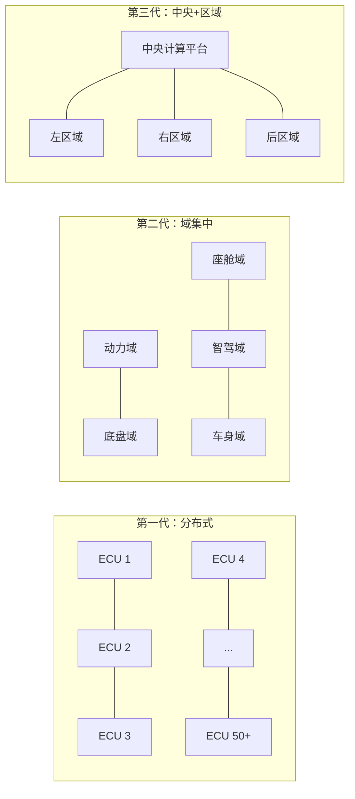
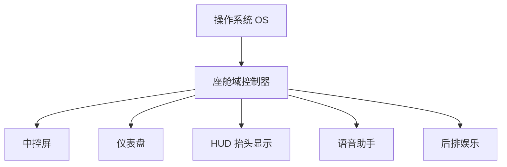

# ADAS 与自动驾驶

## 自动驾驶分级（SAE J3016）

| 级别 | 名称 | 谁负责驾驶 | 监控环境 | 示例 |
|------|------|-----------|----------|------|
| **L0** | 无自动化 | 驾驶员 | 驾驶员 | 定速巡航 |
| **L1** | 驾驶辅助 | 驾驶员+系统 | 驾驶员 | ACC（自适应巡航）或 LKA（车道保持） |
| **L2** | 部分自动化 | 驾驶员+系统 | 驾驶员 | ACC + LKA 同时工作 |
| **L3** | 有条件自动化 | 系统（需要时驾驶员接管） | 系统 | 特定场景（高速堵车）可放手 |
| **L4** | 高度自动化 | 系统 | 系统 | 限定区域 Robotaxi |
| **L5** | 完全自动化 | 系统 | 系统 | 任何地方、任何条件下全自动 |

> 目前量产车最高为 L2+（接近 L3），L4 Robotaxi 在特定城市区域已开始商业运营。

## ADAS 功能概述

### 纵向控制（加减速）

| 功能 | 缩写 | 说明 |
|------|------|------|
| 自适应巡航 | ACC | 自动跟车，保持设定速度和车距 |
| 自动紧急制动 | AEB | 检测碰撞风险自动刹车 |
| 前向碰撞预警 | FCW | 提醒驾驶员前方碰撞风险 |

### 横向控制（转向）

| 功能 | 缩写 | 说明 |
|------|------|------|
| 车道保持辅助 | LKA | 车辆偏离车道时主动纠正 |
| 车道居中控制 | LCC | 持续保持车辆在车道中心 |

### 其他辅助

| 功能 | 缩写 | 说明 |
|------|------|------|
| 盲区监测 | BSD | 提示侧后方盲区来车 |
| 自动泊车 | APA | 自动完成平行/垂直泊车 |
| 驾驶员监测 | DMS | 摄像头监测驾驶员疲劳/分心 |

## 感知传感器

自动驾驶的「眼睛」：

| 传感器 | 原理 | 优势 | 劣势 | 成本 |
|--------|------|------|------|------|
| **摄像头** | 可见光成像 | 颜色/纹理/交通标志 | 受光照/天气影响 | 低 |
| **毫米波雷达** | 无线电波反射 | 测速精准/全天候 | 分辨率低/无颜色 | 中 |
| **激光雷达 Lidar** | 激光点云 | 3D 精确测距 | 恶劣天气衰减/成本高 | 高 |
| **超声波雷达** | 声波反射 | 近距离精准 | 探测距离短（<5m） | 极低 |

### 传感器融合

单一传感器都有局限性，现代方案采用多传感器融合：

| 输入来源 | 主要贡献 | 融合后的价值 |
|----------|----------|--------------|
| 摄像头 | 分类、颜色、车道线、交通标志 | 补充语义信息 |
| 雷达 | 距离、速度、全天候能力 | 提升速度和恶劣天气鲁棒性 |
| 激光雷达 | 三维点云与精确测距 | 提升空间结构理解 |
| 融合感知 | 综合多源结果 | 输出更稳定的环境模型 |

## 视觉感知技术

从图像中理解驾驶场景的技术：

- **目标检测**：识别车辆、行人、骑行者、交通标志等（YOLO 等算法）
- **车道线检测**：识别车道线位置和类型（实线/虚线）
- **语义分割**：将图像中每个像素分类（道路/人行道/建筑/天空）
- **BEV（鸟瞰视角）**：将多摄像头图像转换到统一鸟瞰坐标系

## 决策规划

### 三层架构

- **行为决策**：变道/超车/跟车/停车等高层行为选择
- **路径规划**：在可行驶区域生成无碰撞的几何路径
- **运动规划**：沿路径生成速度曲线，考虑舒适性约束

## 执行控制

自动驾驶的最后一步，将规划转化为车辆动作：

- **线控转向（Steer-by-Wire）**：方向盘与车轮无机械连接，由电机执行
- **线控制动（Brake-by-Wire）**：电子信号控制制动压力
- **线控驱动（Drive-by-Wire）**：电子节气门，控制电机/发动机扭矩

## 场景化学习卡

### 1. 自动驾驶分级

**场景问题：** 销售说“这车能自动驾驶”，工程上应该先问清它到底是哪一级能力？

**简要结构图：**

| 驾驶任务 | 低阶辅助 | 高阶自动化 |
|----------|----------|------------|
| 感知环境 | 驾驶员主责，系统辅助提醒 | 系统在限定范围内主责 |
| 判断风险 | 驾驶员判断为主 | 系统判断并按策略处理 |
| 控制车辆 | 系统可能只管加减速或转向之一 | 系统可同时控制横向和纵向 |
| 监控接管 | 驾驶员持续监控 | 按等级和场景决定是否需要人接管 |

**原理（说人话）：** 自动驾驶分级描述的是系统在特定设计运行范围内承担多少动态驾驶任务，不是宣传强弱榜。很多量产车仍需要驾驶员持续监督，即使能自动跟车、居中、变道，也不等于可以放弃接管责任。

**对比/类比：** 像飞机自动驾驶：能减轻飞行员负担，但不同阶段、天气和故障条件下，人机责任完全不同。

**车企工作场景：** 功能定义、法规合规、用户手册、仪表提示和事故分析都要用准确等级口径。把“辅助驾驶”说成“无人驾驶”，会带来安全和法务风险。

**小测：** 一套高速 NOA 功能要求驾驶员随时接管，它更接近完全自动驾驶还是辅助驾驶？

### 2. 感知传感器与视觉感知

**场景问题：** 为什么智能驾驶车上要同时装摄像头、毫米波雷达、超声波雷达，甚至激光雷达？

**简要结构图：**

| 环节 | 输入/输出 | 作用 |
|------|-----------|------|
| 多传感器采集 | 摄像头、雷达、激光雷达、超声波数据 | 从不同角度观察外界 |
| 感知算法 | 目标检测、车道线识别、语义分割 | 把原始数据转成可理解对象 |
| 环境模型 | 车辆、行人、车道线、可行驶区域 | 供后续决策规划使用 |

**原理（说人话）：** 不同传感器看到的是同一世界的不同侧面。摄像头信息丰富但怕强光、雨雾和遮挡；毫米波雷达擅长距离和速度；超声波适合近距离泊车；激光雷达能提供更清晰的三维结构。算法再把这些数据整理成车辆、行人、车道线和可行驶区域。

**对比/类比：** 像人过马路会同时用眼睛看、耳朵听、身体判断距离；单一感官失误时，其他感官能补一部分。

**车企工作场景：** 感知问题常见于误检、漏检和目标跳变。测试团队会按雨夜、隧道、施工区、异形车、遮挡等场景构造用例。

**小测：** 如果系统把塑料袋误识别成石块，可能导致车辆出现什么异常动作？

### 3. 决策规划与执行控制

**场景问题：** 车辆已经识别到前方慢车，系统如何决定是跟车、减速还是变道，并让车真正动起来？

**简要结构图：**

| 层级 | 主要问题 | 输出 |
|------|----------|------|
| 行为决策 | 跟车、让行、变道还是停车 | 高层驾驶动作 |
| 轨迹规划 | 走哪条线、以什么速度走 | 路径和速度曲线 |
| 执行控制 | 如何转向、制动、驱动 | 执行器命令与车辆反馈 |

**原理（说人话）：** 规划决策把“看到的世界”转成“接下来怎么开”，控制层再把轨迹变成方向盘角度、制动力和驱动力。一个好的策略不是最激进，而是稳定、可解释、可接管；控制效果还会被轮胎、载荷、路面附着和底盘调校影响。

**对比/类比：** 规划像在地图上画路线，控制像手脚按路线开车；路线再好，手脚反应慢也会偏离。

**车企工作场景：** 用户抱怨“变道犹豫”“刹车突兀”“居中摇摆”，往往要同时看感知置信度、决策策略、控制标定和执行器状态。

**小测：** 为什么同样识别到前车减速，系统在雨天和晴天可能采取不同跟车距离？

---

## 电子电气架构演进

### 从分布式 ECU 到中央计算

**场景化问题**：为什么现在的车能 OTA 升级，老车却做不到？为什么新车 ECU 数量不增反降？

**结构图**：

| 阶段 | 架构特征 | ECU 数量 | OTA 能力 | 代表 |
|------|----------|----------|----------|------|
| **分布式** | 一个功能配一个 ECU，独立运行 | 50-100+ | 几乎无 | 2015年前多数燃油车 |
| **域集中** | 五大功能域各用高算力域控制器 | 20-40 | 可 OTA 单域 | 奥迪 zFAS、宝马、大众 MEB |
| **中央+区域** | 中央计算 + 区域控制器（就近采集） | 10-20 | 全车 OTA | 特斯拉 HW3/4、小鹏 X-EEA 3.0 |

**原理（说人话）**：传统汽车的每个功能（车窗、雨刮、ABS、空调……）都有自己独立的 ECU（电子控制单元），各干各的，互相之间通过 CAN 总线简单"打招呼"。好处是功能独立、单点故障不影响全局，坏处是电线又乱又多（一辆车线束总长可达 2-3 公里）、升级一个功能要换硬件、软件没法统一更新。

域集中架构把功能按"域"分组——比如座舱域用一个高性能芯片统一管理仪表、中控、HUD、语音、后排娱乐，智驾域用一个芯片处理摄像头+雷达+决策——线束大幅减少，软件可以统一 OTA 升级。

中央计算架构更进一步：一个（或两个）超级计算机接管全部计算，区域控制器只负责就近采集传感器信号和执行器驱动。特斯拉 Model 3 就是典型——左右车身控制器 + 中央计算模块，整车线束缩短到约 1.5 公里。

**小测**：传统分布式架构的最大痛点是什么？
A. 单个 ECU 算力不够
B. ECU 之间缺乏协同，软件无法统一升级
C. ECU 数量太少
D. 成本太高

**答案：B**。过度分布导致软件碎片化，"换个新功能要换新 ECU"是传统车企 OTA 难的根本原因。

---

### 域控制器：高算力 SoC 对比

**场景化问题**：为什么智能座舱比手机流畅，自动驾驶芯片和显卡上的芯片有什么不同？

**主流高算力 SoC 对比**：

| 芯片 | 厂商 | 算力 | 制程 | 主要应用 |
|------|------|------|------|----------|
| **高通 8295** | Qualcomm | 30 TOPS (AI) | 5nm | 座舱域：多屏交互/HUD/语音 |
| **英伟达 Orin-X** | NVIDIA | 254 TOPS | 7nm | 智驾域：感知/规划/决策 |
| **英伟达 Thor** | NVIDIA | 2000 TOPS | 4nm | 中央计算（2025+） |
| **地平线征程 5** | 地平线 | 128 TOPS | 16nm | 智驾域：国产方案/性价比 |
| **特斯拉 HW4.0** | Tesla | ~300-500 TOPS (est.) | 7nm | 中央计算：FSD 全栈 |
| **华为 MDC 610** | 华为 | 200 TOPS | — | 智驾域：华为 ADS 方案 |

**原理（说人话）**：域控制器本质上是一个"超级大脑"，用一颗高算力芯片替代几十颗分散的小 ECU。座舱域控制器（高通 8295）负责所有"你看到和摸到的东西"——仪表、中控屏、HUD、语音助手；智驾域控制器（英伟达 Orin）负责"看到外界并做出驾驶决策"——处理摄像头/雷达数据、做路径规划、发出控制指令。

衡量标准不是 CPU 主频，而是 **TOPS（Tera Operations Per Second，每秒万亿次运算）**——专门衡量 AI 推理能力。一颗英伟达 Orin（254 TOPS）相当于几百个传统 ECU 的算力总和。

**小测**：座舱域控制器和智驾域控制器通常用什么芯片？
A. 座舱用高通，智驾用英伟达/地平线
B. 座舱和智驾都用同一种芯片
C. 座舱用英特尔，智驾用 AMD
D. 两者都还在用传统 MCU

**答案：A**。座舱域（人机交互）多用高通芯片（Android 生态成熟），智驾域（AI 推理）多用英伟达/地平线（CUDA/BPU 架构优势）。

---

## 智能座舱：车机 OS 对比

**场景化问题**：为什么有的车机像 iPad 一样流畅，有的却卡得让人想砸屏？「8155 芯片」和「8295 芯片」到底差在哪？

**结构图**：

| 车机 OS | 底层 | 代表品牌 | 特点 | 优势 | 短板 |
|---------|------|----------|------|------|------|
| **Android Automotive** | 原生 Android（非手机投屏） | 沃尔沃/极星/通用/福特 | 完整 Google 生态，Play Store 装 App | 谷歌地图/语音/生态无缝 | 国内需"中国版"适配 |
| **鸿蒙座舱** | HarmonyOS | 问界/阿维塔/极狐 | 手机→车机→手表超级终端流转 | 多设备协同、流畅度高 | 仅限华为系设备生态 |
| **蔚来 NIO OS** | 定制 Android | 蔚来全系 | NOMI 语音助手、换电导航 | 情感化交互、持续 OTA | 封闭生态 |
| **小鹏 Xmart OS** | 定制 Android | 小鹏全系 | 全场景语音 2.0、3D 车控 | 语音连续对话、可见即可说 | 封闭生态 |
| **特斯拉 V11** | 自研 Linux | 特斯拉全系 | 极简触控、AMD Ryzen 芯片 | 性能碾压、UI 刷新率高 | 不支持 CarPlay/Android Auto |
| **比亚迪 DiLink** | 定制 Android | 比亚迪全系 | 旋转大屏、App 开放安装 | 开放生态、可玩性高 | 有时稳定性欠佳 |

**原理（说人话）**：车机 OS 跟手机 OS 最大的区别是——手机死机大不了重启，车机死机可能影响导航/空调/驾驶模式。所以车机 OS 必须做到：(1) **启动快**（3 秒内亮屏）；(2) **不卡不死**（-40°C 到 85°C 稳定运行）；(3) **安全隔离**（娱乐系统 ≠ 仪表系统，仪表那侧的 Linux/QNX 绝对不能崩）。

鸿蒙座舱的核心卖点是「流转」——手机上正在导航，上车自动切换到车机大屏；手表监测到你心跳加速，车机会调低音乐音量并问你累不累。特斯拉走的是另一条路：不依赖手机生态，自己从头写系统，极致流畅但封闭。

**车企工作场景**：座舱产品经理要和互联网公司（百度/腾讯/字节）谈生态接入——微信车载版、抖音车机版、咪咕视频等等，还要和芯片厂商（高通/联发科/三星）锁定 8295/8395 芯片的供货窗口，一颗芯片缺货可能让车型延期半年。

**小测**：Android Automotive 和 Android Auto（手机投屏）的区别是什么？

---

## 感知传感器上车方案对比

**场景化问题**：特斯拉坚持「纯视觉」，蔚来/理想堆满激光雷达——谁的路才是对的？

**结构图**：

| 方案 | 核心理念 | 传感器配置 | 代表品牌 | 优势 | 风险 |
|------|----------|-----------|----------|------|------|
| **纯视觉** | 人靠两只眼就能开车，AI 也行 | 8 摄像头 + 毫米波雷达 | 特斯拉 | 成本极低、系统简化 | 恶劣天气/强逆光/异形障碍物 |
| **激光雷达+视觉** | 多一只「激光眼」更安全 | 摄像头 + 激光雷达 + 毫米波 + 超声波 | 蔚来/理想/小鹏 | 3D 精确测距、暗光可靠 | 成本高、激光雷达寿命/保养 |
| **多传感器融合** | 什么传感器都上，综合决策 | 摄像头 + 3 激光雷达 + 6 毫米波 + 12 超声波 | 华为 ADS | 冗余度最高、安全性极强 | 系统复杂、标定/融合难度大 |

**原理（说人话）**：这个争论的本质是「AI 够不够聪明」。特斯拉的逻辑——人开车只靠双眼，如果 AI 的视觉理解能力超越人类，那激光雷达就是多余的拐杖。蔚来/华为的逻辑——激光雷达能精确测距、不受光照影响，在夜间/雨雾/逆光等人类都看不清的场景下是「第二道保险」。

实际数据对比：
- 特斯拉 FSD v12（纯视觉）：累计行驶超 30 亿英里，但仍有「幽灵刹车」和施工区误判案例
- 华为 ADS 3.0（多传感器）：支持城市 NOA 无图化，复杂路口通过率行业领先
- 趋势：2030 年前量产车主流仍是视觉+雷达融合，激光雷达价格已从 10 万元/颗降到 3000 元/颗以下（禾赛 AT128、速腾聚创 M1）

**油电对比 / 生活类比**：
- 油电对比：燃油车很少有传感器方案的争论——因为大多数燃油车根本没有高阶智驾能力，最多装个单目摄像头做 AEB。智驾传感器方案几乎就是电动车的专属讨论。
- 生活类比：纯视觉像老司机——经验丰富、什么路都敢开，但偶尔会看走眼。加激光雷达像副驾坐了个人帮你盯着——多一双眼多一分安全，但多个人也多点成本。

**车企工作场景**：智驾系统工程师在传感器选型时需要综合考虑探测距离、FOV（视场角）、分辨率、成本、功耗、散热和布置空间。还要把所有传感器做联合标定（内外参对齐），标定偏差 1 度角，100 米外就会产生 1.7 米的横向误差。

**小测**：特斯拉纯视觉方案遇到大雾天，最可能失效的原因是？
A. 芯片算力不够  B. 摄像头被雾气遮挡看不清  C. GPS 信号丢失  D. 轮胎打滑

> **答案：B**。纯视觉依赖摄像头成像质量，大雾/暴雨/强逆光会使画面模糊或过曝，视觉系统对场景的理解能力急剧下降。

