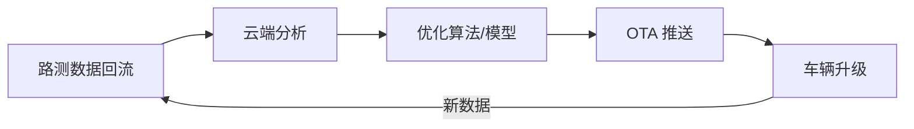

# V2X 与 OTA

## 高精地图与定位

### 高精地图

相比普通导航地图，高精地图精度达到**厘米级**，包含：

- 车道级拓扑（车道线位置、曲率、坡度）
- 交通标志/信号灯精确位置
- 路沿石、护栏等固定设施

> 高精地图是 L3+ 自动驾驶的基础设施。但它需要持续更新（道路施工、标线变更）。

### 融合定位

单一 GNSS（卫星定位）精度不够（民用约 2-5m），需要多传感器融合：

| 信息源 | 作用 | 注意点 |
|--------|------|--------|
| GNSS | 提供全局定位基准 | 城市峡谷、隧道中精度下降 |
| IMU（惯性测量单元） | 短时间推算姿态和运动 | 会产生累计漂移 |
| 轮速 | 提供车辆速度和里程估计 | 受轮胎半径、打滑影响 |
| 视觉/激光匹配 | 与环境特征或地图对齐 | 依赖环境可见性和地图质量 |

- **IMU**：测量加速度和角速度，短时精度高，累积漂移
- **轮速计**：提供车速信息
- **视觉/激光匹配**：与高精地图匹配修正漂移

## V2X 车路协同

Vehicle-to-Everything：车辆与周围一切通信。

| 类型 | 全称 | 通信对象 |
|------|------|----------|
| **V2V** | Vehicle-to-Vehicle | 其他车辆 |
| **V2I** | Vehicle-to-Infrastructure | 信号灯、路侧单元 |
| **V2P** | Vehicle-to-Pedestrian | 行人手机/设备 |
| **V2N** | Vehicle-to-Network | 云端 |

### 通信技术

| 技术 | 标准 | 特点 |
|------|------|------|
| **DSRC** | IEEE 802.11p | 早期方案，欧美较多 |
| **C-V2X** | 3GPP（4G/5G） | 中国主推，演进路径清晰 |

### 典型应用场景

- **信号灯信息**：提前获知前方红绿灯倒计时
- **协作式变道**：周围车辆共享意图
- **紧急车辆提醒**：获知附近救护车/消防车接近

## OTA 远程升级

Over-The-Air，通过无线网络远程升级车辆软件/固件。

### SOTA vs FOTA

| 类型 | 升级内容 | 复杂度 |
|------|----------|--------|
| **SOTA**（软件OTA） | 车载应用、中控系统、导航地图 | 较低 |
| **FOTA**（固件OTA） | ECU固件、BMS、ADAS控制器 | 较高 |

> 特斯拉是最早大规模应用 OTA 的车企，已通过 OTA 推送了刹车距离优化、续航提升等重大更新。

### OTA 流程

| 步骤 | 关键动作 | 关注点 |
|------|----------|--------|
| 发布 | 云平台发布升级包 | 版本范围、车型范围、灰度策略 |
| 下载 | 车辆通过 WiFi 或蜂窝网络下载 | 断点续传、流量与电量条件 |
| 校验 | 数字签名与完整性校验 | 防篡改、防错包 |
| 安装 | 用户确认或按策略静默安装 | 安装条件、失败回滚 |
| 生效 | 重启相关系统并监控结果 | 版本追踪、异常告警 |

### 关键要求

- **安全**：数字签名+加密通道，防止恶意篡改
- **可靠**：支持断点续传、回滚机制（升级失败可恢复）
- **差分升级**：只下载变化部分，减少流量和下载时间

## 场景化学习卡

### 1. 高精地图与融合定位

**场景问题：** 手机导航已经能定位，为什么智能驾驶还要融合定位和高精地图？

**简要结构图：**

| 输入 | 贡献 | 局限 |
|------|------|------|
| GNSS | 提供全局位置 | 隧道、高楼、遮挡会降低精度 |
| IMU/轮速 | 提供短时连续运动估计 | 会随时间累积误差 |
| 视觉/激光与地图匹配 | 修正车道级位置 | 依赖环境特征和地图更新 |

**原理（说人话）：** 智能驾驶需要知道车辆在哪条车道、离车道线多远、前方道路拓扑如何。单靠 GNSS 容易被高楼、隧道和天气影响；IMU、轮速、视觉特征和地图能补充短时连续性。高精地图提供车道线、坡度、曲率、限速和匝道信息，但也带来更新和覆盖成本。

**对比/类比：** 普通导航像知道你在哪条街，高精定位像知道你站在第几条泳道、离边线多少厘米。

**车企工作场景：** 城市 NOA、自动泊车和高速领航都依赖定位边界。产品定义要明确有图/无图、覆盖城市、更新频率和失效降级策略。

**小测：** 进隧道后 GNSS 信号变差，系统为什么还可以短时间维持定位？

### 2. V2X 车路协同

**场景问题：** 车辆已经有传感器，为什么还需要和道路、红绿灯、其他车辆通信？

**简要结构图：**

| 通信对象 | 典型信息 | 价值 |
|----------|----------|------|
| 车辆 V2V | 周边车速、位置、意图 | 提前识别盲区和协作风险 |
| 路侧 V2I | 信号灯、施工、事故、限速 | 获得超视距道路信息 |
| 云端 V2N | 交通状态、地图、策略更新 | 支持区域级交通协同 |
| 行人 V2P | 行人设备或弱势交通参与者信息 | 提升复杂路口安全冗余 |

**原理（说人话）：** V2X 让车辆与车、路、云、人交换信息，可以提前知道前方事故、信号灯相位、道路施工、盲区来车等单车传感器不一定看得到的信息。它不是替代摄像头和雷达，而是在有基础设施和标准支持时增强预判能力。

**对比/类比：** 单车传感器像自己看路，V2X 像有人提前通过对讲机告诉你前方路况。

**车企工作场景：** V2X 项目会牵涉通信标准、城市基础设施、云平台、网络安全和示范区政策。量产定义必须区分“功能可演示”和“用户日常可用”。

**小测：** 路口有大车遮挡视线时，V2X 可能提供哪类额外信息？

### 3. OTA 远程升级

**场景问题：** 为什么汽车现在也会像手机一样升级系统，但升级流程更谨慎？

**简要结构图：**

| 阶段 | 关键动作 | 风险控制 |
|------|----------|----------|
| 数据回收 | 收集故障、体验和场景数据 | 隐私、脱敏、合规 |
| 版本开发 | 修复问题或新增功能 | 回归测试、适用车型确认 |
| OTA 下发 | 灰度发布升级包 | 下载条件、签名校验 |
| 安装监控 | 安装后观察异常 | 失败回滚、客服和售后预案 |

**原理（说人话）：** OTA 让车辆软件可以远程更新。SOTA 常更新应用、座舱和地图，FOTA 可能涉及控制器固件和车辆功能，风险更高。数据闭环会把路测、用户车辆和故障数据回传，用于发现问题、训练模型、优化标定。升级必须经过验证、灰度、监控和回滚。

**对比/类比：** 手机升级失败很烦，汽车升级失败可能影响行驶和安全，所以汽车 OTA 的验证门槛更高。

**车企工作场景：** 发布智驾版本时，研发、测试、法规、售后、客服和运营要共同确认版本号、适用车型、升级条件、失败处理和用户告知。

**小测：** 为什么涉及制动或转向控制器的 FOTA 比更新导航地图更需要谨慎？

---

## 安全与功能安全

### 智能驾驶的安全底线

**场景化问题**：为什么一辆车能自动驾驶了，还要过"安全认证"？自动驾驶的安全和普通汽车的安全有什么不同？

**结构图**：

| 安全体系 | 标准 | 关注什么 | 怎么做 |
|----------|------|----------|--------|
| **功能安全** | ISO 26262 | 电子电气系统故障不会导致危险 | 冗余设计/失效安全/ASIL 分级 |
| **预期功能安全** | ISO 21448 (SOTIF) | 系统功能正常但因设计不足导致危险 | 场景覆盖/传感器局限分析 |
| **网络安全** | ISO 21434 | 防止黑客攻击和恶意控制 | 加密通信/安全启动/入侵检测 |

### ASIL 分级

| 等级 | 含义 | 单车风险 | 举例 |
|------|------|----------|------|
| **ASIL A** | 最低安全等级 | 轻微伤害 | 座椅加热故障 |
| **ASIL B** | 中等安全等级 | 中等伤害 | 仪表盘黑屏 |
| **ASIL C** | 高安全等级 | 严重伤害 | 自适应巡航失效 |
| **ASIL D** | 最高安全等级 | 致命伤害 | 制动/转向失控 |

**原理（说人话）**：功能安全（ISO 26262）回答"如果电子系统坏了怎么办"——比如制动 ECU 死机了，有没有备份系统接管？ASIL D 要求制动系统即使主控芯片烧了也要有机械备份或电子冗余。预期功能安全（SOTIF）回答"系统正常但能力不够怎么办"——比如摄像头在逆光下看不见白色卡车，这不是故障，但会导致事故，需要在设计阶段就覆盖这些场景。网络安全（ISO 21434）回答"被黑客入侵怎么办"——车辆联网后，攻击面变大，需要防篡改、防远程控制。

**车企工作场景**：功能安全工程师需要为每一个安全相关功能写安全目标和安全机制——比如"AEB 误触发"是不可接受的，必须设计多重确认逻辑（摄像头+雷达双重确认才触发紧急制动）。

**小测**：ISO 26262 ASIL D 级对应的安全要求最高，主要是因为该功能失效可能造成什么后果？
A. 用户抱怨  B. 维修费用高  C. 致命伤害  D. 排放超标

**答案：C**。ASIL D 对应最高安全等级，适用于失效可能导致致命伤害的功能。

---

## 软件定义汽车（SDV）

**场景化问题**：为什么特斯拉能通过一次 OTA 升级让刹车距离缩短 6 米？软件怎么可能改变硬件性能？

**结构图**：

### 特斯拉 OTA 经典案例

| 时间 | OTA 内容 | 效果 |
|------|----------|------|
| 2021.8 | AEB 算法优化 | 刹车距离缩短 ~6 米 |
| 2021.9 | 热泵效率优化 | 冬季续航提升 ~10% |
| 2022.1 | 赛道模式 V2 | 新增漂移辅助/扭矩矢量 |
| 2023.11 | FSD v12 端到端 | 从规则驱动切换到神经网络 |

**原理（说人话）**：Software-Defined Vehicle（SDV）的核心是——车辆的硬件能力的上限由出厂时决定，但能挖掘出多少性能取决于软件。传统汽车的体验在出厂那一刻就"冻结"了，而软件定义汽车可以像手机一样持续变好。

SDV 的技术基础：
- **SOA 服务化架构**：把车辆功能拆成独立的"服务"（如"制动服务""转向服务"），通过车载以太网互相调用，而不是硬连线
- **硬件抽象层**：让上层应用软件不关心底层硬件是谁家的——同样的自动驾驶软件可以跑在英伟达或地平线芯片上
- **数据闭环**：车辆在路上跑的数据回传云端 → 发现问题/找到优化点 → 升级软件 → OTA 下发 → 所有车一起变好

**油电对比 / 生活类比**：
- 油电对比：燃油车的发动机特性、变速箱换挡逻辑大部分由机械结构决定，软件能调的有限。电动车三电系统本质上是"大号电器+软件"，OTA 可优化的空间远超燃油车。
- 生活类比：传统汽车像功能手机——出厂什么样用一辈子。软件定义汽车像智能手机——买的时候已经不错，升级几版系统后又多了新功能。

**车企工作场景**：从传统开发（一次性交付）转向 SDV（持续迭代），要求研发组织也转型——需要专门的 OTA 团队、数据平台团队和持续集成/灰度发布体系。

**小测**：以下哪项是"软件定义汽车"的核心特征？
A. 车辆硬件配置可以 OTA 升级
B. 车辆功能可以通过软件更新持续迭代优化
C. 车辆不需要任何硬件
D. 车辆的软件代码开源

**答案：B**。SDV 的核心是功能可迭代——通过 OTA 让车辆越用越好，而不是硬件升级（A 不现实）。
