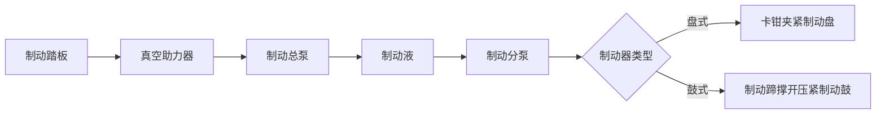
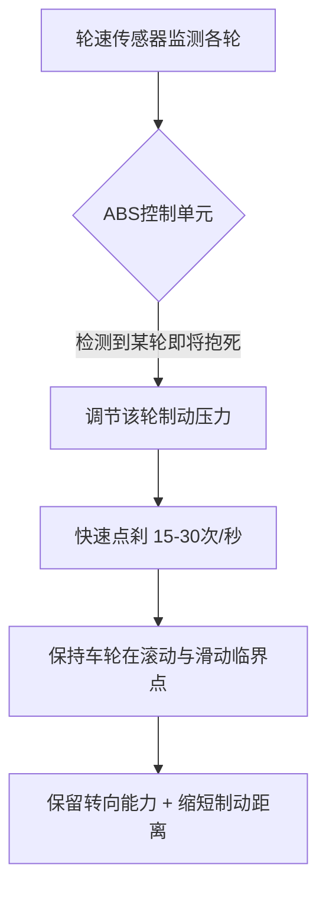
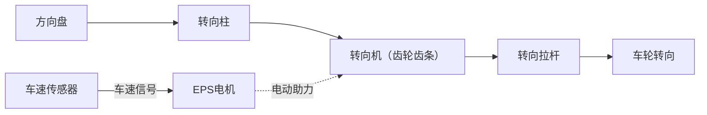
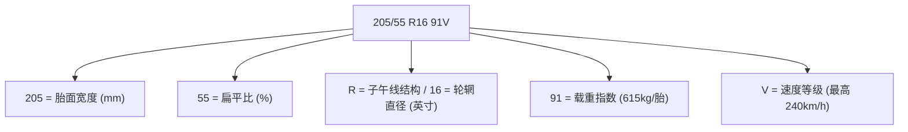

# 制动与转向

### 24. 制动系统类型

**场景化问题**：为什么连续下坡时，大货车的刹车会「失灵」，而家用车一般不会？

**结构图**：

**原理（说人话）**：盘式制动像用两个手指捏住旋转的盘子——卡钳夹紧制动盘，散热好、连续制动不容易「软脚」。鼓式制动像从内部撑开一个旋转的桶——制动蹄往外撑压紧制动鼓，封闭结构制动力大但散热差，连续制动会「热衰退」。所以家用车前轮必定用盘式（前轮负担约 70% 制动力），后轮可以用成本低的鼓式。制动液（刹车油）吸湿后沸点会降低，所以必须定期更换。

**油电对比/生活类比**：电动车多了一套「再生制动」——松油门时电机切换为发电模式，既减速又回收能量，所以电动车的刹车片磨损比燃油车慢得多。生活类比：盘式制动像骑自行车时用手捏车圈（卡钳夹盘），鼓式制动像倒踩脚踏板（内部撑开）。大货车下坡刹车失灵，就像你用橡皮擦擦纸，擦久了橡皮变软——这就是热衰退。

**车企工作场景**：底盘制动工程师选型时要根据车重、最高车速和成本目标，匹配盘/鼓尺寸和摩擦片材料配方，同时通过台架试验验证热衰退和涉水恢复性能。

**小测**：盘式制动相比鼓式制动的主要优势是什么？
- A. 制动力更大
- B. 成本更低
- C. 散热好、抗热衰退
- D. 结构更简单

答案：C。盘式制动散热好是核心优势，连续制动不易衰退。鼓式的优势才是成本低、制动力大。

---

### 25. ABS / ESP

**场景化问题**：为什么雨天急刹车时踏板会「弹脚」，而且能一边刹车一边打方向躲开障碍？

**结构图**：

**原理（说人话）**：ABS 的核心逻辑是——车轮抱死（完全不转）时不仅失去转向能力，刹车距离反而更长，因为滑动摩擦 ＜ 最大静摩擦。ABS 通过轮速传感器实时监测每个轮子，一旦发现某个轮子要抱死，就对该轮「松-紧-松-紧」地点刹，每秒 15-30 次，比你脚快得多。ESP 是 ABS 的升级版，利用同样的硬件，当车辆侧滑时单独制动某一个轮子——推头时拉内侧后轮，甩尾时刹外侧前轮，把车「拽」回来。

**油电对比/生活类比**：电动车的 ABS/ESP 与燃油车原理相同，但电机的响应速度让 ESP 的干预更快（电机扭矩调节比发动机快 10-50 倍），所以电动车的车身稳定控制更精准。生活类比：ABS 就像你骑自行车下坡时不敢把刹车捏死——捏死车轮抱死会侧滑，一松一紧地刹才能安全停住。ESP 就像你走路快摔倒时，本能地伸出一只手扶墙。

**车企工作场景**：ESP 标定工程师在冰雪试车场反复测试，调整制动力介入时机和力度，确保「该出手时才出手」——既不早干预（影响驾驶乐趣），也不晚干预（救不回来）。

**小测**：关于 ABS 和 ESP，以下哪项描述是正确的？
- A. ABS 会使制动距离变长
- B. ESP 只能在转弯时工作
- C. ABS 通过快速点刹防止车轮抱死，保留转向能力
- D. ESP 和 ABS 是两个完全独立的系统，互不关联

答案：C。ABS 通过点刹防止抱死，同时保留转向能力。ESP 集成了 ABS 和 TCS 功能，可在任何行驶状态下介入。

---

### 26. 转向系统

**场景化问题**：为什么有的车低速时方向盘轻得像玩具，高速时又变得沉稳不飘？

**结构图**：

**原理（说人话）**：转向系统经历了三代进化——纯机械（全靠手劲掰）、液压助力 HPS（发动机带动油泵提供助力，手感好但一直耗油）、电动助力 EPS（电机直接助力，不转向时不耗电）。EPS 最革命性的地方是「可编程」：ECU 根据车速调节助力大小——低速时给你大助力，一根手指就能转动；高速时减少助力，方向盘沉稳不发飘。转向比 14:1 意味着方向盘转 14°，车轮才转 1°——转向比越小越运动，越大越舒适。

**油电对比/生活类比**：燃油车的液压助力需要发动机持续运转来驱动油泵，而电动车的 EPS 直接用电，还能无缝接入车道保持、自动泊车等 ADAS 功能。生活类比：EPS 就像电动自行车——有电助力时轻松，没电时也能骑（机械备份永远在）。液压助力就像老式水车，必须靠溪流（发动机）持续转动才能抽水。

**车企工作场景**：转向调校工程师在 EPS 标定中定义「助力曲线」——低速区助力和高速区助力的数值关系，决定一台车的「手感 DNA」是偏运动还是偏舒适。

**小测**：电动助力转向（EPS）相比液压助力转向（HPS）的核心优势是？
- A. 成本更低
- B. 可以根据车速编程调节助力大小，且不转向时不耗能
- C. 路感更直接
- D. 可靠性更高

答案：B。EPS 可编程是最大优势——低速轻便、高速稳重，且节能。HPS 的路感和可靠性反而是传统优势。

---

### 27. 轮胎知识

**场景化问题**：为什么看起来差不多的轮胎，价格从 300 到 3000 都有？

**结构图**：

**原理（说人话）**：轮胎规格是一串密码。205 是胎面有多宽（mm），决定了抓地力上限；55 是扁平比——胎壁高度除以胎宽的百分比，数字越小胎壁越薄，过弯支撑越好但越颠；R16 表示子午线轮胎配 16 英寸轮辋；91V 中 91 是载重指数（每条胎承载 615kg），V 是速度等级（最高 240km/h）。胎压也关键——太高中间磨损快且颠，太低两侧磨损快且费油，正常值看车门框上的标签。轮胎磨损到磨损标记（约 1.6mm）就必须更换。

**油电对比/生活类比**：电动车轮胎一般需要更高的载重指数（电池重）和更低的滚动阻力（续航焦虑），不少电动车标配「自修复轮胎」或防爆胎（因为没有备胎）。生活类比：轮胎就像人的鞋子——扁平比低是薄底跑鞋（路感清晰但硌脚），扁平比高是厚底气垫鞋（舒服但路感模糊）。载重指数就是你鞋能承受的体重，速度等级是你穿这鞋能跑多快。

**车企工作场景**：底盘工程师在选择 OE 配套轮胎时，需要在干地制动、湿地排水、滚动阻力（油耗/续航）、噪音和成本五个维度上做平衡——没有完美的轮胎，只有最适合的取舍。

**小测**：规格 205/55 R16 91V 中，55 和 V 分别代表什么？
- A. 55 = 轮胎宽度 55mm / V = 胎压等级
- B. 55 = 扁平比 55% / V = 速度等级 240km/h
- C. 55 = 轮辋直径 / V = 载重指数
- D. 55 = 载重指数 / V = 扁平比

答案：B。55 是扁平比（胎高/胎宽 = 55%），数字越小胎壁越薄越运动；V = 速度等级，代表最高承受 240km/h。

<figure class="knowledge-figure">
  
  <figcaption>图：盘式制动器夹紧制动盘、ABS 轮速闭环控制，以及轮胎规格中胎宽、扁平比、轮辋和速度等级的读取方式。本站自绘 SVG。</figcaption>
</figure>
