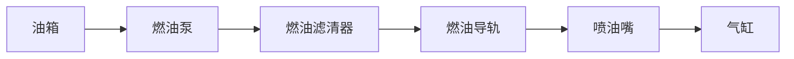
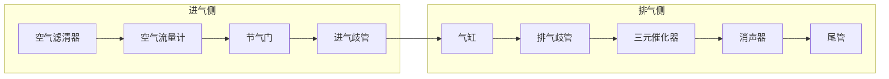
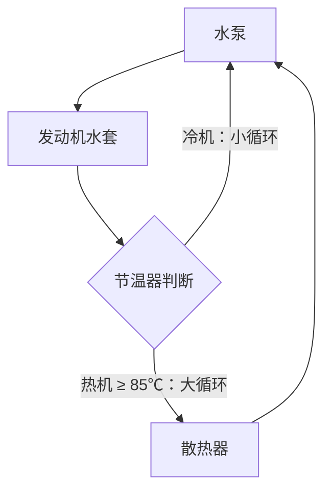
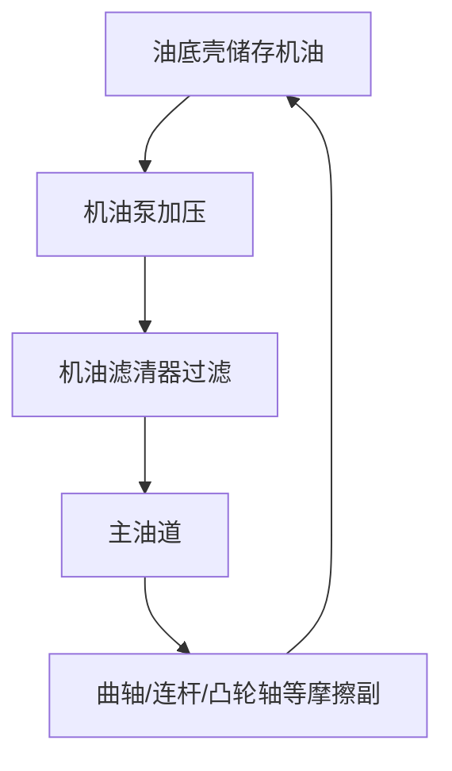

# 燃油动力系统

### 19. 燃油系统构成

**场景化问题**：为什么加满一箱油，有的车能跑 800 公里，有的只能跑 400 公里？

**结构图**：

**原理（说人话）**：燃油系统的核心任务就是「把油箱里的油，精准地送进气缸燃烧」。油泵把油从油箱底部抽上来加压，滤清器过滤掉杂质（否则会堵喷油嘴），高压燃油沿导轨分配到每个气缸的喷油嘴，喷油嘴像花洒一样把油雾化成细密油雾——雾化越好，燃烧越充分，动力越强、油耗越低。

**油电对比/生活类比**：电动车没有这一套——电池的「能量输送」靠电线，瞬间响应，不存在油压建立的过程。生活类比：燃油系统就像家里的自来水系统——水箱（油箱）→ 水泵（燃油泵）→ 净水器（滤清器）→ 水龙头（喷油嘴），水龙头出水越均匀细腻，用起来越舒服。

**车企工作场景**：动力总成工程师标定喷油脉宽和油压时，直接影响排放、油耗和动力响应三项核心指标。

**小测**：燃油滤清器的主要作用是什么？
- A. 提高燃油辛烷值
- B. 过滤燃油中的杂质和水分
- C. 给燃油加热以提高雾化效果
- D. 调节燃油压力

答案：B。燃油滤清器过滤杂质，防止堵塞喷油嘴；燃油压力由燃油泵和压力调节器控制。

---

### 20. 进气与排气系统

**场景化问题**：为什么换了「高流量空滤」后，感觉车子油门变轻了？

**结构图**：

**原理（说人话）**：发动机是「呼吸」的——进气是吸气，排气是呼气。空滤是口罩，把灰尘挡在外面；节气门是喉咙，油门踏板控制它开多大；进气歧管像分叉的气管，把空气均匀送到每个气缸。排气侧，三元催化器是「化学净化厂」，把有毒的 CO、HC、NOx 变成无害的 CO₂、水蒸气和氮气；消声器就是消音器，让废气安静地排出去。

**油电对比/生活类比**：电动车没有进排气系统——电机不呼吸，这是电动车安静的根源之一。生活类比：进排气系统就像人的呼吸系统——鼻子过滤空气 → 气管（节气门调节）→ 肺（气缸燃烧）→ 呼出废气。三元催化器相当于肺里的净化细胞。

**车企工作场景**：标定工程师在台架上调整空燃比时，需要同步监控氧传感器和三元催化器转化效率，确保排放达标。

**小测**：三元催化器（TWC）的主要作用是什么？
- A. 降低排气噪音
- B. 将有害气体（CO/HC/NOx）转化为无害气体
- C. 增加发动机进气量
- D. 冷却废气温度

答案：B。三元催化器是排放后处理核心，将 CO、HC、NOx 分别转化为 CO₂、H₂O、N₂。消声器才是降噪的。

---

### 21. 涡轮增压原理

**场景化问题**：为什么 1.5T 的小排量车，动力反而比 2.0L 自然吸气还猛？

**结构图**：

**原理（说人话）**：涡轮增压本质是「废物利用」。废气排出时速度很快、能量很大，用它吹动一个风扇（涡轮），这个风扇通过同一根轴带动另一个风扇（压气机），把进气强行「压」进气缸。进气被压缩后密度更大，同样大小的气缸里含更多氧气，就能喷更多油、产生更大的爆炸力。中冷器给压缩后的空气降温（压缩会升温，热空气含氧少），进一步提升效率。涡轮迟滞就是踩下油门后，要等废气把涡轮「吹起来」的那零点几秒的延迟。

**油电对比/生活类比**：电动车没有涡轮增压——电机本身就是高功率密度，不需要「充气」。生活类比：涡轮增压就像用风箱给炉子鼓风——本来火不大，一鼓风进去，氧气多了，火就旺得多。涡轮迟滞就是风箱从你开始拉到风真正吹进去之间的那点延迟。

**车企工作场景**：涡轮匹配工程师在选型时，要平衡增压压力、涡轮迟滞和排气背压三者关系——增压大则迟滞大，小惯量涡轮则高速后劲不足。

**小测**：以下哪项是涡轮迟滞（Turbo Lag）的准确描述？
- A. 涡轮增压器转速太高导致的噪音
- B. 踩下油门到涡轮起压之间的动力延迟感
- C. 中冷器散热不及时导致的动力下降
- D. 涡轮增压器的机械磨损

答案：B。涡轮迟滞是涡轮需要等待废气能量积累才能建立正压的过程，小惯量涡轮和可变截面涡轮（VGT）可缓解。

---

### 22. 冷却系统

**场景化问题**：为什么冬天刚启动时暖风不热，要等几分钟才有？

**结构图**：

**原理（说人话）**：发动机燃烧时温度极高（上千度），必须靠冷却液不停循环来带走热量，维持在 85-95℃ 的最佳工作温度。节温器是个聪明的阀门：冷车时关掉去散热器的通道，让冷却液只在发动机内部小循环，快速暖机；温度上来后打开大循环，让冷却液经过车头散热器，用迎面风散热。冷却液是乙二醇水溶液，冬天不结冰、夏天不沸腾——千万别用自来水代替，会生锈、结冰、开锅。

**油电对比/生活类比**：电动车也需要冷却系统，但冷却对象不同——电池和电机需要维持在更窄的温度窗口（尤其是快充时电池发热严重）。生活类比：冷却系统就像人体血液循环——水套是血管、水泵是心脏、节温器是体温调节中枢、散热器是皮肤出汗散热。冷车没暖风，就相当于你刚起床体温还没上来，哈不出热气。

**车企工作场景**：热管理工程师设计冷却回路时，要兼顾发动机暖机速度、散热能力和暖风性能——这三者经常互相冲突。

**小测**：冷却系统中节温器的作用是什么？
- A. 给冷却液加热
- B. 根据水温控制冷却液循环路径（小循环/大循环）
- C. 增加冷却液流速
- D. 检测冷却液是否泄漏

答案：B。节温器在冷机时走小循环加速暖机，热机后走大循环通过散热器降温。冷却液不能用自来水替代。

---

### 23. 润滑系统

**场景化问题**：为什么保养时一定要换机油，而且 4S 店总是催你 5000 公里就换？

**结构图**：

**原理（说人话）**：发动机内部金属零件以每分钟几千转的速度互相摩擦，没有机油的话几秒钟就烧毁。机油泵把油底壳里的机油抽上来加压，经过机滤过滤掉金属碎屑和积碳，再通过纵横交错的油道输送到每一个摩擦面，形成一层油膜隔开金属。机油还有「五合一」功能：润滑、冷却、清洁、防锈、密封。机油标号 5W-30 中，W 前数字代表低温流动性（5W 能耐受 -30℃），W 后数字代表高温时的粘度（越大越稠）。

**油电对比/生活类比**：电动车的减速器齿轮也需要润滑油，但远没有发动机复杂——电机本身不需要机油，只有齿轮箱需要定期换油。生活类比：润滑系统就像人体关节里的滑液——没有滑液骨头干磨会疼（拉缸），滑液不够会磨损软骨（烧瓦）。机滤相当于肾脏，过滤掉血液里的垃圾。

**车企工作场景**：可靠性工程师通过机油光谱分析（检测机油中的金属元素含量）来预判发动机磨损趋势，这是耐久试验中的核心诊断手段。

**小测**：机油标号 5W-30 中，W 前后的数字分别代表什么？
- A. W 前：高温粘度 / W 后：低温流动性
- B. W 前：低温流动性 / W 后：高温粘度
- C. W 前：机油容量 / W 后：更换周期
- D. W 前：品牌代码 / W 后：适用车型

答案：B。W = Winter，数字越小低温流动性越好（5W 耐受约 -30℃）；W 后数字越大高温越稠。机油还有冷却、清洁、防锈、密封等附加功能。

::: tip 配图提示
建议配图：涡轮增压器实物剖面图、冷却液循环流程图、机油标号说明图。
:::
